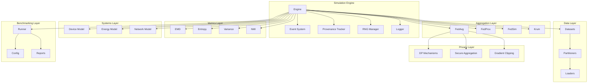
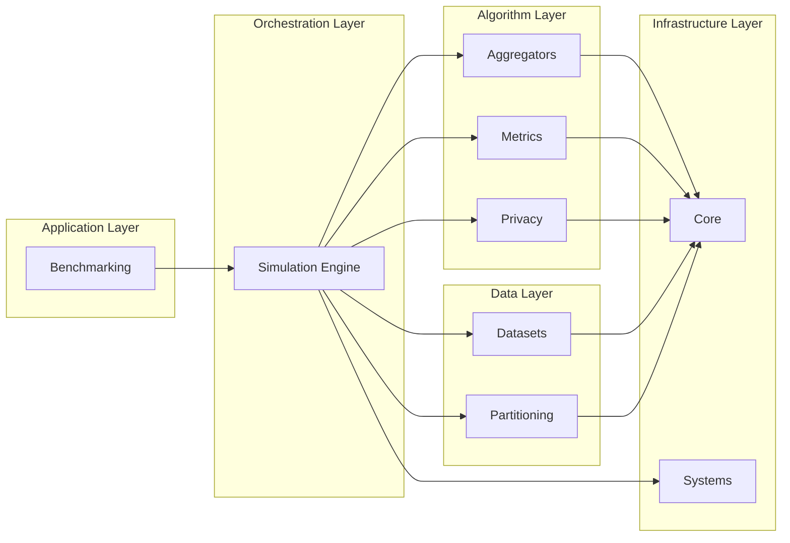
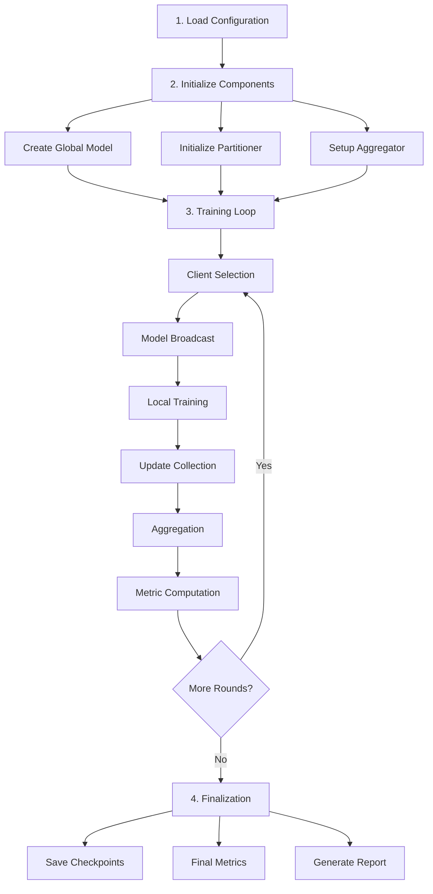
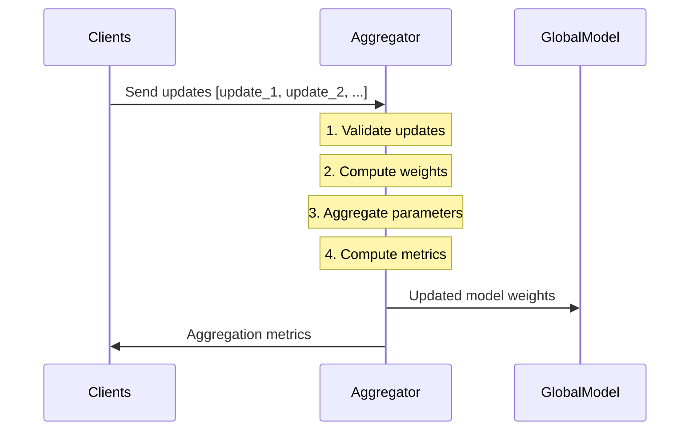
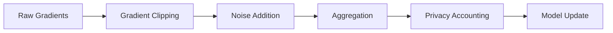
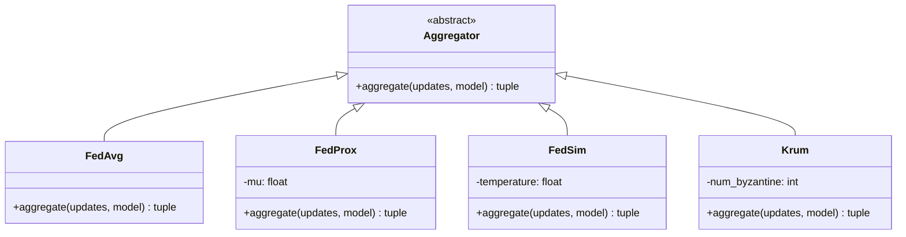
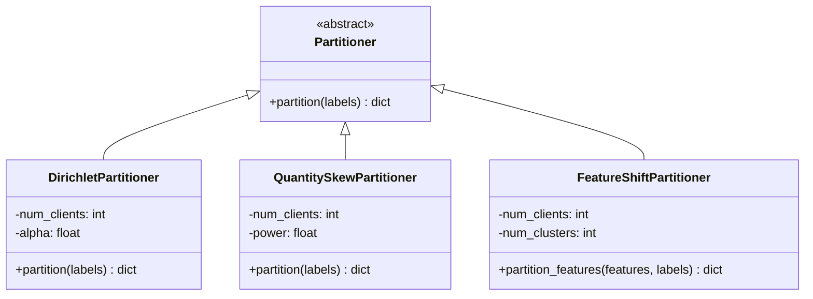

# Architecture

This document describes the high-level architecture of Unbitrium, a production-grade federated learning simulation and benchmarking platform.

---

## Table of Contents

1. [Overview](#overview)
2. [Design Principles](#design-principles)
3. [System Architecture](#system-architecture)
4. [Module Overview](#module-overview)
5. [Data Flow](#data-flow)
6. [Class Hierarchies](#class-hierarchies)
7. [Extension Points](#extension-points)
8. [Dependencies](#dependencies)
9. [Performance Considerations](#performance-considerations)

---

## Overview

Unbitrium is a modular federated learning simulation and benchmarking platform designed for reproducible research. The architecture prioritizes:

- **Modularity**: Independent, composable components
- **Extensibility**: Easy addition of new algorithms
- **Reproducibility**: Deterministic execution and provenance
- **Research Focus**: Heterogeneity measurement and analysis
- **Type Safety**: Full type annotations with strict mypy
- **Performance**: Vectorized operations and GPU acceleration

---

## Design Principles

### Separation of Concerns

Each module handles a specific aspect of federated learning:

| Module | Responsibility |
|--------|----------------|
| `partitioning` | Data distribution synthesis |
| `aggregators` | Model update combination |
| `metrics` | Heterogeneity quantification |
| `simulation` | Client/server orchestration |
| `privacy` | DP mechanisms |
| `systems` | Device/network modeling |
| `datasets` | Dataset loading and registry |
| `bench` | Benchmarking infrastructure |

### Composition Over Inheritance

Components are designed to be composed:

```python
# Compose partitioner, aggregator, and metrics
partitioner = DirichletPartitioner(num_clients=100, alpha=0.5)
aggregator = FedAvg()
metrics = [compute_emd, compute_label_entropy]

# Use in simulation
engine = SimulationEngine(config, aggregator, model, datasets)
```

### Stateless Functions

Metric computations are pure functions:

```python
# No side effects, deterministic output
emd = compute_emd(labels, client_indices)
entropy = compute_label_entropy(labels, client_indices)
```

---

## System Architecture

### High-Level Architecture



### Layer Dependencies



---

## Module Overview

### Core (`unbitrium.core`)

Central infrastructure components.

| Component | Purpose |
|-----------|---------|
| `SimulationEngine` | Orchestrates FL rounds |
| `EventSystem` | Publish-subscribe events |
| `ProvenanceTracker` | Experiment metadata |
| `RNGManager` | Deterministic randomness |
| `Logger` | Structured logging |

### Partitioning (`unbitrium.partitioning`)

Data distribution strategies.

| Strategy | Description |
|----------|-------------|
| `DirichletPartitioner` | Label skew via Dirichlet |
| `MoDMPartitioner` | Mixture-of-Dirichlet |
| `QuantitySkewPartitioner` | Power-law sizes |
| `EntropyControlledPartitioner` | Target entropy |
| `FeatureShiftPartitioner` | Feature clustering |

### Aggregators (`unbitrium.aggregators`)

Model combination algorithms.

| Algorithm | Description |
|-----------|-------------|
| `FedAvg` | Weighted average |
| `FedProx` | Proximal regularization |
| `FedSim` | Similarity weighting |
| `PFedSim` | Personalized similarity |
| `FedDyn` | Dynamic regularization |
| `FedCM` | Client momentum |
| `FedAdam` | Server-side Adam |
| `Krum` | Byzantine-robust |
| `TrimmedMean` | Coordinate trimming |

### Metrics (`unbitrium.metrics`)

Heterogeneity quantification.

| Category | Metrics |
|----------|---------|
| Distribution | EMD, KL, JS, Total Variation |
| Label | Entropy, Imbalance Ratio |
| Gradient | Variance, Drift Norm |
| Representation | NMI, CKA |
| System | Latency, Throughput |

### Privacy (`unbitrium.privacy`)

Privacy-preserving mechanisms.

| Component | Purpose |
|-----------|---------|
| `GaussianMechanism` | (ε,δ)-DP noise |
| `LaplaceMechanism` | ε-DP noise |
| `SecureAggregation` | Simulation interface |
| `clip_gradients` | Sensitivity bounding |

### Systems (`unbitrium.systems`)

Device and network modeling.

| Component | Purpose |
|-----------|---------|
| `Device` | Compute/memory simulation |
| `EnergyModel` | Energy consumption |
| `Network` | Latency/bandwidth |

### Benchmark (`unbitrium.bench`)

Standardized experimentation.

| Component | Purpose |
|-----------|---------|
| `BenchmarkRunner` | Experiment execution |
| `BenchmarkConfig` | Configuration schema |
| `Artifacts` | Result storage |
| `Reports` | Markdown generation |

---

## Data Flow

### Simulation Flow



### Aggregation Flow



### Privacy-Preserving Flow



---

## Class Hierarchies

### Aggregator Hierarchy



### Partitioner Hierarchy



---

## Extension Points

### Custom Aggregator

Implement the `Aggregator` base class:

```python
from unbitrium.aggregators.base import Aggregator

class CustomAggregator(Aggregator):
    def aggregate(
        self,
        updates: list[dict[str, Any]],
        current_global_model: torch.nn.Module,
    ) -> tuple[torch.nn.Module, dict[str, float]]:
        # Custom aggregation logic
        pass
```

### Custom Partitioner

Implement the `Partitioner` base class:

```python
from unbitrium.partitioning.base import Partitioner

class CustomPartitioner(Partitioner):
    def partition(self, labels: np.ndarray) -> dict[int, list[int]]:
        # Custom partitioning logic
        pass
```

### Custom Metric

Create a pure function:

```python
def compute_custom_metric(
    labels: np.ndarray,
    client_indices: dict[int, list[int]],
) -> float:
    # Custom metric computation
    pass
```

---

## Dependencies

### Core Dependencies

| Package | Version | Purpose |
|---------|---------|---------|
| torch | >= 2.0 | Deep learning |
| numpy | >= 2.0 | Numerical computing |
| scipy | >= 1.12 | Scientific computing |
| pyyaml | >= 6.0 | Configuration |
| pydantic | >= 2.0 | Data validation |

### Optional Dependencies

| Package | Purpose |
|---------|---------|
| torchvision | Image datasets |
| matplotlib | Visualization |
| pandas | Data analysis |
| scikit-learn | ML utilities |

---

## Performance Considerations

### Vectorization

All metric computations use vectorized NumPy/PyTorch operations:

```python
# Vectorized EMD computation
distributions = np.array([...])  # (num_clients, num_classes)
global_dist = distributions.mean(axis=0)
emd_per_client = wasserstein_distance_batch(distributions, global_dist)
```

### GPU Acceleration

Model training and aggregation support GPU:

```python
device = torch.device("cuda" if torch.cuda.is_available() else "cpu")
model = model.to(device)
```

### Memory Efficiency

Large update collections are processed incrementally:

```python
# Streaming aggregation for memory efficiency
running_sum = None
for update in updates:
    if running_sum is None:
        running_sum = update["state_dict"]
    else:
        # Incremental aggregation
        ...
```

---

*Last updated: January 2026*
