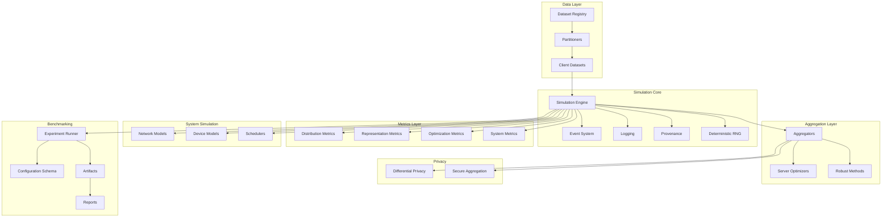
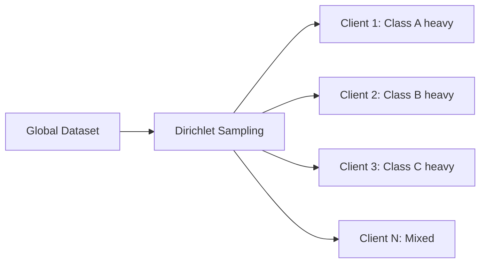
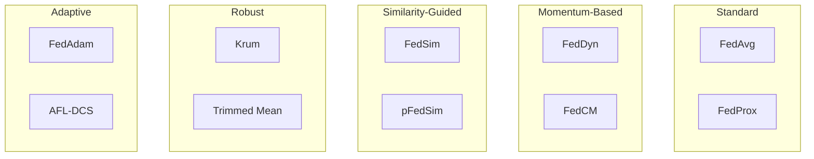

# Unbitrium

<!-- Logo placeholder: 400x80 SVG -->
<p align="center">
  
</p>

<p align="center">
  <strong>Production-Grade Federated Learning Simulator and Benchmarking Platform</strong>
</p>

<p align="center">
  <em>Reproducible non-IID partitioning, advanced aggregation research, heterogeneity measurement, and system realism simulation.</em>
</p>

---

<p align="center">
  <!-- Status Badges -->
  <a href="https://pypi.org/project/unbitrium/"></a>
  <a href="https://pypi.org/project/unbitrium/"></a>
  <a href="https://pypi.org/project/unbitrium/"></a>
  <a href="LICENSE"></a>
  <a href="https://github.com/olaflaitinen/unbitrium/actions/workflows/ci.yml"></a>
  <a href="https://codecov.io/gh/olaflaitinen/unbitrium"></a>
  <a href="https://olaflaitinen.github.io/unbitrium/"></a>
  <a href="https://github.com/olaflaitinen/unbitrium/network/dependabot"></a>
  <a href="https://securityscorecards.dev/viewer/?uri=github.com/olaflaitinen/unbitrium"></a>
  <a href="https://doi.org/10.5281/zenodo.18160043"></a>
  <a href="https://github.com/olaflaitinen/unbitrium"></a>
</p>

<p align="center">
  <!-- OS & Platform -->
  <a href="#"></a>
  <a href="#"></a>
  <a href="#"></a>
  <a href="https://pytorch.org/"></a>
  <a href="https://numpy.org/"></a>
  <a href="https://scipy.org/"></a>
  <a href="https://pandas.pydata.org/"></a>
  <a href="https://matplotlib.org/"></a>
  <a href="https://scikit-learn.org/"></a>
  <a href="https://www.docker.com/"></a>
</p>

<p align="center">
  <!-- Tools & Quality -->
  <a href="https://git-scm.com/"></a>
  <a href="https://github.com/psf/black"></a>
  <a href="https://github.com/astral-sh/ruff"></a>
  <a href="https://www.mypy-lang.org/"></a>
  <a href="https://pre-commit.com/"></a>
  <a href="https://semver.org/"></a>
  <a href="https://code.visualstudio.com/"></a>
  <a href="CONTRIBUTING.md"></a>
  <a href="CITATION.cff"></a>
</p>

---

## Overview

**Unbitrium** is a production-grade federated learning simulator and benchmarking platform designed for reproducible research under data heterogeneity. Built at DTU Compute, it provides the tools necessary to conduct rigorous FL experiments with statistically meaningful results.

### Key Capabilities

| Capability | Description |
|------------|-------------|
| Non-IID Partitioning | Dirichlet label skew, MoDM, quantity skew, feature shift, entropy-controlled |
| Advanced Aggregation | FedAvg, FedProx, FedDyn, FedSim, pFedSim, FedCM, AFL-DCS, FedOpt family, robust methods |
| Heterogeneity Metrics | EMD, KL/JS divergence, gradient variance, NMI, CKA, drift norms |
| System Realism | Network latency/jitter/packet loss, device constraints, energy modeling |
| Reproducibility | Deterministic RNG, provenance tracking, comprehensive reporting |
| Privacy | Differential privacy (Gaussian/Laplace), secure aggregation simulation |

---

## Table of Contents

1. [Installation](#installation)
2. [Quick Start](#quick-start)
3. [Architecture](#architecture)
4. [Modules](#modules)
5. [Partitioning Strategies](#partitioning-strategies)
6. [Aggregation Algorithms](#aggregation-algorithms)
7. [Heterogeneity Metrics](#heterogeneity-metrics)
8. [Configuration](#configuration)
9. [Tutorials](#tutorials)
10. [Benchmarks](#benchmarks)
11. [API Reference](#api-reference)
12. [Development](#development)
13. [Contributing](#contributing)
14. [Security](#security)
15. [License](#license)
16. [Citation](#citation)
17. [Acknowledgments](#acknowledgments)

---

## Installation

### From PyPI (Recommended)

```bash
pip install unbitrium
```

### From Source

```bash
git clone https://github.com/olaflaitinen/unbitrium.git
cd unbitrium
pip install -e ".[dev]"
```

### Using Docker

```bash
docker pull olaflaitinen/unbitrium:latest
docker run -it unbitrium python -c "import unbitrium; print(unbitrium.__version__)"
```

### Using Docker Compose

```bash
git clone https://github.com/olaflaitinen/unbitrium.git
cd unbitrium
docker compose up -d
```

### Requirements

| Requirement | Minimum | Recommended |
|-------------|---------|-------------|
| Python | >= 3.10 | >= 3.12 |
| PyTorch | >= 2.0 | >= 2.2 |
| RAM | 8 GB | 16 GB |
| GPU | Optional | NVIDIA CUDA |

### Verify Installation

```python
import unbitrium as ub
print(f"Version: {ub.__version__}")
print(f"Author: {ub.__author__}")
```

---

## Quick Start

### Minimal Example

```python
import unbitrium as ub

# Load dataset and partition
dataset = ub.datasets.load("cifar10")
partitioner = ub.partitioning.DirichletLabelSkew(alpha=0.5, num_clients=100, seed=42)
client_datasets = partitioner.partition(dataset)

# Configure simulation
config = ub.core.SimulationConfig(
    num_rounds=100,
    clients_per_round=10,
    local_epochs=5,
    batch_size=32,
    learning_rate=0.01,
)

# Initialize aggregator
aggregator = ub.aggregators.FedAvg()

# Run simulation
engine = ub.core.SimulationEngine(config, aggregator)
results = engine.run(client_datasets)

# Compute heterogeneity metrics
metrics = ub.metrics.compute_all(client_datasets)
print(f"EMD: {metrics['emd']:.4f}, JS Divergence: {metrics['js_divergence']:.4f}")

# Generate report
ub.bench.generate_report(results, metrics, output_dir="./results")
```

### Complete Working Example

```python
"""Complete federated learning example with Unbitrium."""

from __future__ import annotations

import torch
import torch.nn as nn
import numpy as np

from unbitrium.aggregators import FedAvg
from unbitrium.partitioning import DirichletPartitioner
from unbitrium.metrics import compute_emd, compute_label_entropy
from unbitrium.simulation import Client

# Configuration
NUM_CLIENTS = 10
ALPHA = 0.5
NUM_ROUNDS = 10
SEED = 42

# Set seeds
np.random.seed(SEED)
torch.manual_seed(SEED)

# Generate synthetic data
X = torch.randn(1000, 10)
y = torch.randint(0, 3, (1000,))

# Partition data
partitioner = DirichletPartitioner(num_clients=NUM_CLIENTS, alpha=ALPHA, seed=SEED)
client_indices = partitioner.partition(y.numpy())

# Measure heterogeneity
print(f"EMD: {compute_emd(y.numpy(), client_indices):.4f}")
print(f"Entropy: {compute_label_entropy(y.numpy(), client_indices):.4f}")

# Simple model
class Model(nn.Module):
    def __init__(self):
        super().__init__()
        self.fc = nn.Linear(10, 3)

    def forward(self, x):
        return self.fc(x)

# Create clients
clients = [
    Client(i, (X[idx], y[idx]), Model, local_epochs=1)
    for i, idx in enumerate(client_indices.values())
]

# Training loop
global_model = Model()
aggregator = FedAvg()

for round_num in range(NUM_ROUNDS):
    updates = [c.train(global_model.state_dict()) for c in clients]
    global_model, metrics = aggregator.aggregate(updates, global_model)
    print(f"Round {round_num + 1}: {metrics}")

print("Training complete!")
```

---

## Architecture



For detailed architecture information, see [ARCHITECTURE.md](ARCHITECTURE.md).

---

## Modules

### Core (`unbitrium.core`)

The simulation engine orchestrates federated learning rounds, manages client selection, and coordinates aggregation.

| Component | Description |
|-----------|-------------|
| `SimulationEngine` | Main orchestrator for synchronous and asynchronous FL rounds |
| `EventSystem` | Publish-subscribe system for simulation events |
| `Logger` | Structured logging with provenance tracking |
| `Provenance` | Experiment metadata and reproducibility artifacts |
| `RNGManager` | Deterministic random number generation and seeding |

### Partitioning (`unbitrium.partitioning`)

Strategies for creating non-IID client data distributions.

| Partitioner | Description |
|-------------|-------------|
| `DirichletLabelSkew` | Dirichlet-multinomial sampling: $p_k \sim \mathrm{Dir}(\alpha \mathbf{1})$ |
| `MoDM` | Mixture-of-Dirichlet-Multinomials for multimodal label skew |
| `QuantitySkewPowerLaw` | Power-law client dataset sizes: $n_k \propto k^{-\gamma}$ |
| `FeatureShiftClustering` | Client partitions by feature-space clustering |
| `EntropyControlledPartition` | Entropy thresholds to control partition hardness |

### Aggregators (`unbitrium.aggregators`)

Algorithms for combining client model updates.

| Aggregator | Description |
|------------|-------------|
| `FedAvg` | Weighted average: $w^{t+1} = \sum_k \frac{n_k}{\sum_j n_j} w_k^t$ |
| `FedProx` | Proximal regularization: $\min_w F_k(w) + \frac{\mu}{2}\|w - w_g\|^2$ |
| `FedDyn` | Dynamic regularization for improved convergence |
| `FedSim` | Similarity-guided weighting using cosine similarity |
| `pFedSim` | Personalized similarity-guided aggregation |
| `FedCM` | Client-level momentum correction |
| `AFL_DCS` | Asynchronous FL with dynamic client scheduling |
| `FedAdam` | Server-side Adam optimizer on aggregated updates |
| `TrimmedMean` | Coordinate-wise trimmed mean for robustness |
| `Krum` | Robust aggregation selecting minimal distance update |

### Metrics (`unbitrium.metrics`)

Quantifying heterogeneity and system performance.

| Category | Metrics |
|----------|---------|
| Distribution | EMD, KL Divergence, JS Divergence, Total Variation |
| Label Analysis | Label Entropy, Imbalance Ratio, Effective Classes |
| Representation | NMI, Centered Kernel Alignment |
| Optimization | Gradient Variance, Cosine Disagreement, Drift Norms |
| System | Latency, Throughput, Energy Estimates |

### Systems (`unbitrium.systems`)

Simulating realistic network and device conditions.

| Component | Description |
|-----------|-------------|
| `NetworkModel` | Latency, jitter, packet loss, bandwidth simulation |
| `DeviceModel` | Compute, memory, and energy constraints |
| `ClientScheduler` | Selection policies and straggler handling |

### Privacy (`unbitrium.privacy`)

Privacy-preserving mechanisms.

| Component | Description |
|-----------|-------------|
| `DifferentialPrivacy` | Noise accounting and heterogeneous privacy budgets |
| `SecureAggregation` | Interface stubs for secure aggregation protocols |

### Benchmarking (`unbitrium.bench`)

Standardized experiment infrastructure.

| Component | Description |
|-----------|-------------|
| `ExperimentRunner` | Configuration-driven experiment execution |
| `ConfigSchema` | Validated YAML/JSON configuration |
| `Artifacts` | Structured result storage |
| `Reports` | Human-readable Markdown reports |

---

## Partitioning Strategies

### Dirichlet Label Skew



**Mathematical Formulation:**

For client $k$, sample class proportions from Dirichlet:

$$p_k \sim \text{Dir}(\alpha \cdot \mathbf{1}_C)$$

where $\alpha$ controls heterogeneity (lower = more heterogeneous).

```python
from unbitrium.partitioning import DirichletPartitioner

partitioner = DirichletPartitioner(
    num_clients=100,
    alpha=0.5,  # Lower = more heterogeneous
    seed=42,
)
client_indices = partitioner.partition(labels)
```

### Quantity Skew (Power-Law)

Dataset sizes follow power-law distribution:

$$n_k \propto k^{-\gamma}$$

```python
from unbitrium.partitioning import QuantitySkewPartitioner

partitioner = QuantitySkewPartitioner(
    num_clients=100,
    power=1.5,
    seed=42,
)
```

---

## Aggregation Algorithms

### Algorithm Comparison



### FedAvg

```python
from unbitrium.aggregators import FedAvg

aggregator = FedAvg()
new_model, metrics = aggregator.aggregate(updates, global_model)
```

### FedProx

```python
from unbitrium.aggregators import FedProx

aggregator = FedProx(mu=0.1)  # Proximal coefficient
```

### Krum (Byzantine-Robust)

```python
from unbitrium.aggregators import Krum

aggregator = Krum(num_byzantine=2, multi_krum=True)
```

---

## Heterogeneity Metrics

### Metric Overview

| Metric | Range | Interpretation |
|--------|-------|----------------|
| EMD | [0, ∞) | Higher = more heterogeneous |
| JS Divergence | [0, 1] | Higher = more heterogeneous |
| Label Entropy | [0, 1] | Lower = more skewed |
| Gradient Variance | [0, ∞) | Higher = more disagreement |

### Usage

```python
from unbitrium.metrics import (
    compute_emd,
    compute_js_divergence,
    compute_label_entropy,
    compute_gradient_variance,
)

# Distribution metrics
emd = compute_emd(labels, client_indices)
js_div = compute_js_divergence(labels, client_indices)
entropy = compute_label_entropy(labels, client_indices)

print(f"EMD: {emd:.4f}")
print(f"JS Divergence: {js_div:.4f}")
print(f"Label Entropy: {entropy:.4f}")
```

---

## Configuration

Experiments are configured via YAML:

```yaml
experiment:
  name: "cifar10_dirichlet_fedavg"
  seed: 42

dataset:
  name: "cifar10"
  download: true

partitioning:
  strategy: "dirichlet_label_skew"
  alpha: 0.5
  num_clients: 100

training:
  num_rounds: 100
  clients_per_round: 10
  local_epochs: 5
  batch_size: 32
  learning_rate: 0.01

aggregator:
  name: "fedavg"

system:
  network:
    latency_mean_ms: 50
    latency_std_ms: 10
    packet_loss_rate: 0.01
  device:
    compute_heterogeneity: true
    memory_limit_mb: 512

metrics:
  - emd
  - js_divergence
  - gradient_variance
  - label_entropy

output:
  dir: "./results"
  format: ["json", "markdown"]
```

---

## Tutorials

Comprehensive tutorials covering all aspects of Unbitrium:

| Series | Topics | Count |
|--------|--------|-------|
| 001-010 | Non-IID Partitioning Strategies | 10 |
| 011-020 | Heterogeneity Measurement | 10 |
| 021-030 | Similarity-Guided Aggregation | 10 |
| 031-040 | Momentum and Stability | 10 |
| 041-050 | Asynchronous Scheduling | 10 |
| 051-060 | Network Simulation | 10 |
| 061-070 | Energy-Constrained Training | 10 |
| 071-080 | Differential Privacy | 10 |
| 081-090 | Benchmark Standardization | 10 |
| 091-200 | Advanced Topics | 110 |

**Total: 200 comprehensive tutorials**

See the [tutorials directory](docs/tutorials/) for complete guides.

---

## Benchmarks

Standard benchmark suite for reproducible comparisons:

```bash
# Run standard benchmark
python -m unbitrium.bench.run --config benchmarks/standard.yaml

# Generate comparison report
python -m unbitrium.bench.report --input results/ --output report.md
```

### Using Makefile

```bash
make benchmark       # Run benchmarks
make benchmark-all   # Run full benchmark suite
```

---

## API Reference

Full API documentation is available at [https://olaflaitinen.github.io/unbitrium/](https://olaflaitinen.github.io/unbitrium/).

### Quick Links

| Module | Documentation |
|--------|---------------|
| Core | [docs/api/core.md](docs/api/core.md) |
| Aggregators | [docs/api/aggregators.md](docs/api/aggregators.md) |
| Partitioning | [docs/api/partitioning.md](docs/api/partitioning.md) |
| Metrics | [docs/api/metrics.md](docs/api/metrics.md) |
| Privacy | [docs/api/privacy.md](docs/api/privacy.md) |
| Systems | [docs/api/systems.md](docs/api/systems.md) |

---

## Development

### Setup Development Environment

```bash
git clone https://github.com/olaflaitinen/unbitrium.git
cd unbitrium
pip install -e ".[dev,docs]"
pre-commit install
```

### Common Commands

```bash
make format      # Format code
make lint        # Run linters
make type-check  # Run mypy
make test        # Run tests
make test-cov    # Run tests with coverage
make docs        # Build documentation
```

See [DEVELOPMENT.md](DEVELOPMENT.md) for detailed development guidelines.

---

## Contributing

We welcome contributions. Please read [CONTRIBUTING.md](CONTRIBUTING.md) for guidelines.

### Quick Start for Contributors

1. Fork the repository
2. Create a feature branch
3. Make changes with tests
4. Submit a pull request

See also:
- [CODE_OF_CONDUCT.md](CODE_OF_CONDUCT.md)
- [GOVERNANCE.md](GOVERNANCE.md)
- [STYLE.md](STYLE.md)

---

## Security

For security vulnerabilities, please email oyli@dtu.dk directly. **Do NOT open public GitHub issues for security vulnerabilities.**

See [SECURITY.md](SECURITY.md) for our full security policy.

---

## License

This project is licensed under the European Union Public Licence 1.2 (EUPL 1.2). See [LICENSE](LICENSE) for the full text.

---

## Citation

If you use Unbitrium in your research, please cite:

```bibtex
@software{unbitrium2026,
  author       = {Laitinen Imanov, Olaf Yunus},
  title        = {Unbitrium: Production-grade Federated Learning Simulator},
  year         = {2026},
  publisher    = {GitHub},
  url          = {https://github.com/olaflaitinen/unbitrium},
  version      = {1.0.0}
}
```

See [CITATION.cff](CITATION.cff) for machine-readable citation metadata.

---

## Acknowledgments

Unbitrium is developed at the Technical University of Denmark (DTU), Department of Applied Mathematics and Computer Science (DTU Compute), Section for Visual Computing.

Unbitrium builds upon foundational research in federated learning. See [docs/references/bibliography.md](docs/references/bibliography.md) for a complete list of references.

---

## Repository Structure

```
unbitrium/
├── src/unbitrium/        # Source code
│   ├── aggregators/      # Aggregation algorithms
│   ├── bench/            # Benchmarking infrastructure
│   ├── core/             # Core simulation engine
│   ├── datasets/         # Dataset loaders
│   ├── metrics/          # Heterogeneity metrics
│   ├── partitioning/     # Data partitioning
│   ├── privacy/          # Privacy mechanisms
│   ├── simulation/       # Client/server simulation
│   └── systems/          # Device/network models
├── tests/                # Test suite
├── docs/                 # Documentation
│   ├── tutorials/        # 200 tutorials
│   ├── api/              # API reference
│   └── validation/       # Validation reports
├── benchmarks/           # Benchmark configurations
├── examples/             # Example scripts
└── .github/              # CI/CD workflows
```

---

## Support

- [Documentation](https://olaflaitinen.github.io/unbitrium/)
- [GitHub Issues](https://github.com/olaflaitinen/unbitrium/issues)
- [GitHub Discussions](https://github.com/olaflaitinen/unbitrium/discussions)
- [SUPPORT.md](SUPPORT.md)

---

<p align="center">
  <sub>Built with precision for reproducible federated learning research.</sub>
</p>
<p align="center">
  <sub>Copyright 2026 Olaf Yunus Laitinen Imanov. Released under EUPL 1.2.</sub>
</p>
