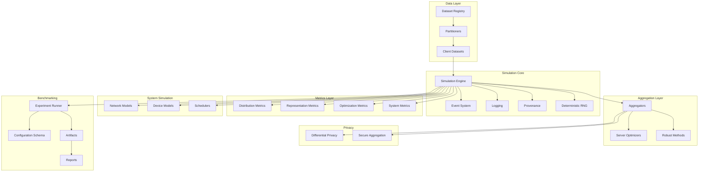

# Unbitrium

<!-- Logo placeholder: 400x80 SVG -->
<p align="center">
  
</p>

<p align="center">
  <strong>Federated Learning Simulator and Benchmarking Platform</strong>
</p>

<p align="center">
  <em>Reproducible non-IID partitioning, advanced aggregation research, heterogeneity measurement, and system realism simulation.</em>
</p>

---

<!-- Badges: exactly 20 -->
<p align="center">
  <a href="https://pypi.org/project/unbitrium/"></a>
  <a href="https://pypi.org/project/unbitrium/"></a>
  <a href="https://pypi.org/project/unbitrium/"></a>
  <a href="LICENSE"></a>
  <a href="https://github.com/olaflaitinen/unbitrium/actions/workflows/ci.yml"></a>
  <a href="https://codecov.io/gh/olaflaitinen/unbitrium"></a>
  <a href="https://olaflaitinen.github.io/unbitrium/"></a>
  <a href="https://github.com/olaflaitinen/unbitrium/actions/workflows/lint.yml"></a>
  <a href="https://github.com/olaflaitinen/unbitrium/actions/workflows/typecheck.yml"></a>
  <a href="https://github.com/olaflaitinen/unbitrium/actions/workflows/release.yml"></a>
  <a href="https://securityscorecards.dev/viewer/?uri=github.com/olaflaitinen/unbitrium"></a>
  <a href="https://github.com/olaflaitinen/unbitrium/security/code-scanning"></a>
  <a href="https://github.com/olaflaitinen/unbitrium/network/dependabot"></a>
  <a href="https://github.com/olaflaitinen/unbitrium/actions/workflows/benchmark.yml"></a>
  <a href="CITATION.cff"></a>
  <a href="https://zenodo.org/badge/latestdoi/placeholder"></a>
  <a href="https://github.com/olaflaitinen/unbitrium/actions/workflows/wheels.yml"></a>
  <a href="https://github.com/olaflaitinen/unbitrium/pkgs/container/unbitrium"></a>
  <a href="https://github.com/olaflaitinen/unbitrium/commits/main"></a>
  <a href="https://github.com/olaflaitinen/unbitrium"></a>
</p>

---

## Overview

**Unbitrium** is a federated learning simulator and benchmarking platform designed for reproducible research under data heterogeneity. It provides:

- **Reproducible Non-IID Partitioning**: Dirichlet label skew, Mixture-of-Dirichlet-Multinomials (MoDM), quantity skew (power-law), feature shift clustering, and entropy-controlled partitions.
- **Advanced Aggregation Algorithms**: FedAvg, FedProx, FedDyn, FedSim, pFedSim, FedCM, AFL-DCS, FedOpt family (FedAdam, FedYogi, FedAdagrad), and robust aggregators (Trimmed Mean, Median, Krum).
- **Heterogeneity Metrics**: Earth Mover's Distance (EMD), KL/JS divergence, total variation, label entropy, gradient variance, cosine disagreement, NMI, centered kernel alignment, and drift norms.
- **System Realism Simulation**: Network dynamics (latency, jitter, packet loss, bandwidth), device constraints (compute, memory, energy), client schedulers, and straggler modeling.
- **Experiment Provenance**: Machine-readable manifests, reproducible seeds, and comprehensive reporting.

---

## Table of Contents

1. [Installation](#installation)
2. [Quick Start](#quick-start)
3. [Architecture](#architecture)
4. [Modules](#modules)
5. [Configuration](#configuration)
6. [Tutorials](#tutorials)
7. [Benchmarks](#benchmarks)
8. [API Reference](#api-reference)
9. [Contributing](#contributing)
10. [License](#license)
11. [Citation](#citation)

---

## Installation

### From PyPI

```bash
pip install unbitrium
```

### From Source

```bash
git clone https://github.com/olaflaitinen/unbitrium.git
cd unbitrium
pip install -e ".[dev]"
```

### Requirements

- Python >= 3.10
- PyTorch >= 2.0 (primary backend)
- Optional: JAX, TensorFlow adapters

---

## Quick Start

```python
import unbitrium as ub

# Load dataset and partition
dataset = ub.datasets.load("cifar10")
partitioner = ub.partitioning.DirichletLabelSkew(alpha=0.5, num_clients=100, seed=42)
client_datasets = partitioner.partition(dataset)

# Configure simulation
config = ub.core.SimulationConfig(
    num_rounds=100,
    clients_per_round=10,
    local_epochs=5,
    batch_size=32,
    learning_rate=0.01,
)

# Initialize aggregator
aggregator = ub.aggregators.FedAvg()

# Run simulation
engine = ub.core.SimulationEngine(config, aggregator)
results = engine.run(client_datasets)

# Compute heterogeneity metrics
metrics = ub.metrics.compute_all(client_datasets)
print(f"EMD: {metrics['emd']:.4f}, JS Divergence: {metrics['js_divergence']:.4f}")

# Generate report
ub.bench.generate_report(results, metrics, output_dir="./results")
```

---

## Architecture



---

## Modules

### Core (`unbitrium.core`)

The simulation engine orchestrates federated learning rounds, manages client selection, and coordinates aggregation.

| Component | Description |
|-----------|-------------|
| `SimulationEngine` | Main orchestrator for synchronous and asynchronous FL rounds |
| `EventSystem` | Publish-subscribe system for simulation events |
| `Logger` | Structured logging with provenance tracking |
| `Provenance` | Experiment metadata and reproducibility artifacts |
| `RNGManager` | Deterministic random number generation and seeding |

### Partitioning (`unbitrium.partitioning`)

Strategies for creating non-IID client data distributions.

| Partitioner | Description |
|-------------|-------------|
| `DirichletLabelSkew` | Dirichlet-multinomial sampling for label skew: $p_k \sim \mathrm{Dirichlet}(\alpha \mathbf{1})$ |
| `MoDM` | Mixture-of-Dirichlet-Multinomials for multimodal label skew |
| `QuantitySkewPowerLaw` | Power-law client dataset sizes: $n_k \propto k^{-\gamma}$ |
| `FeatureShiftClustering` | Client partitions by feature-space clustering |
| `EntropyControlledPartition` | Entropy thresholds to control partition hardness |

### Aggregators (`unbitrium.aggregators`)

Algorithms for combining client model updates.

| Aggregator | Description |
|------------|-------------|
| `FedAvg` | Weighted average: $w^{t+1} = \sum_k \frac{n_k}{\sum_j n_j} w_k^t$ |
| `FedProx` | Proximal regularization: $\min_w F_k(w) + \frac{\mu}{2}\|w - w_g\|^2$ |
| `FedDyn` | Dynamic regularization for improved convergence |
| `FedSim` | Similarity-guided weighting using cosine similarity |
| `pFedSim` | Personalized similarity-guided aggregation with decoupled heads |
| `FedCM` | Client-level momentum correction |
| `AFL_DCS` | Asynchronous FL with dynamic client scheduling |
| `FedAdam` | Server-side Adam optimizer on aggregated updates |
| `TrimmedMean` | Coordinate-wise trimmed mean for robustness |
| `Krum` | Robust aggregation selecting minimal distance update |

### Metrics (`unbitrium.metrics`)

Quantifying heterogeneity and system performance.

| Metric Category | Metrics |
|-----------------|---------|
| Distribution | EMD, KL Divergence, JS Divergence, Total Variation |
| Label Analysis | Label Entropy, Imbalance Ratio, Effective Classes |
| Representation | NMI, Centered Kernel Alignment |
| Optimization | Gradient Variance, Cosine Disagreement, Drift Norms |
| System | Latency, Throughput, Energy Estimates |

### Systems (`unbitrium.systems`)

Simulating realistic network and device conditions.

| Component | Description |
|-----------|-------------|
| `NetworkModel` | Latency, jitter, packet loss, bandwidth simulation |
| `DeviceModel` | Compute, memory, and energy constraints |
| `ClientScheduler` | Selection policies and straggler handling |

### Privacy (`unbitrium.privacy`)

Privacy-preserving mechanisms.

| Component | Description |
|-----------|-------------|
| `DifferentialPrivacy` | Noise accounting and heterogeneous privacy budgets |
| `SecureAggregation` | Interface stubs for secure aggregation protocols |

### Benchmarking (`unbitrium.bench`)

Standardized experiment infrastructure.

| Component | Description |
|-----------|-------------|
| `ExperimentRunner` | Configuration-driven experiment execution |
| `ConfigSchema` | Validated YAML/JSON configuration |
| `Artifacts` | Structured result storage |
| `Reports` | Human-readable Markdown reports |

---

## Configuration

Experiments are configured via YAML:

```yaml
experiment:
  name: "cifar10_dirichlet_fedavg"
  seed: 42

dataset:
  name: "cifar10"
  download: true

partitioning:
  strategy: "dirichlet_label_skew"
  alpha: 0.5
  num_clients: 100

training:
  num_rounds: 100
  clients_per_round: 10
  local_epochs: 5
  batch_size: 32
  learning_rate: 0.01

aggregator:
  name: "fedavg"

system:
  network:
    latency_mean_ms: 50
    latency_std_ms: 10
    packet_loss_rate: 0.01
  device:
    compute_heterogeneity: true
    memory_limit_mb: 512

metrics:
  - emd
  - js_divergence
  - gradient_variance
  - label_entropy

output:
  dir: "./results"
  format: ["json", "markdown"]
```

---

## Tutorials

Comprehensive tutorials covering all aspects of Unbitrium:

| Series | Topics |
|--------|--------|
| 001-010 | Non-IID Partitioning Strategies |
| 011-020 | Heterogeneity Measurement |
| 021-030 | Similarity-Guided Aggregation |
| 031-040 | Momentum and Stability |
| 041-050 | Asynchronous Scheduling |
| 051-060 | Network Simulation |
| 061-070 | Energy-Constrained Training |
| 071-080 | Differential Privacy |
| 081-090 | Benchmark Standardization |
| 091-100+ | Custom Extensions |

See the [tutorials directory](docs/tutorials/) for complete guides.

---

## Benchmarks

Standard benchmark suite for reproducible comparisons:

```bash
# Run standard benchmark
python -m unbitrium.bench.run --config benchmarks/standard.yaml

# Generate comparison report
python -m unbitrium.bench.report --input results/ --output report.md
```

---

## API Reference

Full API documentation is available at [https://olaflaitinen.github.io/unbitrium/](https://olaflaitinen.github.io/unbitrium/).

---

## Contributing

We welcome contributions. Please read [CONTRIBUTING.md](CONTRIBUTING.md) for guidelines.

---

## License

This project is licensed under the European Union Public Licence 1.2 (EUPL 1.2). See [LICENSE](LICENSE) for the full text.

---

## Citation

If you use Unbitrium in your research, please cite:

```bibtex
@software{unbitrium2026,
  author       = {Laitinen Imanov, Olaf Yunus and Contributors},
  title        = {Unbitrium: Federated Learning Simulator and Benchmarking Platform},
  year         = {2026},
  publisher    = {GitHub},
  url          = {https://github.com/olaflaitinen/unbitrium},
  version      = {0.1.0}
}
```

See [CITATION.cff](CITATION.cff) for machine-readable citation metadata.

---

## Acknowledgments

Unbitrium builds upon foundational research in federated learning. See [docs/references/bibliography.md](docs/references/bibliography.md) for a complete list of references.

---

<p align="center">
  <sub>Built with precision for reproducible federated learning research.</sub>
</p>
<p align="center">
  <sub>Copyright 2026 Olaf Yunus Laitinen Imanov and Contributors. Released under EUPL 1.2.</sub>
</p>
