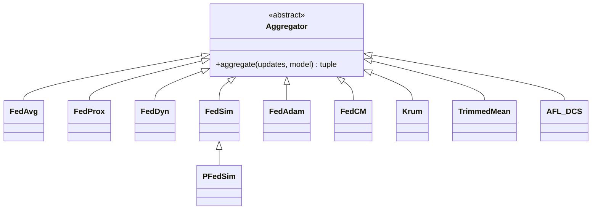

# Aggregators API Reference

This document provides the API reference for the `unbitrium.aggregators` module.

---

## Table of Contents

1. [Overview](#overview)
2. [Base Class](#base-class)
3. [Standard Aggregators](#standard-aggregators)
4. [Robust Aggregators](#robust-aggregators)
5. [Personalized Aggregators](#personalized-aggregators)

---

## Overview

All aggregators inherit from the `Aggregator` base class and implement the `aggregate` method.



---

## Base Class

### Aggregator

```python
from unbitrium.aggregators import Aggregator

class Aggregator(ABC):
    """Abstract base class for aggregation algorithms.

    All aggregators must implement the aggregate method.
    """

    @abstractmethod
    def aggregate(
        self,
        updates: list[dict[str, Any]],
        current_global_model: torch.nn.Module,
    ) -> tuple[torch.nn.Module, dict[str, float]]:
        """Aggregate client updates.

        Args:
            updates: List of client updates with 'state_dict' and 'num_samples'.
            current_global_model: Current global model.

        Returns:
            Tuple of (updated model, aggregation metrics).
        """
        pass
```

---

## Standard Aggregators

### FedAvg

```python
from unbitrium.aggregators import FedAvg
```

Federated Averaging (McMahan et al., 2017).

**Mathematical Formulation:**

$$w^{t+1} = \sum_{k=1}^K \frac{n_k}{N} w_k^t$$

| Parameter | Type | Description |
|-----------|------|-------------|
| - | - | No parameters |

```python
aggregator = FedAvg()
new_model, metrics = aggregator.aggregate(updates, global_model)
```

### FedProx

```python
from unbitrium.aggregators import FedProx
```

FedProx with proximal regularization (Li et al., 2020).

| Parameter | Type | Default | Description |
|-----------|------|---------|-------------|
| `mu` | float | 0.01 | Proximal coefficient |

```python
aggregator = FedProx(mu=0.1)
```

### FedDyn

```python
from unbitrium.aggregators import FedDyn
```

Dynamic regularization for federated learning (Acar et al., 2021).

| Parameter | Type | Default | Description |
|-----------|------|---------|-------------|
| `alpha` | float | 0.01 | Regularization coefficient |

```python
aggregator = FedDyn(alpha=0.01)
```

### FedAdam

```python
from unbitrium.aggregators import FedAdam
```

Server-side Adam optimizer for aggregation.

| Parameter | Type | Default | Description |
|-----------|------|---------|-------------|
| `server_lr` | float | 1.0 | Server learning rate |
| `beta1` | float | 0.9 | Adam beta1 |
| `beta2` | float | 0.99 | Adam beta2 |
| `tau` | float | 1e-3 | Adaptivity parameter |

```python
aggregator = FedAdam(server_lr=0.1, beta1=0.9, beta2=0.99)
```

### FedCM

```python
from unbitrium.aggregators import FedCM
```

Client momentum for federated learning.

| Parameter | Type | Default | Description |
|-----------|------|---------|-------------|
| `beta` | float | 0.9 | Momentum coefficient |

```python
aggregator = FedCM(beta=0.9)
```

---

## Robust Aggregators

### Krum

```python
from unbitrium.aggregators import Krum
```

Byzantine-robust aggregation (Blanchard et al., 2017).

| Parameter | Type | Default | Description |
|-----------|------|---------|-------------|
| `num_byzantine` | int | 0 | Assumed Byzantine clients |
| `multi_krum` | bool | False | Use Multi-Krum |
| `m` | int | None | Number of selections for Multi-Krum |

```python
aggregator = Krum(num_byzantine=2, multi_krum=True, m=5)
```

### TrimmedMean

```python
from unbitrium.aggregators import TrimmedMean
```

Coordinate-wise trimmed mean (Yin et al., 2018).

| Parameter | Type | Default | Description |
|-----------|------|---------|-------------|
| `trim_ratio` | float | 0.1 | Fraction to trim per side |

```python
aggregator = TrimmedMean(trim_ratio=0.2)
```

### AFL_DCS

```python
from unbitrium.aggregators import AFL_DCS
```

Agnostic Federated Learning with Domain Classifier Score.

| Parameter | Type | Default | Description |
|-----------|------|---------|-------------|
| `lambda_fair` | float | 0.1 | Fairness coefficient |

```python
aggregator = AFL_DCS(lambda_fair=0.1)
```

---

## Personalized Aggregators

### FedSim

```python
from unbitrium.aggregators import FedSim
```

Similarity-weighted aggregation based on model parameter similarity.

| Parameter | Type | Default | Description |
|-----------|------|---------|-------------|
| `temperature` | float | 1.0 | Softmax temperature |

```python
aggregator = FedSim(temperature=0.5)
```

### PFedSim

```python
from unbitrium.aggregators import PFedSim
```

Personalized FedSim with per-client weighting.

| Parameter | Type | Default | Description |
|-----------|------|---------|-------------|
| `temperature` | float | 1.0 | Softmax temperature |
| `personal_weight` | float | 0.5 | Personal model weight |

```python
aggregator = PFedSim(temperature=0.5, personal_weight=0.7)
```

---

## Usage Example

```python
from unbitrium.aggregators import FedAvg, FedProx, Krum

# Standard aggregation
fedavg = FedAvg()

# With regularization
fedprox = FedProx(mu=0.1)

# Byzantine-robust
krum = Krum(num_byzantine=2)

# Aggregate updates
updates = [
    {"state_dict": model1.state_dict(), "num_samples": 100},
    {"state_dict": model2.state_dict(), "num_samples": 200},
]

new_model, metrics = fedavg.aggregate(updates, global_model)
print(f"Aggregated {metrics['num_participants']} clients")
```

---

*Last updated: January 2026*
