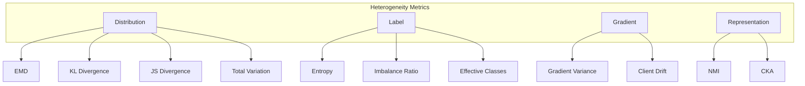

# Metrics API Reference

This document provides the API reference for the `unbitrium.metrics` module.

---

## Table of Contents

1. [Overview](#overview)
2. [Distribution Metrics](#distribution-metrics)
3. [Label Metrics](#label-metrics)
4. [Gradient Metrics](#gradient-metrics)
5. [Representation Metrics](#representation-metrics)
6. [System Metrics](#system-metrics)

---

## Overview

Metrics quantify data heterogeneity and system behavior in federated learning.



---

## Distribution Metrics

### compute_emd

```python
from unbitrium.metrics import compute_emd

def compute_emd(
    labels: np.ndarray,
    client_indices: dict[int, list[int]],
) -> float:
    """Compute Earth Mover's Distance from global distribution.

    Args:
        labels: Class labels for all samples.
        client_indices: Client ID to sample indices mapping.

    Returns:
        Average EMD across clients.
    """
```

**Example:**

```python
emd = compute_emd(labels, client_indices)
print(f"EMD: {emd:.4f}")
```

### compute_js_divergence

```python
from unbitrium.metrics import compute_js_divergence

def compute_js_divergence(
    labels: np.ndarray,
    client_indices: dict[int, list[int]],
) -> float:
    """Compute average Jensen-Shannon divergence.

    Returns:
        Average JS divergence from global distribution.
    """
```

### compute_kl_divergence

```python
from unbitrium.metrics import compute_kl_divergence

def compute_kl_divergence(
    labels: np.ndarray,
    client_indices: dict[int, list[int]],
) -> float:
    """Compute average KL divergence.

    Returns:
        Average KL divergence from global distribution.
    """
```

### compute_total_variation

```python
from unbitrium.metrics import compute_total_variation

def compute_total_variation(
    labels: np.ndarray,
    client_indices: dict[int, list[int]],
) -> float:
    """Compute average total variation distance.

    Returns:
        Average TV distance from global distribution.
    """
```

---

## Label Metrics

### compute_label_entropy

```python
from unbitrium.metrics import compute_label_entropy

def compute_label_entropy(
    labels: np.ndarray,
    client_indices: dict[int, list[int]],
) -> float:
    """Compute average normalized label entropy.

    Returns:
        Average entropy in [0, 1].
    """
```

### compute_imbalance_ratio

```python
from unbitrium.metrics import compute_imbalance_ratio

def compute_imbalance_ratio(
    client_indices: dict[int, list[int]],
) -> float:
    """Compute client size imbalance ratio.

    Returns:
        Ratio of max to min client size.
    """
```

### compute_effective_classes

```python
from unbitrium.metrics import compute_effective_classes

def compute_effective_classes(
    labels: np.ndarray,
    client_indices: dict[int, list[int]],
) -> float:
    """Compute average effective number of classes.

    Returns:
        Average effective classes per client.
    """
```

---

## Gradient Metrics

### compute_gradient_variance

```python
from unbitrium.metrics import compute_gradient_variance

def compute_gradient_variance(
    gradients: list[dict[str, torch.Tensor]],
) -> float:
    """Compute gradient variance across clients.

    Args:
        gradients: List of gradient dictionaries.

    Returns:
        Variance of gradient norms.
    """
```

### compute_client_drift

```python
from unbitrium.metrics import compute_client_drift

def compute_client_drift(
    local_models: list[torch.nn.Module],
    global_model: torch.nn.Module,
) -> float:
    """Compute average client drift from global model.

    Returns:
        Average L2 distance from global model.
    """
```

---

## Representation Metrics

### compute_nmi

```python
from unbitrium.metrics import compute_nmi

def compute_nmi(
    labels: np.ndarray,
    client_indices: dict[int, list[int]],
) -> float:
    """Compute Normalized Mutual Information.

    Returns:
        NMI between client assignment and labels.
    """
```

### compute_cka

```python
from unbitrium.metrics import compute_cka

def compute_cka(
    representations1: torch.Tensor,
    representations2: torch.Tensor,
) -> float:
    """Compute Centered Kernel Alignment.

    Args:
        representations1: First representation matrix.
        representations2: Second representation matrix.

    Returns:
        CKA similarity in [0, 1].
    """
```

---

## System Metrics

### compute_communication_cost

```python
from unbitrium.metrics.system import compute_communication_cost

def compute_communication_cost(
    model: torch.nn.Module,
    num_clients: int,
    num_rounds: int,
) -> float:
    """Compute total communication cost in bytes.

    Returns:
        Total bytes transmitted.
    """
```

### compute_training_time

```python
from unbitrium.metrics.system import compute_training_time

def compute_training_time(
    client_times: list[float],
) -> dict[str, float]:
    """Compute training time statistics.

    Returns:
        Dictionary with mean, std, min, max times.
    """
```

---

## Usage Examples

### Comprehensive Heterogeneity Analysis

```python
from unbitrium.metrics import (
    compute_emd,
    compute_js_divergence,
    compute_label_entropy,
    compute_imbalance_ratio,
)

# Compute all metrics
metrics = {
    "emd": compute_emd(labels, client_indices),
    "js_div": compute_js_divergence(labels, client_indices),
    "entropy": compute_label_entropy(labels, client_indices),
    "imbalance": compute_imbalance_ratio(client_indices),
}

print("Heterogeneity Metrics:")
for name, value in metrics.items():
    print(f"  {name}: {value:.4f}")
```

---

*Last updated: January 2026*
