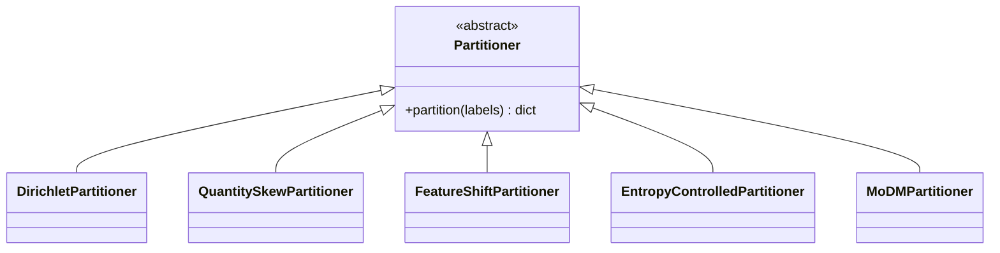

# Partitioning API Reference

This document provides the API reference for the `unbitrium.partitioning` module.

---

## Table of Contents

1. [Overview](#overview)
2. [Base Class](#base-class)
3. [Label Skew Partitioners](#label-skew-partitioners)
4. [Quantity Skew Partitioners](#quantity-skew-partitioners)
5. [Feature Partitioners](#feature-partitioners)

---

## Overview

Partitioners create non-IID data distributions across federated clients.



---

## Base Class

### Partitioner

```python
from unbitrium.partitioning import Partitioner

class Partitioner(ABC):
    """Abstract base class for data partitioning.

    All partitioners must implement the partition method.
    """

    @abstractmethod
    def partition(
        self,
        labels: np.ndarray,
    ) -> dict[int, list[int]]:
        """Partition data across clients.

        Args:
            labels: Array of class labels.

        Returns:
            Dictionary mapping client IDs to sample indices.
        """
        pass
```

---

## Label Skew Partitioners

### DirichletPartitioner

```python
from unbitrium.partitioning import DirichletPartitioner
```

Creates label skew using Dirichlet distribution.

**Mathematical Formulation:**

For each client $k$, sample proportion vector:

$$p_k \sim \text{Dir}(\alpha \cdot \mathbf{1})$$

| Parameter | Type | Default | Description |
|-----------|------|---------|-------------|
| `num_clients` | int | Required | Number of clients |
| `alpha` | float | 0.5 | Concentration parameter |
| `min_samples` | int | 10 | Minimum samples per client |
| `seed` | int | None | Random seed |

```python
partitioner = DirichletPartitioner(
    num_clients=100,
    alpha=0.5,
    min_samples=10,
    seed=42,
)

client_indices = partitioner.partition(labels)
```

### MoDMPartitioner

```python
from unbitrium.partitioning import MoDMPartitioner
```

Mixture of Dirichlet distributions for multi-modal heterogeneity.

| Parameter | Type | Default | Description |
|-----------|------|---------|-------------|
| `num_clients` | int | Required | Number of clients |
| `num_modes` | int | 3 | Number of distribution modes |
| `alphas` | list | None | Alpha per mode |
| `mode_probs` | list | None | Probability of each mode |
| `seed` | int | None | Random seed |

```python
partitioner = MoDMPartitioner(
    num_clients=100,
    num_modes=3,
    alphas=[0.1, 0.5, 1.0],
    seed=42,
)
```

### EntropyControlledPartitioner

```python
from unbitrium.partitioning import EntropyControlledPartitioner
```

Controls target label entropy per client.

| Parameter | Type | Default | Description |
|-----------|------|---------|-------------|
| `num_clients` | int | Required | Number of clients |
| `target_entropy` | float | 0.5 | Target normalized entropy |
| `seed` | int | None | Random seed |

```python
partitioner = EntropyControlledPartitioner(
    num_clients=100,
    target_entropy=0.3,
    seed=42,
)
```

---

## Quantity Skew Partitioners

### QuantitySkewPartitioner

```python
from unbitrium.partitioning import QuantitySkewPartitioner
```

Creates unequal dataset sizes using power-law distribution.

| Parameter | Type | Default | Description |
|-----------|------|---------|-------------|
| `num_clients` | int | Required | Number of clients |
| `power` | float | 1.0 | Power-law exponent |
| `min_samples` | int | 10 | Minimum samples |
| `seed` | int | None | Random seed |

```python
partitioner = QuantitySkewPartitioner(
    num_clients=100,
    power=1.5,
    min_samples=10,
    seed=42,
)
```

---

## Feature Partitioners

### FeatureShiftPartitioner

```python
from unbitrium.partitioning import FeatureShiftPartitioner
```

Partitions based on feature clustering.

| Parameter | Type | Default | Description |
|-----------|------|---------|-------------|
| `num_clients` | int | Required | Number of clients |
| `num_clusters` | int | None | Number of feature clusters |
| `seed` | int | None | Random seed |

```python
partitioner = FeatureShiftPartitioner(
    num_clients=100,
    num_clusters=10,
    seed=42,
)

# For feature-based partitioning
client_indices = partitioner.partition_features(features, labels)
```

---

## Usage Examples

### Basic Usage

```python
import numpy as np
from unbitrium.partitioning import DirichletPartitioner

# Sample data
labels = np.random.randint(0, 10, size=10000)

# Create partitioner
partitioner = DirichletPartitioner(num_clients=100, alpha=0.5)

# Partition
client_indices = partitioner.partition(labels)

# Inspect distribution
for client_id in range(5):
    client_labels = labels[client_indices[client_id]]
    unique, counts = np.unique(client_labels, return_counts=True)
    print(f"Client {client_id}: {dict(zip(unique, counts))}")
```

### Combining with Metrics

```python
from unbitrium.partitioning import DirichletPartitioner
from unbitrium.metrics import compute_emd, compute_label_entropy

# Partition
partitioner = DirichletPartitioner(num_clients=100, alpha=0.5)
client_indices = partitioner.partition(labels)

# Measure heterogeneity
emd = compute_emd(labels, client_indices)
entropy = compute_label_entropy(labels, client_indices)

print(f"EMD: {emd:.4f}")
print(f"Entropy: {entropy:.4f}")
```

---

*Last updated: January 2026*
