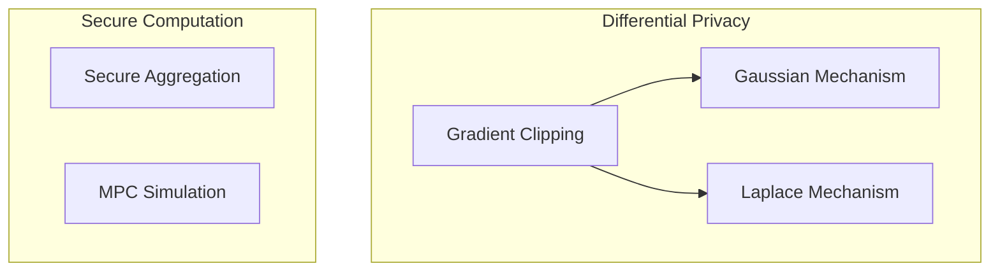

# Privacy API Reference

This document provides the API reference for the `unbitrium.privacy` module.

---

## Table of Contents

1. [Overview](#overview)
2. [Mechanisms](#mechanisms)
3. [Gradient Clipping](#gradient-clipping)
4. [Secure Aggregation](#secure-aggregation)

---

## Overview

Privacy mechanisms protect client data in federated learning.



---

## Mechanisms

### GaussianMechanism

```python
from unbitrium.privacy import GaussianMechanism

class GaussianMechanism:
    """Gaussian mechanism for (epsilon, delta)-DP.

    Args:
        epsilon: Privacy budget epsilon.
        delta: Privacy parameter delta.
        sensitivity: L2 sensitivity.

    Example:
        >>> mech = GaussianMechanism(epsilon=1.0, delta=1e-5, sensitivity=1.0)
        >>> noisy_value = mech.apply(value)
    """
```

### LaplaceMechanism

```python
from unbitrium.privacy import LaplaceMechanism

class LaplaceMechanism:
    """Laplace mechanism for epsilon-DP.

    Args:
        epsilon: Privacy budget.
        sensitivity: L1 sensitivity.

    Example:
        >>> mech = LaplaceMechanism(epsilon=1.0, sensitivity=1.0)
        >>> noisy_value = mech.apply(value)
    """
```

---

## Gradient Clipping

### clip_gradients

```python
from unbitrium.privacy import clip_gradients

def clip_gradients(
    gradients: dict[str, torch.Tensor],
    max_norm: float,
) -> dict[str, torch.Tensor]:
    """Clip gradients to bound sensitivity.

    Args:
        gradients: Gradient dictionary.
        max_norm: Maximum L2 norm.

    Returns:
        Clipped gradients.
    """
```

---

## Secure Aggregation

### SecureAggregation

```python
from unbitrium.privacy import SecureAggregation

class SecureAggregation:
    """Simulated secure aggregation protocol.

    Args:
        num_clients: Number of participating clients.
        threshold: Minimum clients for reconstruction.

    Example:
        >>> sec_agg = SecureAggregation(num_clients=10, threshold=7)
        >>> result = sec_agg.aggregate(client_values)
    """
```

---

*Last updated: January 2026*
