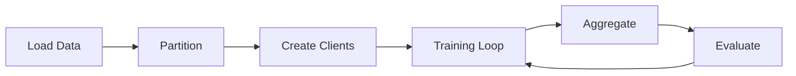

# Quick Start

Get up and running with Unbitrium in minutes.

---

## Table of Contents

1. [Prerequisites](#prerequisites)
2. [Basic Workflow](#basic-workflow)
3. [Partitioning Data](#partitioning-data)
4. [Training Loop](#training-loop)
5. [Measuring Heterogeneity](#measuring-heterogeneity)
6. [Complete Example](#complete-example)

---

## Prerequisites

Ensure Unbitrium is installed:

```bash
pip install unbitrium
```

Verify installation:

```python
import unbitrium
print(unbitrium.__version__)
```

---

## Basic Workflow

A typical Unbitrium workflow consists of:



1. **Load Data**: Load your dataset
2. **Partition**: Distribute data across clients
3. **Create Clients**: Initialize simulated clients
4. **Training Loop**: Run federated training rounds
5. **Aggregate**: Combine client updates
6. **Evaluate**: Measure model performance

---

## Partitioning Data

### Dirichlet Label Skew

The most common non-IID partitioning strategy:

```python
from unbitrium.partitioning import DirichletPartitioner
import numpy as np

# Sample labels
labels = np.random.randint(0, 10, size=10000)

# Create partitioner
partitioner = DirichletPartitioner(
    num_clients=100,
    alpha=0.5,  # Lower = more heterogeneous
    seed=42,
)

# Partition
client_indices = partitioner.partition(labels)

# Check distribution
for client_id in range(5):
    indices = client_indices[client_id]
    print(f"Client {client_id}: {len(indices)} samples")
```

### Alternative Partitioners

| Partitioner | Use Case |
|-------------|----------|
| `DirichletPartitioner` | Label skew |
| `QuantitySkewPartitioner` | Unequal dataset sizes |
| `FeatureShiftPartitioner` | Feature distribution shift |
| `EntropyControlledPartitioner` | Controlled entropy |

---

## Training Loop

### Simple Training Loop

```python
import torch
from unbitrium.aggregators import FedAvg
from unbitrium.simulation import Client

# Global model
global_model = YourModel()

# Aggregator
aggregator = FedAvg()

# Training loop
for round_num in range(num_rounds):
    # Collect client updates
    updates = []
    for client in selected_clients:
        update = client.train(global_model.state_dict())
        updates.append(update)

    # Aggregate
    global_model, metrics = aggregator.aggregate(updates, global_model)

    # Log progress
    print(f"Round {round_num}: {metrics}")
```

### With Client Selection

```python
import random

# Select subset of clients
num_selected = int(0.1 * len(clients))  # 10% participation
selected_clients = random.sample(clients, num_selected)
```

---

## Measuring Heterogeneity

### Earth Mover's Distance

```python
from unbitrium.metrics import compute_emd

emd = compute_emd(labels, client_indices)
print(f"EMD: {emd:.4f}")
```

### Multiple Metrics

```python
from unbitrium.metrics import (
    compute_emd,
    compute_label_entropy,
    compute_js_divergence,
    compute_imbalance_ratio,
)

# Compute metrics
metrics = {
    "emd": compute_emd(labels, client_indices),
    "entropy": compute_label_entropy(labels, client_indices),
    "js_div": compute_js_divergence(labels, client_indices),
    "imbalance": compute_imbalance_ratio(client_indices),
}

for name, value in metrics.items():
    print(f"{name}: {value:.4f}")
```

---

## Complete Example

```python
"""Complete federated learning example with Unbitrium."""

from __future__ import annotations

import torch
import torch.nn as nn
import numpy as np

from unbitrium.aggregators import FedAvg
from unbitrium.partitioning import DirichletPartitioner
from unbitrium.metrics import compute_emd, compute_label_entropy
from unbitrium.simulation import Client

# =============================================================================
# Configuration
# =============================================================================
CONFIG = {
    "num_clients": 10,
    "alpha": 0.5,
    "num_rounds": 10,
    "local_epochs": 1,
    "batch_size": 32,
    "learning_rate": 0.01,
    "seed": 42,
}

# =============================================================================
# Set Seeds
# =============================================================================
np.random.seed(CONFIG["seed"])
torch.manual_seed(CONFIG["seed"])

# =============================================================================
# Generate Data
# =============================================================================
num_samples = 1000
num_features = 10
num_classes = 3

X = torch.randn(num_samples, num_features)
y = torch.randint(0, num_classes, (num_samples,))

# =============================================================================
# Partition Data
# =============================================================================
partitioner = DirichletPartitioner(
    num_clients=CONFIG["num_clients"],
    alpha=CONFIG["alpha"],
    seed=CONFIG["seed"],
)
client_indices = partitioner.partition(y.numpy())

# Measure heterogeneity
emd = compute_emd(y.numpy(), client_indices)
entropy = compute_label_entropy(y.numpy(), client_indices)
print(f"Data Heterogeneity - EMD: {emd:.4f}, Entropy: {entropy:.4f}")

# =============================================================================
# Define Model
# =============================================================================
class SimpleModel(nn.Module):
    """Simple feedforward network."""

    def __init__(self):
        super().__init__()
        self.net = nn.Sequential(
            nn.Linear(num_features, 32),
            nn.ReLU(),
            nn.Linear(32, num_classes),
        )

    def forward(self, x: torch.Tensor) -> torch.Tensor:
        return self.net(x)

# =============================================================================
# Create Clients
# =============================================================================
clients = []
for i in range(CONFIG["num_clients"]):
    indices = client_indices[i]
    client = Client(
        client_id=i,
        local_data=(X[indices], y[indices]),
        model_fn=SimpleModel,
        batch_size=CONFIG["batch_size"],
        learning_rate=CONFIG["learning_rate"],
        local_epochs=CONFIG["local_epochs"],
    )
    clients.append(client)
    print(f"Client {i}: {len(indices)} samples")

# =============================================================================
# Initialize
# =============================================================================
global_model = SimpleModel()
aggregator = FedAvg()

# =============================================================================
# Training Loop
# =============================================================================
print("\nStarting federated training...")
for round_num in range(CONFIG["num_rounds"]):
    # Collect updates from all clients
    updates = []
    for client in clients:
        update = client.train(global_model.state_dict())
        updates.append(update)

    # Aggregate
    global_model, agg_metrics = aggregator.aggregate(updates, global_model)

    # Evaluate
    global_model.eval()
    with torch.no_grad():
        outputs = global_model(X)
        preds = outputs.argmax(dim=1)
        accuracy = (preds == y).float().mean().item()

    print(f"Round {round_num + 1:2d}: Accuracy = {accuracy:.4f}")

print("\nTraining complete!")
```

---

## Next Steps

| Topic | Description |
|-------|-------------|
| [Tutorial 001](../tutorials/tutorial_001.md) | Introduction to Federated Learning |
| [API Reference](../api/core.md) | Complete API documentation |
| [Aggregators](../api/aggregators.md) | All aggregation algorithms |
| [Partitioning](../api/partitioning.md) | All partitioning strategies |

---

*Last updated: January 2026*
