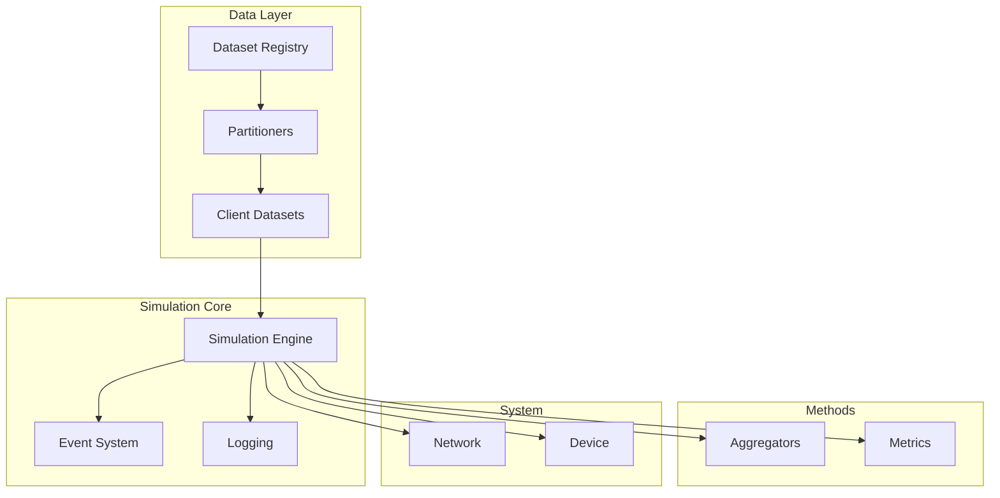

# Unbitrium

**Unbitrium** is a state-of-the-art federated learning simulator and benchmarking platform designed for reproducible research under data heterogeneity.

<div class="grid cards" markdown>

-   :material-chart-network: **Non-IID Partitioning**
    ---
    Simulate realistic data heterogeneity with Dirichlet label skew, quantity skew, and feature shift clustering.

-   :material-server-network: **Advanced Aggregation**
    ---
    Experiment with FedAvg, FedProx, FedDyn, FedSim, and robust aggregation methods.

-   :material-chart-bar: **Heterogeneity Metrics**
    ---
    Quantify distribution shifts using EMD, JS Divergence, and Gradient Variance.

-   :material-router-wireless: **System Realism**
    ---
    Model network latency, jitter, packet loss, and device constraints.

</div>

## Key Features

*   **Modular Architecture**: Easily swap partitioners, aggregators, and system models.
*   **Reproducibility**: Deterministic RNG management and provenance tracking.
*   **Performance**: Vectorized operations and support for GPU acceleration.
*   **Documentation**: Comprehensive API reference and tutorials.

## Architecture



## Getting Started

Check out the [Installation](getting_started/installation.md) guide or jump straight into the [Quick Start](getting_started/quickstart.md).

## Citation

If you use Unbitrium in your research, please cite:

```bibtex
@software{unbitrium2026,
  author       = {Laitinen Imanov, Olaf Yunus and Contributors},
  title        = {Unbitrium: Federated Learning Simulator and Benchmarking Platform},
  year         = {2026},
  publisher    = {GitHub},
  url          = {https://github.com/olaflaitinen/unbitrium},
  version      = {0.1.0}
}
```
