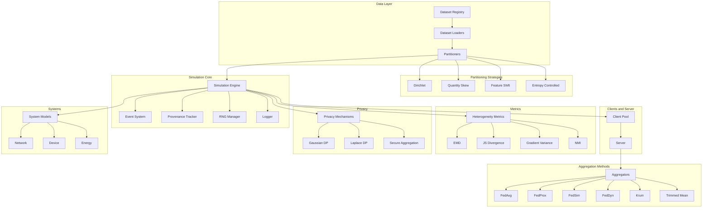

# Unbitrium

**Unbitrium** is a production-grade federated learning simulator and benchmarking platform designed for reproducible research under data heterogeneity.

---

## Overview

Unbitrium provides a comprehensive toolkit for federated learning research, offering:

- **Non-IID Data Partitioning**: Simulate realistic data heterogeneity with Dirichlet label skew, quantity skew, feature shift clustering, and entropy-controlled distributions.
- **Advanced Aggregation Algorithms**: Experiment with FedAvg, FedProx, FedDyn, FedSim, FedAdam, Krum, Trimmed Mean, and more.
- **Heterogeneity Metrics**: Quantify distribution shifts using EMD, JS Divergence, Gradient Variance, NMI, and CKA.
- **Privacy Mechanisms**: Implement differential privacy with Gaussian and Laplace mechanisms, plus secure aggregation simulation.
- **System Realism**: Model network latency, jitter, packet loss, and device constraints.

---

## Key Features

| Feature | Description |
|---------|-------------|
| Modular Architecture | Easily swap partitioners, aggregators, and system models |
| Reproducibility | Deterministic RNG management and provenance tracking |
| Performance | Vectorized operations and GPU acceleration support |
| Documentation | 200+ tutorials and comprehensive API reference |
| Type Safety | Full type hints with mypy strict mode |
| Testing | 80%+ code coverage with pytest |

---

## Architecture



---

## Quick Start

Install Unbitrium:

```bash
pip install unbitrium
```

Run a simple federated learning experiment:

```python
from unbitrium.aggregators import FedAvg
from unbitrium.partitioning import DirichletPartitioner
from unbitrium.metrics import compute_emd

# Create partitioner
partitioner = DirichletPartitioner(num_clients=10, alpha=0.5)

# Create aggregator
aggregator = FedAvg()

# Partition data
client_indices = partitioner.partition(labels)

# Measure heterogeneity
emd = compute_emd(labels, client_indices)
print(f"EMD: {emd:.4f}")
```

---

## Documentation Structure

| Section | Description |
|---------|-------------|
| [Getting Started](getting_started/installation.md) | Installation and setup guides |
| [Tutorials](tutorials/index.md) | 200+ step-by-step tutorials |
| [API Reference](api/core.md) | Complete API documentation |
| [Research Notes](research/notes.md) | Research background and notes |
| [Validation](validation/README.md) | Algorithm validation reports |

---

## Modules

### Core

The simulation infrastructure:

- **SimulationEngine**: Orchestrates FL rounds
- **EventSystem**: Publish-subscribe events
- **ProvenanceTracker**: Experiment metadata
- **RNGManager**: Deterministic randomness

### Partitioning

Data distribution strategies:

- **DirichletPartitioner**: Label skew via Dirichlet distribution
- **QuantitySkewPartitioner**: Power-law size distributions
- **FeatureShiftPartitioner**: Feature-based clustering
- **EntropyControlledPartitioner**: Target entropy control

### Aggregators

Model combination algorithms:

- **FedAvg**: Weighted average (McMahan 2017)
- **FedProx**: Proximal regularization (Li 2020)
- **FedDyn**: Dynamic regularization (Acar 2021)
- **FedSim**: Similarity-weighted aggregation
- **Krum**: Byzantine-robust selection (Blanchard 2017)
- **TrimmedMean**: Coordinate-wise trimming (Yin 2018)

### Metrics

Heterogeneity quantification:

- **EMD**: Earth Mover's Distance
- **JS Divergence**: Jensen-Shannon divergence
- **Gradient Variance**: Client gradient variance
- **NMI**: Normalized Mutual Information
- **CKA**: Centered Kernel Alignment

### Privacy

Privacy-preserving mechanisms:

- **GaussianMechanism**: (epsilon, delta)-DP
- **LaplaceMechanism**: epsilon-DP
- **SecureAggregation**: Simulation interface

---

## Citation

If you use Unbitrium in your research, please cite:

```bibtex
@software{unbitrium2026,
  author       = {Laitinen Imanov, Olaf Yunus},
  title        = {Unbitrium: Production-grade Federated Learning Simulator},
  year         = {2026},
  publisher    = {GitHub},
  url          = {https://github.com/olaflaitinen/unbitrium},
  version      = {1.0.0}
}
```

---

## License

Unbitrium is licensed under the [European Union Public Licence 1.2 (EUPL-1.2)](https://github.com/olaflaitinen/unbitrium/blob/main/LICENSE).

---

*Last updated: January 2026*
