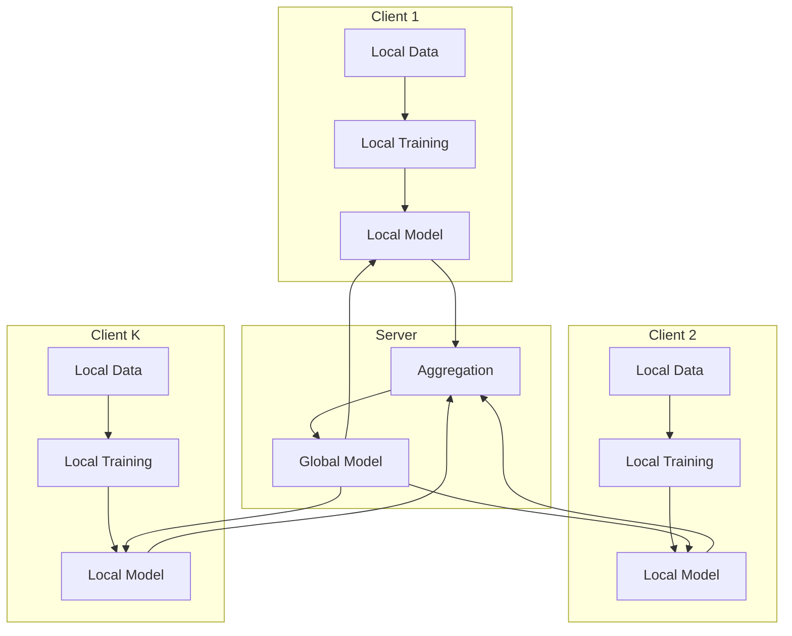
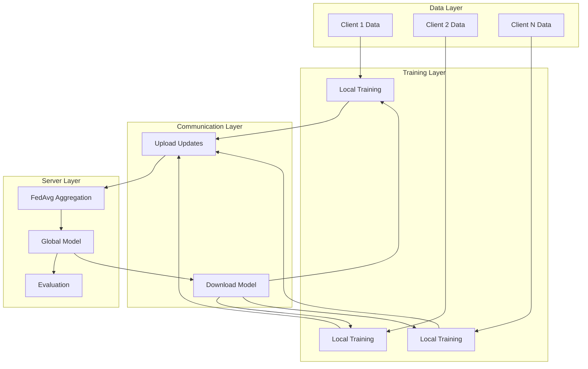

# Tutorial 001: Introduction to Federated Learning

---

## Metadata

| Property | Value |
|----------|-------|
| **Tutorial ID** | 001 |
| **Title** | Introduction to Federated Learning |
| **Category** | Fundamentals |
| **Difficulty** | Beginner |
| **Duration** | 60 minutes |
| **Prerequisites** | Basic Python, Machine Learning fundamentals |
| **Author** | Unbitrium Contributors |
| **Last Updated** | January 2026 |

---

## Learning Objectives

By the end of this tutorial, you will be able to:

1. **Understand** the fundamental concepts of federated learning and how it differs from centralized machine learning approaches.

2. **Identify** key use cases where federated learning provides significant advantages over traditional ML pipelines.

3. **Explain** the core components of a federated learning system including clients, servers, and communication protocols.

4. **Implement** a basic federated averaging (FedAvg) algorithm from scratch using Python and PyTorch.

5. **Analyze** the privacy-utility trade-offs inherent in federated learning systems.

6. **Apply** federated learning concepts to simple classification tasks with distributed data.

---

## Prerequisites

Before starting this tutorial, ensure you have:

- **Python Knowledge**: Comfortable with Python programming, classes, and functions
- **ML Basics**: Understanding of supervised learning, gradient descent, and neural networks
- **Libraries**: PyTorch, NumPy installed and working
- **Hardware**: CPU sufficient for this tutorial

```python
# Verify prerequisites
import torch
import torch.nn as nn
import numpy as np

print(f"PyTorch: {torch.__version__}")
print(f"NumPy: {np.__version__}")
print(f"CUDA available: {torch.cuda.is_available()}")
```

---

## Background and Theory

### What is Federated Learning?

**Federated Learning (FL)** is a machine learning paradigm where a model is trained across multiple decentralized devices or servers holding local data samples, without exchanging the raw data. Instead of collecting all data in a central location, the model goes to the data.

$$\min_{\theta} \sum_{k=1}^{K} \frac{n_k}{n} F_k(\theta)$$

where:
- $K$ is the number of clients
- $n_k$ is the number of samples on client $k$
- $n = \sum_{k=1}^{K} n_k$ is the total number of samples
- $F_k(\theta)$ is the local objective function for client $k$

### Why Federated Learning?

| Aspect | Centralized ML | Federated Learning |
|--------|---------------|-------------------|
| **Data Location** | Central server | Distributed on devices |
| **Privacy** | Data exposed | Data stays local |
| **Communication** | Upload all data | Upload model updates |
| **Bandwidth** | High | Lower |
| **Regulatory** | May violate GDPR | Privacy-preserving |

### Core Components of FL



### The FedAvg Algorithm

The Federated Averaging algorithm, proposed by McMahan et al. (2017), is the foundational algorithm for federated learning:

1. **Server** initializes global model $\theta_0$
2. For each round $t = 1, 2, \ldots, T$:
   - Server selects a subset $S_t$ of clients
   - Server broadcasts $\theta_t$ to selected clients
   - Each client $k \in S_t$ performs local training:
     - $\theta_k^{t+1} = \theta_t - \eta \nabla F_k(\theta_t)$
   - Clients send $\theta_k^{t+1}$ to server
   - Server aggregates:
     - $\theta_{t+1} = \sum_{k \in S_t} \frac{n_k}{\sum_{j \in S_t} n_j} \theta_k^{t+1}$

### Key Challenges in FL

| Challenge | Description | Solutions |
|-----------|-------------|-----------|
| **Non-IID Data** | Data distribution varies across clients | FedProx, SCAFFOLD |
| **Communication** | Limited bandwidth, high latency | Compression, async updates |
| **System Heterogeneity** | Different device capabilities | Partial work, HeteroFL |
| **Privacy Attacks** | Gradient leakage, membership inference | Differential privacy, secure aggregation |

---

## Architecture Diagram



---

## Implementation Code

### Part 1: Data Utilities and Client Setup

```python
#!/usr/bin/env python3
"""
Tutorial 001: Introduction to Federated Learning

This tutorial implements the basic FedAvg algorithm for federated
learning, demonstrating the core concepts of distributed training.

Author: Unbitrium Contributors
License: EUPL-1.2
"""

from __future__ import annotations

from dataclasses import dataclass
from typing import Any

import numpy as np
import torch
import torch.nn as nn
import torch.nn.functional as F
from torch.utils.data import Dataset, DataLoader


@dataclass
class FLConfig:
    """Configuration for federated learning."""
    num_clients: int = 10
    num_rounds: int = 50
    local_epochs: int = 5
    batch_size: int = 32
    learning_rate: float = 0.01
    fraction_fit: float = 1.0  # Fraction of clients per round


class SimpleDataset(Dataset):
    """Simple dataset for federated learning."""

    def __init__(
        self,
        features: np.ndarray,
        labels: np.ndarray,
    ) -> None:
        """Initialize dataset.

        Args:
            features: Feature array of shape (n_samples, n_features).
            labels: Label array of shape (n_samples,).
        """
        self.features = torch.FloatTensor(features)
        self.labels = torch.LongTensor(labels)

    def __len__(self) -> int:
        return len(self.labels)

    def __getitem__(self, idx: int) -> tuple[torch.Tensor, torch.Tensor]:
        return self.features[idx], self.labels[idx]


def create_non_iid_data(
    num_clients: int,
    samples_per_client: int,
    num_classes: int = 10,
    feature_dim: int = 32,
    alpha: float = 0.5,
) -> list[tuple[np.ndarray, np.ndarray]]:
    """Create non-IID data distribution across clients.

    Uses Dirichlet distribution to create heterogeneous label distributions.

    Args:
        num_clients: Number of clients.
        samples_per_client: Samples per client.
        num_classes: Number of classes.
        feature_dim: Feature dimension.
        alpha: Dirichlet concentration parameter (lower = more non-IID).

    Returns:
        List of (features, labels) tuples for each client.
    """
    client_data = []

    # Generate class distribution per client using Dirichlet
    class_probs = np.random.dirichlet([alpha] * num_classes, num_clients)

    for client_id in range(num_clients):
        # Sample labels according to client's distribution
        labels = np.random.choice(
            num_classes,
            size=samples_per_client,
            p=class_probs[client_id],
        )

        # Generate features with class-dependent patterns
        features = np.zeros((samples_per_client, feature_dim), dtype=np.float32)
        for i, label in enumerate(labels):
            # Class-specific mean
            class_mean = np.zeros(feature_dim)
            class_mean[label % feature_dim] = 2.0
            class_mean[(label * 3) % feature_dim] = 1.5

            # Add noise
            features[i] = class_mean + np.random.randn(feature_dim) * 0.5

        client_data.append((features, labels))

    return client_data
```

### Part 2: Neural Network Model

```python
class FederatedModel(nn.Module):
    """Simple neural network for federated learning.

    This is a multi-layer perceptron suitable for tabular data
    classification tasks.
    """

    def __init__(
        self,
        input_dim: int = 32,
        hidden_dim: int = 64,
        num_classes: int = 10,
        dropout: float = 0.2,
    ) -> None:
        """Initialize the model.

        Args:
            input_dim: Input feature dimension.
            hidden_dim: Hidden layer dimension.
            num_classes: Number of output classes.
            dropout: Dropout probability.
        """
        super().__init__()

        self.network = nn.Sequential(
            nn.Linear(input_dim, hidden_dim),
            nn.ReLU(),
            nn.Dropout(dropout),
            nn.Linear(hidden_dim, hidden_dim),
            nn.ReLU(),
            nn.Dropout(dropout),
            nn.Linear(hidden_dim, num_classes),
        )

    def forward(self, x: torch.Tensor) -> torch.Tensor:
        """Forward pass.

        Args:
            x: Input tensor of shape (batch, input_dim).

        Returns:
            Logits of shape (batch, num_classes).
        """
        return self.network(x)


class FederatedClient:
    """Federated learning client.

    Represents a single device or data silo participating in
    federated training.
    """

    def __init__(
        self,
        client_id: int,
        features: np.ndarray,
        labels: np.ndarray,
        config: FLConfig,
    ) -> None:
        """Initialize client.

        Args:
            client_id: Unique client identifier.
            features: Local training features.
            labels: Local training labels.
            config: FL configuration.
        """
        self.client_id = client_id
        self.config = config

        # Create dataset and dataloader
        self.dataset = SimpleDataset(features, labels)
        self.dataloader = DataLoader(
            self.dataset,
            batch_size=config.batch_size,
            shuffle=True,
        )

        # Initialize local model
        self.model = FederatedModel(
            input_dim=features.shape[1],
            num_classes=len(np.unique(labels)),
        )

    @property
    def num_samples(self) -> int:
        """Number of local samples."""
        return len(self.dataset)

    def load_global_model(self, state_dict: dict[str, torch.Tensor]) -> None:
        """Load global model parameters.

        Args:
            state_dict: Global model state dictionary.
        """
        self.model.load_state_dict(state_dict)

    def train(self) -> dict[str, Any]:
        """Perform local training.

        Returns:
            Dictionary containing updated state_dict and metadata.
        """
        self.model.train()
        optimizer = torch.optim.SGD(
            self.model.parameters(),
            lr=self.config.learning_rate,
        )

        total_loss = 0.0
        num_batches = 0

        for epoch in range(self.config.local_epochs):
            for features, labels in self.dataloader:
                optimizer.zero_grad()
                outputs = self.model(features)
                loss = F.cross_entropy(outputs, labels)
                loss.backward()
                optimizer.step()

                total_loss += loss.item()
                num_batches += 1

        return {
            "state_dict": {
                k: v.clone() for k, v in self.model.state_dict().items()
            },
            "num_samples": self.num_samples,
            "client_id": self.client_id,
            "loss": total_loss / num_batches if num_batches > 0 else 0.0,
        }

    def evaluate(self) -> dict[str, float]:
        """Evaluate local model.

        Returns:
            Dictionary of evaluation metrics.
        """
        self.model.eval()
        correct = 0
        total = 0

        with torch.no_grad():
            for features, labels in self.dataloader:
                outputs = self.model(features)
                _, predicted = outputs.max(1)
                correct += predicted.eq(labels).sum().item()
                total += labels.size(0)

        return {
            "accuracy": correct / total if total > 0 else 0.0,
            "num_samples": total,
        }
```

### Part 3: FedAvg Server and Training Loop

```python
class FederatedServer:
    """Federated learning server.

    Coordinates training across clients using FedAvg algorithm.
    """

    def __init__(
        self,
        clients: list[FederatedClient],
        config: FLConfig,
    ) -> None:
        """Initialize server.

        Args:
            clients: List of federated clients.
            config: FL configuration.
        """
        self.clients = clients
        self.config = config

        # Initialize global model
        sample_client = clients[0]
        self.global_model = FederatedModel(
            input_dim=sample_client.dataset.features.shape[1],
        )

        self.history = {
            "rounds": [],
            "losses": [],
            "accuracies": [],
        }

    def select_clients(self) -> list[FederatedClient]:
        """Select clients for current round.

        Returns:
            List of selected clients.
        """
        num_selected = max(1, int(len(self.clients) * self.config.fraction_fit))
        indices = np.random.choice(
            len(self.clients),
            size=num_selected,
            replace=False,
        )
        return [self.clients[i] for i in indices]

    def aggregate(
        self,
        updates: list[dict[str, Any]],
    ) -> dict[str, torch.Tensor]:
        """Aggregate client updates using FedAvg.

        Args:
            updates: List of client update dictionaries.

        Returns:
            Aggregated state dictionary.
        """
        total_samples = sum(u["num_samples"] for u in updates)
        global_state = self.global_model.state_dict()
        new_state = {}

        for key in global_state.keys():
            weighted_sum = torch.zeros_like(global_state[key])
            for update in updates:
                weight = update["num_samples"] / total_samples
                weighted_sum += weight * update["state_dict"][key]
            new_state[key] = weighted_sum

        return new_state

    def train_round(self, round_num: int) -> dict[str, float]:
        """Execute one round of federated training.

        Args:
            round_num: Current round number.

        Returns:
            Round metrics.
        """
        # Select clients
        selected_clients = self.select_clients()

        # Distribute global model
        global_state = self.global_model.state_dict()
        for client in selected_clients:
            client.load_global_model(global_state)

        # Collect local updates
        updates = []
        for client in selected_clients:
            update = client.train()
            updates.append(update)

        # Aggregate updates
        new_state = self.aggregate(updates)
        self.global_model.load_state_dict(new_state)

        # Evaluate
        for client in self.clients:
            client.load_global_model(new_state)

        evaluations = [c.evaluate() for c in self.clients]
        avg_accuracy = np.mean([e["accuracy"] for e in evaluations])
        avg_loss = np.mean([u["loss"] for u in updates])

        # Record history
        self.history["rounds"].append(round_num)
        self.history["losses"].append(avg_loss)
        self.history["accuracies"].append(avg_accuracy)

        return {
            "round": round_num,
            "loss": avg_loss,
            "accuracy": avg_accuracy,
            "num_clients": len(selected_clients),
        }

    def train(self) -> dict[str, list]:
        """Run full federated training.

        Returns:
            Training history.
        """
        print(f"Starting federated training with {len(self.clients)} clients")
        print(f"Rounds: {self.config.num_rounds}, Local epochs: {self.config.local_epochs}")
        print("-" * 50)

        for round_num in range(self.config.num_rounds):
            metrics = self.train_round(round_num)

            if (round_num + 1) % 10 == 0:
                print(
                    f"Round {round_num + 1}/{self.config.num_rounds}: "
                    f"Loss={metrics['loss']:.4f}, Acc={metrics['accuracy']:.4f}"
                )

        print("-" * 50)
        print(f"Training complete. Final accuracy: {self.history['accuracies'][-1]:.4f}")

        return self.history


def run_federated_learning(
    num_clients: int = 10,
    num_rounds: int = 50,
    samples_per_client: int = 500,
    alpha: float = 0.5,
) -> dict[str, list]:
    """Run complete federated learning experiment.

    Args:
        num_clients: Number of clients.
        num_rounds: Number of communication rounds.
        samples_per_client: Samples per client.
        alpha: Non-IID parameter (lower = more heterogeneous).

    Returns:
        Training history.
    """
    config = FLConfig(
        num_clients=num_clients,
        num_rounds=num_rounds,
    )

    # Create non-IID data
    client_data = create_non_iid_data(
        num_clients=num_clients,
        samples_per_client=samples_per_client,
        alpha=alpha,
    )

    # Create clients
    clients = [
        FederatedClient(i, features, labels, config)
        for i, (features, labels) in enumerate(client_data)
    ]

    # Create server and train
    server = FederatedServer(clients, config)
    history = server.train()

    return history


# Example usage
if __name__ == "__main__":
    history = run_federated_learning(
        num_clients=10,
        num_rounds=50,
        alpha=0.5,
    )
```

---

## Metrics and Evaluation

### Training Metrics

| Metric | Description | Expected Range |
|--------|-------------|----------------|
| **Training Loss** | Cross-entropy loss | 0.1 - 2.0 |
| **Accuracy** | Classification accuracy | 70% - 95% |
| **Communication Rounds** | Rounds to convergence | 20 - 100 |

### Impact of Non-IID Data

| Alpha (α) | Data Distribution | Expected Accuracy |
|-----------|-------------------|-------------------|
| 0.1 | Highly non-IID | 60% - 70% |
| 0.5 | Moderately non-IID | 70% - 80% |
| 1.0 | Mildly non-IID | 80% - 85% |
| 10.0 | Nearly IID | 85% - 95% |

---

## Exercises

### Exercise 1: Varying Client Participation

**Task**: Modify the fraction of clients participating in each round and analyze convergence.

```python
def experiment_participation():
    """Experiment with different participation rates."""
    fractions = [0.1, 0.3, 0.5, 1.0]
    results = {}

    for frac in fractions:
        # Your implementation here
        pass

    return results
```

### Exercise 2: Communication Efficiency

**Task**: Implement gradient compression by sending only the top-k% of gradients.

### Exercise 3: Client Selection Strategies

**Task**: Implement different client selection strategies (random, round-robin, power-of-choice).

### Exercise 4: Learning Rate Scheduling

**Task**: Add learning rate decay across communication rounds.

---

## References

1. McMahan, B., et al. (2017). Communication-efficient learning of deep networks from decentralized data. In *AISTATS*.

2. Kairouz, P., et al. (2021). Advances and open problems in federated learning. *Foundations and Trends in ML*.

3. Li, T., et al. (2020). Federated optimization in heterogeneous networks. In *MLSys*.

4. Bonawitz, K., et al. (2019). Towards federated learning at scale. In *SysML*.

5. Wang, J., et al. (2021). A field guide to federated optimization. *arXiv preprint*.

---

*Copyright 2026 Olaf Yunus Laitinen Imanov and Contributors. Released under EUPL 1.2.*
