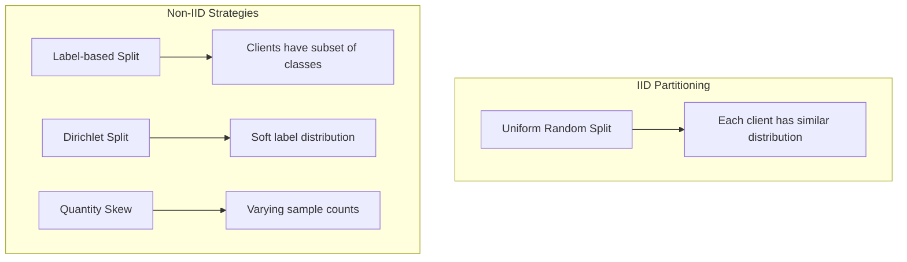
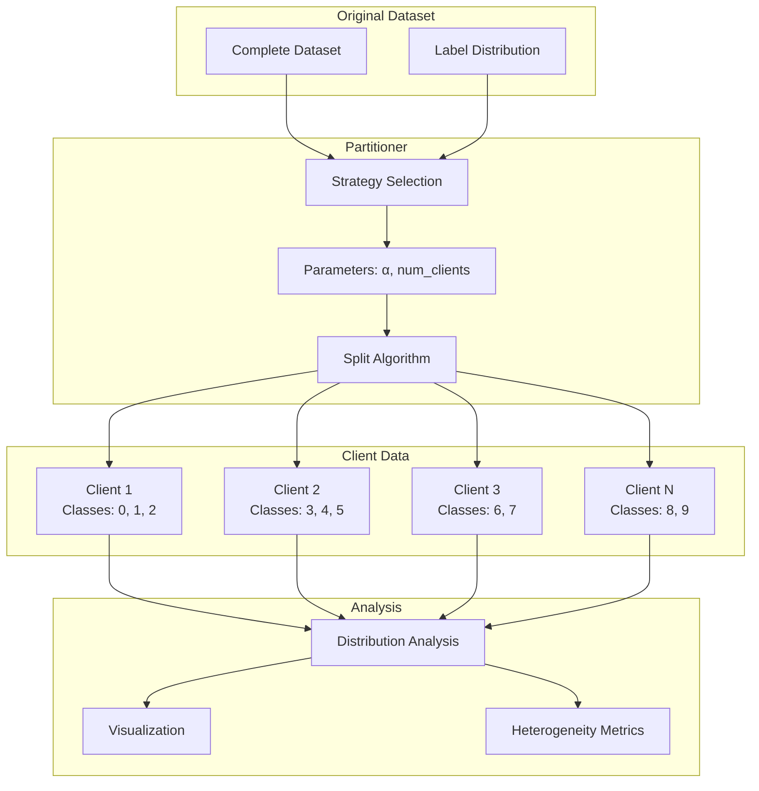

# Tutorial 002: Data Partitioning Strategies

---

## Metadata

| Property | Value |
|----------|-------|
| **Tutorial ID** | 002 |
| **Title** | Data Partitioning Strategies |
| **Category** | Fundamentals |
| **Difficulty** | Beginner |
| **Duration** | 60 minutes |
| **Prerequisites** | Tutorial 001, NumPy basics |
| **Author** | Unbitrium Contributors |
| **Last Updated** | January 2026 |

---

## Learning Objectives

By the end of this tutorial, you will be able to:

1. **Understand** different data partitioning strategies and their impact on federated learning performance.

2. **Implement** IID and non-IID data partitioning schemes using Dirichlet distributions and label-based splits.

3. **Analyze** the statistical properties of partitioned data including class imbalance and distribution skew.

4. **Design** partitioning strategies that simulate real-world federated scenarios.

5. **Evaluate** the impact of data heterogeneity on model convergence and accuracy.

6. **Apply** appropriate partitioning strategies based on application requirements.

---

## Prerequisites

Before starting this tutorial, ensure you have:

- **Completed Tutorials**: 001 (Introduction to Federated Learning)
- **Knowledge**: Basic statistics, probability distributions
- **Libraries**: PyTorch, NumPy, Matplotlib
- **Hardware**: CPU sufficient

```python
# Verify prerequisites
import torch
import numpy as np
import matplotlib.pyplot as plt

print(f"PyTorch: {torch.__version__}")
print(f"NumPy: {np.__version__}")
```

---

## Background and Theory

### Why Data Partitioning Matters

In federated learning, the way data is distributed across clients significantly impacts:

- **Model convergence**: Non-IID data slows convergence
- **Final accuracy**: Heterogeneous data reduces accuracy
- **Fairness**: Some clients may be underrepresented
- **Communication**: More rounds needed for non-IID

### Types of Data Heterogeneity

| Type | Description | Example |
|------|-------------|---------|
| **Feature Skew** | $P(x)$ varies across clients | Different camera qualities |
| **Label Skew** | $P(y)$ varies across clients | Regional preferences |
| **Concept Shift** | $P(y|x)$ varies across clients | Different labeling conventions |
| **Quantity Skew** | Sample counts vary | Active vs inactive users |

### Partitioning Strategies



### Mathematical Formulation

**Dirichlet Distribution** for label partitioning:

$$p \sim \text{Dir}(\alpha \cdot \mathbf{1}_K)$$

where:
- $\alpha$ controls heterogeneity (lower = more heterogeneous)
- $K$ is the number of classes
- $p_k$ is the probability of class $k$ for a client

For $\alpha \to 0$: Each client gets only one class
For $\alpha \to \infty$: Each client gets uniform distribution

### Comparison of Strategies

| Strategy | α Equivalent | Use Case | Realism |
|----------|--------------|----------|---------|
| IID | ∞ | Baseline | Low |
| Mild non-IID | 1.0 | General | Medium |
| Moderate non-IID | 0.5 | Cross-device | High |
| Extreme non-IID | 0.1 | Specialized clients | High |

---

## Architecture Diagram



---

## Implementation Code

### Part 1: Base Partitioner Classes

```python
#!/usr/bin/env python3
"""
Tutorial 002: Data Partitioning Strategies for Federated Learning

This tutorial implements various data partitioning strategies
including IID, label-based, and Dirichlet-based partitioning.

Author: Unbitrium Contributors
License: EUPL-1.2
"""

from __future__ import annotations

from abc import ABC, abstractmethod
from dataclasses import dataclass
from typing import Any

import numpy as np
import torch
from torch.utils.data import Dataset, Subset


@dataclass
class PartitionConfig:
    """Configuration for data partitioning."""
    num_clients: int = 10
    alpha: float = 0.5  # Dirichlet concentration
    min_samples: int = 10  # Minimum samples per client
    seed: int = 42


class BasePartitioner(ABC):
    """Abstract base class for data partitioners."""

    def __init__(self, config: PartitionConfig) -> None:
        """Initialize partitioner.

        Args:
            config: Partitioning configuration.
        """
        self.config = config
        np.random.seed(config.seed)

    @abstractmethod
    def partition(
        self,
        labels: np.ndarray,
    ) -> list[np.ndarray]:
        """Partition data indices.

        Args:
            labels: Array of labels for all samples.

        Returns:
            List of index arrays, one per client.
        """
        pass

    def get_statistics(
        self,
        labels: np.ndarray,
        partitions: list[np.ndarray],
    ) -> dict[str, Any]:
        """Compute partition statistics.

        Args:
            labels: All labels.
            partitions: List of index arrays.

        Returns:
            Dictionary of statistics.
        """
        num_classes = len(np.unique(labels))
        
        stats = {
            "num_clients": len(partitions),
            "samples_per_client": [len(p) for p in partitions],
            "classes_per_client": [],
            "class_distributions": [],
        }

        for partition in partitions:
            client_labels = labels[partition]
            unique_classes = np.unique(client_labels)
            stats["classes_per_client"].append(len(unique_classes))
            
            # Class distribution
            dist = np.zeros(num_classes)
            for label in client_labels:
                dist[label] += 1
            dist /= len(client_labels)
            stats["class_distributions"].append(dist)

        return stats


class IIDPartitioner(BasePartitioner):
    """IID (Independent and Identically Distributed) partitioner.

    Randomly shuffles data and splits evenly among clients.
    """

    def partition(self, labels: np.ndarray) -> list[np.ndarray]:
        """Partition data IID.

        Args:
            labels: Array of labels.

        Returns:
            List of index arrays.
        """
        num_samples = len(labels)
        indices = np.random.permutation(num_samples)
        
        # Split evenly
        split_size = num_samples // self.config.num_clients
        partitions = []
        
        for i in range(self.config.num_clients):
            start = i * split_size
            if i == self.config.num_clients - 1:
                # Last client gets remaining samples
                end = num_samples
            else:
                end = start + split_size
            partitions.append(indices[start:end])

        return partitions


class LabelPartitioner(BasePartitioner):
    """Label-based non-IID partitioner.

    Each client receives data from a subset of classes.
    """

    def __init__(
        self,
        config: PartitionConfig,
        classes_per_client: int = 2,
    ) -> None:
        """Initialize label partitioner.

        Args:
            config: Partitioning configuration.
            classes_per_client: Number of classes per client.
        """
        super().__init__(config)
        self.classes_per_client = classes_per_client

    def partition(self, labels: np.ndarray) -> list[np.ndarray]:
        """Partition data by labels.

        Args:
            labels: Array of labels.

        Returns:
            List of index arrays.
        """
        num_classes = len(np.unique(labels))
        
        # Group indices by class
        class_indices = {c: np.where(labels == c)[0] for c in range(num_classes)}
        
        # Assign classes to clients
        partitions = [[] for _ in range(self.config.num_clients)]
        
        for client_id in range(self.config.num_clients):
            # Select classes for this client
            start_class = (client_id * self.classes_per_client) % num_classes
            client_classes = [
                (start_class + i) % num_classes
                for i in range(self.classes_per_client)
            ]
            
            for cls in client_classes:
                # Divide class samples among clients with this class
                clients_with_class = [
                    c for c in range(self.config.num_clients)
                    if cls in [(c * self.classes_per_client + i) % num_classes
                               for i in range(self.classes_per_client)]
                ]
                
                # Split class indices
                cls_indices = class_indices[cls]
                split = len(cls_indices) // len(clients_with_class)
                client_pos = clients_with_class.index(client_id)
                
                start = client_pos * split
                end = start + split if client_pos < len(clients_with_class) - 1 else len(cls_indices)
                
                partitions[client_id].extend(cls_indices[start:end])
        
        return [np.array(p) for p in partitions]
```

### Part 2: Dirichlet Partitioner

```python
class DirichletPartitioner(BasePartitioner):
    """Dirichlet-based non-IID partitioner.

    Uses Dirichlet distribution to create heterogeneous
    label distributions across clients.
    """

    def partition(self, labels: np.ndarray) -> list[np.ndarray]:
        """Partition data using Dirichlet distribution.

        Args:
            labels: Array of labels.

        Returns:
            List of index arrays.
        """
        num_classes = len(np.unique(labels))
        num_samples = len(labels)
        
        # Sample proportions from Dirichlet for each class
        # Shape: (num_classes, num_clients)
        proportions = np.random.dirichlet(
            [self.config.alpha] * self.config.num_clients,
            num_classes,
        )
        
        # Group indices by class
        class_indices = {c: np.where(labels == c)[0] for c in range(num_classes)}
        
        # Partition each class according to proportions
        partitions = [[] for _ in range(self.config.num_clients)]
        
        for cls in range(num_classes):
            cls_indices = class_indices[cls]
            np.random.shuffle(cls_indices)
            
            # Split according to proportions
            cls_proportions = proportions[cls]
            cumsum = np.cumsum(cls_proportions)
            
            start = 0
            for client_id in range(self.config.num_clients):
                end = int(cumsum[client_id] * len(cls_indices))
                partitions[client_id].extend(cls_indices[start:end])
                start = end
        
        # Ensure minimum samples
        for i, partition in enumerate(partitions):
            if len(partition) < self.config.min_samples:
                # Borrow from largest partition
                largest = max(range(len(partitions)), key=lambda x: len(partitions[x]))
                needed = self.config.min_samples - len(partition)
                borrowed = partitions[largest][:needed]
                partitions[largest] = partitions[largest][needed:]
                partition.extend(borrowed)
        
        return [np.array(p) for p in partitions]


class QuantitySkewPartitioner(BasePartitioner):
    """Quantity skew partitioner.

    Creates partitions with varying sample counts using
    exponential or power-law distributions.
    """

    def __init__(
        self,
        config: PartitionConfig,
        skew_factor: float = 2.0,
    ) -> None:
        """Initialize quantity skew partitioner.

        Args:
            config: Partitioning configuration.
            skew_factor: Controls skewness (higher = more skewed).
        """
        super().__init__(config)
        self.skew_factor = skew_factor

    def partition(self, labels: np.ndarray) -> list[np.ndarray]:
        """Partition with quantity skew.

        Args:
            labels: Array of labels.

        Returns:
            List of index arrays.
        """
        num_samples = len(labels)
        indices = np.random.permutation(num_samples)
        
        # Generate skewed proportions using exponential
        raw_proportions = np.random.exponential(self.skew_factor, self.config.num_clients)
        proportions = raw_proportions / raw_proportions.sum()
        
        # Ensure minimum samples
        min_prop = self.config.min_samples / num_samples
        proportions = np.maximum(proportions, min_prop)
        proportions /= proportions.sum()
        
        # Split according to proportions
        cumsum = np.cumsum(proportions)
        partitions = []
        start = 0
        
        for i in range(self.config.num_clients):
            end = int(cumsum[i] * num_samples)
            partitions.append(indices[start:end])
            start = end
        
        return partitions


class CombinedPartitioner(BasePartitioner):
    """Combined label and quantity skew partitioner."""

    def __init__(
        self,
        config: PartitionConfig,
        alpha: float = 0.5,
        quantity_skew: float = 2.0,
    ) -> None:
        """Initialize combined partitioner.

        Args:
            config: Partitioning configuration.
            alpha: Dirichlet concentration.
            quantity_skew: Quantity skew factor.
        """
        super().__init__(config)
        self.alpha = alpha
        self.quantity_skew = quantity_skew

    def partition(self, labels: np.ndarray) -> list[np.ndarray]:
        """Partition with both label and quantity skew.

        Args:
            labels: Array of labels.

        Returns:
            List of index arrays.
        """
        # First apply Dirichlet
        dirichlet = DirichletPartitioner(self.config)
        self.config.alpha = self.alpha
        label_partitions = dirichlet.partition(labels)
        
        # Then apply quantity skew to each partition
        final_partitions = []
        
        for partition in label_partitions:
            # Subsample with quantity variation
            keep_ratio = np.random.exponential(0.5)
            keep_ratio = min(1.0, max(0.3, keep_ratio))
            
            num_keep = max(self.config.min_samples, int(len(partition) * keep_ratio))
            final_partitions.append(partition[:num_keep])
        
        return final_partitions
```

### Part 3: Visualization and Analysis

```python
def visualize_partitions(
    labels: np.ndarray,
    partitions: list[np.ndarray],
    title: str = "Data Partition Distribution",
) -> None:
    """Visualize partition distributions.

    Args:
        labels: All labels.
        partitions: List of index arrays.
        title: Plot title.
    """
    num_clients = len(partitions)
    num_classes = len(np.unique(labels))
    
    # Compute class distribution per client
    distributions = np.zeros((num_clients, num_classes))
    
    for i, partition in enumerate(partitions):
        client_labels = labels[partition]
        for label in client_labels:
            distributions[i, label] += 1
        # Normalize
        if distributions[i].sum() > 0:
            distributions[i] /= distributions[i].sum()
    
    # Plot heatmap
    plt.figure(figsize=(12, 6))
    plt.imshow(distributions, aspect='auto', cmap='Blues')
    plt.colorbar(label='Proportion')
    plt.xlabel('Class')
    plt.ylabel('Client')
    plt.title(title)
    plt.tight_layout()
    plt.savefig('partition_distribution.png', dpi=150)
    plt.close()


def compute_heterogeneity_metrics(
    labels: np.ndarray,
    partitions: list[np.ndarray],
) -> dict[str, float]:
    """Compute heterogeneity metrics for partitions.

    Args:
        labels: All labels.
        partitions: List of index arrays.

    Returns:
        Dictionary of metrics.
    """
    num_classes = len(np.unique(labels))
    
    # Compute global distribution
    global_dist = np.bincount(labels, minlength=num_classes)
    global_dist = global_dist / global_dist.sum()
    
    # Compute per-client distributions
    client_dists = []
    for partition in partitions:
        client_labels = labels[partition]
        dist = np.bincount(client_labels, minlength=num_classes)
        dist = dist / max(1, dist.sum())
        client_dists.append(dist)
    
    # Average KL divergence
    kl_divs = []
    for client_dist in client_dists:
        # Avoid log(0)
        client_dist = np.maximum(client_dist, 1e-10)
        global_dist_safe = np.maximum(global_dist, 1e-10)
        kl = np.sum(client_dist * np.log(client_dist / global_dist_safe))
        kl_divs.append(kl)
    
    # Average total variation distance
    tv_dists = []
    for client_dist in client_dists:
        tv = 0.5 * np.sum(np.abs(client_dist - global_dist))
        tv_dists.append(tv)
    
    return {
        "avg_kl_divergence": np.mean(kl_divs),
        "max_kl_divergence": np.max(kl_divs),
        "avg_tv_distance": np.mean(tv_dists),
        "max_tv_distance": np.max(tv_dists),
        "samples_std": np.std([len(p) for p in partitions]),
        "avg_classes_per_client": np.mean([
            len(np.unique(labels[p])) for p in partitions
        ]),
    }


def compare_partitioners(
    labels: np.ndarray,
    num_clients: int = 10,
) -> dict[str, dict]:
    """Compare different partitioning strategies.

    Args:
        labels: Array of labels.
        num_clients: Number of clients.

    Returns:
        Dictionary of metrics per strategy.
    """
    config = PartitionConfig(num_clients=num_clients)
    
    strategies = {
        "IID": IIDPartitioner(config),
        "Label-2": LabelPartitioner(config, classes_per_client=2),
        "Dirichlet-0.1": DirichletPartitioner(PartitionConfig(num_clients=num_clients, alpha=0.1)),
        "Dirichlet-0.5": DirichletPartitioner(PartitionConfig(num_clients=num_clients, alpha=0.5)),
        "Dirichlet-1.0": DirichletPartitioner(PartitionConfig(num_clients=num_clients, alpha=1.0)),
    }
    
    results = {}
    for name, partitioner in strategies.items():
        partitions = partitioner.partition(labels)
        metrics = compute_heterogeneity_metrics(labels, partitions)
        results[name] = metrics
        print(f"{name}: KL={metrics['avg_kl_divergence']:.3f}, TV={metrics['avg_tv_distance']:.3f}")
    
    return results


# Example usage
if __name__ == "__main__":
    # Generate sample data
    np.random.seed(42)
    num_samples = 10000
    num_classes = 10
    labels = np.random.randint(0, num_classes, num_samples)
    
    # Compare partitioners
    results = compare_partitioners(labels)
```

---

## Metrics and Evaluation

### Heterogeneity Metrics

| Metric | Description | Range |
|--------|-------------|-------|
| **KL Divergence** | Difference from global distribution | 0 (IID) to ∞ |
| **Total Variation** | Maximum distribution difference | 0 to 1 |
| **Classes per Client** | Average unique classes | 1 to K |

### Expected Results by α

| α Value | Avg KL | Avg TV | Classes/Client |
|---------|--------|--------|----------------|
| 0.1 | 1.5+ | 0.6+ | 2-3 |
| 0.5 | 0.5-1.0 | 0.3-0.5 | 5-7 |
| 1.0 | 0.2-0.5 | 0.1-0.3 | 7-9 |
| 10.0 | <0.1 | <0.1 | 9-10 |

---

## Exercises

### Exercise 1: Custom Partitioner

**Task**: Implement a temporal-based partitioner where earlier clients get older data.

### Exercise 2: Partition Analysis

**Task**: Create visualizations comparing convergence curves under different α values.

### Exercise 3: Real Dataset Partitioning

**Task**: Apply partitioning to MNIST/CIFAR-10 and analyze impact on FL training.

### Exercise 4: Adaptive Partitioning

**Task**: Implement a partitioner that balances class representation while maintaining non-IID properties.

---

## References

1. Hsu, T. H., et al. (2019). Measuring the effects of non-identical data distribution for federated visual classification. *arXiv*.

2. Li, Q., et al. (2022). Federated learning on non-IID data silos: An experimental study. In *ICDE*.

3. Yurochkin, M., et al. (2019). Bayesian nonparametric federated learning of neural networks. In *ICML*.

4. Wang, H., et al. (2020). Federated learning with matched averaging. In *ICLR*.

5. Reddi, S. J., et al. (2021). Adaptive federated optimization. In *ICLR*.

---

*Copyright 2026 Olaf Yunus Laitinen Imanov and Contributors. Released under EUPL 1.2.*
