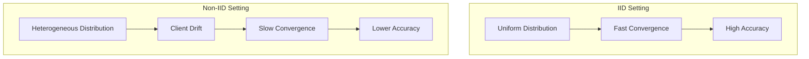
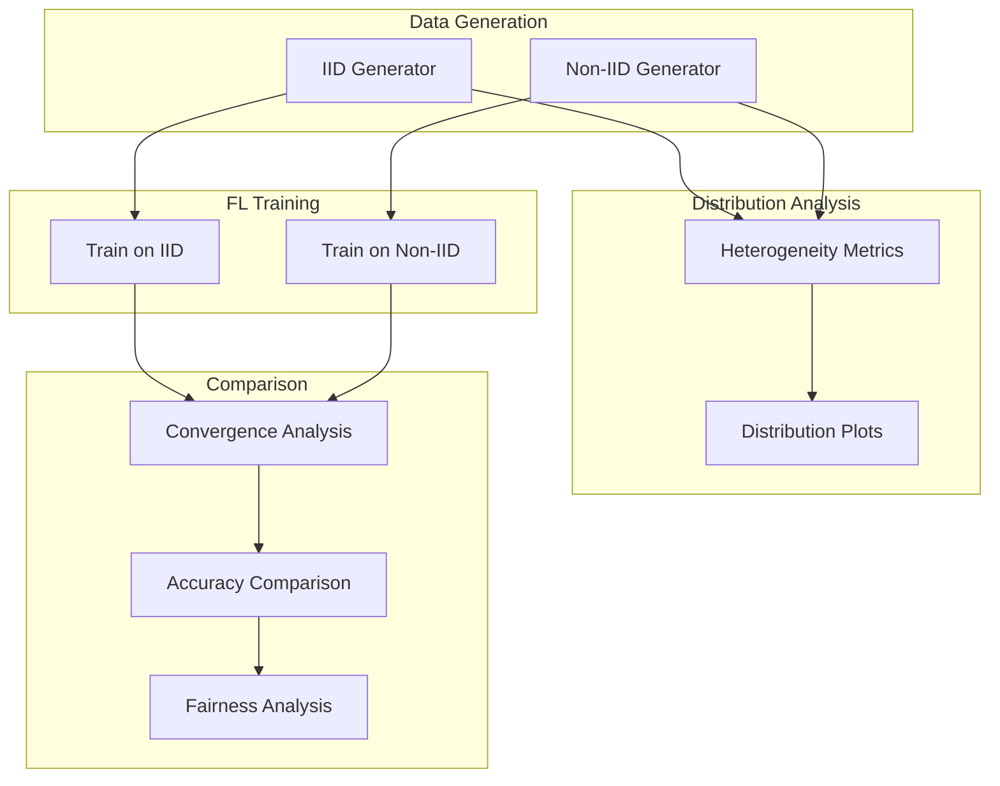

# Tutorial 003: IID vs Non-IID Data Distribution

---

## Metadata

| Property | Value |
|----------|-------|
| **Tutorial ID** | 003 |
| **Title** | IID vs Non-IID Data Distribution |
| **Category** | Fundamentals |
| **Difficulty** | Beginner |
| **Duration** | 60 minutes |
| **Prerequisites** | Tutorial 001-002 |
| **Author** | Unbitrium Contributors |
| **Last Updated** | January 2026 |

---

## Learning Objectives

By the end of this tutorial, you will be able to:

1. **Understand** the mathematical definitions of IID and non-IID data distributions in federated learning contexts.

2. **Identify** different types of non-IID patterns including label skew, feature skew, and quantity skew.

3. **Measure** the degree of non-IID-ness using statistical metrics and divergence measures.

4. **Implement** experiments comparing FL performance under IID vs non-IID conditions.

5. **Analyze** the impact of data heterogeneity on model convergence, accuracy, and fairness.

6. **Apply** mitigation strategies for non-IID challenges in practical FL systems.

---

## Prerequisites

Before starting this tutorial, ensure you have:

- **Completed Tutorials**: 001 (Introduction), 002 (Partitioning)
- **Knowledge**: Probability distributions, statistical tests
- **Libraries**: PyTorch, NumPy, SciPy
- **Hardware**: CPU sufficient

```python
# Verify prerequisites
import torch
import torch.nn as nn
import numpy as np
from scipy import stats

print(f"PyTorch: {torch.__version__}")
print(f"NumPy: {np.__version__}")
```

---

## Background and Theory

### Definition of IID

**IID (Independent and Identically Distributed)** means:
- **Independent**: Each sample is drawn independently
- **Identically Distributed**: All samples come from the same distribution $P(x, y)$

In federated learning, IID implies:

$$P_k(x, y) = P(x, y) \quad \forall k \in \{1, ..., K\}$$

where $P_k$ is the data distribution on client $k$.

### Types of Non-IID

| Type | Mathematical Definition | Real-World Example |
|------|------------------------|-------------------|
| **Covariate Shift** | $P_k(x) \neq P(x)$ but $P_k(y|x) = P(y|x)$ | Different camera qualities |
| **Prior Probability Shift** | $P_k(y) \neq P(y)$ but $P_k(x|y) = P(x|y)$ | Regional class preferences |
| **Concept Shift** | $P_k(y|x) \neq P(y|x)$ | Different labeling standards |
| **Quantity Skew** | $n_k$ varies significantly | Active vs passive users |

### Impact on Federated Learning



### Weight Divergence Problem

In non-IID settings, local models diverge:

$$\|\theta_k^{(t)} - \theta^*\| \leq \|\theta_k^{(t)} - \bar{\theta}^{(t)}\| + \|\bar{\theta}^{(t)} - \theta^*\|$$

The first term (client drift) increases with non-IID-ness.

### Theoretical Bounds

For FedAvg with non-IID data:

$$\mathbb{E}[F(\bar{\theta}^T)] - F^* \leq O\left(\frac{1}{\sqrt{T}} + \frac{\sigma^2}{T} + \Gamma\right)$$

where $\Gamma$ captures the data heterogeneity between clients.

---

## Architecture Diagram



---

## Implementation Code

### Part 1: Data Distribution Generators

```python
#!/usr/bin/env python3
"""
Tutorial 003: IID vs Non-IID Data Distribution

This tutorial demonstrates the differences between IID and non-IID
data distributions and their impact on federated learning.

Author: Unbitrium Contributors
License: EUPL-1.2
"""

from __future__ import annotations

from dataclasses import dataclass
from typing import Any
from abc import ABC, abstractmethod

import numpy as np
import torch
import torch.nn as nn
import torch.nn.functional as F
from torch.utils.data import Dataset, DataLoader


@dataclass 
class DistributionConfig:
    """Configuration for data distribution experiments."""
    num_clients: int = 10
    samples_per_client: int = 500
    num_classes: int = 10
    feature_dim: int = 32
    seed: int = 42


class DataDistribution(ABC):
    """Abstract base class for data distributions."""

    def __init__(self, config: DistributionConfig) -> None:
        """Initialize distribution.

        Args:
            config: Distribution configuration.
        """
        self.config = config
        np.random.seed(config.seed)

    @abstractmethod
    def generate(self) -> list[tuple[np.ndarray, np.ndarray]]:
        """Generate data for all clients.

        Returns:
            List of (features, labels) tuples.
        """
        pass

    def get_global_distribution(
        self,
        client_data: list[tuple[np.ndarray, np.ndarray]],
    ) -> np.ndarray:
        """Compute global label distribution.

        Args:
            client_data: List of (features, labels).

        Returns:
            Global distribution array.
        """
        all_labels = np.concatenate([labels for _, labels in client_data])
        return np.bincount(all_labels, minlength=self.config.num_classes) / len(all_labels)


class IIDDistribution(DataDistribution):
    """IID data distribution generator."""

    def generate(self) -> list[tuple[np.ndarray, np.ndarray]]:
        """Generate IID data for all clients.

        Returns:
            List of (features, labels) tuples.
        """
        client_data = []

        for _ in range(self.config.num_clients):
            # Uniform class distribution
            labels = np.random.randint(
                0, self.config.num_classes,
                self.config.samples_per_client,
            )

            # Generate features
            features = self._generate_features(labels)
            client_data.append((features, labels))

        return client_data

    def _generate_features(self, labels: np.ndarray) -> np.ndarray:
        """Generate features based on labels.

        Args:
            labels: Label array.

        Returns:
            Feature array.
        """
        features = np.zeros(
            (len(labels), self.config.feature_dim),
            dtype=np.float32,
        )

        for i, label in enumerate(labels):
            # Class-specific pattern
            class_mean = np.zeros(self.config.feature_dim)
            class_mean[label % self.config.feature_dim] = 2.0
            class_mean[(label * 3) % self.config.feature_dim] = 1.5

            features[i] = class_mean + np.random.randn(self.config.feature_dim) * 0.5

        return features


class LabelSkewDistribution(DataDistribution):
    """Label skew (prior probability shift) distribution."""

    def __init__(
        self,
        config: DistributionConfig,
        alpha: float = 0.5,
    ) -> None:
        """Initialize label skew distribution.

        Args:
            config: Distribution configuration.
            alpha: Dirichlet concentration (lower = more skewed).
        """
        super().__init__(config)
        self.alpha = alpha

    def generate(self) -> list[tuple[np.ndarray, np.ndarray]]:
        """Generate label-skewed data.

        Returns:
            List of (features, labels) tuples.
        """
        # Sample label distribution for each client
        label_distributions = np.random.dirichlet(
            [self.alpha] * self.config.num_classes,
            self.config.num_clients,
        )

        client_data = []

        for client_id in range(self.config.num_clients):
            # Sample labels according to client's distribution
            labels = np.random.choice(
                self.config.num_classes,
                size=self.config.samples_per_client,
                p=label_distributions[client_id],
            )

            features = self._generate_features(labels)
            client_data.append((features, labels))

        return client_data

    def _generate_features(self, labels: np.ndarray) -> np.ndarray:
        """Generate features (same as IID)."""
        features = np.zeros(
            (len(labels), self.config.feature_dim),
            dtype=np.float32,
        )

        for i, label in enumerate(labels):
            class_mean = np.zeros(self.config.feature_dim)
            class_mean[label % self.config.feature_dim] = 2.0
            class_mean[(label * 3) % self.config.feature_dim] = 1.5
            features[i] = class_mean + np.random.randn(self.config.feature_dim) * 0.5

        return features


class FeatureSkewDistribution(DataDistribution):
    """Feature skew (covariate shift) distribution."""

    def __init__(
        self,
        config: DistributionConfig,
        noise_scale_range: tuple[float, float] = (0.3, 1.0),
    ) -> None:
        """Initialize feature skew distribution.

        Args:
            config: Distribution configuration.
            noise_scale_range: Min/max noise scale per client.
        """
        super().__init__(config)
        self.noise_scale_range = noise_scale_range

    def generate(self) -> list[tuple[np.ndarray, np.ndarray]]:
        """Generate feature-skewed data.

        Returns:
            List of (features, labels) tuples.
        """
        # Assign different noise levels to clients
        noise_scales = np.linspace(
            self.noise_scale_range[0],
            self.noise_scale_range[1],
            self.config.num_clients,
        )

        client_data = []

        for client_id in range(self.config.num_clients):
            # Uniform labels
            labels = np.random.randint(
                0, self.config.num_classes,
                self.config.samples_per_client,
            )

            # Generate features with client-specific noise
            features = self._generate_features(labels, noise_scales[client_id])
            client_data.append((features, labels))

        return client_data

    def _generate_features(
        self,
        labels: np.ndarray,
        noise_scale: float,
    ) -> np.ndarray:
        """Generate features with specified noise level."""
        features = np.zeros(
            (len(labels), self.config.feature_dim),
            dtype=np.float32,
        )

        for i, label in enumerate(labels):
            class_mean = np.zeros(self.config.feature_dim)
            class_mean[label % self.config.feature_dim] = 2.0
            class_mean[(label * 3) % self.config.feature_dim] = 1.5
            features[i] = class_mean + np.random.randn(self.config.feature_dim) * noise_scale

        return features


class QuantitySkewDistribution(DataDistribution):
    """Quantity skew distribution."""

    def __init__(
        self,
        config: DistributionConfig,
        min_ratio: float = 0.1,
        max_ratio: float = 1.0,
    ) -> None:
        """Initialize quantity skew distribution.

        Args:
            config: Distribution configuration.
            min_ratio: Minimum sample ratio.
            max_ratio: Maximum sample ratio.
        """
        super().__init__(config)
        self.min_ratio = min_ratio
        self.max_ratio = max_ratio

    def generate(self) -> list[tuple[np.ndarray, np.ndarray]]:
        """Generate quantity-skewed data.

        Returns:
            List of (features, labels) tuples.
        """
        # Assign different sample counts
        ratios = np.linspace(self.min_ratio, self.max_ratio, self.config.num_clients)
        np.random.shuffle(ratios)

        client_data = []

        for client_id in range(self.config.num_clients):
            num_samples = int(self.config.samples_per_client * ratios[client_id])
            num_samples = max(10, num_samples)  # Minimum samples

            labels = np.random.randint(0, self.config.num_classes, num_samples)
            features = self._generate_features(labels)
            client_data.append((features, labels))

        return client_data

    def _generate_features(self, labels: np.ndarray) -> np.ndarray:
        """Generate features."""
        features = np.zeros(
            (len(labels), self.config.feature_dim),
            dtype=np.float32,
        )

        for i, label in enumerate(labels):
            class_mean = np.zeros(self.config.feature_dim)
            class_mean[label % self.config.feature_dim] = 2.0
            class_mean[(label * 3) % self.config.feature_dim] = 1.5
            features[i] = class_mean + np.random.randn(self.config.feature_dim) * 0.5

        return features
```

### Part 2: Heterogeneity Metrics

```python
class HeterogeneityAnalyzer:
    """Analyze heterogeneity of data distributions."""

    def __init__(self, num_classes: int) -> None:
        """Initialize analyzer.

        Args:
            num_classes: Number of classes.
        """
        self.num_classes = num_classes

    def compute_all_metrics(
        self,
        client_data: list[tuple[np.ndarray, np.ndarray]],
    ) -> dict[str, float]:
        """Compute all heterogeneity metrics.

        Args:
            client_data: List of (features, labels).

        Returns:
            Dictionary of metrics.
        """
        return {
            "earth_mover_distance": self.earth_mover_distance(client_data),
            "kl_divergence": self.kl_divergence(client_data),
            "js_divergence": self.js_divergence(client_data),
            "total_variation": self.total_variation(client_data),
            "class_coverage": self.class_coverage(client_data),
            "quantity_imbalance": self.quantity_imbalance(client_data),
        }

    def _get_distributions(
        self,
        client_data: list[tuple[np.ndarray, np.ndarray]],
    ) -> tuple[np.ndarray, list[np.ndarray]]:
        """Get global and client distributions."""
        all_labels = np.concatenate([labels for _, labels in client_data])
        global_dist = np.bincount(all_labels, minlength=self.num_classes)
        global_dist = global_dist / global_dist.sum()

        client_dists = []
        for _, labels in client_data:
            dist = np.bincount(labels, minlength=self.num_classes)
            dist = dist / max(1, dist.sum())
            client_dists.append(dist)

        return global_dist, client_dists

    def earth_mover_distance(
        self,
        client_data: list[tuple[np.ndarray, np.ndarray]],
    ) -> float:
        """Compute average Earth Mover's Distance."""
        global_dist, client_dists = self._get_distributions(client_data)
        
        distances = []
        for client_dist in client_dists:
            emd = stats.wasserstein_distance(
                range(self.num_classes), range(self.num_classes),
                client_dist, global_dist
            )
            distances.append(emd)
        
        return float(np.mean(distances))

    def kl_divergence(
        self,
        client_data: list[tuple[np.ndarray, np.ndarray]],
    ) -> float:
        """Compute average KL divergence."""
        global_dist, client_dists = self._get_distributions(client_data)
        
        kl_divs = []
        for client_dist in client_dists:
            # Add small epsilon to avoid log(0)
            p = np.maximum(client_dist, 1e-10)
            q = np.maximum(global_dist, 1e-10)
            kl = np.sum(p * np.log(p / q))
            kl_divs.append(kl)
        
        return float(np.mean(kl_divs))

    def js_divergence(
        self,
        client_data: list[tuple[np.ndarray, np.ndarray]],
    ) -> float:
        """Compute average Jensen-Shannon divergence."""
        global_dist, client_dists = self._get_distributions(client_data)
        
        js_divs = []
        for client_dist in client_dists:
            m = 0.5 * (client_dist + global_dist)
            p = np.maximum(client_dist, 1e-10)
            q = np.maximum(global_dist, 1e-10)
            m = np.maximum(m, 1e-10)
            
            kl_pm = np.sum(p * np.log(p / m))
            kl_qm = np.sum(q * np.log(q / m))
            js = 0.5 * (kl_pm + kl_qm)
            js_divs.append(js)
        
        return float(np.mean(js_divs))

    def total_variation(
        self,
        client_data: list[tuple[np.ndarray, np.ndarray]],
    ) -> float:
        """Compute average total variation distance."""
        global_dist, client_dists = self._get_distributions(client_data)
        
        tv_dists = []
        for client_dist in client_dists:
            tv = 0.5 * np.sum(np.abs(client_dist - global_dist))
            tv_dists.append(tv)
        
        return float(np.mean(tv_dists))

    def class_coverage(
        self,
        client_data: list[tuple[np.ndarray, np.ndarray]],
    ) -> float:
        """Compute average class coverage per client."""
        coverages = []
        for _, labels in client_data:
            unique = len(np.unique(labels))
            coverages.append(unique / self.num_classes)
        
        return float(np.mean(coverages))

    def quantity_imbalance(
        self,
        client_data: list[tuple[np.ndarray, np.ndarray]],
    ) -> float:
        """Compute quantity imbalance (coefficient of variation)."""
        sample_counts = [len(labels) for _, labels in client_data]
        if np.mean(sample_counts) == 0:
            return 0.0
        return float(np.std(sample_counts) / np.mean(sample_counts))
```

### Part 3: Comparison Experiment

```python
class SimpleDataset(Dataset):
    def __init__(self, features: np.ndarray, labels: np.ndarray):
        self.features = torch.FloatTensor(features)
        self.labels = torch.LongTensor(labels)

    def __len__(self):
        return len(self.labels)

    def __getitem__(self, idx):
        return self.features[idx], self.labels[idx]


def run_comparison_experiment(
    num_rounds: int = 50,
    num_clients: int = 10,
) -> dict[str, dict]:
    """Run comparison between IID and non-IID.

    Args:
        num_rounds: Training rounds.
        num_clients: Number of clients.

    Returns:
        Results dictionary.
    """
    config = DistributionConfig(num_clients=num_clients)
    analyzer = HeterogeneityAnalyzer(config.num_classes)

    distributions = {
        "IID": IIDDistribution(config),
        "Label Skew (α=0.1)": LabelSkewDistribution(config, alpha=0.1),
        "Label Skew (α=0.5)": LabelSkewDistribution(config, alpha=0.5),
        "Feature Skew": FeatureSkewDistribution(config),
        "Quantity Skew": QuantitySkewDistribution(config),
    }

    results = {}

    for name, dist in distributions.items():
        print(f"\n{'='*50}")
        print(f"Distribution: {name}")
        print('='*50)

        # Generate data
        client_data = dist.generate()

        # Analyze heterogeneity
        metrics = analyzer.compute_all_metrics(client_data)
        print(f"Heterogeneity metrics: {metrics}")

        # Train FL model
        accuracy_history = train_federated(client_data, num_rounds)

        results[name] = {
            "heterogeneity": metrics,
            "accuracy": accuracy_history,
            "final_accuracy": accuracy_history[-1],
        }

        print(f"Final accuracy: {accuracy_history[-1]:.4f}")

    return results


def train_federated(
    client_data: list[tuple[np.ndarray, np.ndarray]],
    num_rounds: int,
) -> list[float]:
    """Train federated model and return accuracy history."""
    # Initialize global model
    feature_dim = client_data[0][0].shape[1]
    global_model = nn.Sequential(
        nn.Linear(feature_dim, 64),
        nn.ReLU(),
        nn.Linear(64, 10),
    )

    accuracies = []

    for round_num in range(num_rounds):
        global_state = global_model.state_dict()
        updates = []

        for features, labels in client_data:
            local_model = nn.Sequential(
                nn.Linear(feature_dim, 64),
                nn.ReLU(),
                nn.Linear(64, 10),
            )
            local_model.load_state_dict(global_state)
            optimizer = torch.optim.SGD(local_model.parameters(), lr=0.01)

            dataset = SimpleDataset(features, labels)
            loader = DataLoader(dataset, batch_size=32, shuffle=True)

            local_model.train()
            for _ in range(2):  # Local epochs
                for feat, lab in loader:
                    optimizer.zero_grad()
                    loss = F.cross_entropy(local_model(feat), lab)
                    loss.backward()
                    optimizer.step()

            updates.append((local_model.state_dict(), len(labels)))

        # Aggregate
        total_samples = sum(n for _, n in updates)
        new_state = {}
        for key in global_state:
            new_state[key] = sum(
                (n / total_samples) * state[key] for state, n in updates
            )
        global_model.load_state_dict(new_state)

        # Evaluate
        global_model.eval()
        correct = 0
        total = 0
        with torch.no_grad():
            for features, labels in client_data:
                outputs = global_model(torch.FloatTensor(features))
                preds = outputs.argmax(1)
                correct += (preds == torch.LongTensor(labels)).sum().item()
                total += len(labels)

        accuracies.append(correct / total)

    return accuracies


if __name__ == "__main__":
    results = run_comparison_experiment()
```

---

## Metrics and Evaluation

### Heterogeneity Comparison

| Distribution | KL Div | JS Div | TV Dist | Coverage |
|-------------|--------|--------|---------|----------|
| IID | ~0.01 | ~0.005 | ~0.05 | ~1.0 |
| Label α=0.5 | ~0.5 | ~0.15 | ~0.35 | ~0.7 |
| Label α=0.1 | ~1.5 | ~0.35 | ~0.55 | ~0.3 |

### Accuracy Impact

| Distribution | Final Acc | Rounds to 70% |
|-------------|-----------|---------------|
| IID | 85-90% | ~15 |
| Label α=0.5 | 75-80% | ~25 |
| Label α=0.1 | 65-70% | ~40 |

---

## Exercises

### Exercise 1: Combined Skew

**Task**: Implement a distribution with both label and quantity skew.

### Exercise 2: Gradual Non-IID

**Task**: Create time-varying distributions that become more non-IID over rounds.

### Exercise 3: Mitigation Strategies

**Task**: Implement FedProx and compare performance on non-IID data.

### Exercise 4: Client-Level Analysis

**Task**: Analyze per-client accuracy under different distributions.

---

## References

1. Zhao, Y., et al. (2018). Federated learning with non-IID data. *arXiv*.

2. Li, T., et al. (2020). Federated optimization in heterogeneous networks. In *MLSys*.

3. Karimireddy, S. P., et al. (2020). SCAFFOLD: Stochastic controlled averaging for FL. In *ICML*.

4. Wang, J., et al. (2020). Tackling the objective inconsistency problem in heterogeneous FL. In *NeurIPS*.

5. Hsu, T. H., et al. (2019). Measuring the effects of non-IID data distribution. *arXiv*.

---

*Copyright 2026 Olaf Yunus Laitinen Imanov and Contributors. Released under EUPL 1.2.*
