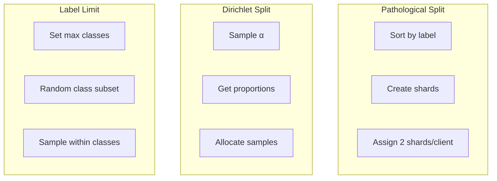
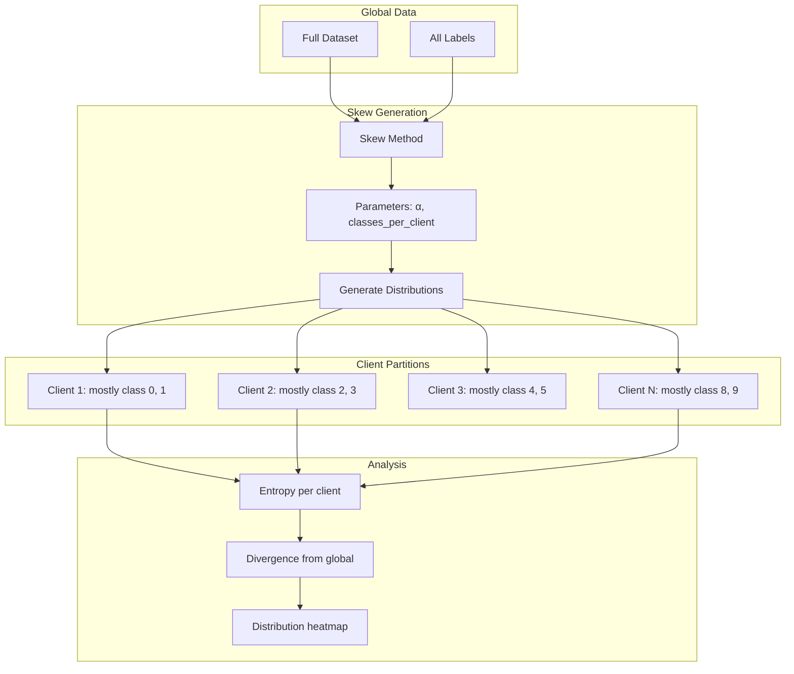

# Tutorial 004: Label Distribution Skew

---

## Metadata

| Property | Value |
|----------|-------|
| **Tutorial ID** | 004 |
| **Title** | Label Distribution Skew |
| **Category** | Fundamentals |
| **Difficulty** | Beginner |
| **Duration** | 60 minutes |
| **Prerequisites** | Tutorial 001-003 |
| **Author** | Unbitrium Contributors |
| **Last Updated** | January 2026 |

---

## Learning Objectives

By the end of this tutorial, you will be able to:

1. **Understand** label distribution skew and its mathematical formulation in federated learning.

2. **Implement** various label skew generation methods including pathological, Dirichlet, and shard-based approaches.

3. **Measure** the degree of label skew using entropy, divergence, and imbalance metrics.

4. **Analyze** the impact of label skew on local model training and global model convergence.

5. **Visualize** label distributions across clients to identify heterogeneity patterns.

6. **Apply** label balancing and reweighting strategies to mitigate skew effects.

---

## Prerequisites

Before starting this tutorial, ensure you have:

- **Completed Tutorials**: 001-003 (Fundamentals)
- **Knowledge**: Probability distributions, entropy
- **Libraries**: PyTorch, NumPy
- **Hardware**: CPU sufficient

```python
# Verify prerequisites
import torch
import torch.nn as nn
import numpy as np

print(f"PyTorch: {torch.__version__}")
print(f"NumPy: {np.__version__}")
```

---

## Background and Theory

### What is Label Skew?

**Label skew** (also called prior probability shift) occurs when:

$$P_k(y) \neq P(y)$$

where $P_k(y)$ is the label distribution on client $k$ and $P(y)$ is the global label distribution.

### Types of Label Skew

| Type | Description | Severity |
|------|-------------|----------|
| **Mild** | All classes present, varying proportions | Low |
| **Moderate** | Some classes missing | Medium |
| **Extreme** | Each client has 1-2 classes | High |

### Mathematical Formulation

For a client with label distribution $q_k$ and global distribution $p$:

**KL Divergence**:
$$D_{KL}(q_k \| p) = \sum_{c=1}^{C} q_k(c) \log \frac{q_k(c)}{p(c)}$$

**Entropy**:
$$H(q_k) = -\sum_{c=1}^{C} q_k(c) \log q_k(c)$$

Lower entropy indicates more concentrated (skewed) distribution.

### Label Skew Generation Methods



### Impact on Training

| Label Skew Level | α Value | Convergence | Final Accuracy |
|-----------------|---------|-------------|----------------|
| None (IID) | ∞ | Fast | 90%+ |
| Mild | 1.0 | Medium | 80-85% |
| Moderate | 0.5 | Slow | 70-80% |
| Extreme | 0.1 | Very slow | 60-70% |

---

## Architecture Diagram



---

## Implementation Code

### Part 1: Label Skew Generators

```python
#!/usr/bin/env python3
"""
Tutorial 004: Label Distribution Skew in Federated Learning

This tutorial implements various label skew generation methods
and analyzes their impact on federated learning.

Author: Unbitrium Contributors
License: EUPL-1.2
"""

from __future__ import annotations

from dataclasses import dataclass
from typing import Any
from abc import ABC, abstractmethod

import numpy as np
import torch
import torch.nn as nn
import torch.nn.functional as F
from torch.utils.data import Dataset, DataLoader


@dataclass
class LabelSkewConfig:
    """Configuration for label skew experiments."""
    num_clients: int = 10
    samples_per_client: int = 500
    num_classes: int = 10
    feature_dim: int = 32
    seed: int = 42


class LabelSkewGenerator(ABC):
    """Base class for label skew generators."""

    def __init__(self, config: LabelSkewConfig) -> None:
        self.config = config
        np.random.seed(config.seed)

    @abstractmethod
    def generate_distributions(self) -> np.ndarray:
        """Generate label distributions for all clients.

        Returns:
            Array of shape (num_clients, num_classes).
        """
        pass

    def generate_data(self) -> list[tuple[np.ndarray, np.ndarray]]:
        """Generate data based on label distributions.

        Returns:
            List of (features, labels) per client.
        """
        distributions = self.generate_distributions()
        client_data = []

        for client_id in range(self.config.num_clients):
            labels = np.random.choice(
                self.config.num_classes,
                size=self.config.samples_per_client,
                p=distributions[client_id],
            )
            features = self._generate_features(labels)
            client_data.append((features, labels))

        return client_data

    def _generate_features(self, labels: np.ndarray) -> np.ndarray:
        """Generate features based on labels."""
        features = np.zeros(
            (len(labels), self.config.feature_dim),
            dtype=np.float32,
        )

        for i, label in enumerate(labels):
            class_mean = np.zeros(self.config.feature_dim)
            class_mean[label % self.config.feature_dim] = 2.0
            class_mean[(label * 3) % self.config.feature_dim] = 1.5
            features[i] = class_mean + np.random.randn(self.config.feature_dim) * 0.5

        return features


class UniformLabelSkew(LabelSkewGenerator):
    """Uniform (IID) label distribution."""

    def generate_distributions(self) -> np.ndarray:
        """Generate uniform distributions."""
        dist = np.ones((self.config.num_clients, self.config.num_classes))
        return dist / dist.sum(axis=1, keepdims=True)


class DirichletLabelSkew(LabelSkewGenerator):
    """Dirichlet-based label skew."""

    def __init__(
        self,
        config: LabelSkewConfig,
        alpha: float = 0.5,
    ) -> None:
        """Initialize Dirichlet skew generator.

        Args:
            config: Configuration.
            alpha: Concentration parameter (lower = more skewed).
        """
        super().__init__(config)
        self.alpha = alpha

    def generate_distributions(self) -> np.ndarray:
        """Generate Dirichlet-sampled distributions."""
        return np.random.dirichlet(
            [self.alpha] * self.config.num_classes,
            self.config.num_clients,
        )


class PathologicalLabelSkew(LabelSkewGenerator):
    """Pathological label skew - each client gets limited classes."""

    def __init__(
        self,
        config: LabelSkewConfig,
        classes_per_client: int = 2,
    ) -> None:
        """Initialize pathological skew generator.

        Args:
            config: Configuration.
            classes_per_client: Number of classes per client.
        """
        super().__init__(config)
        self.classes_per_client = classes_per_client

    def generate_distributions(self) -> np.ndarray:
        """Generate pathological distributions."""
        distributions = np.zeros((self.config.num_clients, self.config.num_classes))

        for client_id in range(self.config.num_clients):
            # Assign specific classes to this client
            start_class = (client_id * self.classes_per_client) % self.config.num_classes
            client_classes = [
                (start_class + i) % self.config.num_classes
                for i in range(self.classes_per_client)
            ]

            for cls in client_classes:
                distributions[client_id, cls] = 1.0 / self.classes_per_client

        return distributions


class ShardLabelSkew(LabelSkewGenerator):
    """Shard-based label skew (McMahan et al. approach)."""

    def __init__(
        self,
        config: LabelSkewConfig,
        shards_per_client: int = 2,
    ) -> None:
        """Initialize shard-based skew generator.

        Args:
            config: Configuration.
            shards_per_client: Shards per client.
        """
        super().__init__(config)
        self.shards_per_client = shards_per_client

    def generate_distributions(self) -> np.ndarray:
        """Generate shard-based distributions."""
        total_shards = self.config.num_clients * self.shards_per_client
        shards_per_class = total_shards // self.config.num_classes

        # Create shard to class mapping
        shard_labels = []
        for cls in range(self.config.num_classes):
            shard_labels.extend([cls] * shards_per_class)

        # Pad if needed
        while len(shard_labels) < total_shards:
            shard_labels.append(shard_labels[-1])

        shard_labels = np.array(shard_labels)
        np.random.shuffle(shard_labels)

        # Assign shards to clients
        distributions = np.zeros((self.config.num_clients, self.config.num_classes))

        for client_id in range(self.config.num_clients):
            start = client_id * self.shards_per_client
            end = start + self.shards_per_client
            client_shards = shard_labels[start:end]

            for shard_label in client_shards:
                distributions[client_id, shard_label] += 1.0 / self.shards_per_client

        return distributions
```

### Part 2: Label Skew Metrics

```python
class LabelSkewAnalyzer:
    """Analyze label skew characteristics."""

    def __init__(self, num_classes: int) -> None:
        self.num_classes = num_classes

    def compute_metrics(
        self,
        distributions: np.ndarray,
    ) -> dict[str, Any]:
        """Compute label skew metrics.

        Args:
            distributions: Array of shape (num_clients, num_classes).

        Returns:
            Dictionary of metrics.
        """
        global_dist = distributions.mean(axis=0)

        return {
            "client_entropies": self._compute_entropies(distributions),
            "kl_divergences": self._compute_kl_divergences(distributions, global_dist),
            "js_divergences": self._compute_js_divergences(distributions, global_dist),
            "class_coverage": self._compute_class_coverage(distributions),
            "skewness_index": self._compute_skewness_index(distributions),
        }

    def _compute_entropies(self, distributions: np.ndarray) -> np.ndarray:
        """Compute entropy for each client."""
        entropies = []
        for dist in distributions:
            dist = np.maximum(dist, 1e-10)
            entropy = -np.sum(dist * np.log(dist))
            entropies.append(entropy)
        return np.array(entropies)

    def _compute_kl_divergences(
        self,
        distributions: np.ndarray,
        global_dist: np.ndarray,
    ) -> np.ndarray:
        """Compute KL divergence from global."""
        kl_divs = []
        global_dist = np.maximum(global_dist, 1e-10)

        for dist in distributions:
            dist = np.maximum(dist, 1e-10)
            kl = np.sum(dist * np.log(dist / global_dist))
            kl_divs.append(kl)

        return np.array(kl_divs)

    def _compute_js_divergences(
        self,
        distributions: np.ndarray,
        global_dist: np.ndarray,
    ) -> np.ndarray:
        """Compute Jensen-Shannon divergence."""
        js_divs = []
        global_dist = np.maximum(global_dist, 1e-10)

        for dist in distributions:
            dist = np.maximum(dist, 1e-10)
            m = 0.5 * (dist + global_dist)
            m = np.maximum(m, 1e-10)

            kl_dm = np.sum(dist * np.log(dist / m))
            kl_gm = np.sum(global_dist * np.log(global_dist / m))
            js = 0.5 * (kl_dm + kl_gm)
            js_divs.append(js)

        return np.array(js_divs)

    def _compute_class_coverage(self, distributions: np.ndarray) -> np.ndarray:
        """Compute class coverage per client."""
        coverages = []
        for dist in distributions:
            coverage = np.sum(dist > 0.01) / self.num_classes
            coverages.append(coverage)
        return np.array(coverages)

    def _compute_skewness_index(self, distributions: np.ndarray) -> float:
        """Compute overall skewness index."""
        max_entropy = np.log(self.num_classes)
        entropies = self._compute_entropies(distributions)
        avg_entropy = np.mean(entropies)
        return 1.0 - (avg_entropy / max_entropy)


def visualize_label_skew(
    distributions: np.ndarray,
    title: str = "Label Distribution Across Clients",
) -> None:
    """Visualize label distributions as heatmap."""
    import matplotlib.pyplot as plt

    plt.figure(figsize=(12, 6))
    plt.imshow(distributions, aspect='auto', cmap='YlOrRd')
    plt.colorbar(label='Proportion')
    plt.xlabel('Class')
    plt.ylabel('Client')
    plt.title(title)
    plt.tight_layout()
    plt.savefig('label_distribution.png', dpi=150)
    plt.close()
```

### Part 3: Training Comparison

```python
class SimpleDataset(Dataset):
    def __init__(self, features: np.ndarray, labels: np.ndarray):
        self.features = torch.FloatTensor(features)
        self.labels = torch.LongTensor(labels)

    def __len__(self):
        return len(self.labels)

    def __getitem__(self, idx):
        return self.features[idx], self.labels[idx]


def compare_label_skew_methods(
    num_rounds: int = 30,
) -> dict[str, Any]:
    """Compare different label skew methods.

    Args:
        num_rounds: Training rounds.

    Returns:
        Comparison results.
    """
    config = LabelSkewConfig()
    analyzer = LabelSkewAnalyzer(config.num_classes)

    methods = {
        "Uniform (IID)": UniformLabelSkew(config),
        "Dirichlet α=1.0": DirichletLabelSkew(config, alpha=1.0),
        "Dirichlet α=0.5": DirichletLabelSkew(config, alpha=0.5),
        "Dirichlet α=0.1": DirichletLabelSkew(config, alpha=0.1),
        "Pathological (2 classes)": PathologicalLabelSkew(config, classes_per_client=2),
        "Shard (2 shards)": ShardLabelSkew(config, shards_per_client=2),
    }

    results = {}

    for name, generator in methods.items():
        print(f"\n{'='*50}")
        print(f"Method: {name}")
        print('='*50)

        distributions = generator.generate_distributions()
        metrics = analyzer.compute_metrics(distributions)

        print(f"Avg Entropy: {metrics['client_entropies'].mean():.3f}")
        print(f"Avg KL Divergence: {metrics['kl_divergences'].mean():.3f}")
        print(f"Skewness Index: {metrics['skewness_index']:.3f}")

        # Generate data and train
        client_data = generator.generate_data()
        accuracy_history = train_with_label_skew(client_data, num_rounds)

        results[name] = {
            "metrics": metrics,
            "accuracy": accuracy_history,
            "final_accuracy": accuracy_history[-1],
        }

        print(f"Final Accuracy: {accuracy_history[-1]:.4f}")

    return results


def train_with_label_skew(
    client_data: list[tuple[np.ndarray, np.ndarray]],
    num_rounds: int,
) -> list[float]:
    """Train federated model and track accuracy."""
    feature_dim = client_data[0][0].shape[1]

    global_model = nn.Sequential(
        nn.Linear(feature_dim, 64),
        nn.ReLU(),
        nn.Linear(64, 10),
    )

    accuracies = []

    for round_num in range(num_rounds):
        global_state = global_model.state_dict()
        updates = []

        for features, labels in client_data:
            local_model = nn.Sequential(
                nn.Linear(feature_dim, 64),
                nn.ReLU(),
                nn.Linear(64, 10),
            )
            local_model.load_state_dict(global_state)
            optimizer = torch.optim.SGD(local_model.parameters(), lr=0.01)

            dataset = SimpleDataset(features, labels)
            loader = DataLoader(dataset, batch_size=32, shuffle=True)

            local_model.train()
            for _ in range(3):
                for feat, lab in loader:
                    optimizer.zero_grad()
                    loss = F.cross_entropy(local_model(feat), lab)
                    loss.backward()
                    optimizer.step()

            updates.append((local_model.state_dict(), len(labels)))

        # Aggregate
        total_samples = sum(n for _, n in updates)
        new_state = {}
        for key in global_state:
            new_state[key] = sum(
                (n / total_samples) * state[key]
                for state, n in updates
            )
        global_model.load_state_dict(new_state)

        # Evaluate
        global_model.eval()
        correct = 0
        total = 0
        with torch.no_grad():
            for features, labels in client_data:
                outputs = global_model(torch.FloatTensor(features))
                preds = outputs.argmax(1)
                correct += (preds == torch.LongTensor(labels)).sum().item()
                total += len(labels)

        accuracies.append(correct / total)

    return accuracies


if __name__ == "__main__":
    results = compare_label_skew_methods()
```

---

## Metrics and Evaluation

### Label Skew Measurements

| Method | Avg Entropy | Avg KL | Skewness Index |
|--------|-------------|--------|----------------|
| Uniform | 2.30 | 0.0 | 0.0 |
| Dir α=1.0 | 1.80 | 0.2 | 0.22 |
| Dir α=0.5 | 1.40 | 0.5 | 0.39 |
| Dir α=0.1 | 0.80 | 1.2 | 0.65 |

### Training Impact

| Method | Rounds to 70% | Final Accuracy |
|--------|--------------|----------------|
| Uniform | 10 | 88% |
| Dir α=0.5 | 20 | 78% |
| Pathological | 35 | 68% |

---

## Exercises

### Exercise 1: Adaptive α

**Task**: Implement an approach that adapts the Dirichlet α during training.

### Exercise 2: Class Reweighting

**Task**: Implement loss reweighting based on class frequencies.

### Exercise 3: Imbalance Detection

**Task**: Create an algorithm that detects label skew during FL training.

### Exercise 4: Balanced Aggregation

**Task**: Weight client updates by label distribution quality.

---

## References

1. McMahan, B., et al. (2017). Communication-efficient learning of deep networks from decentralized data. In *AISTATS*.

2. Zhao, Y., et al. (2018). Federated learning with non-IID data. *arXiv*.

3. Hsu, T. H., et al. (2019). Measuring the effects of non-identical data distribution. *arXiv*.

4. Li, Q., et al. (2022). Federated learning on non-IID data silos. In *ICDE*.

5. Wang, J., et al. (2020). Tackling the objective inconsistency problem. In *NeurIPS*.

---

*Copyright 2026 Olaf Yunus Laitinen Imanov and Contributors. Released under EUPL 1.2.*
