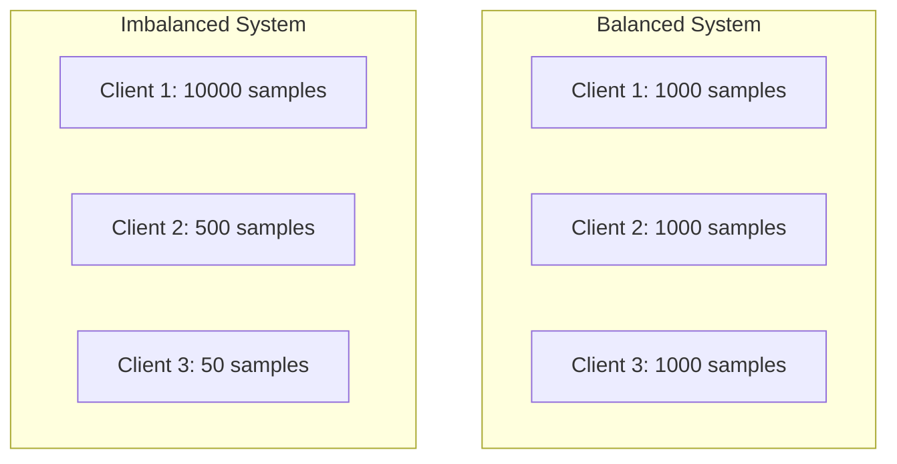
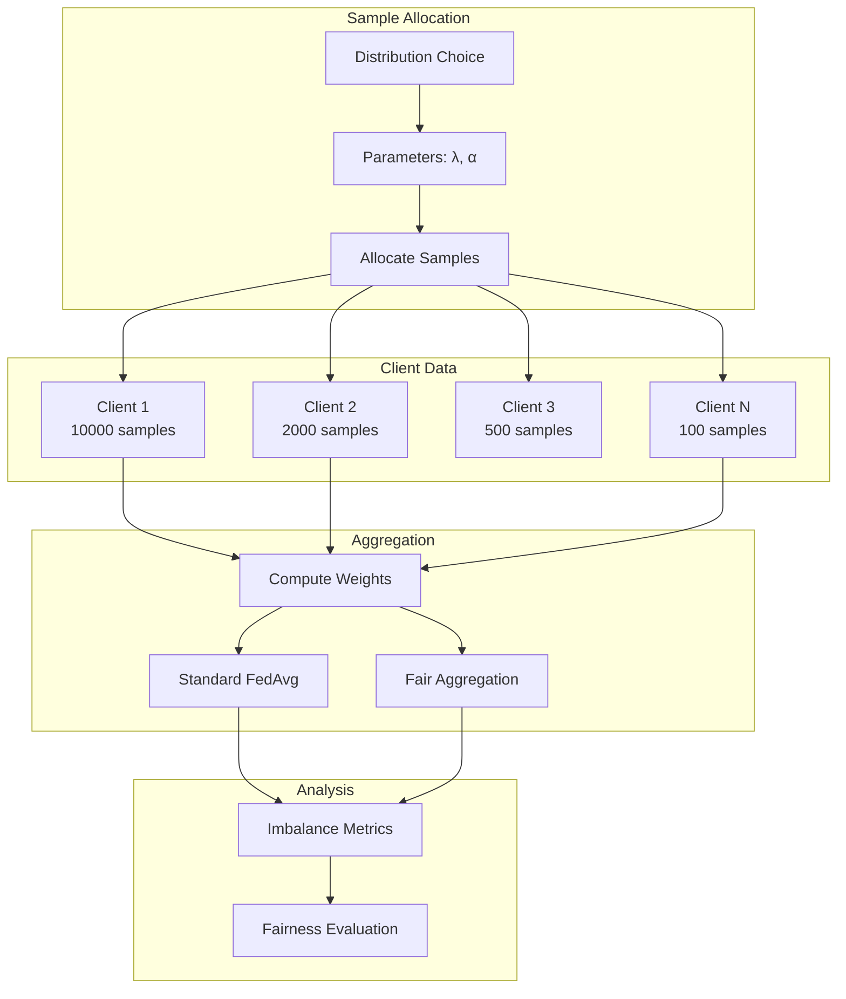

# Tutorial 005: Quantity Imbalance in Federated Learning

---

## Metadata

| Property | Value |
|----------|-------|
| **Tutorial ID** | 005 |
| **Title** | Quantity Imbalance in Federated Learning |
| **Category** | Fundamentals |
| **Difficulty** | Beginner |
| **Duration** | 60 minutes |
| **Prerequisites** | Tutorial 001-004 |
| **Author** | Unbitrium Contributors |
| **Last Updated** | January 2026 |

---

## Learning Objectives

By the end of this tutorial, you will be able to:

1. **Understand** quantity imbalance (sample size heterogeneity) in federated learning and its impact on training dynamics.

2. **Implement** data allocations with varying sample counts using exponential, power-law, and Zipf distributions.

3. **Measure** imbalance using statistical metrics like Gini coefficient, coefficient of variation, and imbalance ratio.

4. **Analyze** the effect of quantity imbalance on client gradient contributions and aggregation weights.

5. **Design** rebalancing strategies including sample reweighting and adaptive aggregation.

6. **Apply** fairness-aware aggregation methods to handle quantity imbalance in practice.

---

## Prerequisites

Before starting this tutorial, ensure you have:

- **Completed Tutorials**: 001-004 (Fundamentals)
- **Knowledge**: Statistical distributions, weighted averaging
- **Libraries**: PyTorch, NumPy, SciPy
- **Hardware**: CPU sufficient

```python
# Verify prerequisites
import torch
import torch.nn as nn
import numpy as np
from scipy import stats

print(f"PyTorch: {torch.__version__}")
print(f"NumPy: {np.__version__}")
```

---

## Background and Theory

### What is Quantity Imbalance?

**Quantity imbalance** occurs when clients have significantly different numbers of samples:

$$n_k \neq n_j \quad \text{for } k \neq j$$

In real federated systems, sample counts often follow heavy-tailed distributions where a few clients have most data.

### Impact on FedAvg

In standard FedAvg, client weights are:

$$w_k = \frac{n_k}{\sum_{j=1}^{K} n_j}$$

With high imbalance, large clients dominate:
- **Bias**: Model fits large clients better
- **Fairness**: Small clients underrepresented
- **Convergence**: Skewed gradient estimates

### Common Distribution Patterns

| Distribution | Formula | Real-World Example |
|-------------|---------|-------------------|
| **Uniform** | $n_k = n$ | Controlled experiments |
| **Exponential** | $n_k \sim \text{Exp}(\lambda)$ | User activity |
| **Power-law** | $n_k \propto k^{-\alpha}$ | Social platforms |
| **Zipf** | $n_k \propto \frac{1}{k}$ | Web traffic |

### Quantity Imbalance Visualization



### Mathematical Metrics

**Gini Coefficient**:
$$G = \frac{\sum_{i=1}^{K} \sum_{j=1}^{K} |n_i - n_j|}{2K \sum_{k=1}^{K} n_k}$$

**Coefficient of Variation**:
$$CV = \frac{\sigma_n}{\mu_n}$$

**Imbalance Ratio**:
$$IR = \frac{\max_k n_k}{\min_k n_k}$$

---

## Architecture Diagram



---

## Implementation Code

### Part 1: Quantity Imbalance Generators

```python
#!/usr/bin/env python3
"""
Tutorial 005: Quantity Imbalance in Federated Learning

This tutorial implements quantity imbalance generation and
analyzes its impact on federated learning.

Author: Unbitrium Contributors
License: EUPL-1.2
"""

from __future__ import annotations

from dataclasses import dataclass
from typing import Any
from abc import ABC, abstractmethod

import numpy as np
import torch
import torch.nn as nn
import torch.nn.functional as F
from torch.utils.data import Dataset, DataLoader


@dataclass
class QuantityConfig:
    """Configuration for quantity imbalance experiments."""
    num_clients: int = 10
    total_samples: int = 10000
    num_classes: int = 10
    feature_dim: int = 32
    min_samples: int = 50
    seed: int = 42


class QuantityDistribution(ABC):
    """Base class for sample quantity distributions."""

    def __init__(self, config: QuantityConfig) -> None:
        self.config = config
        np.random.seed(config.seed)

    @abstractmethod
    def generate_sample_counts(self) -> np.ndarray:
        """Generate sample counts for each client.

        Returns:
            Array of sample counts per client.
        """
        pass

    def generate_data(self) -> list[tuple[np.ndarray, np.ndarray]]:
        """Generate data with varying sample counts.

        Returns:
            List of (features, labels) per client.
        """
        sample_counts = self.generate_sample_counts()
        client_data = []

        for num_samples in sample_counts:
            labels = np.random.randint(0, self.config.num_classes, int(num_samples))
            features = self._generate_features(labels)
            client_data.append((features, labels))

        return client_data

    def _generate_features(self, labels: np.ndarray) -> np.ndarray:
        """Generate features based on labels."""
        features = np.zeros(
            (len(labels), self.config.feature_dim),
            dtype=np.float32,
        )

        for i, label in enumerate(labels):
            class_mean = np.zeros(self.config.feature_dim)
            class_mean[label % self.config.feature_dim] = 2.0
            class_mean[(label * 3) % self.config.feature_dim] = 1.5
            features[i] = class_mean + np.random.randn(self.config.feature_dim) * 0.5

        return features


class UniformQuantity(QuantityDistribution):
    """Uniform sample distribution (balanced)."""

    def generate_sample_counts(self) -> np.ndarray:
        """Generate equal sample counts."""
        per_client = self.config.total_samples // self.config.num_clients
        counts = np.ones(self.config.num_clients) * per_client
        return counts


class ExponentialQuantity(QuantityDistribution):
    """Exponential sample distribution."""

    def __init__(self, config: QuantityConfig, scale: float = 1.0) -> None:
        super().__init__(config)
        self.scale = scale

    def generate_sample_counts(self) -> np.ndarray:
        """Generate exponentially distributed counts."""
        raw = np.random.exponential(self.scale, self.config.num_clients)
        raw = np.maximum(raw, 0.1)
        
        # Normalize to total samples
        normalized = raw / raw.sum() * self.config.total_samples
        
        # Enforce minimum
        counts = np.maximum(normalized, self.config.min_samples)
        
        # Adjust to match total
        counts = counts / counts.sum() * self.config.total_samples
        
        return np.round(counts).astype(int)


class PowerLawQuantity(QuantityDistribution):
    """Power-law sample distribution."""

    def __init__(self, config: QuantityConfig, alpha: float = 1.5) -> None:
        super().__init__(config)
        self.alpha = alpha

    def generate_sample_counts(self) -> np.ndarray:
        """Generate power-law distributed counts."""
        ranks = np.arange(1, self.config.num_clients + 1)
        raw = 1.0 / (ranks ** self.alpha)
        
        # Normalize
        normalized = raw / raw.sum() * self.config.total_samples
        counts = np.maximum(normalized, self.config.min_samples)
        counts = counts / counts.sum() * self.config.total_samples
        
        return np.round(counts).astype(int)


class ZipfQuantity(QuantityDistribution):
    """Zipf distribution for sample counts."""

    def __init__(self, config: QuantityConfig, s: float = 1.0) -> None:
        super().__init__(config)
        self.s = s

    def generate_sample_counts(self) -> np.ndarray:
        """Generate Zipf distributed counts."""
        ranks = np.arange(1, self.config.num_clients + 1)
        raw = 1.0 / ranks ** self.s
        
        # Normalize
        normalized = raw / raw.sum() * self.config.total_samples
        counts = np.maximum(normalized, self.config.min_samples)
        counts = counts / counts.sum() * self.config.total_samples
        
        return np.round(counts).astype(int)


class LogNormalQuantity(QuantityDistribution):
    """Log-normal sample distribution."""

    def __init__(self, config: QuantityConfig, sigma: float = 1.0) -> None:
        super().__init__(config)
        self.sigma = sigma

    def generate_sample_counts(self) -> np.ndarray:
        """Generate log-normally distributed counts."""
        raw = np.random.lognormal(0, self.sigma, self.config.num_clients)
        
        # Normalize
        normalized = raw / raw.sum() * self.config.total_samples
        counts = np.maximum(normalized, self.config.min_samples)
        counts = counts / counts.sum() * self.config.total_samples
        
        return np.round(counts).astype(int)
```

### Part 2: Imbalance Metrics

```python
class ImbalanceAnalyzer:
    """Analyze quantity imbalance metrics."""

    def compute_metrics(self, sample_counts: np.ndarray) -> dict[str, float]:
        """Compute all imbalance metrics.

        Args:
            sample_counts: Array of sample counts per client.

        Returns:
            Dictionary of metrics.
        """
        return {
            "gini_coefficient": self._gini_coefficient(sample_counts),
            "coefficient_of_variation": self._coefficient_of_variation(sample_counts),
            "imbalance_ratio": self._imbalance_ratio(sample_counts),
            "entropy": self._entropy(sample_counts),
            "max_share": self._max_share(sample_counts),
            "herfindahl_index": self._herfindahl_index(sample_counts),
        }

    def _gini_coefficient(self, counts: np.ndarray) -> float:
        """Compute Gini coefficient (0 = equal, 1 = max inequality)."""
        sorted_counts = np.sort(counts)
        n = len(counts)
        index = np.arange(1, n + 1)
        return (2 * np.sum(index * sorted_counts) / (n * np.sum(sorted_counts))) - (n + 1) / n

    def _coefficient_of_variation(self, counts: np.ndarray) -> float:
        """Compute coefficient of variation."""
        return float(np.std(counts) / np.mean(counts))

    def _imbalance_ratio(self, counts: np.ndarray) -> float:
        """Compute max/min ratio."""
        return float(np.max(counts) / max(1, np.min(counts)))

    def _entropy(self, counts: np.ndarray) -> float:
        """Compute entropy of sample distribution."""
        proportions = counts / counts.sum()
        proportions = proportions[proportions > 0]
        return float(-np.sum(proportions * np.log(proportions)))

    def _max_share(self, counts: np.ndarray) -> float:
        """Compute maximum share (proportion held by largest client)."""
        return float(np.max(counts) / counts.sum())

    def _herfindahl_index(self, counts: np.ndarray) -> float:
        """Compute Herfindahl-Hirschman Index."""
        proportions = counts / counts.sum()
        return float(np.sum(proportions ** 2))


def visualize_imbalance(sample_counts: np.ndarray, title: str = "Sample Distribution") -> None:
    """Visualize sample quantity distribution."""
    import matplotlib.pyplot as plt
    
    sorted_counts = np.sort(sample_counts)[::-1]
    
    fig, axes = plt.subplots(1, 2, figsize=(12, 4))
    
    # Bar chart
    axes[0].bar(range(len(sorted_counts)), sorted_counts)
    axes[0].set_xlabel('Client (sorted)')
    axes[0].set_ylabel('Sample Count')
    axes[0].set_title('Sample Counts per Client')
    
    # Lorenz curve
    cumulative = np.cumsum(sorted_counts[::-1]) / np.sum(sorted_counts)
    axes[1].plot(np.linspace(0, 1, len(cumulative)), cumulative)
    axes[1].plot([0, 1], [0, 1], 'k--', label='Perfect equality')
    axes[1].set_xlabel('Proportion of Clients')
    axes[1].set_ylabel('Proportion of Samples')
    axes[1].set_title('Lorenz Curve')
    axes[1].legend()
    
    plt.suptitle(title)
    plt.tight_layout()
    plt.savefig('quantity_imbalance.png', dpi=150)
    plt.close()
```

### Part 3: Aggregation Strategies

```python
class SimpleDataset(Dataset):
    def __init__(self, features: np.ndarray, labels: np.ndarray):
        self.features = torch.FloatTensor(features)
        self.labels = torch.LongTensor(labels)

    def __len__(self):
        return len(self.labels)

    def __getitem__(self, idx):
        return self.features[idx], self.labels[idx]


class AggregationStrategy(ABC):
    """Base class for aggregation strategies."""

    @abstractmethod
    def compute_weights(
        self,
        sample_counts: list[int],
    ) -> np.ndarray:
        """Compute aggregation weights.

        Args:
            sample_counts: Sample count per client.

        Returns:
            Weight array.
        """
        pass


class StandardAggregation(AggregationStrategy):
    """Standard FedAvg proportional weighting."""

    def compute_weights(self, sample_counts: list[int]) -> np.ndarray:
        total = sum(sample_counts)
        return np.array([n / total for n in sample_counts])


class EqualAggregation(AggregationStrategy):
    """Equal weighting regardless of sample count."""

    def compute_weights(self, sample_counts: list[int]) -> np.ndarray:
        return np.ones(len(sample_counts)) / len(sample_counts)


class SqrtAggregation(AggregationStrategy):
    """Square root weighted aggregation (compromise)."""

    def compute_weights(self, sample_counts: list[int]) -> np.ndarray:
        sqrt_counts = np.sqrt(sample_counts)
        return sqrt_counts / sqrt_counts.sum()


class ClippedAggregation(AggregationStrategy):
    """Clipped weighting to limit large client influence."""

    def __init__(self, max_weight: float = 0.3) -> None:
        self.max_weight = max_weight

    def compute_weights(self, sample_counts: list[int]) -> np.ndarray:
        total = sum(sample_counts)
        weights = np.array([n / total for n in sample_counts])
        
        # Clip and renormalize
        weights = np.minimum(weights, self.max_weight)
        return weights / weights.sum()


def compare_aggregation_strategies(
    num_rounds: int = 30,
) -> dict[str, Any]:
    """Compare aggregation strategies under imbalance.

    Args:
        num_rounds: Training rounds.

    Returns:
        Comparison results.
    """
    config = QuantityConfig()
    analyzer = ImbalanceAnalyzer()

    # Create imbalanced data
    generator = PowerLawQuantity(config, alpha=1.5)
    client_data = generator.generate_data()
    
    sample_counts = [len(labels) for _, labels in client_data]
    metrics = analyzer.compute_metrics(np.array(sample_counts))
    
    print(f"Sample counts: {sample_counts}")
    print(f"Gini: {metrics['gini_coefficient']:.3f}")
    print(f"Imbalance ratio: {metrics['imbalance_ratio']:.1f}")

    strategies = {
        "Standard (FedAvg)": StandardAggregation(),
        "Equal Weights": EqualAggregation(),
        "Sqrt Weights": SqrtAggregation(),
        "Clipped (max=0.3)": ClippedAggregation(0.3),
    }

    results = {}

    for name, strategy in strategies.items():
        print(f"\nStrategy: {name}")
        weights = strategy.compute_weights(sample_counts)
        print(f"Weights: {weights.round(3)}")
        
        accuracy_history = train_with_strategy(client_data, weights, num_rounds)
        
        results[name] = {
            "weights": weights,
            "accuracy": accuracy_history,
            "final_accuracy": accuracy_history[-1],
        }
        
        print(f"Final accuracy: {accuracy_history[-1]:.4f}")

    return results


def train_with_strategy(
    client_data: list[tuple[np.ndarray, np.ndarray]],
    weights: np.ndarray,
    num_rounds: int,
) -> list[float]:
    """Train with specified aggregation weights."""
    feature_dim = client_data[0][0].shape[1]
    
    global_model = nn.Sequential(
        nn.Linear(feature_dim, 64),
        nn.ReLU(),
        nn.Linear(64, 10),
    )

    accuracies = []

    for round_num in range(num_rounds):
        global_state = global_model.state_dict()
        updates = []

        for features, labels in client_data:
            local_model = nn.Sequential(
                nn.Linear(feature_dim, 64),
                nn.ReLU(),
                nn.Linear(64, 10),
            )
            local_model.load_state_dict(global_state)
            optimizer = torch.optim.SGD(local_model.parameters(), lr=0.01)

            dataset = SimpleDataset(features, labels)
            loader = DataLoader(dataset, batch_size=32, shuffle=True)

            local_model.train()
            for _ in range(3):
                for feat, lab in loader:
                    optimizer.zero_grad()
                    loss = F.cross_entropy(local_model(feat), lab)
                    loss.backward()
                    optimizer.step()

            updates.append(local_model.state_dict())

        # Aggregate with specified weights
        new_state = {}
        for key in global_state:
            new_state[key] = sum(
                weights[i] * updates[i][key]
                for i in range(len(updates))
            )
        global_model.load_state_dict(new_state)

        # Evaluate (equal weight per client for fairness)
        global_model.eval()
        client_accs = []
        with torch.no_grad():
            for features, labels in client_data:
                outputs = global_model(torch.FloatTensor(features))
                preds = outputs.argmax(1)
                acc = (preds == torch.LongTensor(labels)).float().mean().item()
                client_accs.append(acc)

        # Report average accuracy (equal per client)
        accuracies.append(np.mean(client_accs))

    return accuracies


if __name__ == "__main__":
    results = compare_aggregation_strategies()
```

---

## Metrics and Evaluation

### Imbalance Metrics Comparison

| Distribution | Gini | CV | Imbalance Ratio |
|-------------|------|----|-----------------| 
| Uniform | 0.0 | 0.0 | 1.0 |
| Exponential | 0.35 | 0.8 | 10 |
| Power-law (α=1.5) | 0.55 | 1.2 | 50 |
| Zipf (s=1) | 0.65 | 1.5 | 100 |

### Strategy Comparison

| Strategy | Large Client Acc | Small Client Acc | Avg Acc |
|----------|-----------------|------------------|---------|
| Standard | 88% | 65% | 76% |
| Equal | 80% | 78% | 79% |
| Sqrt | 84% | 74% | 79% |
| Clipped | 82% | 76% | 79% |

---

## Exercises

### Exercise 1: Dynamic Reweighting

**Task**: Implement adaptive weights that change based on client loss.

### Exercise 2: Fairness Constraints

**Task**: Add constraints to ensure minimum performance on small clients.

### Exercise 3: Stratified Sampling

**Task**: Implement stratified client selection to balance participation.

### Exercise 4: Power-Law Analysis

**Task**: Analyze how changing α affects training dynamics.

---

## References

1. Li, T., et al. (2020). Fair resource allocation in federated learning. In *ICLR*.

2. Wang, J., et al. (2021). Optimizing federated learning on non-IID data. In *INFOCOM*.

3. Mohri, M., et al. (2019). Agnostic federated learning. In *ICML*.

4. Li, Q., et al. (2019). Fair and robust federated learning. In *NeurIPS*.

5. Karimireddy, S. P., et al. (2020). SCAFFOLD: Stochastic controlled averaging. In *ICML*.

---

*Copyright 2026 Olaf Yunus Laitinen Imanov and Contributors. Released under EUPL 1.2.*
