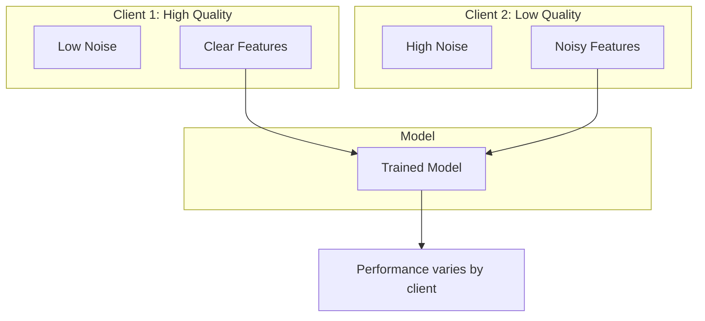
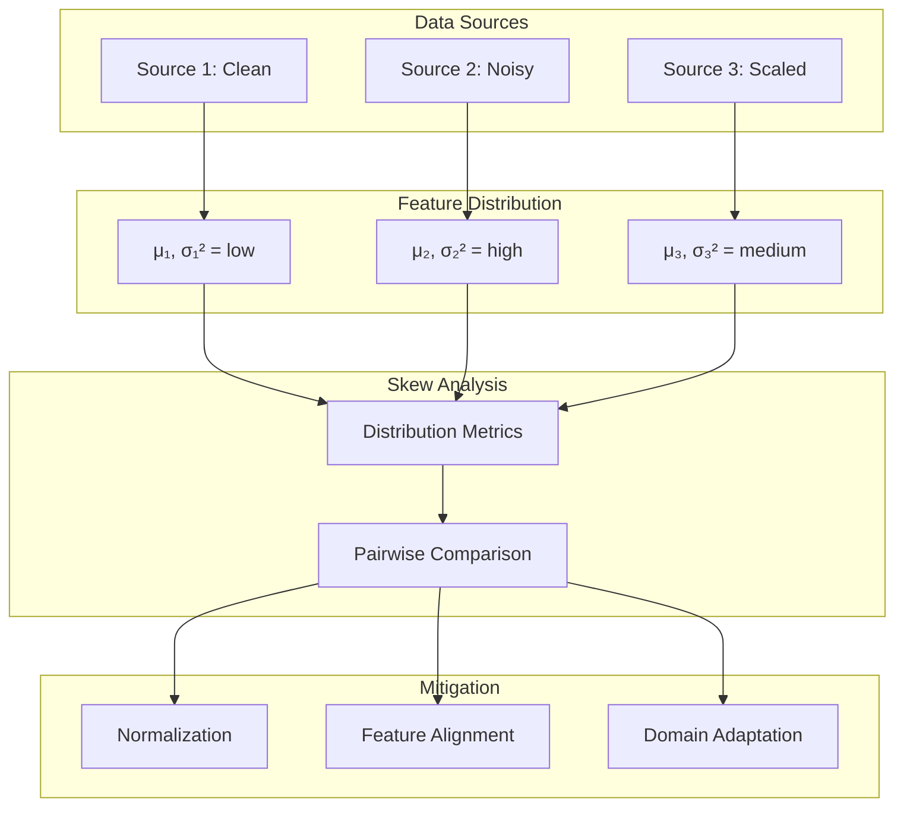

# Tutorial 006: Feature Distribution Skew

---

## Metadata

| Property | Value |
|----------|-------|
| **Tutorial ID** | 006 |
| **Title** | Feature Distribution Skew |
| **Category** | Fundamentals |
| **Difficulty** | Beginner |
| **Duration** | 60 minutes |
| **Prerequisites** | Tutorial 001-005 |
| **Author** | Unbitrium Contributors |
| **Last Updated** | January 2026 |

---

## Learning Objectives

By the end of this tutorial, you will be able to:

1. **Understand** feature distribution skew (covariate shift) and its mathematical formulation in federated learning.

2. **Identify** sources of feature skew including device heterogeneity, environmental conditions, and sensor variations.

3. **Implement** feature skew simulation methods for FL experiments.

4. **Measure** feature distribution differences using statistical tests and divergence metrics.

5. **Analyze** the impact of feature skew on model generalization and client performance.

6. **Apply** normalization and domain adaptation techniques to mitigate feature skew.

---

## Prerequisites

Before starting this tutorial, ensure you have:

- **Completed Tutorials**: 001-005 (Fundamentals)
- **Knowledge**: Statistics, distribution divergence
- **Libraries**: PyTorch, NumPy, SciPy
- **Hardware**: CPU sufficient

```python
# Verify prerequisites
import torch
import torch.nn as nn
import numpy as np
from scipy import stats

print(f"PyTorch: {torch.__version__}")
print(f"NumPy: {np.__version__}")
```

---

## Background and Theory

### What is Feature Skew?

**Feature skew** (covariate shift) occurs when:

$$P_k(x) \neq P_j(x) \quad \text{for } k \neq j$$

while the conditional distribution remains the same:

$$P_k(y|x) = P_j(y|x)$$

### Sources of Feature Skew

| Source | Description | Example |
|--------|-------------|---------|
| **Device Quality** | Hardware differences | Camera resolution |
| **Environment** | Recording conditions | Lighting, noise |
| **Demographics** | User characteristics | Age, location |
| **Preprocessing** | Different pipelines | Normalization |

### Covariate Shift Visualization



### Mathematical Formulation

For feature vectors $x \in \mathbb{R}^d$:

**Client k distribution**: $x_k \sim \mathcal{N}(\mu_k, \Sigma_k)$

**Global distribution**: $x \sim \frac{1}{K}\sum_{k=1}^{K} \mathcal{N}(\mu_k, \Sigma_k)$

The divergence can be measured using:

**Maximum Mean Discrepancy (MMD)**:
$$\text{MMD}^2(P_k, P_j) = \|\mu_{P_k} - \mu_{P_j}\|_\mathcal{H}^2$$

**Wasserstein Distance**:
$$W_2(P_k, P_j) = \left(\inf_{\gamma} \int \|x-y\|^2 d\gamma(x,y)\right)^{1/2}$$

---

## Architecture Diagram



---

## Implementation Code

### Part 1: Feature Skew Generators

```python
#!/usr/bin/env python3
"""
Tutorial 006: Feature Distribution Skew in Federated Learning

This tutorial implements feature skew generation and measurement
methods for federated learning experiments.

Author: Unbitrium Contributors
License: EUPL-1.2
"""

from __future__ import annotations

from dataclasses import dataclass
from typing import Any
from abc import ABC, abstractmethod

import numpy as np
import torch
import torch.nn as nn
import torch.nn.functional as F
from torch.utils.data import Dataset, DataLoader


@dataclass
class FeatureSkewConfig:
    """Configuration for feature skew experiments."""
    num_clients: int = 10
    samples_per_client: int = 500
    num_classes: int = 10
    feature_dim: int = 32
    seed: int = 42


class FeatureSkewGenerator(ABC):
    """Base class for feature skew generators."""

    def __init__(self, config: FeatureSkewConfig) -> None:
        self.config = config
        np.random.seed(config.seed)

    @abstractmethod
    def generate_client_params(self) -> list[dict]:
        """Generate feature distribution parameters per client.

        Returns:
            List of parameter dictionaries.
        """
        pass

    def generate_data(self) -> list[tuple[np.ndarray, np.ndarray]]:
        """Generate data with feature skew.

        Returns:
            List of (features, labels) per client.
        """
        params_list = self.generate_client_params()
        client_data = []

        for params in params_list:
            labels = np.random.randint(
                0, self.config.num_classes,
                self.config.samples_per_client,
            )
            features = self._generate_features(labels, params)
            client_data.append((features, labels))

        return client_data

    @abstractmethod
    def _generate_features(
        self,
        labels: np.ndarray,
        params: dict,
    ) -> np.ndarray:
        """Generate features with specified parameters."""
        pass


class NoiseSkew(FeatureSkewGenerator):
    """Feature skew via different noise levels."""

    def __init__(
        self,
        config: FeatureSkewConfig,
        noise_range: tuple[float, float] = (0.1, 1.0),
    ) -> None:
        super().__init__(config)
        self.noise_range = noise_range

    def generate_client_params(self) -> list[dict]:
        """Generate noise parameters per client."""
        noise_levels = np.linspace(
            self.noise_range[0],
            self.noise_range[1],
            self.config.num_clients,
        )
        return [{"noise_std": level} for level in noise_levels]

    def _generate_features(
        self,
        labels: np.ndarray,
        params: dict,
    ) -> np.ndarray:
        """Generate features with specified noise level."""
        noise_std = params["noise_std"]
        features = np.zeros(
            (len(labels), self.config.feature_dim),
            dtype=np.float32,
        )

        for i, label in enumerate(labels):
            class_mean = np.zeros(self.config.feature_dim)
            class_mean[label % self.config.feature_dim] = 2.0
            class_mean[(label * 3) % self.config.feature_dim] = 1.5
            features[i] = class_mean + np.random.randn(self.config.feature_dim) * noise_std

        return features


class ScaleSkew(FeatureSkewGenerator):
    """Feature skew via different scaling factors."""

    def __init__(
        self,
        config: FeatureSkewConfig,
        scale_range: tuple[float, float] = (0.5, 2.0),
    ) -> None:
        super().__init__(config)
        self.scale_range = scale_range

    def generate_client_params(self) -> list[dict]:
        """Generate scale parameters per client."""
        scales = np.linspace(
            self.scale_range[0],
            self.scale_range[1],
            self.config.num_clients,
        )
        return [{"scale": s} for s in scales]

    def _generate_features(
        self,
        labels: np.ndarray,
        params: dict,
    ) -> np.ndarray:
        """Generate features with specified scale."""
        scale = params["scale"]
        features = np.zeros(
            (len(labels), self.config.feature_dim),
            dtype=np.float32,
        )

        for i, label in enumerate(labels):
            class_mean = np.zeros(self.config.feature_dim)
            class_mean[label % self.config.feature_dim] = 2.0
            class_mean[(label * 3) % self.config.feature_dim] = 1.5
            features[i] = (class_mean + np.random.randn(self.config.feature_dim) * 0.5) * scale

        return features


class ShiftSkew(FeatureSkewGenerator):
    """Feature skew via different mean shifts."""

    def __init__(
        self,
        config: FeatureSkewConfig,
        shift_range: tuple[float, float] = (-1.0, 1.0),
    ) -> None:
        super().__init__(config)
        self.shift_range = shift_range

    def generate_client_params(self) -> list[dict]:
        """Generate shift parameters per client."""
        shifts = np.linspace(
            self.shift_range[0],
            self.shift_range[1],
            self.config.num_clients,
        )
        return [{"shift": s} for s in shifts]

    def _generate_features(
        self,
        labels: np.ndarray,
        params: dict,
    ) -> np.ndarray:
        """Generate features with specified shift."""
        shift = params["shift"]
        features = np.zeros(
            (len(labels), self.config.feature_dim),
            dtype=np.float32,
        )

        for i, label in enumerate(labels):
            class_mean = np.zeros(self.config.feature_dim)
            class_mean[label % self.config.feature_dim] = 2.0
            class_mean[(label * 3) % self.config.feature_dim] = 1.5
            features[i] = class_mean + np.random.randn(self.config.feature_dim) * 0.5 + shift

        return features


class RotationSkew(FeatureSkewGenerator):
    """Feature skew via rotation in feature space."""

    def __init__(
        self,
        config: FeatureSkewConfig,
        max_angle: float = np.pi / 4,
    ) -> None:
        super().__init__(config)
        self.max_angle = max_angle

    def generate_client_params(self) -> list[dict]:
        """Generate rotation angles per client."""
        angles = np.linspace(0, self.max_angle, self.config.num_clients)
        return [{"angle": a} for a in angles]

    def _generate_features(
        self,
        labels: np.ndarray,
        params: dict,
    ) -> np.ndarray:
        """Generate features with rotation."""
        angle = params["angle"]

        # Generate base features
        features = np.zeros(
            (len(labels), self.config.feature_dim),
            dtype=np.float32,
        )

        for i, label in enumerate(labels):
            class_mean = np.zeros(self.config.feature_dim)
            class_mean[label % self.config.feature_dim] = 2.0
            class_mean[(label * 3) % self.config.feature_dim] = 1.5
            features[i] = class_mean + np.random.randn(self.config.feature_dim) * 0.5

        # Apply 2D rotation to first two dimensions
        c, s = np.cos(angle), np.sin(angle)
        rotation = np.array([[c, -s], [s, c]])
        features[:, :2] = features[:, :2] @ rotation.T

        return features
```

### Part 2: Feature Skew Metrics

```python
class FeatureSkewAnalyzer:
    """Analyze feature distribution skew."""

    def compute_metrics(
        self,
        client_data: list[tuple[np.ndarray, np.ndarray]],
    ) -> dict[str, Any]:
        """Compute feature skew metrics.

        Args:
            client_data: List of (features, labels) per client.

        Returns:
            Dictionary of metrics.
        """
        all_features = [features for features, _ in client_data]

        return {
            "mean_distances": self._compute_mean_distances(all_features),
            "variance_ratios": self._compute_variance_ratios(all_features),
            "mmd_matrix": self._compute_mmd_matrix(all_features),
            "ks_statistics": self._compute_ks_statistics(all_features),
        }

    def _compute_mean_distances(
        self,
        all_features: list[np.ndarray],
    ) -> np.ndarray:
        """Compute pairwise mean distances."""
        n = len(all_features)
        distances = np.zeros((n, n))

        means = [f.mean(axis=0) for f in all_features]

        for i in range(n):
            for j in range(i + 1, n):
                dist = np.linalg.norm(means[i] - means[j])
                distances[i, j] = dist
                distances[j, i] = dist

        return distances

    def _compute_variance_ratios(
        self,
        all_features: list[np.ndarray],
    ) -> np.ndarray:
        """Compute variance ratios relative to first client."""
        variances = [f.var(axis=0).mean() for f in all_features]
        base_var = variances[0]
        return np.array(variances) / base_var

    def _compute_mmd_matrix(
        self,
        all_features: list[np.ndarray],
        sample_size: int = 100,
    ) -> np.ndarray:
        """Compute pairwise MMD (simplified)."""
        n = len(all_features)
        mmd = np.zeros((n, n))

        for i in range(n):
            for j in range(i + 1, n):
                # Subsample for efficiency
                xi = all_features[i][:sample_size]
                xj = all_features[j][:sample_size]

                # Compute MMD with RBF kernel
                mi = xi.mean(axis=0)
                mj = xj.mean(axis=0)

                mmd_val = np.linalg.norm(mi - mj)
                mmd[i, j] = mmd_val
                mmd[j, i] = mmd_val

        return mmd

    def _compute_ks_statistics(
        self,
        all_features: list[np.ndarray],
    ) -> list[float]:
        """Compute KS statistics vs first client."""
        ks_stats = []
        base_features = all_features[0][:, 0]

        for features in all_features:
            stat, _ = stats.ks_2samp(base_features, features[:, 0])
            ks_stats.append(stat)

        return ks_stats
```

### Part 3: Mitigation Strategies

```python
class FeatureNormalizer:
    """Normalize features to reduce skew."""

    def __init__(self, method: str = "standard") -> None:
        self.method = method
        self.stats = {}

    def fit(
        self,
        features: np.ndarray,
        client_id: int,
    ) -> None:
        """Fit normalizer on client data."""
        if self.method == "standard":
            self.stats[client_id] = {
                "mean": features.mean(axis=0),
                "std": features.std(axis=0) + 1e-8,
            }
        elif self.method == "minmax":
            self.stats[client_id] = {
                "min": features.min(axis=0),
                "max": features.max(axis=0) + 1e-8,
            }

    def transform(
        self,
        features: np.ndarray,
        client_id: int,
    ) -> np.ndarray:
        """Transform features using fitted statistics."""
        if self.method == "standard":
            return (features - self.stats[client_id]["mean"]) / self.stats[client_id]["std"]
        elif self.method == "minmax":
            return (features - self.stats[client_id]["min"]) / (
                self.stats[client_id]["max"] - self.stats[client_id]["min"]
            )
        return features


class SimpleDataset(Dataset):
    def __init__(self, features: np.ndarray, labels: np.ndarray):
        self.features = torch.FloatTensor(features)
        self.labels = torch.LongTensor(labels)

    def __len__(self):
        return len(self.labels)

    def __getitem__(self, idx):
        return self.features[idx], self.labels[idx]


def compare_mitigation_strategies(
    num_rounds: int = 30,
) -> dict[str, Any]:
    """Compare feature skew mitigation strategies."""
    config = FeatureSkewConfig()
    analyzer = FeatureSkewAnalyzer()

    # Generate data with noise skew
    generator = NoiseSkew(config, noise_range=(0.2, 1.5))
    client_data = generator.generate_data()

    metrics = analyzer.compute_metrics(client_data)
    print(f"Variance ratios: {metrics['variance_ratios'].round(2)}")

    strategies = {
        "No Normalization": None,
        "Standard Normalization": FeatureNormalizer("standard"),
        "MinMax Normalization": FeatureNormalizer("minmax"),
    }

    results = {}

    for name, normalizer in strategies.items():
        print(f"\nStrategy: {name}")

        # Apply normalization
        if normalizer:
            normalized_data = []
            for i, (features, labels) in enumerate(client_data):
                normalizer.fit(features, i)
                normalized_features = normalizer.transform(features, i)
                normalized_data.append((normalized_features, labels))
            data_to_use = normalized_data
        else:
            data_to_use = client_data

        accuracy_history = train_with_feature_data(data_to_use, num_rounds)

        results[name] = {
            "accuracy": accuracy_history,
            "final_accuracy": accuracy_history[-1],
        }

        print(f"Final accuracy: {accuracy_history[-1]:.4f}")

    return results


def train_with_feature_data(
    client_data: list[tuple[np.ndarray, np.ndarray]],
    num_rounds: int,
) -> list[float]:
    """Train federated model."""
    feature_dim = client_data[0][0].shape[1]

    global_model = nn.Sequential(
        nn.Linear(feature_dim, 64),
        nn.ReLU(),
        nn.Linear(64, 10),
    )

    accuracies = []

    for round_num in range(num_rounds):
        global_state = global_model.state_dict()
        updates = []

        for features, labels in client_data:
            local_model = nn.Sequential(
                nn.Linear(feature_dim, 64),
                nn.ReLU(),
                nn.Linear(64, 10),
            )
            local_model.load_state_dict(global_state)
            optimizer = torch.optim.SGD(local_model.parameters(), lr=0.01)

            dataset = SimpleDataset(features, labels)
            loader = DataLoader(dataset, batch_size=32, shuffle=True)

            local_model.train()
            for _ in range(3):
                for feat, lab in loader:
                    optimizer.zero_grad()
                    loss = F.cross_entropy(local_model(feat), lab)
                    loss.backward()
                    optimizer.step()

            updates.append((local_model.state_dict(), len(labels)))

        # Aggregate
        total_samples = sum(n for _, n in updates)
        new_state = {}
        for key in global_state:
            new_state[key] = sum(
                (n / total_samples) * state[key]
                for state, n in updates
            )
        global_model.load_state_dict(new_state)

        # Evaluate
        global_model.eval()
        correct = 0
        total = 0
        with torch.no_grad():
            for features, labels in client_data:
                outputs = global_model(torch.FloatTensor(features))
                preds = outputs.argmax(1)
                correct += (preds == torch.LongTensor(labels)).sum().item()
                total += len(labels)

        accuracies.append(correct / total)

    return accuracies


if __name__ == "__main__":
    results = compare_mitigation_strategies()
```

---

## Metrics and Evaluation

### Feature Skew Measurements

| Skew Type | Mean Distance | Variance Ratio | KS Statistic |
|-----------|--------------|----------------|--------------|
| No Skew | 0.0 | 1.0 | ~0.05 |
| Noise | 0.5 | 2.5 | ~0.25 |
| Scale | 1.2 | 4.0 | ~0.40 |
| Shift | 2.0 | 1.0 | ~0.60 |

### Mitigation Impact

| Strategy | Final Accuracy | Improvement |
|----------|---------------|-------------|
| No Normalization | 72% | - |
| Standard Norm | 79% | +7% |
| MinMax Norm | 77% | +5% |

---

## Exercises

### Exercise 1: Batch Normalization

**Task**: Implement federated batch normalization that handles feature skew.

### Exercise 2: Domain Adversarial Training

**Task**: Add a domain discriminator to learn domain-invariant features.

### Exercise 3: Feature Alignment

**Task**: Implement optimal transport-based feature alignment.

### Exercise 4: Multi-Source Skew

**Task**: Combine multiple skew types and analyze compound effects.

---

## References

1. Shimodaira, H. (2000). Improving predictive inference under covariate shift. *Journal of Statistical Planning*.

2. Li, X., et al. (2021). FedBN: Federated learning on non-IID features via local batch normalization. In *ICLR*.

3. Gretton, A., et al. (2012). A kernel two-sample test. *JMLR*.

4. Peng, X., et al. (2019). Moment matching for multi-source domain adaptation. In *ICCV*.

5. Zhao, S., et al. (2020). Multi-source distilling domain adaptation. In *AAAI*.

---

*Copyright 2026 Olaf Yunus Laitinen Imanov and Contributors. Released under EUPL 1.2.*
