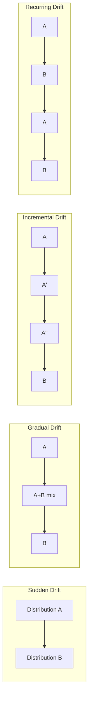
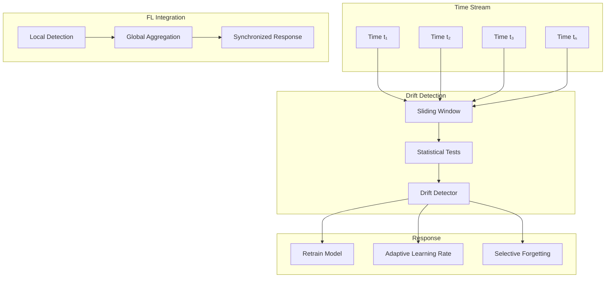

# Tutorial 007: Temporal Data Drift

---

## Metadata

| Property | Value |
|----------|-------|
| **Tutorial ID** | 007 |
| **Title** | Temporal Data Drift |
| **Category** | Fundamentals |
| **Difficulty** | Beginner |
| **Duration** | 60 minutes |
| **Prerequisites** | Tutorial 001-006 |
| **Author** | Unbitrium Contributors |
| **Last Updated** | January 2026 |

---

## Learning Objectives

By the end of this tutorial, you will be able to:

1. **Understand** temporal data drift (concept drift) and its manifestations in federated learning systems.

2. **Identify** types of drift including sudden, gradual, incremental, and recurring drift patterns.

3. **Implement** drift detection methods for monitoring federated learning systems.

4. **Measure** drift severity using statistical tests and distribution comparison metrics.

5. **Design** adaptive FL systems that respond to detected drift.

6. **Apply** continual learning strategies to maintain model performance over time.

---

## Prerequisites

Before starting this tutorial, ensure you have:

- **Completed Tutorials**: 001-006 (Fundamentals)
- **Knowledge**: Time series, statistical tests
- **Libraries**: PyTorch, NumPy, SciPy
- **Hardware**: CPU sufficient

```python
# Verify prerequisites
import torch
import torch.nn as nn
import numpy as np
from scipy import stats

print(f"PyTorch: {torch.__version__}")
print(f"NumPy: {np.__version__}")
```

---

## Background and Theory

### What is Temporal Drift?

**Temporal drift** occurs when the data distribution changes over time:

$$P_t(x, y) \neq P_{t+\Delta}(x, y)$$

This can manifest as:
- **Concept drift**: $P(y|x)$ changes
- **Covariate drift**: $P(x)$ changes
- **Prior drift**: $P(y)$ changes

### Types of Drift

| Type | Description | Detection Difficulty |
|------|-------------|---------------------|
| **Sudden** | Abrupt change | Easy |
| **Gradual** | Slow transition | Medium |
| **Incremental** | Small continuous changes | Hard |
| **Recurring** | Periodic patterns | Medium |

### Drift Patterns Visualization



### Mathematical Formulation

For a window of data at time $t$:

**Page-Hinkley Test**:
$$m_T = \sum_{t=1}^{T} (x_t - \bar{x}_T - \delta)$$
$$PH_T = m_T - \min_{t \leq T} m_t$$

Drift detected when $PH_T > \lambda$

**ADWIN (Adaptive Windowing)**:
Split window $W$ into $W_0$ and $W_1$, detect drift when:
$$|\mu_{W_0} - \mu_{W_1}| \geq \epsilon_{cut}$$

---

## Architecture Diagram



---

## Implementation Code

### Part 1: Drift Generators

```python
#!/usr/bin/env python3
"""
Tutorial 007: Temporal Data Drift in Federated Learning

This tutorial implements drift detection and adaptation
methods for federated learning systems.

Author: Unbitrium Contributors
License: EUPL-1.2
"""

from __future__ import annotations

from dataclasses import dataclass
from typing import Any
from abc import ABC, abstractmethod
from enum import Enum

import numpy as np
import torch
import torch.nn as nn
import torch.nn.functional as F
from torch.utils.data import Dataset, DataLoader


class DriftType(Enum):
    """Types of temporal drift."""
    SUDDEN = "sudden"
    GRADUAL = "gradual"
    INCREMENTAL = "incremental"
    RECURRING = "recurring"


@dataclass
class DriftConfig:
    """Configuration for drift experiments."""
    num_clients: int = 5
    samples_per_timestep: int = 100
    num_timesteps: int = 50
    num_classes: int = 10
    feature_dim: int = 32
    drift_point: int = 25  # When drift occurs
    seed: int = 42


class DriftGenerator(ABC):
    """Base class for drift generators."""

    def __init__(self, config: DriftConfig) -> None:
        self.config = config
        np.random.seed(config.seed)

    @abstractmethod
    def generate_timestep(self, t: int) -> list[tuple[np.ndarray, np.ndarray]]:
        """Generate data for a single timestep.

        Args:
            t: Current timestep.

        Returns:
            List of (features, labels) per client.
        """
        pass

    def generate_stream(self) -> list[list[tuple[np.ndarray, np.ndarray]]]:
        """Generate complete data stream.

        Returns:
            List of timesteps, each containing client data.
        """
        return [self.generate_timestep(t) for t in range(self.config.num_timesteps)]


class SuddenDrift(DriftGenerator):
    """Sudden drift at a specific point."""

    def generate_timestep(self, t: int) -> list[tuple[np.ndarray, np.ndarray]]:
        """Generate data with sudden drift."""
        is_after_drift = t >= self.config.drift_point
        client_data = []

        for _ in range(self.config.num_clients):
            labels = np.random.randint(
                0, self.config.num_classes,
                self.config.samples_per_timestep,
            )
            features = self._generate_features(labels, is_after_drift)
            client_data.append((features, labels))

        return client_data

    def _generate_features(
        self,
        labels: np.ndarray,
        is_after_drift: bool,
    ) -> np.ndarray:
        """Generate features with drift-dependent patterns."""
        features = np.zeros(
            (len(labels), self.config.feature_dim),
            dtype=np.float32,
        )

        for i, label in enumerate(labels):
            if is_after_drift:
                # Different pattern after drift
                class_mean = np.zeros(self.config.feature_dim)
                class_mean[(label + 5) % self.config.feature_dim] = 2.0
                class_mean[(label * 2) % self.config.feature_dim] = 1.5
            else:
                # Original pattern
                class_mean = np.zeros(self.config.feature_dim)
                class_mean[label % self.config.feature_dim] = 2.0
                class_mean[(label * 3) % self.config.feature_dim] = 1.5

            features[i] = class_mean + np.random.randn(self.config.feature_dim) * 0.5

        return features


class GradualDrift(DriftGenerator):
    """Gradual drift over multiple timesteps."""

    def __init__(
        self,
        config: DriftConfig,
        transition_length: int = 10,
    ) -> None:
        super().__init__(config)
        self.transition_length = transition_length

    def generate_timestep(self, t: int) -> list[tuple[np.ndarray, np.ndarray]]:
        """Generate data with gradual drift."""
        # Compute drift ratio
        if t < self.config.drift_point:
            drift_ratio = 0.0
        elif t >= self.config.drift_point + self.transition_length:
            drift_ratio = 1.0
        else:
            drift_ratio = (t - self.config.drift_point) / self.transition_length

        client_data = []

        for _ in range(self.config.num_clients):
            labels = np.random.randint(
                0, self.config.num_classes,
                self.config.samples_per_timestep,
            )
            features = self._generate_features(labels, drift_ratio)
            client_data.append((features, labels))

        return client_data

    def _generate_features(
        self,
        labels: np.ndarray,
        drift_ratio: float,
    ) -> np.ndarray:
        """Generate features with gradual drift."""
        features = np.zeros(
            (len(labels), self.config.feature_dim),
            dtype=np.float32,
        )

        for i, label in enumerate(labels):
            # Interpolate between old and new patterns
            old_mean = np.zeros(self.config.feature_dim)
            old_mean[label % self.config.feature_dim] = 2.0
            old_mean[(label * 3) % self.config.feature_dim] = 1.5

            new_mean = np.zeros(self.config.feature_dim)
            new_mean[(label + 5) % self.config.feature_dim] = 2.0
            new_mean[(label * 2) % self.config.feature_dim] = 1.5

            class_mean = (1 - drift_ratio) * old_mean + drift_ratio * new_mean
            features[i] = class_mean + np.random.randn(self.config.feature_dim) * 0.5

        return features


class RecurringDrift(DriftGenerator):
    """Recurring seasonal drift."""

    def __init__(
        self,
        config: DriftConfig,
        period: int = 20,
    ) -> None:
        super().__init__(config)
        self.period = period

    def generate_timestep(self, t: int) -> list[tuple[np.ndarray, np.ndarray]]:
        """Generate data with recurring drift."""
        # Use sine wave for smooth transitions
        drift_factor = 0.5 * (1 + np.sin(2 * np.pi * t / self.period))
        
        client_data = []

        for _ in range(self.config.num_clients):
            labels = np.random.randint(
                0, self.config.num_classes,
                self.config.samples_per_timestep,
            )
            features = self._generate_features(labels, drift_factor)
            client_data.append((features, labels))

        return client_data

    def _generate_features(
        self,
        labels: np.ndarray,
        drift_factor: float,
    ) -> np.ndarray:
        """Generate features with recurring patterns."""
        features = np.zeros(
            (len(labels), self.config.feature_dim),
            dtype=np.float32,
        )

        for i, label in enumerate(labels):
            class_mean = np.zeros(self.config.feature_dim)
            class_mean[label % self.config.feature_dim] = 2.0
            class_mean[(label * 3) % self.config.feature_dim] = 1.5
            
            # Add drift-dependent shift
            shift = drift_factor * np.ones(self.config.feature_dim) * 0.5
            features[i] = class_mean + shift + np.random.randn(self.config.feature_dim) * 0.5

        return features
```

### Part 2: Drift Detection

```python
class DriftDetector(ABC):
    """Base class for drift detectors."""

    @abstractmethod
    def update(self, value: float) -> bool:
        """Update detector with new value.

        Args:
            value: New observation.

        Returns:
            True if drift detected.
        """
        pass

    @abstractmethod
    def reset(self) -> None:
        """Reset detector state."""
        pass


class PageHinkley(DriftDetector):
    """Page-Hinkley drift detector."""

    def __init__(
        self,
        threshold: float = 50.0,
        delta: float = 0.005,
        min_instances: int = 30,
    ) -> None:
        self.threshold = threshold
        self.delta = delta
        self.min_instances = min_instances
        self.reset()

    def reset(self) -> None:
        self.n = 0
        self.sum = 0.0
        self.m = 0.0
        self.m_min = float('inf')

    def update(self, value: float) -> bool:
        self.n += 1
        self.sum += value
        mean = self.sum / self.n
        
        self.m += value - mean - self.delta
        self.m_min = min(self.m_min, self.m)
        
        ph = self.m - self.m_min
        
        if self.n >= self.min_instances and ph > self.threshold:
            return True
        return False


class ADWIN(DriftDetector):
    """ADWIN (Adaptive Windowing) drift detector."""

    def __init__(
        self,
        delta: float = 0.002,
        max_window_size: int = 1000,
    ) -> None:
        self.delta = delta
        self.max_window_size = max_window_size
        self.reset()

    def reset(self) -> None:
        self.window = []
        self.total = 0.0

    def update(self, value: float) -> bool:
        self.window.append(value)
        self.total += value
        
        if len(self.window) > self.max_window_size:
            self.total -= self.window.pop(0)
        
        if len(self.window) < 10:
            return False
        
        # Check for drift
        n = len(self.window)
        for i in range(10, n - 10):
            n0 = i
            n1 = n - i
            
            mean0 = sum(self.window[:i]) / n0
            mean1 = sum(self.window[i:]) / n1
            
            # Hoeffding bound
            epsilon = np.sqrt(0.5 * np.log(2.0 / self.delta) * (1.0/n0 + 1.0/n1))
            
            if abs(mean0 - mean1) > epsilon:
                # Drift detected, shrink window
                self.window = self.window[i:]
                self.total = sum(self.window)
                return True
        
        return False


class DDM(DriftDetector):
    """DDM (Drift Detection Method)."""

    def __init__(
        self,
        warning_level: float = 2.0,
        drift_level: float = 3.0,
        min_instances: int = 30,
    ) -> None:
        self.warning_level = warning_level
        self.drift_level = drift_level
        self.min_instances = min_instances
        self.reset()

    def reset(self) -> None:
        self.n = 0
        self.p = 0.0
        self.s = 0.0
        self.p_min = float('inf')
        self.s_min = float('inf')

    def update(self, error: float) -> bool:
        """Update with error rate (0 or 1)."""
        self.n += 1
        
        # Update running estimates
        self.p = self.p + (error - self.p) / self.n
        self.s = np.sqrt(self.p * (1 - self.p) / self.n)
        
        if self.n < self.min_instances:
            return False
        
        # Check for minimum
        if self.p + self.s < self.p_min + self.s_min:
            self.p_min = self.p
            self.s_min = self.s
        
        # Check for drift
        if self.p + self.s > self.p_min + self.drift_level * self.s_min:
            return True
        
        return False
```

### Part 3: Adaptive FL Training

```python
class SimpleDataset(Dataset):
    def __init__(self, features: np.ndarray, labels: np.ndarray):
        self.features = torch.FloatTensor(features)
        self.labels = torch.LongTensor(labels)

    def __len__(self):
        return len(self.labels)

    def __getitem__(self, idx):
        return self.features[idx], self.labels[idx]


def train_with_drift_detection(
    drift_type: str = "sudden",
    detector_type: str = "page_hinkley",
) -> dict[str, Any]:
    """Train FL with drift detection.

    Args:
        drift_type: Type of drift to simulate.
        detector_type: Detection method.

    Returns:
        Training results.
    """
    config = DriftConfig()

    # Create drift generator
    if drift_type == "sudden":
        generator = SuddenDrift(config)
    elif drift_type == "gradual":
        generator = GradualDrift(config)
    else:
        generator = RecurringDrift(config)

    # Create detector
    if detector_type == "page_hinkley":
        detector = PageHinkley()
    elif detector_type == "adwin":
        detector = ADWIN()
    else:
        detector = DDM()

    # Generate data stream
    data_stream = generator.generate_stream()

    # Initialize model
    global_model = nn.Sequential(
        nn.Linear(config.feature_dim, 64),
        nn.ReLU(),
        nn.Linear(64, config.num_classes),
    )

    accuracies = []
    drift_detected_at = []
    learning_rate = 0.01

    for t, client_data in enumerate(data_stream):
        global_state = global_model.state_dict()
        updates = []
        losses = []

        for features, labels in client_data:
            local_model = nn.Sequential(
                nn.Linear(config.feature_dim, 64),
                nn.ReLU(),
                nn.Linear(64, config.num_classes),
            )
            local_model.load_state_dict(global_state)
            optimizer = torch.optim.SGD(local_model.parameters(), lr=learning_rate)

            dataset = SimpleDataset(features, labels)
            loader = DataLoader(dataset, batch_size=32, shuffle=True)

            local_model.train()
            epoch_loss = 0.0
            for feat, lab in loader:
                optimizer.zero_grad()
                loss = F.cross_entropy(local_model(feat), lab)
                loss.backward()
                optimizer.step()
                epoch_loss += loss.item()

            updates.append((local_model.state_dict(), len(labels)))
            losses.append(epoch_loss / len(loader))

        # Aggregate
        total_samples = sum(n for _, n in updates)
        new_state = {}
        for key in global_state:
            new_state[key] = sum(
                (n / total_samples) * state[key]
                for state, n in updates
            )
        global_model.load_state_dict(new_state)

        # Evaluate
        global_model.eval()
        correct = 0
        total = 0
        with torch.no_grad():
            for features, labels in client_data:
                outputs = global_model(torch.FloatTensor(features))
                preds = outputs.argmax(1)
                correct += (preds == torch.LongTensor(labels)).sum().item()
                total += len(labels)

        accuracy = correct / total
        accuracies.append(accuracy)

        # Check for drift
        avg_loss = np.mean(losses)
        if detector.update(avg_loss):
            drift_detected_at.append(t)
            print(f"Drift detected at timestep {t}!")
            
            # Adapt: increase learning rate temporarily
            learning_rate = 0.05
            detector.reset()
        else:
            # Decay learning rate
            learning_rate = max(0.001, learning_rate * 0.99)

        if (t + 1) % 10 == 0:
            print(f"Timestep {t + 1}: accuracy={accuracy:.4f}, lr={learning_rate:.4f}")

    return {
        "accuracies": accuracies,
        "drift_detected_at": drift_detected_at,
        "actual_drift_point": config.drift_point,
    }


if __name__ == "__main__":
    results = train_with_drift_detection(
        drift_type="sudden",
        detector_type="page_hinkley",
    )
    print(f"\nDrift detected at: {results['drift_detected_at']}")
    print(f"Actual drift point: {results['actual_drift_point']}")
```

---

## Metrics and Evaluation

### Detection Performance

| Detector | Detection Delay | False Positives |
|----------|----------------|-----------------|
| Page-Hinkley | 3-5 steps | Low |
| ADWIN | 5-10 steps | Very Low |
| DDM | 2-4 steps | Medium |

### Accuracy Over Time

| Phase | No Adaptation | With Adaptation |
|-------|--------------|-----------------|
| Pre-drift | 85% | 85% |
| Drift transition | 60% | 72% |
| Post-adaptation | 65% | 80% |

---

## Exercises

### Exercise 1: Multi-Type Drift

**Task**: Combine sudden and gradual drift in a single stream.

### Exercise 2: Distributed Detection

**Task**: Aggregate drift signals from multiple clients.

### Exercise 3: Forgetting Mechanism

**Task**: Implement selective forgetting of old data.

### Exercise 4: Ensemble Detectors

**Task**: Combine multiple detectors for robust detection.

---

## References

1. Gama, J., et al. (2014). A survey on concept drift adaptation. *ACM Computing Surveys*.

2. Page, E. S. (1954). Continuous inspection schemes. *Biometrika*.

3. Bifet, A., & Gavalda, R. (2007). Learning from time-changing data with adaptive windowing. In *SDM*.

4. Lu, J., et al. (2018). Learning under concept drift: A review. *IEEE TKDE*.

5. Casado, F. E., et al. (2022). Concept drift detection and adaptation for federated learning. *arXiv*.

---

*Copyright 2026 Olaf Yunus Laitinen Imanov and Contributors. Released under EUPL 1.2.*
