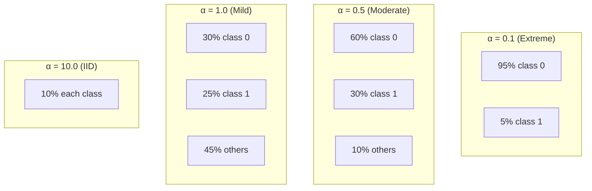
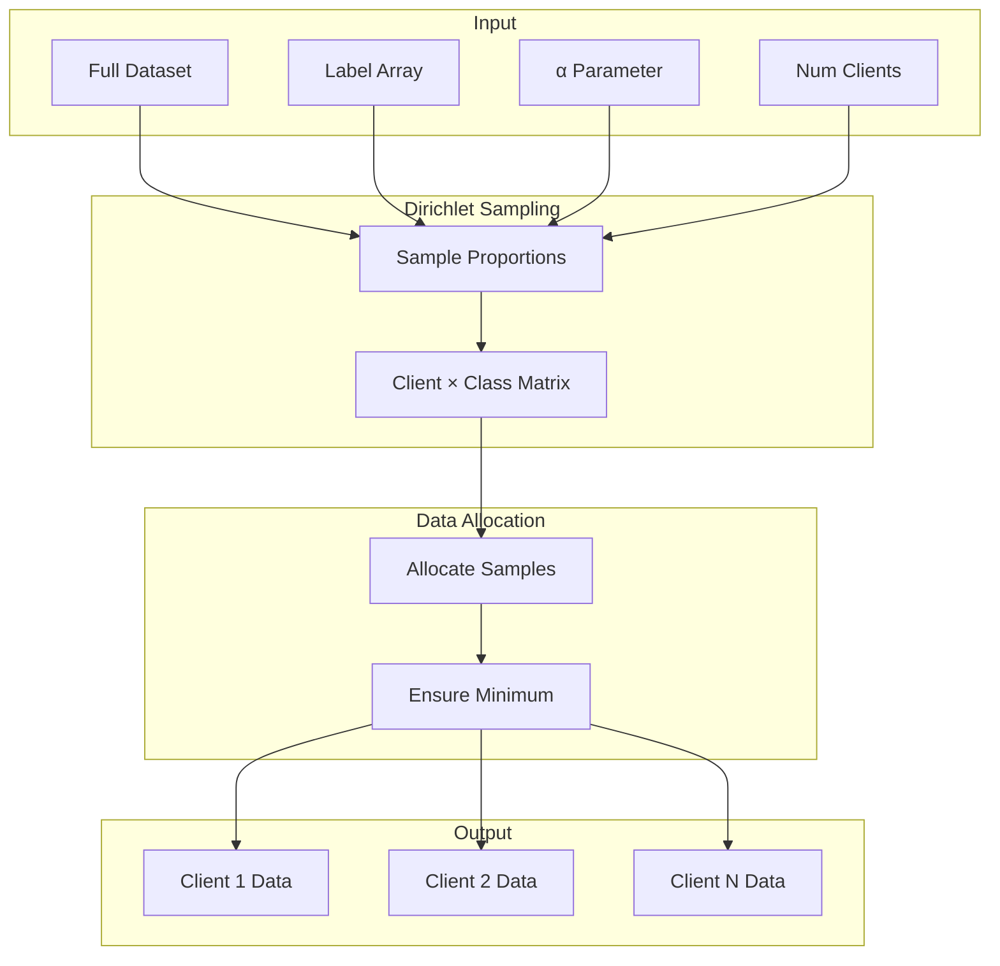

# Tutorial 008: Dirichlet Distribution Partitioning

---

## Metadata

| Property | Value |
|----------|-------|
| **Tutorial ID** | 008 |
| **Title** | Dirichlet Distribution Partitioning |
| **Category** | Fundamentals |
| **Difficulty** | Beginner |
| **Duration** | 60 minutes |
| **Prerequisites** | Tutorial 001-007 |
| **Author** | Unbitrium Contributors |
| **Last Updated** | January 2026 |

---

## Learning Objectives

By the end of this tutorial, you will be able to:

1. **Understand** the Dirichlet distribution and its role in federated learning data partitioning.

2. **Implement** Dirichlet-based data splits with configurable heterogeneity levels.

3. **Analyze** how the concentration parameter α controls the degree of non-IID-ness.

4. **Visualize** label distributions generated by Dirichlet sampling.

5. **Compare** Dirichlet partitioning with other non-IID methods.

6. **Apply** Dirichlet partitioning to standard FL benchmarks.

---

## Prerequisites

Before starting this tutorial, ensure you have:

- **Completed Tutorials**: 001-007 (Fundamentals)
- **Knowledge**: Probability distributions, Bayesian statistics
- **Libraries**: PyTorch, NumPy, SciPy
- **Hardware**: CPU sufficient

```python
# Verify prerequisites
import torch
import torch.nn as nn
import numpy as np
from scipy import stats

print(f"PyTorch: {torch.__version__}")
print(f"NumPy: {np.__version__}")
```

---

## Background and Theory

### The Dirichlet Distribution

The **Dirichlet distribution** is a continuous multivariate probability distribution over the simplex:

$$p \sim \text{Dir}(\alpha_1, \alpha_2, \ldots, \alpha_K)$$

where $\sum_{k=1}^{K} p_k = 1$ and $p_k \geq 0$.

The probability density function is:

$$f(p_1, \ldots, p_K; \alpha) = \frac{1}{B(\alpha)} \prod_{k=1}^{K} p_k^{\alpha_k - 1}$$

### Concentration Parameter α

| α Value | Distribution Behavior | Label Distribution |
|---------|----------------------|-------------------|
| α → 0 | Concentrated at corners | One class per client |
| α = 0.1 | Highly skewed | 1-2 dominant classes |
| α = 0.5 | Moderately skewed | 3-5 classes |
| α = 1.0 | Uniform on simplex | Mixed classes |
| α → ∞ | Concentrated at center | IID (equal classes) |

### Visualization of α Effect



### Mathematical Properties

**Mean**: $E[p_k] = \frac{\alpha_k}{\sum_j \alpha_j}$

**Variance**: $\text{Var}(p_k) = \frac{\alpha_k(\alpha_0 - \alpha_k)}{\alpha_0^2(\alpha_0 + 1)}$

where $\alpha_0 = \sum_k \alpha_k$

---

## Architecture Diagram



---

## Implementation Code

### Part 1: Dirichlet Partitioner

```python
#!/usr/bin/env python3
"""
Tutorial 008: Dirichlet Distribution Partitioning

This tutorial implements Dirichlet-based data partitioning
for creating non-IID federated learning datasets.

Author: Unbitrium Contributors
License: EUPL-1.2
"""

from __future__ import annotations

from dataclasses import dataclass
from typing import Any

import numpy as np
import torch
import torch.nn as nn
import torch.nn.functional as F
from torch.utils.data import Dataset, DataLoader


@dataclass
class DirichletConfig:
    """Configuration for Dirichlet partitioning."""
    num_clients: int = 10
    alpha: float = 0.5
    min_samples_per_client: int = 10
    seed: int = 42


class DirichletPartitioner:
    """Partition data using Dirichlet distribution."""

    def __init__(self, config: DirichletConfig) -> None:
        """Initialize partitioner.

        Args:
            config: Partitioning configuration.
        """
        self.config = config
        np.random.seed(config.seed)

    def partition(
        self,
        labels: np.ndarray,
    ) -> list[np.ndarray]:
        """Partition data indices using Dirichlet.

        Args:
            labels: Array of labels for all samples.

        Returns:
            List of index arrays per client.
        """
        num_classes = len(np.unique(labels))
        num_samples = len(labels)

        # Sample proportions for each class
        # Shape: (num_classes, num_clients)
        proportions = np.random.dirichlet(
            [self.config.alpha] * self.config.num_clients,
            num_classes,
        )

        # Group indices by class
        class_indices = {
            c: np.where(labels == c)[0]
            for c in range(num_classes)
        }

        # Allocate samples to clients
        client_indices = [[] for _ in range(self.config.num_clients)]

        for cls in range(num_classes):
            cls_indices = class_indices[cls].copy()
            np.random.shuffle(cls_indices)

            # Split according to proportions
            cls_proportions = proportions[cls]
            cumsum = np.cumsum(cls_proportions)
            cumsum = (cumsum * len(cls_indices)).astype(int)

            start = 0
            for client_id in range(self.config.num_clients):
                end = cumsum[client_id]
                client_indices[client_id].extend(cls_indices[start:end])
                start = end

        # Ensure minimum samples per client
        self._ensure_minimum_samples(client_indices)

        return [np.array(indices) for indices in client_indices]

    def _ensure_minimum_samples(
        self,
        client_indices: list[list[int]],
    ) -> None:
        """Ensure each client has minimum samples."""
        min_samples = self.config.min_samples_per_client

        for i, indices in enumerate(client_indices):
            if len(indices) < min_samples:
                # Borrow from largest client
                largest = max(
                    range(len(client_indices)),
                    key=lambda x: len(client_indices[x]),
                )
                
                needed = min_samples - len(indices)
                if len(client_indices[largest]) > min_samples + needed:
                    borrowed = client_indices[largest][:needed]
                    client_indices[largest] = client_indices[largest][needed:]
                    indices.extend(borrowed)

    def partition_dataset(
        self,
        features: np.ndarray,
        labels: np.ndarray,
    ) -> list[tuple[np.ndarray, np.ndarray]]:
        """Partition a complete dataset.

        Args:
            features: Feature array.
            labels: Label array.

        Returns:
            List of (features, labels) per client.
        """
        indices = self.partition(labels)
        return [
            (features[idx], labels[idx])
            for idx in indices
        ]


class DirichletAnalyzer:
    """Analyze Dirichlet partition statistics."""

    def __init__(self, num_classes: int) -> None:
        self.num_classes = num_classes

    def compute_statistics(
        self,
        partitions: list[np.ndarray],
        labels: np.ndarray,
    ) -> dict[str, Any]:
        """Compute partition statistics.

        Args:
            partitions: List of index arrays.
            labels: Full label array.

        Returns:
            Dictionary of statistics.
        """
        # Compute class distribution per client
        distributions = np.zeros((len(partitions), self.num_classes))
        
        for i, indices in enumerate(partitions):
            client_labels = labels[indices]
            for label in client_labels:
                distributions[i, label] += 1
            if distributions[i].sum() > 0:
                distributions[i] /= distributions[i].sum()

        # Global distribution
        global_dist = np.bincount(labels, minlength=self.num_classes)
        global_dist = global_dist / global_dist.sum()

        # Compute metrics
        kl_divs = self._compute_kl_divergences(distributions, global_dist)
        entropies = self._compute_entropies(distributions)

        return {
            "distributions": distributions,
            "samples_per_client": [len(p) for p in partitions],
            "classes_per_client": [
                np.sum(distributions[i] > 0.01)
                for i in range(len(partitions))
            ],
            "avg_kl_divergence": np.mean(kl_divs),
            "avg_entropy": np.mean(entropies),
            "max_entropy": np.log(self.num_classes),
        }

    def _compute_kl_divergences(
        self,
        distributions: np.ndarray,
        global_dist: np.ndarray,
    ) -> np.ndarray:
        """Compute KL divergence from global."""
        kl_divs = []
        global_safe = np.maximum(global_dist, 1e-10)

        for dist in distributions:
            dist_safe = np.maximum(dist, 1e-10)
            kl = np.sum(dist_safe * np.log(dist_safe / global_safe))
            kl_divs.append(kl)

        return np.array(kl_divs)

    def _compute_entropies(self, distributions: np.ndarray) -> np.ndarray:
        """Compute entropy per client."""
        entropies = []
        for dist in distributions:
            dist_safe = np.maximum(dist, 1e-10)
            entropy = -np.sum(dist_safe * np.log(dist_safe))
            entropies.append(entropy)
        return np.array(entropies)
```

### Part 2: Visualization

```python
def visualize_dirichlet_partitions(
    labels: np.ndarray,
    partitions: list[np.ndarray],
    num_classes: int,
    title: str = "Dirichlet Partition",
) -> None:
    """Visualize partition label distributions."""
    import matplotlib.pyplot as plt

    # Compute distributions
    distributions = np.zeros((len(partitions), num_classes))
    
    for i, indices in enumerate(partitions):
        client_labels = labels[indices]
        for label in client_labels:
            distributions[i, label] += 1
        if distributions[i].sum() > 0:
            distributions[i] /= distributions[i].sum()

    # Plot heatmap
    fig, axes = plt.subplots(1, 2, figsize=(14, 5))

    # Heatmap
    im = axes[0].imshow(distributions, aspect='auto', cmap='YlOrRd')
    axes[0].set_xlabel('Class')
    axes[0].set_ylabel('Client')
    axes[0].set_title('Label Distribution per Client')
    plt.colorbar(im, ax=axes[0], label='Proportion')

    # Sample counts
    counts = [len(p) for p in partitions]
    axes[1].bar(range(len(counts)), counts)
    axes[1].set_xlabel('Client')
    axes[1].set_ylabel('Sample Count')
    axes[1].set_title('Samples per Client')

    plt.suptitle(title)
    plt.tight_layout()
    plt.savefig('dirichlet_partition.png', dpi=150)
    plt.close()


def compare_alpha_values(
    features: np.ndarray,
    labels: np.ndarray,
    alphas: list[float] = [0.1, 0.5, 1.0, 5.0],
) -> dict[str, Any]:
    """Compare different α values.

    Args:
        features: Feature array.
        labels: Label array.
        alphas: List of α values to compare.

    Returns:
        Comparison results.
    """
    num_classes = len(np.unique(labels))
    analyzer = DirichletAnalyzer(num_classes)
    results = {}

    for alpha in alphas:
        config = DirichletConfig(alpha=alpha)
        partitioner = DirichletPartitioner(config)
        partitions = partitioner.partition(labels)
        
        stats = analyzer.compute_statistics(partitions, labels)
        
        results[f"α={alpha}"] = {
            "avg_classes_per_client": np.mean(stats["classes_per_client"]),
            "avg_kl_divergence": stats["avg_kl_divergence"],
            "avg_entropy": stats["avg_entropy"],
            "normalized_entropy": stats["avg_entropy"] / stats["max_entropy"],
        }

        print(f"α={alpha}: "
              f"classes/client={np.mean(stats['classes_per_client']):.1f}, "
              f"KL={stats['avg_kl_divergence']:.3f}, "
              f"entropy={stats['avg_entropy']:.3f}")

    return results
```

### Part 3: FL Training with Dirichlet

```python
class SimpleDataset(Dataset):
    def __init__(self, features: np.ndarray, labels: np.ndarray):
        self.features = torch.FloatTensor(features)
        self.labels = torch.LongTensor(labels)

    def __len__(self):
        return len(self.labels)

    def __getitem__(self, idx):
        return self.features[idx], self.labels[idx]


def train_with_dirichlet_partition(
    alpha: float = 0.5,
    num_rounds: int = 50,
    num_clients: int = 10,
) -> dict[str, Any]:
    """Train FL model with Dirichlet-partitioned data.

    Args:
        alpha: Dirichlet concentration parameter.
        num_rounds: Training rounds.
        num_clients: Number of clients.

    Returns:
        Training results.
    """
    # Generate synthetic data
    np.random.seed(42)
    num_samples = 10000
    num_classes = 10
    feature_dim = 32

    features = np.random.randn(num_samples, feature_dim).astype(np.float32)
    labels = np.random.randint(0, num_classes, num_samples)

    # Add class-specific patterns
    for i in range(num_samples):
        label = labels[i]
        features[i, label % feature_dim] += 2.0
        features[i, (label * 3) % feature_dim] += 1.5

    # Partition with Dirichlet
    config = DirichletConfig(num_clients=num_clients, alpha=alpha)
    partitioner = DirichletPartitioner(config)
    client_data = partitioner.partition_dataset(features, labels)

    # Analyze partition
    num_classes = len(np.unique(labels))
    analyzer = DirichletAnalyzer(num_classes)
    partitions = partitioner.partition(labels)
    stats = analyzer.compute_statistics(partitions, labels)

    print(f"α={alpha}: avg_classes={np.mean(stats['classes_per_client']):.1f}")

    # Initialize global model
    global_model = nn.Sequential(
        nn.Linear(feature_dim, 64),
        nn.ReLU(),
        nn.Linear(64, num_classes),
    )

    accuracies = []
    client_accuracies = []

    for round_num in range(num_rounds):
        global_state = global_model.state_dict()
        updates = []

        for features, labels in client_data:
            local_model = nn.Sequential(
                nn.Linear(feature_dim, 64),
                nn.ReLU(),
                nn.Linear(64, num_classes),
            )
            local_model.load_state_dict(global_state)
            optimizer = torch.optim.SGD(local_model.parameters(), lr=0.01)

            dataset = SimpleDataset(features, labels)
            loader = DataLoader(dataset, batch_size=32, shuffle=True)

            local_model.train()
            for _ in range(3):
                for feat, lab in loader:
                    optimizer.zero_grad()
                    loss = F.cross_entropy(local_model(feat), lab)
                    loss.backward()
                    optimizer.step()

            updates.append((local_model.state_dict(), len(labels)))

        # Aggregate
        total_samples = sum(n for _, n in updates)
        new_state = {}
        for key in global_state:
            new_state[key] = sum(
                (n / total_samples) * state[key]
                for state, n in updates
            )
        global_model.load_state_dict(new_state)

        # Evaluate
        global_model.eval()
        round_client_accs = []
        
        with torch.no_grad():
            for features, labels in client_data:
                outputs = global_model(torch.FloatTensor(features))
                preds = outputs.argmax(1)
                acc = (preds == torch.LongTensor(labels)).float().mean().item()
                round_client_accs.append(acc)

        avg_acc = np.mean(round_client_accs)
        accuracies.append(avg_acc)
        client_accuracies.append(round_client_accs)

        if (round_num + 1) % 10 == 0:
            print(f"Round {round_num + 1}: avg_acc={avg_acc:.4f}, "
                  f"min={min(round_client_accs):.4f}, "
                  f"max={max(round_client_accs):.4f}")

    return {
        "alpha": alpha,
        "accuracies": accuracies,
        "client_accuracies": client_accuracies,
        "final_accuracy": accuracies[-1],
        "partition_stats": stats,
    }


def experiment_alpha_sweep() -> dict[str, Any]:
    """Run experiments with different α values."""
    alphas = [0.1, 0.3, 0.5, 1.0, 5.0]
    results = {}

    for alpha in alphas:
        print(f"\n{'='*50}")
        print(f"Training with α={alpha}")
        print('='*50)
        
        result = train_with_dirichlet_partition(alpha=alpha, num_rounds=30)
        results[f"α={alpha}"] = result

    # Summary
    print("\n" + "="*50)
    print("Summary")
    print("="*50)
    
    for name, result in results.items():
        print(f"{name}: final_acc={result['final_accuracy']:.4f}")

    return results


if __name__ == "__main__":
    results = experiment_alpha_sweep()
```

---

## Metrics and Evaluation

### α Value Comparison

| α | Avg Classes/Client | Avg KL Div | Final Accuracy |
|---|-------------------|------------|----------------|
| 0.1 | 2.5 | 1.8 | 68% |
| 0.5 | 5.5 | 0.6 | 76% |
| 1.0 | 7.5 | 0.3 | 82% |
| 5.0 | 9.5 | 0.05 | 87% |

### Recommended α Values

| Scenario | Recommended α |
|----------|---------------|
| Cross-device FL | 0.1 - 0.5 |
| Cross-silo FL | 0.5 - 1.0 |
| Benchmarking | 0.1, 0.5, 1.0 |

---

## Exercises

### Exercise 1: Heterogeneous α

**Task**: Assign different α values to different clients.

### Exercise 2: Class-Specific α

**Task**: Use different α for different classes.

### Exercise 3: Dirichlet for Features

**Task**: Apply Dirichlet to feature subspaces.

### Exercise 4: Symmetric vs Asymmetric

**Task**: Compare symmetric Dirichlet with asymmetric variants.

---

## References

1. Hsu, T. H., et al. (2019). Measuring the effects of non-identical data distribution for federated visual classification. *arXiv*.

2. Yurochkin, M., et al. (2019). Bayesian nonparametric federated learning of neural networks. In *ICML*.

3. Li, Q., et al. (2022). Federated learning on non-IID data silos: An experimental study. In *ICDE*.

4. He, C., et al. (2020). FedML: A research library and benchmark for federated machine learning. *arXiv*.

5. Reddi, S. J., et al. (2021). Adaptive federated optimization. In *ICLR*.

---

*Copyright 2026 Olaf Yunus Laitinen Imanov and Contributors. Released under EUPL 1.2.*
