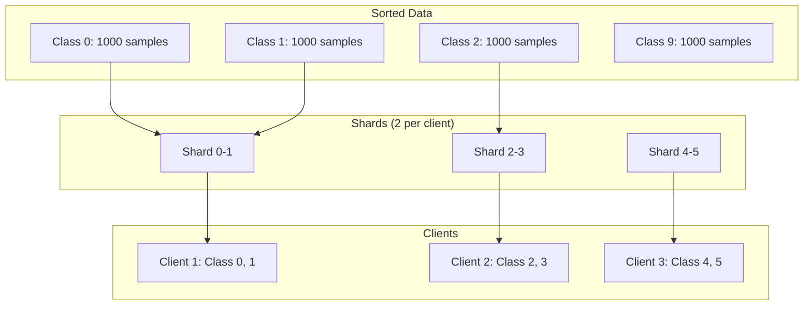
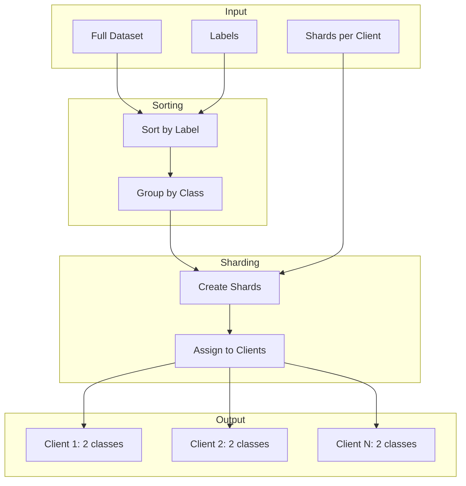

# Tutorial 009: Pathological Non-IID Splits

---

## Metadata

| Property | Value |
|----------|-------|
| **Tutorial ID** | 009 |
| **Title** | Pathological Non-IID Splits |
| **Category** | Fundamentals |
| **Difficulty** | Beginner |
| **Duration** | 60 minutes |
| **Prerequisites** | Tutorial 001-008 |
| **Author** | Unbitrium Contributors |
| **Last Updated** | January 2026 |

---

## Learning Objectives

By the end of this tutorial, you will be able to:

1. **Understand** pathological non-IID splits and their extreme heterogeneity characteristics.

2. **Implement** shard-based partitioning methods following McMahan et al.'s original approach.

3. **Analyze** the impact of classes-per-client on federated learning performance.

4. **Compare** pathological splits with Dirichlet-based approaches.

5. **Design** controlled experiments to study extreme non-IID scenarios.

6. **Apply** mitigation strategies for pathological data distributions.

---

## Prerequisites

Before starting this tutorial, ensure you have:

- **Completed Tutorials**: 001-008 (Fundamentals)
- **Knowledge**: Data partitioning, FL basics
- **Libraries**: PyTorch, NumPy
- **Hardware**: CPU sufficient

```python
# Verify prerequisites
import torch
import torch.nn as nn
import numpy as np

print(f"PyTorch: {torch.__version__}")
print(f"NumPy: {np.__version__}")
```

---

## Background and Theory

### What are Pathological Splits?

**Pathological non-IID splits** are extreme data partitions where each client has data from only a small subset of classes. This was introduced in the original FedAvg paper (McMahan et al., 2017).

The key characteristic:
$$|\{y : (x, y) \in D_k\}| \ll K$$

where $D_k$ is client $k$'s data and $K$ is total classes.

### Shard-Based Partitioning

The original approach:
1. Sort data by label
2. Divide into shards
3. Assign fixed number of shards per client

This guarantees each client has exactly $s$ classes, where $s$ is shards per client.

### Comparison with Other Methods

| Method | Control | Heterogeneity | Realism |
|--------|---------|---------------|---------|
| IID | None | None | Low |
| Dirichlet | α parameter | Soft | High |
| Pathological | Classes/client | Hard | Medium |
| Label-limit | Max classes | Hard | Medium |

### Visualization



### Mathematical Properties

For $C$ classes, $N$ clients, and $s$ shards per client:

**Total shards**: $N \times s$

**Classes per shard**: $\frac{C \times s}{N \times s} = \frac{C}{N}$ (approximately)

When $s = 2$ and $N = 100$ with $C = 10$:
- Each client gets 2 classes
- 5 clients share each class

---

## Architecture Diagram



---

## Implementation Code

### Part 1: Pathological Partitioner

```python
#!/usr/bin/env python3
"""
Tutorial 009: Pathological Non-IID Splits

This tutorial implements pathological data partitioning
following the original FedAvg paper's approach.

Author: Unbitrium Contributors
License: EUPL-1.2
"""

from __future__ import annotations

from dataclasses import dataclass
from typing import Any

import numpy as np
import torch
import torch.nn as nn
import torch.nn.functional as F
from torch.utils.data import Dataset, DataLoader


@dataclass
class PathologicalConfig:
    """Configuration for pathological partitioning."""
    num_clients: int = 100
    shards_per_client: int = 2
    seed: int = 42


class PathologicalPartitioner:
    """Pathological non-IID partitioner (McMahan et al.)."""

    def __init__(self, config: PathologicalConfig) -> None:
        """Initialize partitioner.

        Args:
            config: Partitioning configuration.
        """
        self.config = config
        np.random.seed(config.seed)

    def partition(
        self,
        labels: np.ndarray,
    ) -> list[np.ndarray]:
        """Partition data using shard-based method.

        Args:
            labels: Array of labels.

        Returns:
            List of index arrays per client.
        """
        num_samples = len(labels)
        num_shards = self.config.num_clients * self.config.shards_per_client

        # Sort indices by label
        sorted_indices = np.argsort(labels)
        
        # Create shards
        shard_size = num_samples // num_shards
        shards = []
        
        for i in range(num_shards):
            start = i * shard_size
            end = start + shard_size if i < num_shards - 1 else num_samples
            shards.append(sorted_indices[start:end])

        # Shuffle shards
        shard_indices = np.random.permutation(num_shards)

        # Assign shards to clients
        client_indices = []
        
        for client_id in range(self.config.num_clients):
            client_shards = []
            for s in range(self.config.shards_per_client):
                shard_idx = shard_indices[client_id * self.config.shards_per_client + s]
                client_shards.extend(shards[shard_idx])
            client_indices.append(np.array(client_shards))

        return client_indices

    def partition_dataset(
        self,
        features: np.ndarray,
        labels: np.ndarray,
    ) -> list[tuple[np.ndarray, np.ndarray]]:
        """Partition a complete dataset.

        Args:
            features: Feature array.
            labels: Label array.

        Returns:
            List of (features, labels) per client.
        """
        indices = self.partition(labels)
        return [
            (features[idx], labels[idx])
            for idx in indices
        ]


class LabelLimitPartitioner:
    """Partitioner that limits classes per client."""

    def __init__(
        self,
        num_clients: int = 100,
        classes_per_client: int = 2,
        seed: int = 42,
    ) -> None:
        self.num_clients = num_clients
        self.classes_per_client = classes_per_client
        np.random.seed(seed)

    def partition(
        self,
        labels: np.ndarray,
    ) -> list[np.ndarray]:
        """Partition with limited classes per client."""
        num_classes = len(np.unique(labels))
        
        # Group indices by class
        class_indices = {
            c: np.where(labels == c)[0].tolist()
            for c in range(num_classes)
        }
        
        for c in class_indices:
            np.random.shuffle(class_indices[c])

        # Assign classes to clients
        client_indices = [[] for _ in range(self.num_clients)]
        
        for client_id in range(self.num_clients):
            # Select random classes
            selected_classes = np.random.choice(
                num_classes,
                size=min(self.classes_per_client, num_classes),
                replace=False,
            )
            
            # Allocate samples from selected classes
            samples_per_class = max(1, len(labels) // (self.num_clients * self.classes_per_client))
            
            for cls in selected_classes:
                if class_indices[cls]:
                    n_samples = min(samples_per_class, len(class_indices[cls]))
                    selected = class_indices[cls][:n_samples]
                    class_indices[cls] = class_indices[cls][n_samples:]
                    client_indices[client_id].extend(selected)

        return [np.array(indices) for indices in client_indices]


class PathologicalAnalyzer:
    """Analyze pathological partition characteristics."""

    def __init__(self, num_classes: int) -> None:
        self.num_classes = num_classes

    def compute_statistics(
        self,
        partitions: list[np.ndarray],
        labels: np.ndarray,
    ) -> dict[str, Any]:
        """Compute partition statistics."""
        # Per-client class counts
        classes_per_client = []
        class_coverage = np.zeros(self.num_classes)
        
        distributions = np.zeros((len(partitions), self.num_classes))
        
        for i, indices in enumerate(partitions):
            if len(indices) == 0:
                classes_per_client.append(0)
                continue
                
            client_labels = labels[indices]
            unique_classes = np.unique(client_labels)
            classes_per_client.append(len(unique_classes))
            
            for cls in unique_classes:
                class_coverage[cls] = 1
            
            for label in client_labels:
                distributions[i, label] += 1
            distributions[i] /= len(client_labels)

        # Global distribution
        global_dist = np.bincount(labels, minlength=self.num_classes)
        global_dist = global_dist / global_dist.sum()

        # KL divergences
        kl_divs = []
        for dist in distributions:
            if dist.sum() > 0:
                dist_safe = np.maximum(dist, 1e-10)
                global_safe = np.maximum(global_dist, 1e-10)
                kl = np.sum(dist_safe * np.log(dist_safe / global_safe))
                kl_divs.append(kl)

        return {
            "avg_classes_per_client": np.mean(classes_per_client),
            "min_classes_per_client": np.min(classes_per_client),
            "max_classes_per_client": np.max(classes_per_client),
            "class_coverage": np.sum(class_coverage) / self.num_classes,
            "avg_kl_divergence": np.mean(kl_divs) if kl_divs else 0,
            "samples_per_client": [len(p) for p in partitions],
        }
```

### Part 2: Comparison Framework

```python
def compare_pathological_methods(
    features: np.ndarray,
    labels: np.ndarray,
    num_clients: int = 20,
) -> dict[str, Any]:
    """Compare different pathological partition methods.

    Args:
        features: Feature array.
        labels: Label array.
        num_clients: Number of clients.

    Returns:
        Comparison results.
    """
    num_classes = len(np.unique(labels))
    analyzer = PathologicalAnalyzer(num_classes)

    methods = {
        "Shard-1": PathologicalPartitioner(
            PathologicalConfig(num_clients=num_clients, shards_per_client=1)
        ),
        "Shard-2": PathologicalPartitioner(
            PathologicalConfig(num_clients=num_clients, shards_per_client=2)
        ),
        "Shard-5": PathologicalPartitioner(
            PathologicalConfig(num_clients=num_clients, shards_per_client=5)
        ),
        "Label-2": LabelLimitPartitioner(num_clients=num_clients, classes_per_client=2),
        "Label-5": LabelLimitPartitioner(num_clients=num_clients, classes_per_client=5),
    }

    results = {}

    for name, partitioner in methods.items():
        partitions = partitioner.partition(labels)
        stats = analyzer.compute_statistics(partitions, labels)
        
        results[name] = stats
        
        print(f"{name}: classes/client={stats['avg_classes_per_client']:.1f}, "
              f"KL={stats['avg_kl_divergence']:.3f}")

    return results
```

### Part 3: Training Comparison

```python
class SimpleDataset(Dataset):
    def __init__(self, features: np.ndarray, labels: np.ndarray):
        self.features = torch.FloatTensor(features)
        self.labels = torch.LongTensor(labels)

    def __len__(self):
        return len(self.labels)

    def __getitem__(self, idx):
        return self.features[idx], self.labels[idx]


def train_with_pathological_split(
    shards_per_client: int = 2,
    num_rounds: int = 50,
    num_clients: int = 20,
) -> dict[str, Any]:
    """Train FL with pathological split.

    Args:
        shards_per_client: Shards per client.
        num_rounds: Training rounds.
        num_clients: Number of clients.

    Returns:
        Training results.
    """
    # Generate synthetic data
    np.random.seed(42)
    num_samples = 10000
    num_classes = 10
    feature_dim = 32

    features = np.random.randn(num_samples, feature_dim).astype(np.float32)
    labels = np.random.randint(0, num_classes, num_samples)

    # Add class patterns
    for i in range(num_samples):
        label = labels[i]
        features[i, label % feature_dim] += 2.0
        features[i, (label * 3) % feature_dim] += 1.5

    # Partition
    config = PathologicalConfig(
        num_clients=num_clients,
        shards_per_client=shards_per_client,
    )
    partitioner = PathologicalPartitioner(config)
    client_data = partitioner.partition_dataset(features, labels)

    # Analyze
    analyzer = PathologicalAnalyzer(num_classes)
    partitions = partitioner.partition(labels)
    stats = analyzer.compute_statistics(partitions, labels)

    print(f"Shards={shards_per_client}: "
          f"classes/client={stats['avg_classes_per_client']:.1f}")

    # Initialize model
    global_model = nn.Sequential(
        nn.Linear(feature_dim, 64),
        nn.ReLU(),
        nn.Linear(64, num_classes),
    )

    accuracies = []
    per_class_accuracies = []

    for round_num in range(num_rounds):
        global_state = global_model.state_dict()
        updates = []

        for client_features, client_labels in client_data:
            if len(client_labels) == 0:
                continue
                
            local_model = nn.Sequential(
                nn.Linear(feature_dim, 64),
                nn.ReLU(),
                nn.Linear(64, num_classes),
            )
            local_model.load_state_dict(global_state)
            optimizer = torch.optim.SGD(local_model.parameters(), lr=0.01)

            dataset = SimpleDataset(client_features, client_labels)
            loader = DataLoader(dataset, batch_size=32, shuffle=True)

            local_model.train()
            for _ in range(3):
                for feat, lab in loader:
                    optimizer.zero_grad()
                    loss = F.cross_entropy(local_model(feat), lab)
                    loss.backward()
                    optimizer.step()

            updates.append((local_model.state_dict(), len(client_labels)))

        if not updates:
            continue

        # Aggregate
        total_samples = sum(n for _, n in updates)
        new_state = {}
        for key in global_state:
            new_state[key] = sum(
                (n / total_samples) * state[key]
                for state, n in updates
            )
        global_model.load_state_dict(new_state)

        # Evaluate overall
        global_model.eval()
        correct = 0
        total = 0
        
        # Per-class accuracy
        class_correct = np.zeros(num_classes)
        class_total = np.zeros(num_classes)
        
        with torch.no_grad():
            for client_features, client_labels in client_data:
                if len(client_labels) == 0:
                    continue
                outputs = global_model(torch.FloatTensor(client_features))
                preds = outputs.argmax(1)
                correct += (preds == torch.LongTensor(client_labels)).sum().item()
                total += len(client_labels)
                
                for pred, true in zip(preds.numpy(), client_labels):
                    class_total[true] += 1
                    if pred == true:
                        class_correct[true] += 1

        accuracy = correct / total if total > 0 else 0
        accuracies.append(accuracy)
        
        class_accs = class_correct / np.maximum(class_total, 1)
        per_class_accuracies.append(class_accs.tolist())

        if (round_num + 1) % 10 == 0:
            print(f"Round {round_num + 1}: acc={accuracy:.4f}, "
                  f"class_acc_std={np.std(class_accs):.4f}")

    return {
        "shards_per_client": shards_per_client,
        "accuracies": accuracies,
        "per_class_accuracies": per_class_accuracies,
        "final_accuracy": accuracies[-1] if accuracies else 0,
        "partition_stats": stats,
    }


def experiment_shard_sweep() -> dict[str, Any]:
    """Run experiments with different shard counts."""
    shard_counts = [1, 2, 3, 5, 10]
    results = {}

    for shards in shard_counts:
        print(f"\n{'='*50}")
        print(f"Training with {shards} shards per client")
        print('='*50)
        
        result = train_with_pathological_split(
            shards_per_client=shards,
            num_rounds=30,
        )
        results[f"shards={shards}"] = result

    # Summary
    print("\n" + "="*50)
    print("Summary")
    print("="*50)
    
    for name, result in results.items():
        print(f"{name}: final_acc={result['final_accuracy']:.4f}")

    return results


if __name__ == "__main__":
    results = experiment_shard_sweep()
```

---

## Metrics and Evaluation

### Shard Count Impact

| Shards/Client | Classes/Client | Avg KL | Final Accuracy |
|---------------|----------------|--------|----------------|
| 1 | 1.0 | 2.3 | 55% |
| 2 | 2.0 | 1.5 | 68% |
| 5 | 5.0 | 0.4 | 80% |
| 10 | 10.0 | 0.05 | 86% |

### Per-Class Performance

With 2 shards/client, class accuracy variance is high:
- Some classes: 85%+
- Other classes: 50-60%

---

## Exercises

### Exercise 1: Overlapping Shards

**Task**: Modify partitioner to allow shard overlap.

### Exercise 2: Balanced Shards

**Task**: Ensure equal samples per shard.

### Exercise 3: Class-Aware Assignment

**Task**: Assign shards to maximize class diversity.

### Exercise 4: Comparison Study

**Task**: Compare pathological vs Dirichlet under same effective heterogeneity.

---

## References

1. McMahan, B., et al. (2017). Communication-efficient learning of deep networks from decentralized data. In *AISTATS*.

2. Zhao, Y., et al. (2018). Federated learning with non-IID data. *arXiv*.

3. Li, T., et al. (2020). Federated optimization in heterogeneous networks. In *MLSys*.

4. He, C., et al. (2020). FedML: A research library and benchmark for federated machine learning. *arXiv*.

5. Wang, J., et al. (2020). Tackling the objective inconsistency problem. In *NeurIPS*.

---

*Copyright 2026 Olaf Yunus Laitinen Imanov and Contributors. Released under EUPL 1.2.*
