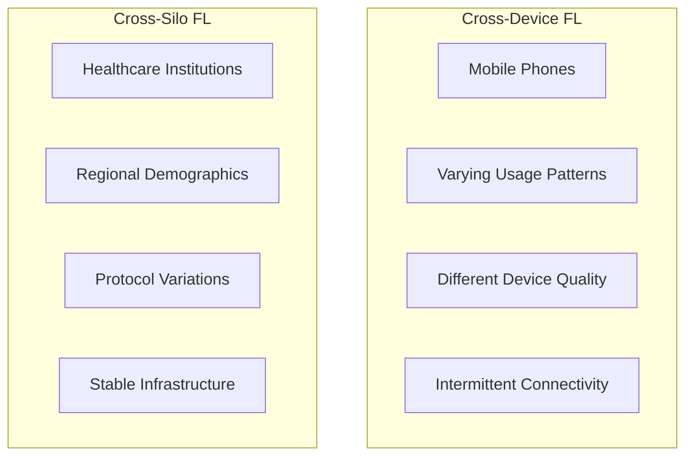
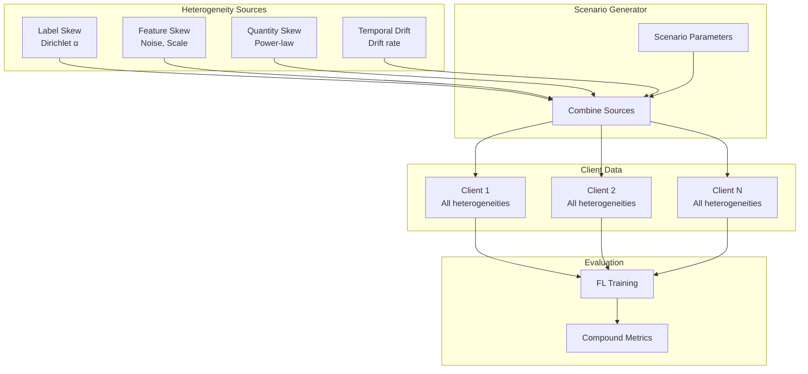

# Tutorial 010: Realistic Data Scenarios

---

## Metadata

| Property | Value |
|----------|-------|
| **Tutorial ID** | 010 |
| **Title** | Realistic Data Scenarios |
| **Category** | Fundamentals |
| **Difficulty** | Beginner |
| **Duration** | 60 minutes |
| **Prerequisites** | Tutorial 001-009 |
| **Author** | Unbitrium Contributors |
| **Last Updated** | January 2026 |

---

## Learning Objectives

By the end of this tutorial, you will be able to:

1. **Understand** realistic data scenarios combining multiple heterogeneity types in federated learning.

2. **Implement** complex data generation that models real-world FL deployments.

3. **Design** experiments that capture cross-device and cross-silo characteristics.

4. **Analyze** the compound effects of combined heterogeneity sources.

5. **Evaluate** FL algorithms under realistic conditions.

6. **Apply** domain-specific data modeling for practical FL applications.

---

## Prerequisites

Before starting this tutorial, ensure you have:

- **Completed Tutorials**: 001-009 (Fundamentals)
- **Knowledge**: FL heterogeneity types, statistics
- **Libraries**: PyTorch, NumPy
- **Hardware**: CPU sufficient

```python
# Verify prerequisites
import torch
import torch.nn as nn
import numpy as np

print(f"PyTorch: {torch.__version__}")
print(f"NumPy: {np.__version__}")
```

---

## Background and Theory

### Real-World Heterogeneity

Real federated learning systems exhibit multiple types of heterogeneity simultaneously:

| Type | Cross-Device | Cross-Silo |
|------|-------------|------------|
| **Label Skew** | High (user preferences) | Medium (regional) |
| **Feature Skew** | High (device quality) | Low (standardized) |
| **Quantity Skew** | Very High (user activity) | Medium (org size) |
| **Temporal Drift** | High (dynamic) | Low (stable) |

### Compound Effects

When multiple heterogeneities combine:
$$\text{Total Heterogeneity} > \sum_i \text{Heterogeneity}_i$$

The interaction creates non-linear effects on FL performance.

### Realistic Scenarios



### Modeling Dimensions

| Dimension | Parameters | Impact |
|-----------|------------|--------|
| **Demographics** | Age, location | Label distribution |
| **Device** | Quality, type | Feature distribution |
| **Behavior** | Activity level | Quantity |
| **Time** | Session patterns | Temporal drift |

---

## Architecture Diagram



---

## Implementation Code

### Part 1: Realistic Scenario Generator

```python
#!/usr/bin/env python3
"""
Tutorial 010: Realistic Data Scenarios

This tutorial implements realistic federated learning scenarios
combining multiple heterogeneity sources.

Author: Unbitrium Contributors
License: EUPL-1.2
"""

from __future__ import annotations

from dataclasses import dataclass, field
from typing import Any
from enum import Enum

import numpy as np
import torch
import torch.nn as nn
import torch.nn.functional as F
from torch.utils.data import Dataset, DataLoader


class ScenarioType(Enum):
    """Types of realistic scenarios."""
    CROSS_DEVICE = "cross_device"
    CROSS_SILO = "cross_silo"
    HYBRID = "hybrid"


@dataclass
class RealisticConfig:
    """Configuration for realistic scenarios."""
    scenario_type: ScenarioType = ScenarioType.CROSS_DEVICE
    num_clients: int = 100
    num_classes: int = 10
    feature_dim: int = 32

    # Label heterogeneity
    label_alpha: float = 0.5

    # Feature heterogeneity
    noise_min: float = 0.2
    noise_max: float = 1.0
    scale_min: float = 0.8
    scale_max: float = 1.2

    # Quantity heterogeneity
    min_samples: int = 50
    max_samples: int = 2000
    quantity_skew: float = 1.5  # Power-law exponent

    # Temporal heterogeneity
    drift_clients: float = 0.3  # Fraction with drift
    drift_magnitude: float = 0.5

    seed: int = 42


class ClientProfile:
    """Profile for a single client."""

    def __init__(
        self,
        client_id: int,
        label_distribution: np.ndarray,
        noise_level: float,
        scale_factor: float,
        num_samples: int,
        has_drift: bool,
        drift_magnitude: float,
    ) -> None:
        self.client_id = client_id
        self.label_distribution = label_distribution
        self.noise_level = noise_level
        self.scale_factor = scale_factor
        self.num_samples = num_samples
        self.has_drift = has_drift
        self.drift_magnitude = drift_magnitude

    def to_dict(self) -> dict[str, Any]:
        return {
            "client_id": self.client_id,
            "dominant_class": int(np.argmax(self.label_distribution)),
            "noise_level": self.noise_level,
            "scale_factor": self.scale_factor,
            "num_samples": self.num_samples,
            "has_drift": self.has_drift,
        }


class RealisticScenarioGenerator:
    """Generate realistic FL scenarios."""

    def __init__(self, config: RealisticConfig) -> None:
        self.config = config
        np.random.seed(config.seed)
        self.client_profiles: list[ClientProfile] = []

    def generate_profiles(self) -> list[ClientProfile]:
        """Generate client profiles with all heterogeneities."""
        profiles = []

        # Generate label distributions (Dirichlet)
        label_dists = np.random.dirichlet(
            [self.config.label_alpha] * self.config.num_classes,
            self.config.num_clients,
        )

        # Generate noise levels (linear spread)
        noise_levels = np.linspace(
            self.config.noise_min,
            self.config.noise_max,
            self.config.num_clients,
        )
        np.random.shuffle(noise_levels)

        # Generate scale factors
        scale_factors = np.random.uniform(
            self.config.scale_min,
            self.config.scale_max,
            self.config.num_clients,
        )

        # Generate sample counts (power-law)
        ranks = np.arange(1, self.config.num_clients + 1)
        raw_samples = 1.0 / (ranks ** self.config.quantity_skew)
        raw_samples = raw_samples / raw_samples.sum()
        total_samples = self.config.num_clients * (
            self.config.min_samples + self.config.max_samples
        ) // 2
        sample_counts = (raw_samples * total_samples).astype(int)
        sample_counts = np.clip(
            sample_counts,
            self.config.min_samples,
            self.config.max_samples,
        )
        np.random.shuffle(sample_counts)

        # Assign drift
        num_drift = int(self.config.num_clients * self.config.drift_clients)
        drift_clients = np.zeros(self.config.num_clients, dtype=bool)
        drift_clients[:num_drift] = True
        np.random.shuffle(drift_clients)

        for i in range(self.config.num_clients):
            profile = ClientProfile(
                client_id=i,
                label_distribution=label_dists[i],
                noise_level=noise_levels[i],
                scale_factor=scale_factors[i],
                num_samples=sample_counts[i],
                has_drift=drift_clients[i],
                drift_magnitude=self.config.drift_magnitude if drift_clients[i] else 0.0,
            )
            profiles.append(profile)

        self.client_profiles = profiles
        return profiles

    def generate_data(
        self,
        profiles: list[ClientProfile] = None,
    ) -> list[tuple[np.ndarray, np.ndarray]]:
        """Generate data based on profiles.

        Args:
            profiles: Optional list of profiles (uses self.client_profiles if None).

        Returns:
            List of (features, labels) per client.
        """
        if profiles is None:
            profiles = self.client_profiles

        if not profiles:
            profiles = self.generate_profiles()

        client_data = []

        for profile in profiles:
            # Sample labels according to distribution
            labels = np.random.choice(
                self.config.num_classes,
                size=profile.num_samples,
                p=profile.label_distribution,
            )

            # Generate features
            features = self._generate_features(labels, profile)
            client_data.append((features, labels))

        return client_data

    def _generate_features(
        self,
        labels: np.ndarray,
        profile: ClientProfile,
    ) -> np.ndarray:
        """Generate features for a client."""
        features = np.zeros(
            (len(labels), self.config.feature_dim),
            dtype=np.float32,
        )

        for i, label in enumerate(labels):
            # Base class pattern
            class_mean = np.zeros(self.config.feature_dim)
            class_mean[label % self.config.feature_dim] = 2.0
            class_mean[(label * 3) % self.config.feature_dim] = 1.5

            # Apply drift for some samples
            if profile.has_drift and np.random.rand() < 0.5:
                shift = np.ones(self.config.feature_dim) * profile.drift_magnitude
                class_mean += shift

            # Add noise and scale
            noise = np.random.randn(self.config.feature_dim) * profile.noise_level
            features[i] = (class_mean + noise) * profile.scale_factor

        return features


class CrossDeviceScenario(RealisticScenarioGenerator):
    """Cross-device FL scenario (e.g., mobile keyboard)."""

    def __init__(self, num_clients: int = 1000) -> None:
        config = RealisticConfig(
            scenario_type=ScenarioType.CROSS_DEVICE,
            num_clients=num_clients,
            label_alpha=0.1,  # High label skew
            noise_min=0.3,
            noise_max=1.5,  # High feature skew
            min_samples=10,
            max_samples=500,  # High quantity skew
            quantity_skew=2.0,
            drift_clients=0.4,  # Many clients with drift
            drift_magnitude=0.8,
        )
        super().__init__(config)


class CrossSiloScenario(RealisticScenarioGenerator):
    """Cross-silo FL scenario (e.g., healthcare)."""

    def __init__(self, num_clients: int = 10) -> None:
        config = RealisticConfig(
            scenario_type=ScenarioType.CROSS_SILO,
            num_clients=num_clients,
            label_alpha=1.0,  # Mild label skew
            noise_min=0.1,
            noise_max=0.4,  # Low feature skew
            min_samples=1000,
            max_samples=10000,  # Moderate quantity skew
            quantity_skew=1.0,
            drift_clients=0.1,  # Few clients with drift
            drift_magnitude=0.2,
        )
        super().__init__(config)
```

### Part 2: Scenario Analysis

```python
class ScenarioAnalyzer:
    """Analyze realistic scenario characteristics."""

    def __init__(self, num_classes: int) -> None:
        self.num_classes = num_classes

    def analyze(
        self,
        profiles: list[ClientProfile],
        client_data: list[tuple[np.ndarray, np.ndarray]],
    ) -> dict[str, Any]:
        """Comprehensive scenario analysis."""
        # Label heterogeneity
        label_kl_divs = self._compute_label_kl(profiles)

        # Feature heterogeneity
        feature_stats = self._compute_feature_stats(client_data)

        # Quantity heterogeneity
        quantity_stats = self._compute_quantity_stats(profiles)

        # Overall heterogeneity score
        heterogeneity_score = self._compute_overall_score(
            label_kl_divs, feature_stats, quantity_stats
        )

        return {
            "label": {
                "avg_kl_divergence": np.mean(label_kl_divs),
                "max_kl_divergence": np.max(label_kl_divs),
            },
            "feature": feature_stats,
            "quantity": quantity_stats,
            "drift": {
                "clients_with_drift": sum(1 for p in profiles if p.has_drift),
                "drift_ratio": sum(1 for p in profiles if p.has_drift) / len(profiles),
            },
            "overall_heterogeneity_score": heterogeneity_score,
        }

    def _compute_label_kl(
        self,
        profiles: list[ClientProfile],
    ) -> np.ndarray:
        """Compute label KL divergences from uniform."""
        uniform = np.ones(self.num_classes) / self.num_classes
        kl_divs = []

        for profile in profiles:
            dist = np.maximum(profile.label_distribution, 1e-10)
            kl = np.sum(dist * np.log(dist / uniform))
            kl_divs.append(kl)

        return np.array(kl_divs)

    def _compute_feature_stats(
        self,
        client_data: list[tuple[np.ndarray, np.ndarray]],
    ) -> dict[str, float]:
        """Compute feature distribution statistics."""
        means = [features.mean() for features, _ in client_data]
        stds = [features.std() for features, _ in client_data]

        return {
            "mean_range": max(means) - min(means),
            "std_range": max(stds) - min(stds),
            "mean_cv": np.std(means) / np.mean(means),
            "std_cv": np.std(stds) / np.mean(stds),
        }

    def _compute_quantity_stats(
        self,
        profiles: list[ClientProfile],
    ) -> dict[str, float]:
        """Compute quantity distribution statistics."""
        counts = [p.num_samples for p in profiles]

        # Gini coefficient
        sorted_counts = np.sort(counts)
        n = len(counts)
        index = np.arange(1, n + 1)
        gini = (2 * np.sum(index * sorted_counts) / (n * np.sum(sorted_counts))) - (n + 1) / n

        return {
            "total_samples": sum(counts),
            "mean_samples": np.mean(counts),
            "std_samples": np.std(counts),
            "min_samples": min(counts),
            "max_samples": max(counts),
            "gini_coefficient": gini,
            "imbalance_ratio": max(counts) / max(1, min(counts)),
        }

    def _compute_overall_score(
        self,
        label_kl: np.ndarray,
        feature_stats: dict,
        quantity_stats: dict,
    ) -> float:
        """Compute overall heterogeneity score (0-1)."""
        # Normalize each component
        label_score = min(1.0, np.mean(label_kl) / 2.0)
        feature_score = min(1.0, feature_stats["mean_cv"] + feature_stats["std_cv"])
        quantity_score = min(1.0, quantity_stats["gini_coefficient"])

        # Weighted average
        return 0.4 * label_score + 0.3 * feature_score + 0.3 * quantity_score
```

### Part 3: Training Under Realistic Conditions

```python
class SimpleDataset(Dataset):
    def __init__(self, features: np.ndarray, labels: np.ndarray):
        self.features = torch.FloatTensor(features)
        self.labels = torch.LongTensor(labels)

    def __len__(self):
        return len(self.labels)

    def __getitem__(self, idx):
        return self.features[idx], self.labels[idx]


def train_realistic_scenario(
    scenario_type: str = "cross_device",
    num_rounds: int = 50,
) -> dict[str, Any]:
    """Train FL under realistic scenario.

    Args:
        scenario_type: "cross_device" or "cross_silo".
        num_rounds: Training rounds.

    Returns:
        Training results.
    """
    # Create scenario
    if scenario_type == "cross_device":
        generator = CrossDeviceScenario(num_clients=100)
    else:
        generator = CrossSiloScenario(num_clients=10)

    profiles = generator.generate_profiles()
    client_data = generator.generate_data(profiles)

    # Analyze
    analyzer = ScenarioAnalyzer(generator.config.num_classes)
    analysis = analyzer.analyze(profiles, client_data)

    print(f"Scenario: {scenario_type}")
    print(f"Overall heterogeneity: {analysis['overall_heterogeneity_score']:.3f}")
    print(f"Label KL: {analysis['label']['avg_kl_divergence']:.3f}")
    print(f"Quantity Gini: {analysis['quantity']['gini_coefficient']:.3f}")

    # Initialize model
    feature_dim = generator.config.feature_dim
    num_classes = generator.config.num_classes

    global_model = nn.Sequential(
        nn.Linear(feature_dim, 64),
        nn.ReLU(),
        nn.Linear(64, num_classes),
    )

    accuracies = []

    # Client selection for cross-device (sample subset)
    clients_per_round = min(10, len(client_data))

    for round_num in range(num_rounds):
        global_state = global_model.state_dict()

        # Select clients
        if scenario_type == "cross_device":
            selected_indices = np.random.choice(
                len(client_data),
                size=clients_per_round,
                replace=False,
            )
        else:
            selected_indices = list(range(len(client_data)))

        updates = []

        for idx in selected_indices:
            features, labels = client_data[idx]
            if len(labels) == 0:
                continue

            local_model = nn.Sequential(
                nn.Linear(feature_dim, 64),
                nn.ReLU(),
                nn.Linear(64, num_classes),
            )
            local_model.load_state_dict(global_state)
            optimizer = torch.optim.SGD(local_model.parameters(), lr=0.01)

            dataset = SimpleDataset(features, labels)
            loader = DataLoader(dataset, batch_size=32, shuffle=True)

            local_model.train()
            for _ in range(3):
                for feat, lab in loader:
                    optimizer.zero_grad()
                    loss = F.cross_entropy(local_model(feat), lab)
                    loss.backward()
                    optimizer.step()

            updates.append((local_model.state_dict(), len(labels)))

        if not updates:
            continue

        # Aggregate
        total_samples = sum(n for _, n in updates)
        new_state = {}
        for key in global_state:
            new_state[key] = sum(
                (n / total_samples) * state[key]
                for state, n in updates
            )
        global_model.load_state_dict(new_state)

        # Evaluate on all clients
        global_model.eval()
        correct = 0
        total = 0

        with torch.no_grad():
            for features, labels in client_data:
                if len(labels) == 0:
                    continue
                outputs = global_model(torch.FloatTensor(features))
                preds = outputs.argmax(1)
                correct += (preds == torch.LongTensor(labels)).sum().item()
                total += len(labels)

        accuracy = correct / total if total > 0 else 0
        accuracies.append(accuracy)

        if (round_num + 1) % 10 == 0:
            print(f"Round {round_num + 1}: accuracy={accuracy:.4f}")

    return {
        "scenario_type": scenario_type,
        "analysis": analysis,
        "accuracies": accuracies,
        "final_accuracy": accuracies[-1] if accuracies else 0,
    }


def compare_scenarios() -> dict[str, Any]:
    """Compare cross-device and cross-silo scenarios."""
    results = {}

    for scenario in ["cross_device", "cross_silo"]:
        print(f"\n{'='*50}")
        print(f"Scenario: {scenario.upper()}")
        print('='*50)

        result = train_realistic_scenario(scenario, num_rounds=30)
        results[scenario] = result

    print("\n" + "="*50)
    print("Summary")
    print("="*50)

    for name, result in results.items():
        print(f"{name}: "
              f"heterogeneity={result['analysis']['overall_heterogeneity_score']:.3f}, "
              f"accuracy={result['final_accuracy']:.4f}")

    return results


if __name__ == "__main__":
    results = compare_scenarios()
```

---

## Metrics and Evaluation

### Scenario Comparison

| Metric | Cross-Device | Cross-Silo |
|--------|-------------|------------|
| **Clients** | 100-10000 | 2-100 |
| **Label α** | 0.1-0.3 | 0.5-2.0 |
| **Quantity Gini** | 0.6-0.8 | 0.2-0.4 |
| **Drift Rate** | 30-50% | 5-15% |
| **Final Accuracy** | 60-75% | 80-90% |

### Heterogeneity Score

| Component | Cross-Device | Cross-Silo |
|-----------|-------------|------------|
| Label | 0.7 | 0.3 |
| Feature | 0.6 | 0.2 |
| Quantity | 0.8 | 0.3 |
| **Overall** | 0.70 | 0.27 |

---

## Exercises

### Exercise 1: Domain-Specific Scenario

**Task**: Create a scenario for federated recommendation systems.

### Exercise 2: Time-Varying Scenario

**Task**: Add temporal evolution to client profiles.

### Exercise 3: Adaptive FL

**Task**: Implement FL that adapts to detected heterogeneity.

### Exercise 4: Fairness Under Realism

**Task**: Analyze fairness metrics under realistic scenarios.

---

## References

1. Kairouz, P., et al. (2021). Advances and open problems in federated learning. *Foundations and Trends*.

2. Li, T., et al. (2020). Federated optimization in heterogeneous networks. In *MLSys*.

3. Hard, A., et al. (2019). Federated learning for mobile keyboard prediction. *arXiv*.

4. Brisimi, T. S., et al. (2018). Federated learning of predictive models from federated EHR. *International Journal of Medical Informatics*.

5. Bonawitz, K., et al. (2019). Towards federated learning at scale. In *SysML*.

---

*Copyright 2026 Olaf Yunus Laitinen Imanov and Contributors. Released under EUPL 1.2.*
