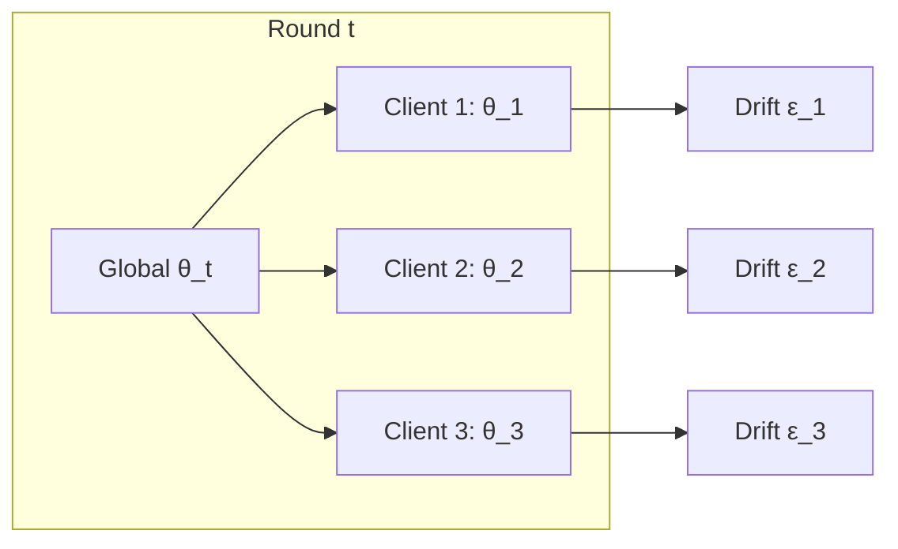
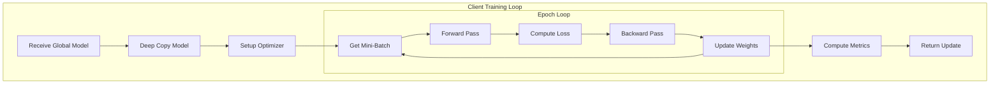

# Tutorial 012: Client-Side Local Training

---

## Metadata

| Property | Value |
|----------|-------|
| **Tutorial ID** | 012 |
| **Title** | Client-Side Local Training |
| **Category** | Core Algorithms |
| **Difficulty** | Intermediate |
| **Duration** | 75 minutes |
| **Prerequisites** | Tutorial 001-011 |
| **Author** | Unbitrium Contributors |
| **Last Updated** | January 2026 |

---

## Learning Objectives

By the end of this tutorial, you will be able to:

1. **Understand** the local training process in federated learning including mini-batch SGD and gradient computation.

2. **Implement** efficient client-side training loops with proper memory management.

3. **Configure** local training parameters including epochs, batch size, and optimizer settings.

4. **Analyze** the trade-offs between local computation and global convergence.

5. **Debug** local training issues including gradient explosion, vanishing gradients, and overfitting.

6. **Optimize** client training for resource-constrained devices.

---

## Prerequisites

Before starting this tutorial, ensure you have:

- **Completed Tutorials**: 001-011 (Fundamentals and FedAvg)
- **Knowledge**: Gradient descent, backpropagation
- **Libraries**: PyTorch, NumPy
- **Hardware**: CPU sufficient

```python
# Verify prerequisites
import torch
import torch.nn as nn
import numpy as np

print(f"PyTorch: {torch.__version__}")
print(f"CUDA available: {torch.cuda.is_available()}")
```

---

## Background and Theory

### Local Training in FL

Each client performs local SGD updates:

$$\theta_k^{(t, e+1)} = \theta_k^{(t, e)} - \eta \nabla F_k(\theta_k^{(t, e)}; \xi)$$

where:
- $t$ is the global round
- $e$ is the local epoch
- $\xi$ is a mini-batch

### Local Updates Per Round

For E local epochs with B batch size on n_k samples:

**Updates per round**: $\tau = E \times \lceil n_k / B \rceil$

### Trade-offs

| More Local Epochs | Fewer Local Epochs |
|------------------|-------------------|
| ✓ Less communication | ✗ More communication |
| ✗ Client drift | ✓ Better alignment |
| ✓ Faster per round | ✗ Slower per round |
| ✗ May overfit locally | ✓ Better generalization |

### Client Drift Problem



With more local epochs, clients drift further from optimal.

---

## Architecture Diagram



---

## Implementation Code

### Part 1: Training Utilities

```python
#!/usr/bin/env python3
"""
Tutorial 012: Client-Side Local Training

This tutorial provides detailed implementation of client-side
local training with optimization techniques.

Author: Unbitrium Contributors
License: EUPL-1.2
"""

from __future__ import annotations

import copy
import time
from dataclasses import dataclass, field
from typing import Any, Optional, Callable

import numpy as np
import torch
import torch.nn as nn
import torch.nn.functional as F
from torch.utils.data import Dataset, DataLoader


@dataclass
class LocalTrainingConfig:
    """Configuration for local training."""
    local_epochs: int = 5
    batch_size: int = 32
    learning_rate: float = 0.01
    momentum: float = 0.9
    weight_decay: float = 1e-4
    max_grad_norm: float = 10.0  # Gradient clipping
    early_stopping_patience: int = 0  # 0 = disabled
    use_mixed_precision: bool = False
    log_interval: int = 10


@dataclass
class TrainingMetrics:
    """Metrics collected during training."""
    epochs_completed: int = 0
    total_batches: int = 0
    total_loss: float = 0.0
    total_correct: int = 0
    total_samples: int = 0
    training_time: float = 0.0
    gradient_norms: list = field(default_factory=list)
    loss_history: list = field(default_factory=list)

    @property
    def avg_loss(self) -> float:
        return self.total_loss / max(1, self.total_batches)

    @property
    def accuracy(self) -> float:
        return self.total_correct / max(1, self.total_samples)


class SimpleDataset(Dataset):
    """Dataset wrapper for training."""

    def __init__(self, features: np.ndarray, labels: np.ndarray) -> None:
        self.features = torch.FloatTensor(features)
        self.labels = torch.LongTensor(labels)

    def __len__(self) -> int:
        return len(self.labels)

    def __getitem__(self, idx: int) -> tuple[torch.Tensor, torch.Tensor]:
        return self.features[idx], self.labels[idx]
```

### Part 2: Advanced Local Trainer

```python
class LocalTrainer:
    """Advanced local trainer with optimization features."""

    def __init__(
        self,
        config: LocalTrainingConfig,
        device: torch.device = None,
    ) -> None:
        self.config = config
        self.device = device or torch.device("cpu")
        
        # Mixed precision scaler
        self.scaler = None
        if config.use_mixed_precision and torch.cuda.is_available():
            self.scaler = torch.cuda.amp.GradScaler()

    def create_optimizer(
        self,
        model: nn.Module,
    ) -> torch.optim.Optimizer:
        """Create optimizer for model."""
        return torch.optim.SGD(
            model.parameters(),
            lr=self.config.learning_rate,
            momentum=self.config.momentum,
            weight_decay=self.config.weight_decay,
        )

    def compute_gradient_norm(self, model: nn.Module) -> float:
        """Compute total gradient norm."""
        total_norm = 0.0
        for p in model.parameters():
            if p.grad is not None:
                param_norm = p.grad.data.norm(2)
                total_norm += param_norm.item() ** 2
        return total_norm ** 0.5

    def clip_gradients(self, model: nn.Module) -> float:
        """Clip gradients and return norm."""
        return torch.nn.utils.clip_grad_norm_(
            model.parameters(),
            self.config.max_grad_norm,
        )

    def train_epoch(
        self,
        model: nn.Module,
        dataloader: DataLoader,
        optimizer: torch.optim.Optimizer,
        metrics: TrainingMetrics,
    ) -> float:
        """Train for one epoch."""
        model.train()
        epoch_loss = 0.0

        for batch_idx, (features, labels) in enumerate(dataloader):
            features = features.to(self.device)
            labels = labels.to(self.device)

            optimizer.zero_grad()

            # Forward pass (with optional mixed precision)
            if self.scaler is not None:
                with torch.cuda.amp.autocast():
                    outputs = model(features)
                    loss = F.cross_entropy(outputs, labels)
                
                self.scaler.scale(loss).backward()
                self.scaler.unscale_(optimizer)
                grad_norm = self.clip_gradients(model)
                self.scaler.step(optimizer)
                self.scaler.update()
            else:
                outputs = model(features)
                loss = F.cross_entropy(outputs, labels)
                loss.backward()
                grad_norm = self.clip_gradients(model)
                optimizer.step()

            # Update metrics
            batch_loss = loss.item()
            epoch_loss += batch_loss
            metrics.total_loss += batch_loss
            metrics.total_batches += 1
            metrics.gradient_norms.append(grad_norm)

            # Compute accuracy
            preds = outputs.argmax(dim=1)
            metrics.total_correct += (preds == labels).sum().item()
            metrics.total_samples += labels.size(0)

        metrics.epochs_completed += 1
        return epoch_loss / len(dataloader)

    def train(
        self,
        model: nn.Module,
        dataset: Dataset,
        initial_state: dict = None,
    ) -> tuple[dict, TrainingMetrics]:
        """Perform complete local training.

        Args:
            model: Model to train.
            dataset: Training dataset.
            initial_state: Optional initial state dict.

        Returns:
            Tuple of (updated state_dict, metrics).
        """
        # Deep copy model to avoid modifying original
        local_model = copy.deepcopy(model).to(self.device)
        
        if initial_state is not None:
            local_model.load_state_dict(initial_state)

        # Setup training
        dataloader = DataLoader(
            dataset,
            batch_size=self.config.batch_size,
            shuffle=True,
            drop_last=False,
        )
        
        optimizer = self.create_optimizer(local_model)
        metrics = TrainingMetrics()

        # Training loop
        start_time = time.time()
        best_loss = float('inf')
        patience_counter = 0

        for epoch in range(self.config.local_epochs):
            epoch_loss = self.train_epoch(
                local_model, dataloader, optimizer, metrics
            )
            metrics.loss_history.append(epoch_loss)

            # Early stopping check
            if self.config.early_stopping_patience > 0:
                if epoch_loss < best_loss:
                    best_loss = epoch_loss
                    patience_counter = 0
                else:
                    patience_counter += 1
                    if patience_counter >= self.config.early_stopping_patience:
                        break

        metrics.training_time = time.time() - start_time

        # Return updated state
        updated_state = {
            k: v.cpu() for k, v in local_model.state_dict().items()
        }

        return updated_state, metrics
```

### Part 3: Federated Client with Local Training

```python
class FederatedClient:
    """Complete federated learning client."""

    def __init__(
        self,
        client_id: int,
        dataset: Dataset,
        trainer: LocalTrainer,
    ) -> None:
        self.client_id = client_id
        self.dataset = dataset
        self.trainer = trainer
        self.training_history: list[TrainingMetrics] = []

    @property
    def num_samples(self) -> int:
        return len(self.dataset)

    def train(
        self,
        global_model: nn.Module,
        round_num: int = 0,
    ) -> dict[str, Any]:
        """Perform local training round.

        Args:
            global_model: Current global model.
            round_num: Current round number.

        Returns:
            Client update dictionary.
        """
        # Perform local training
        updated_state, metrics = self.trainer.train(
            global_model,
            self.dataset,
        )

        self.training_history.append(metrics)

        return {
            "state_dict": updated_state,
            "num_samples": self.num_samples,
            "client_id": self.client_id,
            "metrics": {
                "loss": metrics.avg_loss,
                "accuracy": metrics.accuracy,
                "epochs": metrics.epochs_completed,
                "training_time": metrics.training_time,
                "avg_grad_norm": np.mean(metrics.gradient_norms),
            },
        }

    def get_training_summary(self) -> dict[str, Any]:
        """Get summary of all training rounds."""
        if not self.training_history:
            return {}

        losses = [m.avg_loss for m in self.training_history]
        accuracies = [m.accuracy for m in self.training_history]
        times = [m.training_time for m in self.training_history]

        return {
            "total_rounds": len(self.training_history),
            "avg_loss": np.mean(losses),
            "avg_accuracy": np.mean(accuracies),
            "total_training_time": sum(times),
        }


class OptimizedLocalTrainer(LocalTrainer):
    """Optimized trainer for resource-constrained devices."""

    def __init__(
        self,
        config: LocalTrainingConfig,
        device: torch.device = None,
        max_memory_mb: float = 512,
    ) -> None:
        super().__init__(config, device)
        self.max_memory_mb = max_memory_mb

    def estimate_batch_size(
        self,
        model: nn.Module,
        sample_input: torch.Tensor,
    ) -> int:
        """Estimate optimal batch size given memory constraints."""
        # Simplified estimation
        model_size_mb = sum(
            p.numel() * p.element_size()
            for p in model.parameters()
        ) / (1024 * 1024)

        # Reserve 4x model size for gradients and activations
        available_mb = self.max_memory_mb - 4 * model_size_mb
        sample_size_mb = sample_input.numel() * sample_input.element_size() / (1024 * 1024)

        estimated_batch = int(available_mb / (sample_size_mb * 10))  # 10x for safety
        return max(1, min(estimated_batch, self.config.batch_size))

    def train(
        self,
        model: nn.Module,
        dataset: Dataset,
        initial_state: dict = None,
    ) -> tuple[dict, TrainingMetrics]:
        """Memory-aware training."""
        # Adjust batch size if needed
        sample = dataset[0][0]
        optimal_batch = self.estimate_batch_size(model, sample)
        
        if optimal_batch < self.config.batch_size:
            self.config.batch_size = optimal_batch

        return super().train(model, dataset, initial_state)
```

### Part 4: Training Analysis

```python
def analyze_local_training_impact(
    num_clients: int = 10,
    local_epochs_list: list[int] = [1, 5, 10, 20],
    num_rounds: int = 30,
) -> dict[str, Any]:
    """Analyze impact of local epochs on training."""
    results = {}

    for local_epochs in local_epochs_list:
        print(f"\nTraining with E={local_epochs} local epochs")
        
        config = LocalTrainingConfig(
            local_epochs=local_epochs,
            batch_size=32,
            learning_rate=0.01,
        )

        # Generate data
        np.random.seed(42)
        feature_dim = 32
        num_classes = 10
        
        # Create model
        model = nn.Sequential(
            nn.Linear(feature_dim, 64),
            nn.ReLU(),
            nn.Linear(64, num_classes),
        )

        # Create clients
        trainer = LocalTrainer(config)
        clients = []
        
        for i in range(num_clients):
            n_samples = np.random.randint(50, 200)
            features = np.random.randn(n_samples, feature_dim).astype(np.float32)
            labels = np.random.randint(0, num_classes, n_samples)
            dataset = SimpleDataset(features, labels)
            clients.append(FederatedClient(i, dataset, trainer))

        # Training loop
        accuracies = []
        
        for round_num in range(num_rounds):
            global_state = model.state_dict()
            updates = []

            for client in clients:
                update = client.train(model, round_num)
                updates.append(update)

            # Aggregate
            total_samples = sum(u["num_samples"] for u in updates)
            new_state = {}
            for key in global_state:
                new_state[key] = sum(
                    (u["num_samples"] / total_samples) * u["state_dict"][key]
                    for u in updates
                )
            model.load_state_dict(new_state)

            # Evaluate
            avg_acc = np.mean([u["metrics"]["accuracy"] for u in updates])
            accuracies.append(avg_acc)

        results[f"E={local_epochs}"] = {
            "accuracies": accuracies,
            "final_accuracy": accuracies[-1],
            "convergence_round": next(
                (i for i, a in enumerate(accuracies) if a > 0.7),
                num_rounds
            ),
        }

        print(f"Final accuracy: {accuracies[-1]:.4f}")

    return results


if __name__ == "__main__":
    results = analyze_local_training_impact()
    
    print("\nSummary:")
    for name, data in results.items():
        print(f"{name}: final_acc={data['final_accuracy']:.4f}, "
              f"converge_at={data['convergence_round']}")
```

---

## Metrics and Evaluation

### Local Training Metrics

| Metric | Description | Healthy Range |
|--------|-------------|---------------|
| **Loss** | Cross-entropy loss | Decreasing |
| **Gradient Norm** | L2 norm of gradients | 0.1 - 10 |
| **Training Time** | Seconds per round | Device-dependent |

### Local Epochs Impact

| E | Convergence | Client Drift | Accuracy |
|---|-------------|--------------|----------|
| 1 | Slow | Low | Medium |
| 5 | Medium | Medium | High |
| 20 | Fast initially | High | Variable |

---

## Exercises

### Exercise 1: Adaptive Local Epochs

**Task**: Implement adaptive local epochs based on local loss.

### Exercise 2: Layer-wise Learning Rates

**Task**: Use different learning rates for different layers.

### Exercise 3: Regularization Techniques

**Task**: Add local regularization to prevent overfitting.

### Exercise 4: Resource Monitoring

**Task**: Implement CPU/memory monitoring during training.

---

## References

1. McMahan, B., et al. (2017). Communication-efficient learning of deep networks from decentralized data. In *AISTATS*.

2. Li, T., et al. (2020). On the convergence of FedAvg on non-IID data. In *ICLR*.

3. Karimireddy, S. P., et al. (2020). SCAFFOLD: Stochastic controlled averaging. In *ICML*.

4. Wang, J., et al. (2020). Tackling the objective inconsistency problem. In *NeurIPS*.

5. Charles, Z., et al. (2021). On large-cohort training for federated learning. In *NeurIPS*.

---

*Copyright 2026 Olaf Yunus Laitinen Imanov and Contributors. Released under EUPL 1.2.*
