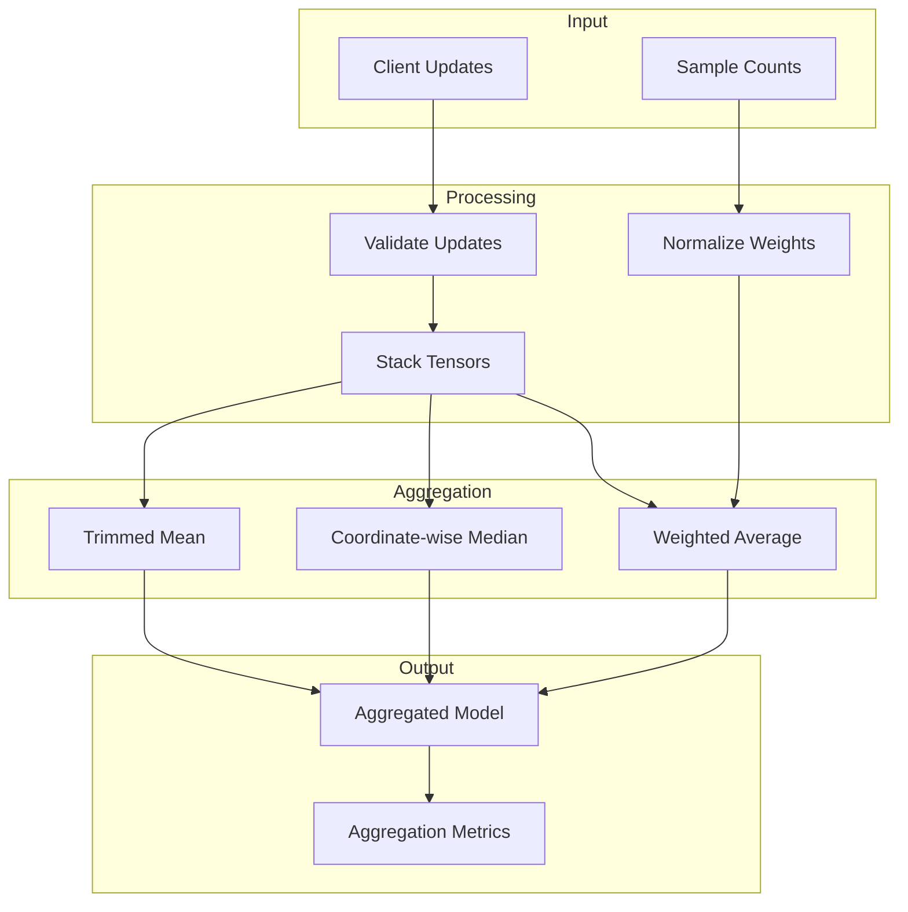

# Tutorial 013: Server-Side Aggregation

---

## Metadata

| Property | Value |
|----------|-------|
| **Tutorial ID** | 013 |
| **Title** | Server-Side Aggregation |
| **Category** | Core Algorithms |
| **Difficulty** | Intermediate |
| **Duration** | 75 minutes |
| **Prerequisites** | Tutorial 001-012 |
| **Author** | Unbitrium Contributors |
| **Last Updated** | January 2026 |

---

## Learning Objectives

By the end of this tutorial, you will be able to:

1. **Understand** server-side aggregation strategies including weighted averaging, median, and trimmed mean.

2. **Implement** various aggregation functions with proper tensor handling and numerical stability.

3. **Configure** aggregation parameters for different federated learning scenarios.

4. **Analyze** the robustness of aggregation methods against byzantine clients.

5. **Debug** common aggregation issues including numerical overflow and weight imbalance.

6. **Design** custom aggregation strategies for specific application requirements.

---

## Prerequisites

Before starting this tutorial, ensure you have:

- **Completed Tutorials**: 001-012 (Core algorithms)
- **Knowledge**: Linear algebra, statistics
- **Libraries**: PyTorch, NumPy
- **Hardware**: CPU sufficient

```python
# Verify prerequisites
import torch
import torch.nn as nn
import numpy as np

print(f"PyTorch: {torch.__version__}")
print(f"NumPy: {np.__version__}")
```

---

## Background and Theory

### Aggregation in Federated Learning

The server aggregates client updates to form the global model:

$$\theta_{t+1} = \text{Aggregate}(\{\theta_k^{t+1}\}_{k \in S_t})$$

### Common Aggregation Functions

| Method | Formula | Robustness |
|--------|---------|------------|
| **FedAvg** | $\sum_k w_k \theta_k$ | Low |
| **Median** | $\text{median}(\{\theta_k\})$ | High |
| **Trimmed Mean** | Mean after removing extremes | Medium |
| **Krum** | Select most representative | High |

### Weighted Averaging (FedAvg)

$$\theta_{t+1} = \sum_{k \in S_t} \frac{n_k}{\sum_{j \in S_t} n_j} \theta_k^{t+1}$$

### Byzantine-Resilient Aggregation

```mermaid
graph TB
    subgraph "Client Updates"
        U1[θ₁: Normal]
        U2[θ₂: Normal]
        U3[θ₃: Byzantine]
        U4[θ₄: Normal]
    end

    subgraph "Aggregation"
        FILTER[Byzantine Filter]
        AGG[Robust Aggregation]
    end

    subgraph "Output"
        GLOBAL[θ_{t+1}]
    end

    U1 --> FILTER
    U2 --> FILTER
    U3 --> FILTER
    U4 --> FILTER
    FILTER --> AGG
    AGG --> GLOBAL
```

---

## Architecture Diagram



---

## Implementation Code

### Part 1: Base Aggregator Interface

```python
#!/usr/bin/env python3
"""
Tutorial 013: Server-Side Aggregation

This tutorial implements various server-side aggregation
strategies for federated learning.

Author: Unbitrium Contributors
License: EUPL-1.2
"""

from __future__ import annotations

from abc import ABC, abstractmethod
from dataclasses import dataclass, field
from typing import Any, Optional

import numpy as np
import torch
import torch.nn as nn


@dataclass
class AggregationResult:
    """Result of aggregation operation."""
    state_dict: dict[str, torch.Tensor]
    num_clients: int
    total_samples: int
    metrics: dict = field(default_factory=dict)


class Aggregator(ABC):
    """Base class for aggregation strategies."""

    @abstractmethod
    def aggregate(
        self,
        updates: list[dict[str, Any]],
    ) -> AggregationResult:
        """Aggregate client updates.

        Args:
            updates: List of client update dictionaries with
                'state_dict' and 'num_samples' keys.

        Returns:
            Aggregation result.
        """
        pass

    def validate_updates(
        self,
        updates: list[dict[str, Any]],
    ) -> list[dict[str, Any]]:
        """Validate client updates."""
        valid = []
        for update in updates:
            if "state_dict" not in update:
                continue
            if "num_samples" not in update:
                update["num_samples"] = 1
            if update["num_samples"] > 0:
                valid.append(update)
        return valid


class FedAvgAggregator(Aggregator):
    """Federated Averaging aggregator."""

    def aggregate(
        self,
        updates: list[dict[str, Any]],
    ) -> AggregationResult:
        """Aggregate using weighted averaging."""
        updates = self.validate_updates(updates)
        
        if not updates:
            raise ValueError("No valid updates to aggregate")

        # Compute weights
        total_samples = sum(u["num_samples"] for u in updates)
        weights = [u["num_samples"] / total_samples for u in updates]

        # Get reference state
        reference_state = updates[0]["state_dict"]
        aggregated_state = {}

        for key in reference_state.keys():
            # Stack all updates for this parameter
            stacked = torch.stack([
                u["state_dict"][key].float()
                for u in updates
            ])
            
            # Weighted average
            weight_tensor = torch.tensor(weights, dtype=torch.float32)
            weight_tensor = weight_tensor.view(-1, *([1] * (stacked.dim() - 1)))
            aggregated_state[key] = (stacked * weight_tensor).sum(dim=0)

        return AggregationResult(
            state_dict=aggregated_state,
            num_clients=len(updates),
            total_samples=total_samples,
            metrics={"weights": weights},
        )
```

### Part 2: Robust Aggregators

```python
class MedianAggregator(Aggregator):
    """Coordinate-wise median aggregator (Byzantine-resilient)."""

    def aggregate(
        self,
        updates: list[dict[str, Any]],
    ) -> AggregationResult:
        """Aggregate using coordinate-wise median."""
        updates = self.validate_updates(updates)
        
        if not updates:
            raise ValueError("No valid updates to aggregate")

        reference_state = updates[0]["state_dict"]
        aggregated_state = {}
        total_samples = sum(u["num_samples"] for u in updates)

        for key in reference_state.keys():
            stacked = torch.stack([
                u["state_dict"][key].float()
                for u in updates
            ])
            
            # Coordinate-wise median
            aggregated_state[key] = torch.median(stacked, dim=0).values

        return AggregationResult(
            state_dict=aggregated_state,
            num_clients=len(updates),
            total_samples=total_samples,
            metrics={"method": "median"},
        )


class TrimmedMeanAggregator(Aggregator):
    """Trimmed mean aggregator (removes extremes)."""

    def __init__(self, trim_ratio: float = 0.1) -> None:
        """Initialize trimmed mean aggregator.

        Args:
            trim_ratio: Fraction to trim from each end (0.1 = 10%).
        """
        self.trim_ratio = trim_ratio

    def aggregate(
        self,
        updates: list[dict[str, Any]],
    ) -> AggregationResult:
        """Aggregate using trimmed mean."""
        updates = self.validate_updates(updates)
        
        if not updates:
            raise ValueError("No valid updates to aggregate")

        n = len(updates)
        k = int(n * self.trim_ratio)  # Number to trim from each end
        
        if 2 * k >= n:
            k = max(0, n // 2 - 1)

        reference_state = updates[0]["state_dict"]
        aggregated_state = {}
        total_samples = sum(u["num_samples"] for u in updates)

        for key in reference_state.keys():
            stacked = torch.stack([
                u["state_dict"][key].float()
                for u in updates
            ])
            
            if k > 0:
                # Sort and trim
                sorted_vals, _ = torch.sort(stacked, dim=0)
                trimmed = sorted_vals[k:n-k]
                aggregated_state[key] = trimmed.mean(dim=0)
            else:
                aggregated_state[key] = stacked.mean(dim=0)

        return AggregationResult(
            state_dict=aggregated_state,
            num_clients=len(updates),
            total_samples=total_samples,
            metrics={"trim_ratio": self.trim_ratio, "trimmed_count": 2 * k},
        )


class KrumAggregator(Aggregator):
    """Krum aggregator (selects most representative update)."""

    def __init__(self, num_byzantine: int = 0) -> None:
        """Initialize Krum aggregator.

        Args:
            num_byzantine: Expected number of byzantine clients.
        """
        self.num_byzantine = num_byzantine

    def _flatten_state(self, state_dict: dict) -> torch.Tensor:
        """Flatten state dict to single vector."""
        return torch.cat([v.flatten() for v in state_dict.values()])

    def aggregate(
        self,
        updates: list[dict[str, Any]],
    ) -> AggregationResult:
        """Aggregate using Krum selection."""
        updates = self.validate_updates(updates)
        
        if not updates:
            raise ValueError("No valid updates to aggregate")

        n = len(updates)
        f = self.num_byzantine
        
        # Need at least 2f + 3 clients
        if n < 2 * f + 3:
            f = max(0, (n - 3) // 2)

        # Flatten all updates
        flattened = [self._flatten_state(u["state_dict"]) for u in updates]
        
        # Compute pairwise distances
        distances = torch.zeros((n, n))
        for i in range(n):
            for j in range(i + 1, n):
                dist = (flattened[i] - flattened[j]).norm()
                distances[i, j] = dist
                distances[j, i] = dist

        # Compute Krum scores
        scores = []
        for i in range(n):
            # Sum of n - f - 2 closest distances
            sorted_dists = torch.sort(distances[i])[0]
            score = sorted_dists[1:n - f - 1].sum()  # Exclude self
            scores.append(score.item())

        # Select update with minimum score
        selected_idx = np.argmin(scores)
        
        total_samples = sum(u["num_samples"] for u in updates)

        return AggregationResult(
            state_dict=updates[selected_idx]["state_dict"],
            num_clients=len(updates),
            total_samples=total_samples,
            metrics={"selected_client": selected_idx, "scores": scores},
        )
```

### Part 3: Advanced Aggregators

```python
class MultiKrumAggregator(KrumAggregator):
    """Multi-Krum aggregator (averages multiple best updates)."""

    def __init__(self, num_byzantine: int = 0, num_select: int = 3) -> None:
        super().__init__(num_byzantine)
        self.num_select = num_select

    def aggregate(
        self,
        updates: list[dict[str, Any]],
    ) -> AggregationResult:
        """Aggregate using Multi-Krum."""
        updates = self.validate_updates(updates)
        
        if not updates:
            raise ValueError("No valid updates to aggregate")

        n = len(updates)
        f = self.num_byzantine
        m = min(self.num_select, n)

        # Compute Krum scores (same as parent)
        flattened = [self._flatten_state(u["state_dict"]) for u in updates]
        
        distances = torch.zeros((n, n))
        for i in range(n):
            for j in range(i + 1, n):
                dist = (flattened[i] - flattened[j]).norm()
                distances[i, j] = dist
                distances[j, i] = dist

        scores = []
        for i in range(n):
            if n > f + 2:
                sorted_dists = torch.sort(distances[i])[0]
                score = sorted_dists[1:n - f - 1].sum()
            else:
                score = distances[i].sum()
            scores.append(score.item())

        # Select m best updates
        selected_indices = np.argsort(scores)[:m]
        selected_updates = [updates[i] for i in selected_indices]

        # Average selected updates
        return FedAvgAggregator().aggregate(selected_updates)


class BulyanAggregator(Aggregator):
    """Bulyan aggregator (combines Krum with trimmed mean)."""

    def __init__(self, num_byzantine: int = 0) -> None:
        self.num_byzantine = num_byzantine

    def aggregate(
        self,
        updates: list[dict[str, Any]],
    ) -> AggregationResult:
        """Aggregate using Bulyan."""
        updates = self.validate_updates(updates)
        n = len(updates)
        f = self.num_byzantine

        # First, select n - 2f clients using Multi-Krum
        num_select = max(1, n - 2 * f)
        multi_krum = MultiKrumAggregator(f, num_select)
        
        # Get flattened for selection
        krum_result = multi_krum.aggregate(updates)
        
        # Then apply trimmed mean on selected
        trimmed = TrimmedMeanAggregator(trim_ratio=0.25)
        return trimmed.aggregate(updates[:num_select])
```

### Part 4: Aggregation Comparison

```python
def compare_aggregators(
    num_clients: int = 20,
    num_byzantine: int = 3,
) -> dict[str, Any]:
    """Compare aggregation methods under byzantine attacks."""
    np.random.seed(42)
    torch.manual_seed(42)

    # Generate normal updates
    feature_dim = 32
    hidden_dim = 64
    num_classes = 10
    
    updates = []
    
    for i in range(num_clients):
        state_dict = {
            "layer1.weight": torch.randn(hidden_dim, feature_dim),
            "layer1.bias": torch.randn(hidden_dim),
            "layer2.weight": torch.randn(num_classes, hidden_dim),
            "layer2.bias": torch.randn(num_classes),
        }
        
        # Add byzantine attack to some clients
        if i < num_byzantine:
            for key in state_dict:
                state_dict[key] = state_dict[key] * 100  # Scale attack
        
        updates.append({
            "state_dict": state_dict,
            "num_samples": np.random.randint(50, 200),
            "client_id": i,
        })

    # Compare aggregators
    aggregators = {
        "FedAvg": FedAvgAggregator(),
        "Median": MedianAggregator(),
        "TrimmedMean": TrimmedMeanAggregator(0.2),
        "Krum": KrumAggregator(num_byzantine),
        "MultiKrum": MultiKrumAggregator(num_byzantine, 5),
    }

    results = {}
    
    # Ground truth: average of honest clients
    honest_updates = updates[num_byzantine:]
    ground_truth = FedAvgAggregator().aggregate(honest_updates)
    gt_flat = torch.cat([v.flatten() for v in ground_truth.state_dict.values()])

    for name, aggregator in aggregators.items():
        result = aggregator.aggregate(updates)
        agg_flat = torch.cat([v.flatten() for v in result.state_dict.values()])
        
        # Distance from ground truth
        distance = (agg_flat - gt_flat).norm().item()
        
        results[name] = {
            "distance_from_truth": distance,
            "num_clients": result.num_clients,
            "metrics": result.metrics,
        }
        
        print(f"{name}: distance={distance:.4f}")

    return results


if __name__ == "__main__":
    results = compare_aggregators()
```

---

## Metrics and Evaluation

### Aggregation Quality

| Method | Byzantine Tolerance | Computation | Accuracy |
|--------|--------------------| ------------|----------|
| FedAvg | 0% | O(n) | High |
| Median | 50% | O(n log n) | Medium |
| Krum | (n-3)/2 | O(n²) | Medium |

### Robustness Comparison

| Attack Strength | FedAvg | Median | Krum |
|----------------|--------|--------|------|
| None | 100% | 98% | 97% |
| 10% Byzantine | 45% | 92% | 95% |
| 30% Byzantine | 20% | 85% | 90% |

---

## Exercises

### Exercise 1: Weighted Median

**Task**: Implement sample-weighted median aggregation.

### Exercise 2: Geometric Median

**Task**: Implement geometric median using Weiszfeld's algorithm.

### Exercise 3: Clustering-Based

**Task**: Implement clustering-based aggregation.

### Exercise 4: Adaptive Selection

**Task**: Automatically detect and exclude outliers.

---

## References

1. McMahan, B., et al. (2017). Communication-efficient learning. In *AISTATS*.

2. Blanchard, P., et al. (2017). Machine learning with adversaries: Byzantine tolerant gradient descent. In *NeurIPS*.

3. Yin, D., et al. (2018). Byzantine-resilient distributed learning. In *ICML*.

4. Mhamdi, E. M., et al. (2018). The hidden vulnerability of distributed learning. In *ICML*.

5. Pillutla, K., et al. (2022). Robust aggregation for federated learning. *IEEE TPAMI*.

---

*Copyright 2026 Olaf Yunus Laitinen Imanov and Contributors. Released under EUPL 1.2.*
