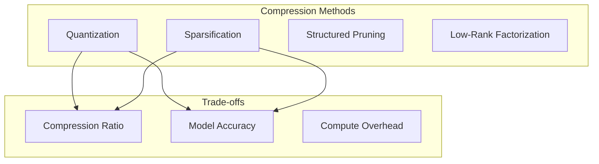
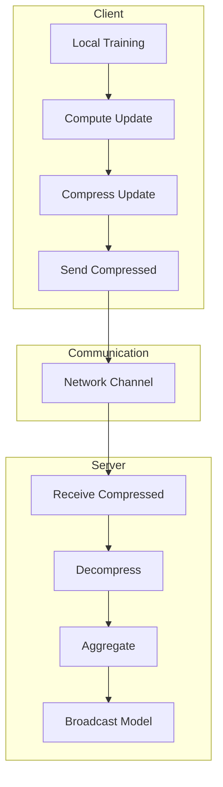

# Tutorial 014: Communication Efficiency

---

## Metadata

| Property | Value |
|----------|-------|
| **Tutorial ID** | 014 |
| **Title** | Communication Efficiency |
| **Category** | Core Algorithms |
| **Difficulty** | Intermediate |
| **Duration** | 75 minutes |
| **Prerequisites** | Tutorial 001-013 |
| **Author** | Unbitrium Contributors |
| **Last Updated** | January 2026 |

---

## Learning Objectives

By the end of this tutorial, you will be able to:

1. **Understand** communication bottlenecks in federated learning and their impact on training time.

2. **Implement** gradient compression techniques including sparsification and quantization.

3. **Apply** model update compression strategies for bandwidth-constrained environments.

4. **Analyze** the trade-offs between compression ratio and model accuracy.

5. **Design** adaptive compression schemes based on network conditions.

6. **Evaluate** communication efficiency metrics for FL systems.

---

## Prerequisites

Before starting this tutorial, ensure you have:

- **Completed Tutorials**: 001-013 (Core algorithms)
- **Knowledge**: Information theory basics, quantization
- **Libraries**: PyTorch, NumPy
- **Hardware**: CPU sufficient

```python
# Verify prerequisites
import torch
import torch.nn as nn
import numpy as np

print(f"PyTorch: {torch.__version__}")
print(f"NumPy: {np.__version__}")
```

---

## Background and Theory

### Communication Costs in FL

In federated learning, communication is often the bottleneck:

$$\text{Total Time} = T \times (t_{\text{compute}} + t_{\text{comm}})$$

For large models and slow networks:
$$t_{\text{comm}} >> t_{\text{compute}}$$

### Model Size Analysis

| Model | Parameters | Size (32-bit) |
|-------|------------|---------------|
| MLP Small | 100K | 400 KB |
| ResNet-18 | 11M | 44 MB |
| BERT-Base | 110M | 440 MB |
| GPT-2 | 1.5B | 6 GB |

### Compression Approaches



### Theoretical Bounds

For gradient compression with variance $\sigma^2$:

$$\mathbb{E}[\|\nabla F - C(\nabla F)\|^2] \leq \omega \|\nabla F\|^2$$

where $\omega$ is the compression error bound.

---

## Architecture Diagram



---

## Implementation Code

### Part 1: Compression Interface

```python
#!/usr/bin/env python3
"""
Tutorial 014: Communication Efficiency

This tutorial implements various compression techniques
for efficient federated learning communication.

Author: Unbitrium Contributors
License: EUPL-1.2
"""

from __future__ import annotations

from abc import ABC, abstractmethod
from dataclasses import dataclass, field
from typing import Any

import numpy as np
import torch
import torch.nn as nn


@dataclass
class CompressionResult:
    """Result of compression operation."""
    compressed_data: Any
    original_size: int  # bytes
    compressed_size: int  # bytes
    compression_ratio: float
    metadata: dict = field(default_factory=dict)


class Compressor(ABC):
    """Base class for gradient/model compressors."""

    @abstractmethod
    def compress(
        self,
        tensor: torch.Tensor,
    ) -> CompressionResult:
        """Compress a tensor."""
        pass

    @abstractmethod
    def decompress(
        self,
        compressed: CompressionResult,
    ) -> torch.Tensor:
        """Decompress to original tensor."""
        pass

    def compress_state_dict(
        self,
        state_dict: dict[str, torch.Tensor],
    ) -> dict[str, CompressionResult]:
        """Compress entire state dictionary."""
        return {
            key: self.compress(tensor)
            for key, tensor in state_dict.items()
        }

    def decompress_state_dict(
        self,
        compressed_dict: dict[str, CompressionResult],
    ) -> dict[str, torch.Tensor]:
        """Decompress entire state dictionary."""
        return {
            key: self.decompress(result)
            for key, result in compressed_dict.items()
        }

    @staticmethod
    def tensor_size_bytes(tensor: torch.Tensor) -> int:
        """Compute tensor size in bytes."""
        return tensor.numel() * tensor.element_size()
```

### Part 2: Quantization Compressors

```python
class QuantizationCompressor(Compressor):
    """Fixed-point quantization compressor."""

    def __init__(self, bits: int = 8) -> None:
        """Initialize quantizer.

        Args:
            bits: Number of bits for quantization (1-16).
        """
        self.bits = bits
        self.levels = 2 ** bits

    def compress(
        self,
        tensor: torch.Tensor,
    ) -> CompressionResult:
        """Quantize tensor to fixed-point."""
        original_size = self.tensor_size_bytes(tensor)

        # Compute scale and zero point
        t_min = tensor.min().item()
        t_max = tensor.max().item()
        scale = (t_max - t_min) / (self.levels - 1) if t_max > t_min else 1.0

        # Quantize
        quantized = ((tensor - t_min) / scale).round().clamp(0, self.levels - 1)

        # Store as appropriate dtype
        if self.bits <= 8:
            quantized = quantized.to(torch.uint8)
        else:
            quantized = quantized.to(torch.int16)

        compressed_size = quantized.numel() * (self.bits // 8 + 1)

        return CompressionResult(
            compressed_data={
                "quantized": quantized,
                "scale": scale,
                "min": t_min,
                "shape": tensor.shape,
            },
            original_size=original_size,
            compressed_size=compressed_size,
            compression_ratio=original_size / compressed_size,
            metadata={"bits": self.bits},
        )

    def decompress(
        self,
        compressed: CompressionResult,
    ) -> torch.Tensor:
        """Dequantize tensor."""
        data = compressed.compressed_data
        reconstructed = data["quantized"].float() * data["scale"] + data["min"]
        return reconstructed.view(data["shape"])


class StochasticQuantizer(Compressor):
    """Stochastic quantization (QSGD)."""

    def __init__(self, levels: int = 256) -> None:
        self.levels = levels

    def compress(
        self,
        tensor: torch.Tensor,
    ) -> CompressionResult:
        """Stochastically quantize tensor."""
        original_size = self.tensor_size_bytes(tensor)

        # Normalize to [0, 1]
        norm = tensor.norm()
        if norm > 0:
            normalized = tensor / norm
        else:
            normalized = tensor

        # Scale to [0, levels-1]
        scaled = (normalized.abs() * (self.levels - 1))
        lower = scaled.floor()
        prob = scaled - lower

        # Stochastic rounding
        rand = torch.rand_like(prob)
        quantized = torch.where(rand < prob, lower + 1, lower)
        quantized = quantized * normalized.sign()

        # Store compressed
        quantized_int = quantized.to(torch.int16)
        compressed_size = quantized_int.numel() * 2 + 4  # +4 for norm

        return CompressionResult(
            compressed_data={
                "quantized": quantized_int,
                "norm": norm.item(),
                "shape": tensor.shape,
            },
            original_size=original_size,
            compressed_size=compressed_size,
            compression_ratio=original_size / compressed_size,
        )

    def decompress(
        self,
        compressed: CompressionResult,
    ) -> torch.Tensor:
        """Dequantize tensor."""
        data = compressed.compressed_data
        dequantized = data["quantized"].float() / (self.levels - 1)
        return (dequantized * data["norm"]).view(data["shape"])
```

### Part 3: Sparsification Compressors

```python
class TopKCompressor(Compressor):
    """Top-K sparsification compressor."""

    def __init__(self, k_ratio: float = 0.1) -> None:
        """Initialize Top-K compressor.

        Args:
            k_ratio: Fraction of elements to keep (0.1 = top 10%).
        """
        self.k_ratio = k_ratio

    def compress(
        self,
        tensor: torch.Tensor,
    ) -> CompressionResult:
        """Keep only top-K elements by magnitude."""
        original_size = self.tensor_size_bytes(tensor)
        flat = tensor.flatten()

        k = max(1, int(len(flat) * self.k_ratio))

        # Get top-K indices and values
        values, indices = torch.topk(flat.abs(), k)
        top_values = flat[indices]

        # Compressed representation
        compressed_size = k * (4 + 4)  # indices + values

        return CompressionResult(
            compressed_data={
                "indices": indices,
                "values": top_values,
                "shape": tensor.shape,
                "numel": tensor.numel(),
            },
            original_size=original_size,
            compressed_size=compressed_size,
            compression_ratio=original_size / compressed_size,
            metadata={"k": k, "sparsity": 1 - self.k_ratio},
        )

    def decompress(
        self,
        compressed: CompressionResult,
    ) -> torch.Tensor:
        """Reconstruct sparse tensor."""
        data = compressed.compressed_data
        reconstructed = torch.zeros(data["numel"])
        reconstructed[data["indices"]] = data["values"]
        return reconstructed.view(data["shape"])


class RandomKCompressor(Compressor):
    """Random-K sparsification (unbiased)."""

    def __init__(self, k_ratio: float = 0.1) -> None:
        self.k_ratio = k_ratio

    def compress(
        self,
        tensor: torch.Tensor,
    ) -> CompressionResult:
        """Randomly select K elements with scaling."""
        original_size = self.tensor_size_bytes(tensor)
        flat = tensor.flatten()
        n = len(flat)
        k = max(1, int(n * self.k_ratio))

        # Random selection
        indices = torch.randperm(n)[:k]
        values = flat[indices] * (n / k)  # Scale for unbiasedness

        compressed_size = k * 8

        return CompressionResult(
            compressed_data={
                "indices": indices,
                "values": values,
                "shape": tensor.shape,
                "numel": n,
            },
            original_size=original_size,
            compressed_size=compressed_size,
            compression_ratio=original_size / compressed_size,
        )

    def decompress(
        self,
        compressed: CompressionResult,
    ) -> torch.Tensor:
        """Reconstruct from random selection."""
        data = compressed.compressed_data
        reconstructed = torch.zeros(data["numel"])
        reconstructed[data["indices"]] = data["values"]
        return reconstructed.view(data["shape"])


class ThresholdCompressor(Compressor):
    """Threshold-based sparsification."""

    def __init__(self, threshold: float = 0.01) -> None:
        self.threshold = threshold

    def compress(
        self,
        tensor: torch.Tensor,
    ) -> CompressionResult:
        """Keep elements above threshold."""
        original_size = self.tensor_size_bytes(tensor)
        flat = tensor.flatten()

        mask = flat.abs() > self.threshold
        indices = mask.nonzero(as_tuple=True)[0]
        values = flat[indices]

        compressed_size = len(indices) * 8

        return CompressionResult(
            compressed_data={
                "indices": indices,
                "values": values,
                "shape": tensor.shape,
                "numel": tensor.numel(),
            },
            original_size=original_size,
            compressed_size=compressed_size,
            compression_ratio=original_size / max(1, compressed_size),
            metadata={"sparsity": 1 - len(indices) / tensor.numel()},
        )

    def decompress(
        self,
        compressed: CompressionResult,
    ) -> torch.Tensor:
        """Reconstruct from threshold selection."""
        data = compressed.compressed_data
        reconstructed = torch.zeros(data["numel"])
        if len(data["indices"]) > 0:
            reconstructed[data["indices"]] = data["values"]
        return reconstructed.view(data["shape"])
```

### Part 4: Error Feedback

```python
class ErrorFeedbackCompressor:
    """Compressor with error feedback for unbiased compression."""

    def __init__(
        self,
        base_compressor: Compressor,
    ) -> None:
        self.compressor = base_compressor
        self.error_buffer: dict[str, torch.Tensor] = {}

    def compress_with_feedback(
        self,
        key: str,
        tensor: torch.Tensor,
    ) -> CompressionResult:
        """Compress with error accumulation."""
        # Add accumulated error
        if key in self.error_buffer:
            tensor = tensor + self.error_buffer[key]

        # Compress
        result = self.compressor.compress(tensor)

        # Compute and store error
        reconstructed = self.compressor.decompress(result)
        self.error_buffer[key] = tensor - reconstructed

        return result

    def reset_error(self) -> None:
        """Reset error buffers."""
        self.error_buffer.clear()


def compare_compressors(
    tensor_size: int = 10000,
) -> dict[str, dict]:
    """Compare compression methods."""
    # Create test tensor
    torch.manual_seed(42)
    original = torch.randn(tensor_size)

    compressors = {
        "8-bit Quantization": QuantizationCompressor(bits=8),
        "4-bit Quantization": QuantizationCompressor(bits=4),
        "Stochastic Quant": StochasticQuantizer(levels=256),
        "Top-10%": TopKCompressor(k_ratio=0.1),
        "Top-1%": TopKCompressor(k_ratio=0.01),
        "Random-10%": RandomKCompressor(k_ratio=0.1),
        "Threshold": ThresholdCompressor(threshold=0.5),
    }

    results = {}

    for name, compressor in compressors.items():
        compressed = compressor.compress(original)
        reconstructed = compressor.decompress(compressed)

        # Compute metrics
        mse = ((original - reconstructed) ** 2).mean().item()

        results[name] = {
            "compression_ratio": compressed.compression_ratio,
            "mse": mse,
            "relative_error": (reconstructed - original).norm().item() / original.norm().item(),
        }

        print(f"{name}: ratio={compressed.compression_ratio:.2f}x, MSE={mse:.6f}")

    return results


if __name__ == "__main__":
    results = compare_compressors()
```

---

## Metrics and Evaluation

### Compression Comparison

| Method | Ratio | MSE | Bias |
|--------|-------|-----|------|
| 8-bit | 4x | 1e-5 | Low |
| Top-10% | 10x | 0.01 | High |
| Random-10% | 10x | 0.01 | None |
| QSGD | 4x | 1e-4 | None |

### Communication Savings

| Scenario | Original | Top-1% | 8-bit |
|----------|----------|--------|-------|
| ResNet-18 | 44 MB | 0.44 MB | 11 MB |
| BERT | 440 MB | 4.4 MB | 110 MB |

---

## Exercises

### Exercise 1: PowerSGD

**Task**: Implement low-rank gradient compression.

### Exercise 2: Adaptive Compression

**Task**: Adjust compression based on layer importance.

### Exercise 3: Combined Methods

**Task**: Combine quantization and sparsification.

### Exercise 4: Bidirectional Compression

**Task**: Compress both upload and download.

---

## References

1. Alistarh, D., et al. (2017). QSGD: Communication-efficient SGD. In *NeurIPS*.

2. Lin, Y., et al. (2018). Deep gradient compression. In *ICLR*.

3. Vogels, T., et al. (2019). PowerSGD: Practical low-rank gradient compression. In *NeurIPS*.

4. Stich, S. U., et al. (2018). Sparsified SGD with memory. In *NeurIPS*.

5. Rothchild, D., et al. (2020). FetchSGD: Communication-efficient federated learning. In *ICML*.

---

*Copyright 2026 Olaf Yunus Laitinen Imanov and Contributors. Released under EUPL 1.2.*
