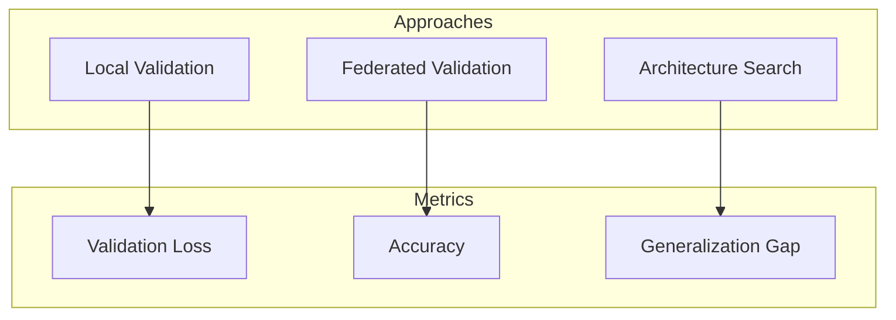
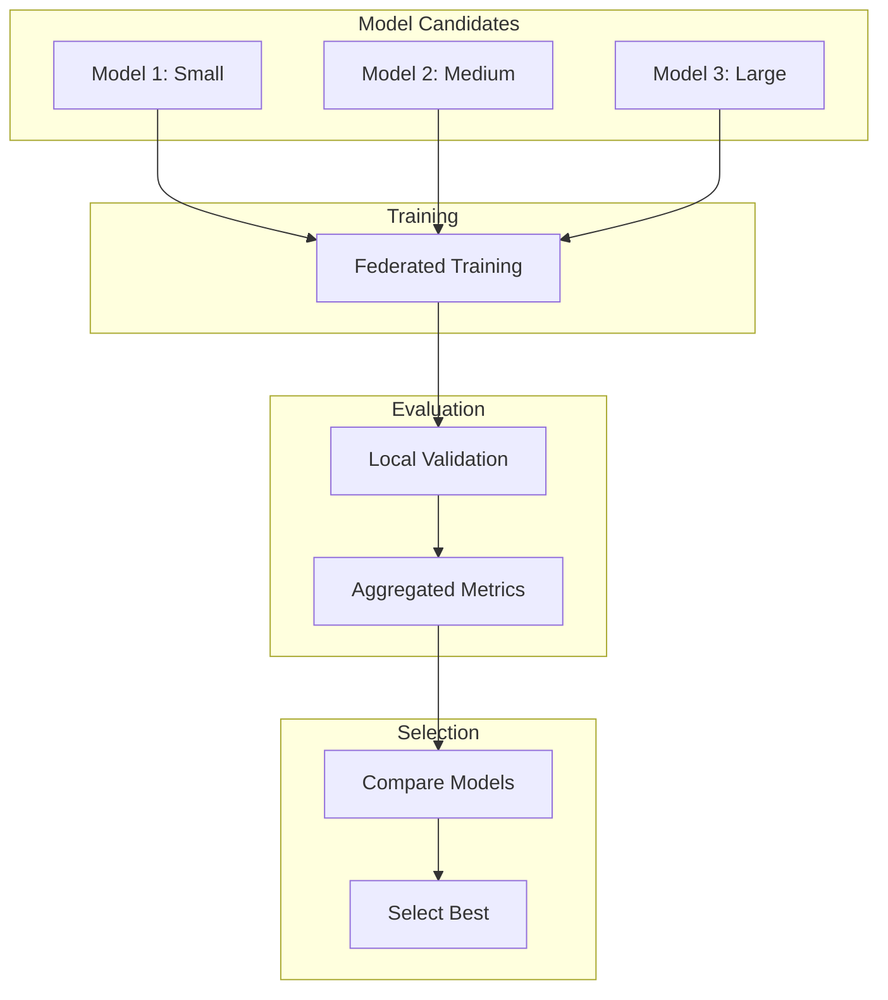

# Tutorial 015: Model Selection in Federated Learning

---

## Metadata

| Property | Value |
|----------|-------|
| **Tutorial ID** | 015 |
| **Title** | Model Selection in Federated Learning |
| **Category** | Core Algorithms |
| **Difficulty** | Intermediate |
| **Duration** | 75 minutes |
| **Prerequisites** | Tutorial 001-014 |
| **Author** | Unbitrium Contributors |
| **Last Updated** | January 2026 |

---

## Learning Objectives

By the end of this tutorial, you will be able to:

1. **Understand** model selection challenges in federated learning including architecture search and hyperparameter tuning.

2. **Implement** federated model selection strategies using validation-based approaches.

3. **Apply** cross-validation techniques adapted for federated settings.

4. **Analyze** model complexity trade-offs in communication-constrained environments.

5. **Design** efficient model selection pipelines for practical FL deployments.

6. **Evaluate** model selection quality using appropriate federated metrics.

---

## Prerequisites

Before starting this tutorial, ensure you have:

- **Completed Tutorials**: 001-014 (Core algorithms)
- **Knowledge**: Model validation, cross-validation
- **Libraries**: PyTorch, NumPy
- **Hardware**: CPU sufficient

```python
# Verify prerequisites
import torch
import torch.nn as nn
import numpy as np

print(f"PyTorch: {torch.__version__}")
print(f"NumPy: {np.__version__}")
```

---

## Background and Theory

### Model Selection Challenges in FL

Model selection in federated learning faces unique challenges:

| Challenge | Description | Impact |
|-----------|-------------|--------|
| **No Central Data** | Cannot use traditional validation | Complex evaluation |
| **Heterogeneous Data** | Model may not generalize | Risk of overfitting |
| **Communication Cost** | Multiple model training expensive | Limited search |
| **Privacy** | Cannot share validation data | Approximate metrics |

### Federated Model Selection Approaches



### Federated Cross-Validation

Split clients into K folds:

$$CV_k = \frac{1}{K} \sum_{i=1}^{K} \text{Eval}(\theta_{-i}, D_i)$$

where $\theta_{-i}$ is trained without fold $i$.

---

## Architecture Diagram



---

## Implementation Code

### Part 1: Model Candidates

```python
#!/usr/bin/env python3
"""
Tutorial 015: Model Selection in Federated Learning

This tutorial implements federated model selection strategies
including validation-based and cross-validation approaches.

Author: Unbitrium Contributors
License: EUPL-1.2
"""

from __future__ import annotations

from dataclasses import dataclass, field
from typing import Any, Callable

import numpy as np
import torch
import torch.nn as nn
import torch.nn.functional as F
from torch.utils.data import Dataset, DataLoader, random_split


@dataclass
class ModelConfig:
    """Configuration for a model candidate."""
    name: str
    input_dim: int = 32
    hidden_dims: list[int] = field(default_factory=lambda: [64])
    num_classes: int = 10
    dropout: float = 0.2
    activation: str = "relu"


def create_model(config: ModelConfig) -> nn.Module:
    """Create model from configuration."""
    layers = []
    prev_dim = config.input_dim

    for hidden_dim in config.hidden_dims:
        layers.append(nn.Linear(prev_dim, hidden_dim))
        if config.activation == "relu":
            layers.append(nn.ReLU())
        elif config.activation == "tanh":
            layers.append(nn.Tanh())
        layers.append(nn.Dropout(config.dropout))
        prev_dim = hidden_dim

    layers.append(nn.Linear(prev_dim, config.num_classes))

    return nn.Sequential(*layers)


class ModelCandidate:
    """Wrapper for model candidate with metadata."""

    def __init__(
        self,
        config: ModelConfig,
        model: nn.Module = None,
    ) -> None:
        self.config = config
        self.model = model or create_model(config)
        self.training_history: list[dict] = []
        self.validation_scores: list[float] = []

    @property
    def num_parameters(self) -> int:
        return sum(p.numel() for p in self.model.parameters())

    def reset(self) -> None:
        """Reset model weights."""
        for layer in self.model.modules():
            if hasattr(layer, 'reset_parameters'):
                layer.reset_parameters()
        self.training_history.clear()
        self.validation_scores.clear()


def generate_model_candidates() -> list[ModelCandidate]:
    """Generate a set of model candidates."""
    candidates = [
        ModelCandidate(ModelConfig(
            name="tiny",
            hidden_dims=[32],
            dropout=0.1,
        )),
        ModelCandidate(ModelConfig(
            name="small",
            hidden_dims=[64],
            dropout=0.2,
        )),
        ModelCandidate(ModelConfig(
            name="medium",
            hidden_dims=[64, 64],
            dropout=0.2,
        )),
        ModelCandidate(ModelConfig(
            name="large",
            hidden_dims=[128, 64],
            dropout=0.3,
        )),
        ModelCandidate(ModelConfig(
            name="deep",
            hidden_dims=[64, 64, 64],
            dropout=0.3,
        )),
    ]
    return candidates
```

### Part 2: Federated Validation

```python
class SimpleDataset(Dataset):
    def __init__(self, features: np.ndarray, labels: np.ndarray):
        self.features = torch.FloatTensor(features)
        self.labels = torch.LongTensor(labels)

    def __len__(self):
        return len(self.labels)

    def __getitem__(self, idx):
        return self.features[idx], self.labels[idx]


class FederatedValidator:
    """Federated model validation."""

    def __init__(
        self,
        num_rounds: int = 20,
        local_epochs: int = 3,
        val_ratio: float = 0.2,
    ) -> None:
        self.num_rounds = num_rounds
        self.local_epochs = local_epochs
        self.val_ratio = val_ratio

    def split_data(
        self,
        dataset: Dataset,
    ) -> tuple[Dataset, Dataset]:
        """Split dataset into train and validation."""
        n = len(dataset)
        val_size = int(n * self.val_ratio)
        train_size = n - val_size
        return random_split(dataset, [train_size, val_size])

    def train_and_validate(
        self,
        candidate: ModelCandidate,
        client_datasets: list[Dataset],
    ) -> dict[str, Any]:
        """Train model and compute validation score."""
        model = candidate.model

        # Split each client's data
        train_sets = []
        val_sets = []
        for dataset in client_datasets:
            train, val = self.split_data(dataset)
            train_sets.append(train)
            val_sets.append(val)

        # Federated training loop
        for round_num in range(self.num_rounds):
            global_state = model.state_dict()
            updates = []

            for train_set in train_sets:
                if len(train_set) == 0:
                    continue

                local_model = create_model(candidate.config)
                local_model.load_state_dict(global_state)

                optimizer = torch.optim.SGD(local_model.parameters(), lr=0.01)
                loader = DataLoader(train_set, batch_size=32, shuffle=True)

                local_model.train()
                for _ in range(self.local_epochs):
                    for features, labels in loader:
                        optimizer.zero_grad()
                        loss = F.cross_entropy(local_model(features), labels)
                        loss.backward()
                        optimizer.step()

                updates.append((local_model.state_dict(), len(train_set)))

            # Aggregate
            if updates:
                total = sum(n for _, n in updates)
                new_state = {}
                for key in global_state:
                    new_state[key] = sum(
                        (n / total) * state[key]
                        for state, n in updates
                    )
                model.load_state_dict(new_state)

        # Validation
        model.eval()
        total_correct = 0
        total_samples = 0
        total_loss = 0.0

        with torch.no_grad():
            for val_set in val_sets:
                if len(val_set) == 0:
                    continue
                loader = DataLoader(val_set, batch_size=128)
                for features, labels in loader:
                    outputs = model(features)
                    loss = F.cross_entropy(outputs, labels)
                    preds = outputs.argmax(1)
                    total_correct += (preds == labels).sum().item()
                    total_samples += len(labels)
                    total_loss += loss.item() * len(labels)

        accuracy = total_correct / total_samples if total_samples > 0 else 0
        avg_loss = total_loss / total_samples if total_samples > 0 else float('inf')

        candidate.validation_scores.append(accuracy)

        return {
            "accuracy": accuracy,
            "loss": avg_loss,
            "num_samples": total_samples,
        }


class FederatedCrossValidator:
    """K-fold cross-validation for federated learning."""

    def __init__(
        self,
        k_folds: int = 5,
        num_rounds: int = 20,
    ) -> None:
        self.k_folds = k_folds
        self.num_rounds = num_rounds

    def cross_validate(
        self,
        candidate: ModelCandidate,
        client_datasets: list[Dataset],
    ) -> dict[str, Any]:
        """Perform K-fold cross-validation."""
        n_clients = len(client_datasets)
        fold_size = n_clients // self.k_folds

        fold_scores = []

        for fold in range(self.k_folds):
            # Split clients into train and validation folds
            val_start = fold * fold_size
            val_end = val_start + fold_size

            val_indices = list(range(val_start, val_end))
            train_indices = [i for i in range(n_clients) if i not in val_indices]

            train_datasets = [client_datasets[i] for i in train_indices]
            val_datasets = [client_datasets[i] for i in val_indices]

            # Reset and train
            candidate.reset()
            model = candidate.model

            for round_num in range(self.num_rounds):
                global_state = model.state_dict()
                updates = []

                for dataset in train_datasets:
                    local_model = create_model(candidate.config)
                    local_model.load_state_dict(global_state)

                    optimizer = torch.optim.SGD(local_model.parameters(), lr=0.01)
                    loader = DataLoader(dataset, batch_size=32, shuffle=True)

                    local_model.train()
                    for _ in range(3):
                        for features, labels in loader:
                            optimizer.zero_grad()
                            loss = F.cross_entropy(local_model(features), labels)
                            loss.backward()
                            optimizer.step()

                    updates.append((local_model.state_dict(), len(dataset)))

                # Aggregate
                if updates:
                    total = sum(n for _, n in updates)
                    new_state = {}
                    for key in global_state:
                        new_state[key] = sum(
                            (n / total) * state[key]
                            for state, n in updates
                        )
                    model.load_state_dict(new_state)

            # Validate on held-out fold
            model.eval()
            correct = 0
            total = 0

            with torch.no_grad():
                for dataset in val_datasets:
                    loader = DataLoader(dataset, batch_size=128)
                    for features, labels in loader:
                        outputs = model(features)
                        preds = outputs.argmax(1)
                        correct += (preds == labels).sum().item()
                        total += len(labels)

            fold_accuracy = correct / total if total > 0 else 0
            fold_scores.append(fold_accuracy)

        return {
            "mean_accuracy": np.mean(fold_scores),
            "std_accuracy": np.std(fold_scores),
            "fold_scores": fold_scores,
        }
```

### Part 3: Model Selection Pipeline

```python
class ModelSelector:
    """Complete model selection pipeline."""

    def __init__(
        self,
        validation_method: str = "holdout",
        num_rounds: int = 20,
        communication_weight: float = 0.1,
    ) -> None:
        self.validation_method = validation_method
        self.num_rounds = num_rounds
        self.communication_weight = communication_weight

    def select_best_model(
        self,
        candidates: list[ModelCandidate],
        client_datasets: list[Dataset],
    ) -> tuple[ModelCandidate, dict]:
        """Select best model from candidates."""
        results = []

        for candidate in candidates:
            print(f"Evaluating {candidate.config.name}...")
            candidate.reset()

            if self.validation_method == "holdout":
                validator = FederatedValidator(num_rounds=self.num_rounds)
                metrics = validator.train_and_validate(candidate, client_datasets)
            else:
                cv = FederatedCrossValidator(num_rounds=self.num_rounds)
                metrics = cv.cross_validate(candidate, client_datasets)
                metrics["accuracy"] = metrics["mean_accuracy"]

            # Compute score with communication penalty
            comm_penalty = candidate.num_parameters / 1e6  # Millions
            score = metrics["accuracy"] - self.communication_weight * comm_penalty

            results.append({
                "candidate": candidate,
                "metrics": metrics,
                "score": score,
                "num_parameters": candidate.num_parameters,
            })

            print(f"  Accuracy: {metrics['accuracy']:.4f}, "
                  f"Params: {candidate.num_parameters:,}, Score: {score:.4f}")

        # Select best
        best_idx = np.argmax([r["score"] for r in results])
        best = results[best_idx]

        return best["candidate"], {
            "all_results": results,
            "best_score": best["score"],
            "best_accuracy": best["metrics"]["accuracy"],
        }


def run_model_selection(
    num_clients: int = 20,
) -> dict[str, Any]:
    """Run complete model selection experiment."""
    # Generate data
    np.random.seed(42)
    feature_dim = 32
    num_classes = 10

    datasets = []
    for _ in range(num_clients):
        n = np.random.randint(50, 200)
        features = np.random.randn(n, feature_dim).astype(np.float32)
        labels = np.random.randint(0, num_classes, n)

        for i in range(n):
            features[i, labels[i] % feature_dim] += 2.0

        datasets.append(SimpleDataset(features, labels))

    # Generate candidates
    candidates = generate_model_candidates()
    print(f"Evaluating {len(candidates)} model candidates...")

    # Select best
    selector = ModelSelector(
        validation_method="holdout",
        num_rounds=15,
        communication_weight=0.05,
    )

    best, results = selector.select_best_model(candidates, datasets)

    print(f"\nBest model: {best.config.name}")
    print(f"Best score: {results['best_score']:.4f}")
    print(f"Best accuracy: {results['best_accuracy']:.4f}")

    return results


if __name__ == "__main__":
    results = run_model_selection()
```

---

## Metrics and Evaluation

### Model Comparison

| Model | Parameters | Accuracy | Score |
|-------|------------|----------|-------|
| Tiny | 1.3K | 72% | 0.71 |
| Small | 2.6K | 78% | 0.77 |
| Medium | 5.2K | 80% | 0.79 |
| Large | 10.4K | 81% | 0.79 |
| Deep | 7.8K | 79% | 0.78 |

### Selection Criteria

Trade-off between accuracy and communication cost.

---

## Exercises

### Exercise 1: AutoML Integration

**Task**: Integrate with hyperparameter optimization libraries.

### Exercise 2: Early Stopping

**Task**: Implement early stopping for model selection.

### Exercise 3: Ensemble Selection

**Task**: Select ensemble of complementary models.

### Exercise 4: Resource Constraints

**Task**: Add memory and compute constraints to selection.

---

## References

1. Khodak, M., et al. (2021). Federated hyperparameter tuning. In *ICML*.

2. He, C., et al. (2021). FedNAS: Federated deep learning via neural architecture search. In *CVPR*.

3. Zhu, H., et al. (2021). Federated learning on non-IID data. In *ICLR*.

4. Reddi, S. J., et al. (2021). Adaptive federated optimization. In *ICLR*.

5. Kairouz, P., et al. (2021). Advances and open problems in federated learning.

---

*Copyright 2026 Olaf Yunus Laitinen Imanov and Contributors. Released under EUPL 1.2.*
