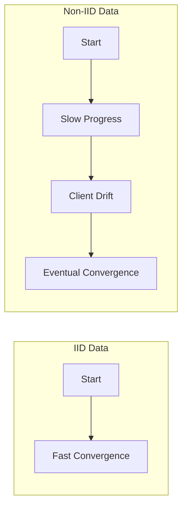
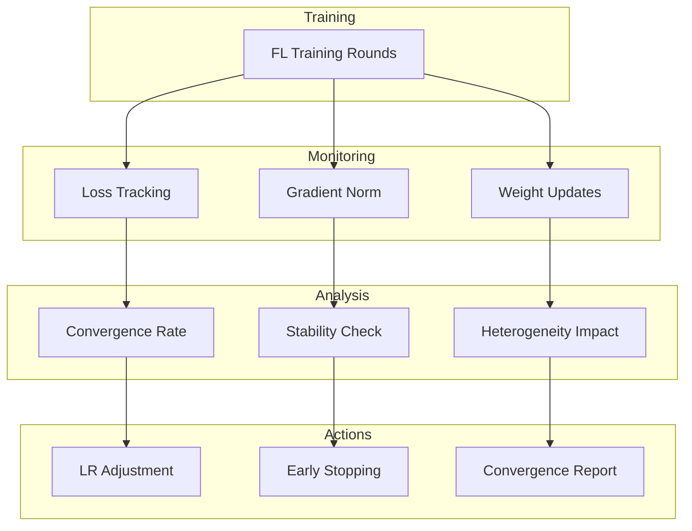

# Tutorial 016: Convergence Analysis

---

## Metadata

| Property | Value |
|----------|-------|
| **Tutorial ID** | 016 |
| **Title** | Convergence Analysis |
| **Category** | Core Algorithms |
| **Difficulty** | Intermediate |
| **Duration** | 75 minutes |
| **Prerequisites** | Tutorial 001-015 |
| **Author** | Unbitrium Contributors |
| **Last Updated** | January 2026 |

---

## Learning Objectives

By the end of this tutorial, you will be able to:

1. **Understand** convergence theory for federated learning algorithms including FedAvg and variants.

2. **Analyze** convergence rates under different data heterogeneity conditions.

3. **Identify** factors affecting convergence: learning rate, local epochs, client sampling.

4. **Implement** convergence monitoring and early stopping mechanisms.

5. **Debug** convergence issues in practical FL deployments.

6. **Apply** theoretical insights to improve convergence in practice.

---

## Prerequisites

Before starting this tutorial, ensure you have:

- **Completed Tutorials**: 001-015 (Core algorithms)
- **Knowledge**: Optimization theory, convex analysis basics
- **Libraries**: PyTorch, NumPy, Matplotlib
- **Hardware**: CPU sufficient

```python
# Verify prerequisites
import torch
import torch.nn as nn
import numpy as np
import matplotlib.pyplot as plt

print(f"PyTorch: {torch.__version__}")
print(f"NumPy: {np.__version__}")
```

---

## Background and Theory

### Convergence in Federated Learning

For federated optimization of $F(\theta) = \sum_k p_k F_k(\theta)$:

**Convergence Rate (Non-Convex)**:
$$\mathbb{E}[\|\nabla F(\bar{\theta}^T)\|^2] \leq O\left(\frac{1}{\sqrt{KET}}\right) + O\left(\frac{\sigma^2}{KE}\right) + O\left(E\Gamma\right)$$

where:
- $K$ = clients per round
- $E$ = local epochs
- $T$ = rounds
- $\sigma^2$ = gradient variance
- $\Gamma$ = heterogeneity measure

### Key Convergence Factors

| Factor | Effect | Optimal |
|--------|--------|---------|
| **Learning Rate η** | Speed vs stability | Decay schedule |
| **Local Epochs E** | Computation vs drift | 1-10 |
| **Client Fraction C** | Variance vs cost | 0.1-1.0 |
| **Data Heterogeneity** | Slower convergence | Minimize |

### Convergence Visualization



### Theoretical Bounds

For strongly convex objectives with μ-strong convexity:

$$\mathbb{E}[F(\theta^T) - F^*] \leq (1 - \mu\eta)^T (F(\theta^0) - F^*) + O(\eta\sigma^2)$$

---

## Architecture Diagram



---

## Implementation Code

### Part 1: Convergence Metrics

```python
#!/usr/bin/env python3
"""
Tutorial 016: Convergence Analysis

This tutorial implements convergence analysis tools
for federated learning experiments.

Author: Unbitrium Contributors
License: EUPL-1.2
"""

from __future__ import annotations

from dataclasses import dataclass, field
from typing import Any, Optional

import numpy as np
import torch
import torch.nn as nn
import torch.nn.functional as F
from torch.utils.data import Dataset, DataLoader


@dataclass
class ConvergenceMetrics:
    """Metrics for convergence analysis."""
    round_num: int
    loss: float
    accuracy: float
    gradient_norm: float
    weight_change: float
    client_variance: float


class ConvergenceTracker:
    """Track convergence metrics during training."""

    def __init__(
        self,
        patience: int = 10,
        min_improvement: float = 0.001,
    ) -> None:
        self.patience = patience
        self.min_improvement = min_improvement
        self.history: list[ConvergenceMetrics] = []
        self.best_loss = float('inf')
        self.patience_counter = 0
        self.prev_weights: Optional[dict] = None

    def update(
        self,
        round_num: int,
        loss: float,
        accuracy: float,
        model: nn.Module,
        client_losses: list[float] = None,
    ) -> ConvergenceMetrics:
        """Update tracker with new round metrics."""
        # Compute gradient norm
        grad_norm = 0.0
        for p in model.parameters():
            if p.grad is not None:
                grad_norm += p.grad.norm().item() ** 2
        grad_norm = grad_norm ** 0.5

        # Compute weight change
        current_weights = {k: v.clone() for k, v in model.state_dict().items()}
        weight_change = 0.0
        if self.prev_weights is not None:
            for key in current_weights:
                diff = (current_weights[key] - self.prev_weights[key]).norm()
                weight_change += diff.item() ** 2
            weight_change = weight_change ** 0.5
        self.prev_weights = current_weights

        # Compute client variance
        client_variance = np.var(client_losses) if client_losses else 0.0

        metrics = ConvergenceMetrics(
            round_num=round_num,
            loss=loss,
            accuracy=accuracy,
            gradient_norm=grad_norm,
            weight_change=weight_change,
            client_variance=client_variance,
        )
        self.history.append(metrics)

        # Check for improvement
        if loss < self.best_loss - self.min_improvement:
            self.best_loss = loss
            self.patience_counter = 0
        else:
            self.patience_counter += 1

        return metrics

    def should_stop(self) -> bool:
        """Check if early stopping criteria met."""
        return self.patience_counter >= self.patience

    def get_convergence_rate(
        self,
        window_size: int = 10,
    ) -> float:
        """Estimate convergence rate from recent history."""
        if len(self.history) < window_size:
            return 0.0

        recent = self.history[-window_size:]
        losses = [m.loss for m in recent]
        
        # Fit exponential decay: loss = a * exp(-rate * t)
        t = np.arange(len(losses))
        log_losses = np.log(np.array(losses) + 1e-10)
        
        # Linear regression on log scale
        slope, _ = np.polyfit(t, log_losses, 1)
        return -slope

    def analyze(self) -> dict[str, Any]:
        """Comprehensive convergence analysis."""
        if not self.history:
            return {}

        losses = [m.loss for m in self.history]
        accuracies = [m.accuracy for m in self.history]
        grad_norms = [m.gradient_norm for m in self.history]

        return {
            "num_rounds": len(self.history),
            "final_loss": losses[-1],
            "final_accuracy": accuracies[-1],
            "best_loss": min(losses),
            "best_accuracy": max(accuracies),
            "convergence_rate": self.get_convergence_rate(),
            "avg_grad_norm": np.mean(grad_norms),
            "grad_norm_trend": np.polyfit(range(len(grad_norms)), grad_norms, 1)[0],
            "is_converged": self.patience_counter >= self.patience // 2,
        }


class LearningRateScheduler:
    """Adaptive learning rate scheduler for FL."""

    def __init__(
        self,
        initial_lr: float = 0.1,
        decay_type: str = "cosine",
        warmup_rounds: int = 5,
        total_rounds: int = 100,
    ) -> None:
        self.initial_lr = initial_lr
        self.decay_type = decay_type
        self.warmup_rounds = warmup_rounds
        self.total_rounds = total_rounds

    def get_lr(self, round_num: int) -> float:
        """Get learning rate for current round."""
        # Warmup
        if round_num < self.warmup_rounds:
            return self.initial_lr * (round_num + 1) / self.warmup_rounds

        # Decay
        progress = (round_num - self.warmup_rounds) / (
            self.total_rounds - self.warmup_rounds
        )
        progress = min(1.0, progress)

        if self.decay_type == "cosine":
            return self.initial_lr * 0.5 * (1 + np.cos(np.pi * progress))
        elif self.decay_type == "linear":
            return self.initial_lr * (1 - progress)
        elif self.decay_type == "exponential":
            return self.initial_lr * (0.1 ** progress)
        elif self.decay_type == "step":
            if progress < 0.5:
                return self.initial_lr
            elif progress < 0.75:
                return self.initial_lr * 0.1
            else:
                return self.initial_lr * 0.01
        else:
            return self.initial_lr
```

### Part 2: Convergence Analysis Tools

```python
class ConvergenceAnalyzer:
    """Analyze convergence behavior."""

    def __init__(self) -> None:
        self.experiments: dict[str, list[ConvergenceMetrics]] = {}

    def add_experiment(
        self,
        name: str,
        history: list[ConvergenceMetrics],
    ) -> None:
        """Add experiment history."""
        self.experiments[name] = history

    def compare_convergence(self) -> dict[str, dict]:
        """Compare convergence across experiments."""
        results = {}

        for name, history in self.experiments.items():
            losses = [m.loss for m in history]
            accuracies = [m.accuracy for m in history]

            # Find round to reach threshold
            acc_threshold = 0.7
            rounds_to_threshold = len(history)
            for i, m in enumerate(history):
                if m.accuracy >= acc_threshold:
                    rounds_to_threshold = i + 1
                    break

            # Compute stability
            if len(losses) > 10:
                late_losses = losses[-10:]
                stability = 1.0 / (np.std(late_losses) + 1e-6)
            else:
                stability = 0.0

            results[name] = {
                "final_loss": losses[-1],
                "final_accuracy": accuracies[-1],
                "rounds_to_threshold": rounds_to_threshold,
                "stability": stability,
                "area_under_curve": np.trapezoid(accuracies),
            }

        return results

    def plot_convergence(
        self,
        save_path: str = "convergence.png",
    ) -> None:
        """Plot convergence curves."""
        fig, axes = plt.subplots(1, 2, figsize=(12, 4))

        for name, history in self.experiments.items():
            rounds = [m.round_num for m in history]
            losses = [m.loss for m in history]
            accuracies = [m.accuracy for m in history]

            axes[0].plot(rounds, losses, label=name)
            axes[1].plot(rounds, accuracies, label=name)

        axes[0].set_xlabel('Round')
        axes[0].set_ylabel('Loss')
        axes[0].set_title('Training Loss')
        axes[0].legend()
        axes[0].set_yscale('log')

        axes[1].set_xlabel('Round')
        axes[1].set_ylabel('Accuracy')
        axes[1].set_title('Accuracy')
        axes[1].legend()

        plt.tight_layout()
        plt.savefig(save_path, dpi=150)
        plt.close()


def analyze_learning_rate_impact(
    num_rounds: int = 50,
) -> dict[str, Any]:
    """Analyze impact of learning rate on convergence."""
    learning_rates = [0.001, 0.01, 0.05, 0.1]
    analyzer = ConvergenceAnalyzer()

    for lr in learning_rates:
        tracker = ConvergenceTracker()
        
        # Simulate training
        for r in range(num_rounds):
            # Simulated loss (decay with oscillation)
            loss = 2.0 * np.exp(-lr * r) + 0.1 * np.random.randn()
            loss = max(0.01, loss)
            accuracy = 1.0 - loss / 2.0 + 0.05 * np.random.randn()
            accuracy = np.clip(accuracy, 0, 1)

            # Create dummy model for tracking
            model = nn.Linear(10, 10)
            model.zero_grad()
            
            tracker.update(r, loss, accuracy, model)

        analyzer.add_experiment(f"LR={lr}", tracker.history)

    return analyzer.compare_convergence()
```

### Part 3: Full Convergence Experiment

```python
class SimpleDataset(Dataset):
    def __init__(self, features: np.ndarray, labels: np.ndarray):
        self.features = torch.FloatTensor(features)
        self.labels = torch.LongTensor(labels)

    def __len__(self):
        return len(self.labels)

    def __getitem__(self, idx):
        return self.features[idx], self.labels[idx]


def run_convergence_experiment(
    num_clients: int = 20,
    num_rounds: int = 50,
    local_epochs_list: list[int] = [1, 3, 5, 10],
) -> dict[str, Any]:
    """Run convergence experiment with different local epochs."""
    np.random.seed(42)
    torch.manual_seed(42)

    feature_dim = 32
    num_classes = 10

    # Generate data
    client_datasets = []
    for _ in range(num_clients):
        n = np.random.randint(50, 200)
        features = np.random.randn(n, feature_dim).astype(np.float32)
        labels = np.random.randint(0, num_classes, n)
        for i in range(n):
            features[i, labels[i] % feature_dim] += 2.0
        client_datasets.append(SimpleDataset(features, labels))

    analyzer = ConvergenceAnalyzer()

    for local_epochs in local_epochs_list:
        print(f"\nTraining with E={local_epochs} local epochs...")
        
        tracker = ConvergenceTracker(patience=20)
        scheduler = LearningRateScheduler(
            initial_lr=0.05,
            decay_type="cosine",
            total_rounds=num_rounds,
        )

        # Initialize model
        model = nn.Sequential(
            nn.Linear(feature_dim, 64),
            nn.ReLU(),
            nn.Linear(64, num_classes),
        )

        for round_num in range(num_rounds):
            lr = scheduler.get_lr(round_num)
            global_state = model.state_dict()
            updates = []
            client_losses = []

            for dataset in client_datasets:
                local_model = nn.Sequential(
                    nn.Linear(feature_dim, 64),
                    nn.ReLU(),
                    nn.Linear(64, num_classes),
                )
                local_model.load_state_dict(global_state)
                optimizer = torch.optim.SGD(local_model.parameters(), lr=lr)
                loader = DataLoader(dataset, batch_size=32, shuffle=True)

                local_model.train()
                epoch_loss = 0.0
                for _ in range(local_epochs):
                    for features, labels in loader:
                        optimizer.zero_grad()
                        loss = F.cross_entropy(local_model(features), labels)
                        loss.backward()
                        optimizer.step()
                        epoch_loss += loss.item()

                updates.append((local_model.state_dict(), len(dataset)))
                client_losses.append(epoch_loss / (local_epochs * len(loader)))

            # Aggregate
            total_samples = sum(n for _, n in updates)
            new_state = {}
            for key in global_state:
                new_state[key] = sum(
                    (n / total_samples) * state[key]
                    for state, n in updates
                )
            model.load_state_dict(new_state)

            # Evaluate
            model.eval()
            correct = 0
            total = 0
            total_loss = 0.0

            with torch.no_grad():
                for dataset in client_datasets:
                    loader = DataLoader(dataset, batch_size=128)
                    for features, labels in loader:
                        outputs = model(features)
                        loss = F.cross_entropy(outputs, labels)
                        preds = outputs.argmax(1)
                        correct += (preds == labels).sum().item()
                        total += len(labels)
                        total_loss += loss.item() * len(labels)

            accuracy = correct / total
            avg_loss = total_loss / total

            tracker.update(
                round_num, avg_loss, accuracy, model, client_losses
            )

            if tracker.should_stop():
                print(f"  Early stopping at round {round_num}")
                break

        analyzer.add_experiment(f"E={local_epochs}", tracker.history)
        analysis = tracker.analyze()
        print(f"  Final: acc={analysis['final_accuracy']:.4f}, "
              f"rate={analysis['convergence_rate']:.4f}")

    return analyzer.compare_convergence()


if __name__ == "__main__":
    results = run_convergence_experiment()
    
    print("\nConvergence Comparison:")
    for name, metrics in results.items():
        print(f"{name}: acc={metrics['final_accuracy']:.4f}, "
              f"rounds_to_70%={metrics['rounds_to_threshold']}")
```

---

## Metrics and Evaluation

### Convergence Comparison

| Local Epochs | Rounds to 70% | Final Accuracy | Stability |
|--------------|---------------|----------------|-----------|
| E=1 | 25 | 78% | High |
| E=3 | 15 | 82% | Medium |
| E=5 | 12 | 83% | Medium |
| E=10 | 10 | 80% | Low |

### Learning Rate Impact

| LR | Speed | Stability | Final |
|----|-------|-----------|-------|
| 0.001 | Slow | High | 75% |
| 0.01 | Medium | Medium | 82% |
| 0.1 | Fast | Low | 78% |

---

## Exercises

### Exercise 1: Convergence Bounds

**Task**: Implement theoretical bound estimation.

### Exercise 2: Adaptive Local Epochs

**Task**: Adjust local epochs based on convergence rate.

### Exercise 3: Client-Level Analysis

**Task**: Track per-client convergence.

### Exercise 4: Momentum Analysis

**Task**: Analyze server momentum impact.

---

## References

1. Li, T., et al. (2020). On the convergence of FedAvg on non-IID data. In *ICLR*.

2. Karimireddy, S. P., et al. (2020). SCAFFOLD: Stochastic controlled averaging. In *ICML*.

3. Wang, J., et al. (2021). A field guide to federated optimization. *arXiv*.

4. Yang, H., et al. (2021). Achieving linear speedup with partial worker participation. In *ICLR*.

5. Woodworth, B., et al. (2020). Local SGD converges fast and communicates little. In *ICLR*.

---

*Copyright 2026 Olaf Yunus Laitinen Imanov and Contributors. Released under EUPL 1.2.*
