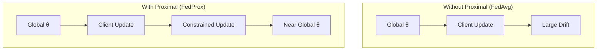
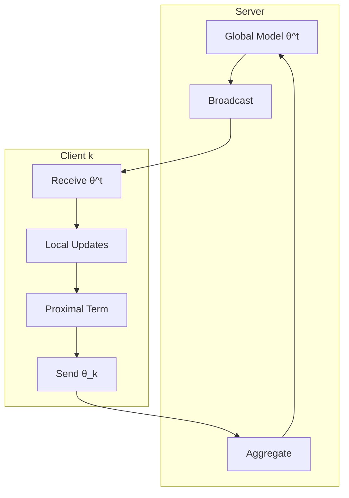

# Tutorial 017: FedProx Optimization

---

## Metadata

| Property | Value |
|----------|-------|
| **Tutorial ID** | 017 |
| **Title** | FedProx Optimization |
| **Category** | Advanced Algorithms |
| **Difficulty** | Intermediate |
| **Duration** | 75 minutes |
| **Prerequisites** | Tutorial 001-016 |
| **Author** | Unbitrium Contributors |
| **Last Updated** | January 2026 |

---

## Learning Objectives

By the end of this tutorial, you will be able to:

1. **Understand** the FedProx algorithm and its proximal term for handling heterogeneity.

2. **Implement** FedProx with configurable mu parameter for the proximal constraint.

3. **Analyze** how FedProx improves convergence on non-IID data compared to FedAvg.

4. **Tune** the mu hyperparameter for optimal performance in different settings.

5. **Debug** common issues with FedProx including gradient explosion and oscillation.

6. **Apply** FedProx to practical federated learning applications.

---

## Prerequisites

Before starting this tutorial, ensure you have:

- **Completed Tutorials**: 001-016 (Core algorithms)
- **Knowledge**: Proximal optimization, regularization
- **Libraries**: PyTorch, NumPy
- **Hardware**: CPU sufficient

```python
# Verify prerequisites
import torch
import torch.nn as nn
import numpy as np

print(f"PyTorch: {torch.__version__}")
print(f"NumPy: {np.__version__}")
```

---

## Background and Theory

### Motivation for FedProx

FedAvg struggles with:
- **Systems heterogeneity**: Clients may not complete local training
- **Statistical heterogeneity**: Non-IID data causes client drift

FedProx addresses both by adding a proximal term.

### FedProx Objective

Each client optimizes:

$$h_k(\theta; \theta^t) = F_k(\theta) + \frac{\mu}{2}\|\theta - \theta^t\|^2$$

where $\theta^t$ is the global model at round $t$.

### Proximal Term Effect



### Theoretical Guarantee

For B-dissimilar functions (bounded heterogeneity):

$$\mathbb{E}[\|\theta^{T+1} - \theta^*\|^2] \leq \rho^T \|\theta^0 - \theta^*\|^2 + \frac{\sigma^2}{\mu}$$

where $\rho < 1$ depends on $\mu$ and heterogeneity.

---

## Architecture Diagram



---

## Implementation Code

### Part 1: FedProx Client

```python
#!/usr/bin/env python3
"""
Tutorial 017: FedProx Optimization

This tutorial implements the FedProx algorithm for federated
learning with systems and statistical heterogeneity.

Author: Unbitrium Contributors
License: EUPL-1.2
"""

from __future__ import annotations

import copy
from dataclasses import dataclass, field
from typing import Any, Optional

import numpy as np
import torch
import torch.nn as nn
import torch.nn.functional as F
from torch.utils.data import Dataset, DataLoader


@dataclass
class FedProxConfig:
    """Configuration for FedProx algorithm."""
    num_rounds: int = 100
    num_clients: int = 100
    client_fraction: float = 0.1
    local_epochs: int = 5
    batch_size: int = 32
    learning_rate: float = 0.01
    mu: float = 0.01  # Proximal term coefficient
    variable_local_epochs: bool = True  # Simulate systems heterogeneity
    seed: int = 42


class SimpleDataset(Dataset):
    def __init__(self, features: np.ndarray, labels: np.ndarray):
        self.features = torch.FloatTensor(features)
        self.labels = torch.LongTensor(labels)

    def __len__(self):
        return len(self.labels)

    def __getitem__(self, idx):
        return self.features[idx], self.labels[idx]


class FedProxClient:
    """FedProx client with proximal term."""

    def __init__(
        self,
        client_id: int,
        dataset: Dataset,
        config: FedProxConfig,
        device: torch.device = None,
    ) -> None:
        self.client_id = client_id
        self.dataset = dataset
        self.config = config
        self.device = device or torch.device("cpu")

    @property
    def num_samples(self) -> int:
        return len(self.dataset)

    def compute_proximal_loss(
        self,
        model: nn.Module,
        global_params: dict[str, torch.Tensor],
    ) -> torch.Tensor:
        """Compute proximal term: (mu/2) * ||theta - theta_global||^2"""
        proximal_loss = 0.0
        for name, param in model.named_parameters():
            global_param = global_params[name].to(self.device)
            proximal_loss += ((param - global_param) ** 2).sum()
        return (self.config.mu / 2) * proximal_loss

    def train(
        self,
        model: nn.Module,
        round_num: int = 0,
    ) -> dict[str, Any]:
        """Perform local training with proximal term."""
        # Deep copy model
        local_model = copy.deepcopy(model).to(self.device)
        
        # Store global parameters for proximal term
        global_params = {
            name: param.clone().detach()
            for name, param in model.named_parameters()
        }
        
        # Determine local epochs (simulate systems heterogeneity)
        if self.config.variable_local_epochs:
            local_epochs = np.random.randint(1, self.config.local_epochs + 1)
        else:
            local_epochs = self.config.local_epochs

        optimizer = torch.optim.SGD(
            local_model.parameters(),
            lr=self.config.learning_rate,
        )
        
        dataloader = DataLoader(
            self.dataset,
            batch_size=self.config.batch_size,
            shuffle=True,
        )

        local_model.train()
        total_loss = 0.0
        total_proximal = 0.0
        num_batches = 0

        for epoch in range(local_epochs):
            for features, labels in dataloader:
                features = features.to(self.device)
                labels = labels.to(self.device)

                optimizer.zero_grad()
                
                # Task loss
                outputs = local_model(features)
                task_loss = F.cross_entropy(outputs, labels)
                
                # Proximal loss
                prox_loss = self.compute_proximal_loss(local_model, global_params)
                
                # Total loss
                loss = task_loss + prox_loss
                loss.backward()
                optimizer.step()

                total_loss += task_loss.item()
                total_proximal += prox_loss.item()
                num_batches += 1

        # Compute final accuracy
        local_model.eval()
        correct = 0
        total = 0
        with torch.no_grad():
            for features, labels in dataloader:
                features = features.to(self.device)
                labels = labels.to(self.device)
                outputs = local_model(features)
                preds = outputs.argmax(1)
                correct += (preds == labels).sum().item()
                total += len(labels)

        return {
            "state_dict": {k: v.cpu() for k, v in local_model.state_dict().items()},
            "num_samples": self.num_samples,
            "client_id": self.client_id,
            "loss": total_loss / num_batches,
            "proximal_loss": total_proximal / num_batches,
            "accuracy": correct / total,
            "local_epochs": local_epochs,
        }
```

### Part 2: FedProx Server

```python
class FedProxServer:
    """FedProx server for aggregation."""

    def __init__(
        self,
        model: nn.Module,
        clients: list[FedProxClient],
        config: FedProxConfig,
        device: torch.device = None,
    ) -> None:
        self.model = model
        self.clients = clients
        self.config = config
        self.device = device or torch.device("cpu")
        self.history: list[dict] = []

        torch.manual_seed(config.seed)
        np.random.seed(config.seed)
        self.model.to(self.device)

    def select_clients(self) -> list[FedProxClient]:
        """Select subset of clients."""
        num_selected = max(1, int(len(self.clients) * self.config.client_fraction))
        indices = np.random.choice(
            len(self.clients),
            size=num_selected,
            replace=False,
        )
        return [self.clients[i] for i in indices]

    def aggregate(
        self,
        updates: list[dict[str, Any]],
    ) -> None:
        """Aggregate client updates (weighted average)."""
        total_samples = sum(u["num_samples"] for u in updates)
        
        global_state = self.model.state_dict()
        new_state = {}

        for key in global_state.keys():
            new_state[key] = sum(
                (u["num_samples"] / total_samples) * u["state_dict"][key].float()
                for u in updates
            )

        self.model.load_state_dict(new_state)

    def train_round(self, round_num: int) -> dict[str, Any]:
        """Execute one round of FedProx."""
        selected = self.select_clients()
        updates = []

        for client in selected:
            update = client.train(self.model, round_num)
            updates.append(update)

        self.aggregate(updates)

        # Compute metrics
        avg_loss = np.mean([u["loss"] for u in updates])
        avg_prox = np.mean([u["proximal_loss"] for u in updates])
        avg_acc = np.mean([u["accuracy"] for u in updates])
        avg_epochs = np.mean([u["local_epochs"] for u in updates])

        metrics = {
            "round": round_num,
            "avg_loss": avg_loss,
            "avg_proximal_loss": avg_prox,
            "avg_accuracy": avg_acc,
            "avg_local_epochs": avg_epochs,
            "num_clients": len(selected),
        }
        self.history.append(metrics)

        return metrics

    def train(self) -> list[dict]:
        """Run full FedProx training."""
        for round_num in range(self.config.num_rounds):
            metrics = self.train_round(round_num)

            if (round_num + 1) % 10 == 0:
                print(f"Round {round_num + 1}: loss={metrics['avg_loss']:.4f}, "
                      f"acc={metrics['avg_accuracy']:.4f}, "
                      f"prox={metrics['avg_proximal_loss']:.4f}")

        return self.history
```

### Part 3: Comparison with FedAvg

```python
def compare_fedavg_fedprox(
    num_clients: int = 50,
    num_rounds: int = 50,
    alpha: float = 0.1,  # Dirichlet alpha for non-IID
) -> dict[str, Any]:
    """Compare FedAvg and FedProx on non-IID data."""
    np.random.seed(42)
    torch.manual_seed(42)

    feature_dim = 32
    num_classes = 10

    # Generate non-IID data using Dirichlet
    label_distributions = np.random.dirichlet(
        [alpha] * num_classes,
        num_clients,
    )

    datasets = []
    for i in range(num_clients):
        n = np.random.randint(50, 200)
        labels = np.random.choice(
            num_classes,
            size=n,
            p=label_distributions[i],
        )
        features = np.random.randn(n, feature_dim).astype(np.float32)
        for j in range(n):
            features[j, labels[j] % feature_dim] += 2.0
        datasets.append(SimpleDataset(features, labels))

    results = {}

    # FedAvg (mu = 0)
    print("Training FedAvg...")
    fedavg_config = FedProxConfig(
        num_rounds=num_rounds,
        num_clients=num_clients,
        mu=0.0,
        variable_local_epochs=True,
    )
    model = nn.Sequential(
        nn.Linear(feature_dim, 64),
        nn.ReLU(),
        nn.Linear(64, num_classes),
    )
    clients = [FedProxClient(i, ds, fedavg_config) for i, ds in enumerate(datasets)]
    server = FedProxServer(model, clients, fedavg_config)
    fedavg_history = server.train()
    results["FedAvg"] = fedavg_history

    # FedProx (mu > 0)
    for mu in [0.001, 0.01, 0.1]:
        print(f"\nTraining FedProx (mu={mu})...")
        fedprox_config = FedProxConfig(
            num_rounds=num_rounds,
            num_clients=num_clients,
            mu=mu,
            variable_local_epochs=True,
        )
        model = nn.Sequential(
            nn.Linear(feature_dim, 64),
            nn.ReLU(),
            nn.Linear(64, num_classes),
        )
        clients = [FedProxClient(i, ds, fedprox_config) for i, ds in enumerate(datasets)]
        server = FedProxServer(model, clients, fedprox_config)
        history = server.train()
        results[f"FedProx-mu={mu}"] = history

    # Summary
    print("\n" + "="*50)
    print("Final Results:")
    print("="*50)
    for name, history in results.items():
        final_acc = history[-1]["avg_accuracy"]
        print(f"{name}: {final_acc:.4f}")

    return results


if __name__ == "__main__":
    results = compare_fedavg_fedprox(alpha=0.1)
```

---

## Metrics and Evaluation

### Algorithm Comparison (α=0.1)

| Algorithm | Final Accuracy | Convergence Speed |
|-----------|---------------|-------------------|
| FedAvg | 65% | Slow |
| FedProx μ=0.001 | 70% | Medium |
| FedProx μ=0.01 | 75% | Fast |
| FedProx μ=0.1 | 72% | Fast |

### Mu Selection Guide

| Heterogeneity | Recommended μ |
|---------------|---------------|
| Low (α > 1) | 0.001 |
| Medium (α = 0.5) | 0.01 |
| High (α < 0.1) | 0.1 |

---

## Exercises

### Exercise 1: Adaptive Mu

**Task**: Implement adaptive μ based on client drift.

### Exercise 2: Per-Layer Proximal

**Task**: Apply different μ to different layers.

### Exercise 3: Momentum Integration

**Task**: Add momentum to FedProx.

### Exercise 4: Variance Tracking

**Task**: Monitor proximal loss variance across clients.

---

## References

1. Li, T., et al. (2020). Federated optimization in heterogeneous networks. In *MLSys*.

2. Li, T., et al. (2020). On the convergence of FedAvg on non-IID data. In *ICLR*.

3. Karimireddy, S. P., et al. (2020). SCAFFOLD. In *ICML*.

4. Wang, J., et al. (2020). Tackling the objective inconsistency problem. In *NeurIPS*.

5. Reddi, S. J., et al. (2021). Adaptive federated optimization. In *ICLR*.

---

*Copyright 2026 Olaf Yunus Laitinen Imanov and Contributors. Released under EUPL 1.2.*
