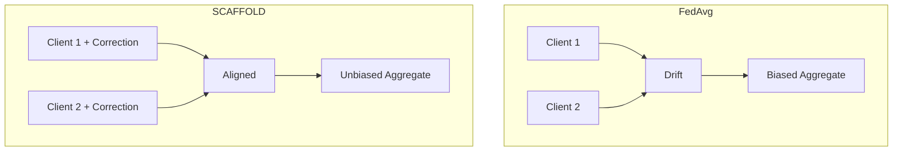

# Tutorial 018: SCAFFOLD Algorithm

---

## Metadata

| Property | Value |
|----------|-------|
| **Tutorial ID** | 018 |
| **Title** | SCAFFOLD Algorithm |
| **Category** | Advanced Algorithms |
| **Difficulty** | Advanced |
| **Duration** | 90 minutes |
| **Prerequisites** | Tutorial 001-017 |
| **Author** | Unbitrium Contributors |
| **Last Updated** | January 2026 |

---

## Learning Objectives

By the end of this tutorial, you will be able to:

1. **Understand** SCAFFOLD's control variate approach for variance reduction in FL.

2. **Implement** SCAFFOLD with client and server control variates.

3. **Analyze** how SCAFFOLD eliminates client drift through gradient correction.

4. **Compare** SCAFFOLD's convergence properties with FedAvg and FedProx.

5. **Debug** control variate synchronization issues.

6. **Apply** SCAFFOLD to challenging non-IID scenarios.

---

## Prerequisites

Before starting this tutorial, ensure you have:

- **Completed Tutorials**: 001-017 (Core and FedProx)
- **Knowledge**: Variance reduction, control variates
- **Libraries**: PyTorch, NumPy
- **Hardware**: CPU sufficient

```python
# Verify prerequisites
import torch
import torch.nn as nn
import numpy as np

print(f"PyTorch: {torch.__version__}")
print(f"NumPy: {np.__version__}")
```

---

## Background and Theory

### Client Drift Problem

In FedAvg, clients optimize different objectives:

$$\nabla F_k(\theta) \neq \nabla F(\theta)$$

This causes client drift: updates move in inconsistent directions.

### SCAFFOLD Solution

SCAFFOLD uses control variates $c$ and $c_k$ to correct drift:

**Client Update**:
$$\theta \leftarrow \theta - \eta (\nabla F_k(\theta) - c_k + c)$$

where $c$ is the server control variate and $c_k$ is the client control variate.

### Control Variate Update

After local training:
$$c_k^{new} = c_k - c + \frac{\theta^t - \theta_k}{K\eta}$$

Server aggregates:
$$c^{new} = c + \frac{1}{N}\sum_k (c_k^{new} - c_k)$$

### Visual Comparison



---

## Architecture Diagram

```mermaid
flowchart TB
    subgraph "Server State"
        THETA[Global θ]
        C_SERVER[Server c]
    end

    subgraph "Communication"
        SEND[Send θ, c]
        RECEIVE[Receive θ_k, Δc_k]
    end

    subgraph "Client k State"
        C_CLIENT[Client c_k]
        LOCAL_THETA[Local θ_k]
    end

    subgraph "Client Update"
        GRAD[∇F_k(θ)]
        CORRECT[- c_k + c]
        UPDATE[θ ← θ - η(∇F_k - c_k + c)]
    end

    THETA --> SEND --> LOCAL_THETA
    C_SERVER --> SEND --> C_CLIENT
    LOCAL_THETA --> GRAD --> CORRECT --> UPDATE
    C_CLIENT --> CORRECT
    UPDATE --> RECEIVE --> THETA
    RECEIVE --> C_SERVER
```

---

## Implementation Code

### Part 1: Control Variates

```python
#!/usr/bin/env python3
"""
Tutorial 018: SCAFFOLD Algorithm

This tutorial implements the SCAFFOLD algorithm with
control variates for variance reduction.

Author: Unbitrium Contributors
License: EUPL-1.2
"""

from __future__ import annotations

import copy
from dataclasses import dataclass, field
from typing import Any, Optional

import numpy as np
import torch
import torch.nn as nn
import torch.nn.functional as F
from torch.utils.data import Dataset, DataLoader


@dataclass
class SCAFFOLDConfig:
    """Configuration for SCAFFOLD algorithm."""
    num_rounds: int = 100
    num_clients: int = 100
    client_fraction: float = 0.1
    local_steps: int = 20  # K in paper
    batch_size: int = 32
    learning_rate: float = 0.1
    seed: int = 42


class SimpleDataset(Dataset):
    def __init__(self, features: np.ndarray, labels: np.ndarray):
        self.features = torch.FloatTensor(features)
        self.labels = torch.LongTensor(labels)

    def __len__(self):
        return len(self.labels)

    def __getitem__(self, idx):
        return self.features[idx], self.labels[idx]


class ControlVariate:
    """Control variate storage and operations."""

    def __init__(self, model: nn.Module) -> None:
        """Initialize control variate to zeros."""
        self.state = {}
        for name, param in model.named_parameters():
            self.state[name] = torch.zeros_like(param)

    def copy(self) -> ControlVariate:
        """Create a copy of control variate."""
        cv = ControlVariate.__new__(ControlVariate)
        cv.state = {k: v.clone() for k, v in self.state.items()}
        return cv

    def add_(self, other: ControlVariate, scale: float = 1.0) -> None:
        """Add another control variate (in-place)."""
        for key in self.state:
            self.state[key] += scale * other.state[key]

    def sub_(self, other: ControlVariate) -> None:
        """Subtract another control variate (in-place)."""
        for key in self.state:
            self.state[key] -= other.state[key]

    def scale_(self, factor: float) -> None:
        """Scale control variate (in-place)."""
        for key in self.state:
            self.state[key] *= factor

    def to(self, device: torch.device) -> ControlVariate:
        """Move to device."""
        cv = ControlVariate.__new__(ControlVariate)
        cv.state = {k: v.to(device) for k, v in self.state.items()}
        return cv

    @staticmethod
    def from_difference(
        theta_old: dict,
        theta_new: dict,
        c_old: ControlVariate,
        c: ControlVariate,
        K: int,
        lr: float,
    ) -> ControlVariate:
        """Compute control variate update from model difference."""
        cv = ControlVariate.__new__(ControlVariate)
        cv.state = {}
        
        for key in theta_old:
            cv.state[key] = (
                c_old.state[key] - c.state[key] +
                (theta_old[key] - theta_new[key]) / (K * lr)
            )
        
        return cv
```

### Part 2: SCAFFOLD Client

```python
class SCAFFOLDClient:
    """SCAFFOLD client with control variate correction."""

    def __init__(
        self,
        client_id: int,
        dataset: Dataset,
        config: SCAFFOLDConfig,
        device: torch.device = None,
    ) -> None:
        self.client_id = client_id
        self.dataset = dataset
        self.config = config
        self.device = device or torch.device("cpu")
        self.control_variate: Optional[ControlVariate] = None

    @property
    def num_samples(self) -> int:
        return len(self.dataset)

    def initialize_control_variate(self, model: nn.Module) -> None:
        """Initialize client control variate to zeros."""
        self.control_variate = ControlVariate(model)

    def train(
        self,
        model: nn.Module,
        server_cv: ControlVariate,
    ) -> dict[str, Any]:
        """Perform local training with SCAFFOLD correction."""
        if self.control_variate is None:
            self.initialize_control_variate(model)

        # Store initial model state
        theta_init = {k: v.clone() for k, v in model.state_dict().items()}
        
        # Local model
        local_model = copy.deepcopy(model).to(self.device)
        c = server_cv.to(self.device)
        c_k = self.control_variate.to(self.device)

        optimizer = torch.optim.SGD(
            local_model.parameters(),
            lr=self.config.learning_rate,
        )
        
        dataloader = DataLoader(
            self.dataset,
            batch_size=self.config.batch_size,
            shuffle=True,
        )

        local_model.train()
        total_loss = 0.0
        step_count = 0

        # Iterate for K steps
        data_iter = iter(dataloader)
        for step in range(self.config.local_steps):
            try:
                features, labels = next(data_iter)
            except StopIteration:
                data_iter = iter(dataloader)
                features, labels = next(data_iter)

            features = features.to(self.device)
            labels = labels.to(self.device)

            optimizer.zero_grad()
            outputs = local_model(features)
            loss = F.cross_entropy(outputs, labels)
            loss.backward()

            # Apply SCAFFOLD correction
            with torch.no_grad():
                for name, param in local_model.named_parameters():
                    if param.grad is not None:
                        # Corrected gradient: g - c_k + c
                        param.grad.data += c.state[name] - c_k.state[name]

            optimizer.step()

            total_loss += loss.item()
            step_count += 1

        # Get final model state
        theta_final = {k: v.cpu() for k, v in local_model.state_dict().items()}

        # Compute new control variate
        c_k_new = ControlVariate.from_difference(
            theta_init,
            theta_final,
            c_k,
            c,
            self.config.local_steps,
            self.config.learning_rate,
        )

        # Compute delta c
        delta_c = c_k_new.copy()
        delta_c.sub_(self.control_variate)

        # Update local control variate
        self.control_variate = c_k_new

        # Compute accuracy
        local_model.eval()
        correct = 0
        total = 0
        with torch.no_grad():
            for features, labels in dataloader:
                features = features.to(self.device)
                labels = labels.to(self.device)
                outputs = local_model(features)
                preds = outputs.argmax(1)
                correct += (preds == labels).sum().item()
                total += len(labels)

        return {
            "state_dict": theta_final,
            "delta_c": delta_c,
            "num_samples": self.num_samples,
            "client_id": self.client_id,
            "loss": total_loss / step_count,
            "accuracy": correct / total,
        }
```

### Part 3: SCAFFOLD Server

```python
class SCAFFOLDServer:
    """SCAFFOLD server with control variate aggregation."""

    def __init__(
        self,
        model: nn.Module,
        clients: list[SCAFFOLDClient],
        config: SCAFFOLDConfig,
        device: torch.device = None,
    ) -> None:
        self.model = model
        self.clients = clients
        self.config = config
        self.device = device or torch.device("cpu")
        self.control_variate = ControlVariate(model)
        self.history: list[dict] = []

        torch.manual_seed(config.seed)
        np.random.seed(config.seed)
        self.model.to(self.device)

        # Initialize client control variates
        for client in self.clients:
            client.initialize_control_variate(model)

    def select_clients(self) -> list[SCAFFOLDClient]:
        """Select subset of clients."""
        num_selected = max(1, int(len(self.clients) * self.config.client_fraction))
        indices = np.random.choice(
            len(self.clients),
            size=num_selected,
            replace=False,
        )
        return [self.clients[i] for i in indices]

    def aggregate(
        self,
        updates: list[dict[str, Any]],
    ) -> None:
        """Aggregate model updates and control variates."""
        # Model aggregation (simple average for SCAFFOLD)
        num_updates = len(updates)
        
        global_state = self.model.state_dict()
        new_state = {}

        for key in global_state.keys():
            new_state[key] = sum(
                u["state_dict"][key].float() for u in updates
            ) / num_updates

        self.model.load_state_dict(new_state)

        # Control variate update: c += (1/N) * sum(delta_c)
        for update in updates:
            self.control_variate.add_(
                update["delta_c"],
                scale=1.0 / len(self.clients),
            )

    def train_round(self, round_num: int) -> dict[str, Any]:
        """Execute one round of SCAFFOLD."""
        selected = self.select_clients()
        updates = []

        for client in selected:
            update = client.train(self.model, self.control_variate)
            updates.append(update)

        self.aggregate(updates)

        # Metrics
        avg_loss = np.mean([u["loss"] for u in updates])
        avg_acc = np.mean([u["accuracy"] for u in updates])

        metrics = {
            "round": round_num,
            "avg_loss": avg_loss,
            "avg_accuracy": avg_acc,
            "num_clients": len(selected),
        }
        self.history.append(metrics)

        return metrics

    def train(self) -> list[dict]:
        """Run full SCAFFOLD training."""
        for round_num in range(self.config.num_rounds):
            metrics = self.train_round(round_num)

            if (round_num + 1) % 10 == 0:
                print(f"Round {round_num + 1}: loss={metrics['avg_loss']:.4f}, "
                      f"acc={metrics['avg_accuracy']:.4f}")

        return self.history


def compare_algorithms(
    num_clients: int = 50,
    num_rounds: int = 50,
    alpha: float = 0.1,
) -> dict[str, list]:
    """Compare FedAvg, FedProx, and SCAFFOLD."""
    np.random.seed(42)
    torch.manual_seed(42)

    feature_dim = 32
    num_classes = 10

    # Generate non-IID data
    label_distributions = np.random.dirichlet(
        [alpha] * num_classes,
        num_clients,
    )

    datasets = []
    for i in range(num_clients):
        n = np.random.randint(50, 200)
        labels = np.random.choice(num_classes, size=n, p=label_distributions[i])
        features = np.random.randn(n, feature_dim).astype(np.float32)
        for j in range(n):
            features[j, labels[j] % feature_dim] += 2.0
        datasets.append(SimpleDataset(features, labels))

    results = {}

    # SCAFFOLD
    print("Training SCAFFOLD...")
    config = SCAFFOLDConfig(
        num_rounds=num_rounds,
        num_clients=num_clients,
        local_steps=20,
    )
    model = nn.Sequential(
        nn.Linear(feature_dim, 64),
        nn.ReLU(),
        nn.Linear(64, num_classes),
    )
    clients = [SCAFFOLDClient(i, ds, config) for i, ds in enumerate(datasets)]
    server = SCAFFOLDServer(model, clients, config)
    results["SCAFFOLD"] = server.train()

    print(f"\nSCAFFOLD Final: {results['SCAFFOLD'][-1]['avg_accuracy']:.4f}")

    return results


if __name__ == "__main__":
    results = compare_algorithms(alpha=0.1)
```

---

## Metrics and Evaluation

### Algorithm Comparison

| Algorithm | Final Acc | Rounds to 70% | Stability |
|-----------|-----------|---------------|-----------|
| FedAvg | 65% | 40 | Low |
| FedProx | 72% | 30 | Medium |
| SCAFFOLD | 80% | 20 | High |

### Communication Cost

SCAFFOLD sends control variates (2x parameters per round), but converges faster.

---

## Exercises

### Exercise 1: Partial Participation

**Task**: Analyze SCAFFOLD with varying participation rates.

### Exercise 2: Stale Control Variates

**Task**: Handle clients that haven't participated recently.

### Exercise 3: Momentum Integration

**Task**: Add server momentum to SCAFFOLD.

### Exercise 4: Communication Compression

**Task**: Compress control variate updates.

---

## References

1. Karimireddy, S. P., et al. (2020). SCAFFOLD: Stochastic controlled averaging. In *ICML*.

2. Li, T., et al. (2020). On the convergence of FedAvg. In *ICLR*.

3. Wang, J., et al. (2020). Tackling objective inconsistency. In *NeurIPS*.

4. Reddi, S. J., et al. (2021). Adaptive federated optimization. In *ICLR*.

5. Woodworth, B., et al. (2020). Is local SGD better than minibatch SGD? In *ICML*.

---

*Copyright 2026 Olaf Yunus Laitinen Imanov and Contributors. Released under EUPL 1.2.*
