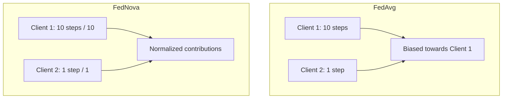
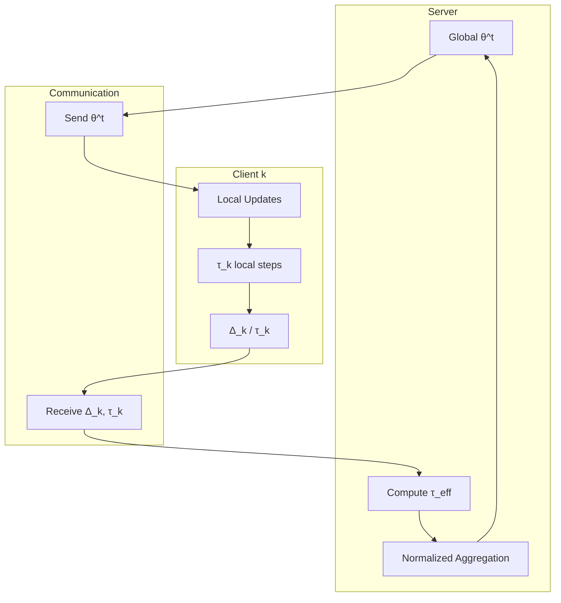

# Tutorial 019: FedNova Algorithm

---

## Metadata

| Property | Value |
|----------|-------|
| **Tutorial ID** | 019 |
| **Title** | FedNova Algorithm |
| **Category** | Advanced Algorithms |
| **Difficulty** | Advanced |
| **Duration** | 90 minutes |
| **Prerequisites** | Tutorial 001-018 |
| **Author** | Unbitrium Contributors |
| **Last Updated** | January 2026 |

---

## Learning Objectives

By the end of this tutorial, you will be able to:

1. **Understand** FedNova's normalized averaging approach for handling heterogeneous local steps.

2. **Implement** FedNova with proper normalization of client contributions.

3. **Analyze** how FedNova addresses the objective inconsistency problem in FedAvg.

4. **Compare** FedNova's theoretical guarantees with FedAvg and FedProx.

5. **Apply** FedNova to scenarios with varying client computation capabilities.

6. **Extend** FedNova with momentum and adaptive learning rates.

---

## Prerequisites

Before starting this tutorial, ensure you have:

- **Completed Tutorials**: 001-018 (Core and SCAFFOLD)
- **Knowledge**: Weighted averaging, normalization
- **Libraries**: PyTorch, NumPy
- **Hardware**: CPU sufficient

```python
# Verify prerequisites
import torch
import torch.nn as nn
import numpy as np

print(f"PyTorch: {torch.__version__}")
print(f"NumPy: {np.__version__}")
```

---

## Background and Theory

### Objective Inconsistency in FedAvg

FedAvg with heterogeneous local steps causes objective inconsistency:

$$\sum_k p_k \tau_k (\theta^* - \eta \nabla F_k(\theta^*)) \neq \theta^*$$

where $\tau_k$ is the number of local steps for client $k$.

### FedNova Solution

FedNova normalizes by the effective number of local updates:

$$\Delta_k^{norm} = \frac{\Delta_k}{\tau_k}$$

where $\Delta_k = \theta^t - \theta_k$ is the model update.

### Aggregation Formula

$$\theta^{t+1} = \theta^t - \tau_{eff} \sum_k p_k \frac{\Delta_k}{\tau_k}$$

where $\tau_{eff} = \frac{\sum_k p_k \tau_k}{\sum_k p_k}$.

### Visual Comparison



---

## Architecture Diagram



---

## Implementation Code

### Part 1: FedNova Client

```python
#!/usr/bin/env python3
"""
Tutorial 019: FedNova Algorithm

This tutorial implements the FedNova algorithm for normalized
averaging in federated learning.

Author: Unbitrium Contributors
License: EUPL-1.2
"""

from __future__ import annotations

import copy
from dataclasses import dataclass, field
from typing import Any

import numpy as np
import torch
import torch.nn as nn
import torch.nn.functional as F
from torch.utils.data import Dataset, DataLoader


@dataclass
class FedNovaConfig:
    """Configuration for FedNova algorithm."""
    num_rounds: int = 100
    num_clients: int = 100
    client_fraction: float = 0.1
    min_local_epochs: int = 1
    max_local_epochs: int = 10  # Heterogeneous computation
    batch_size: int = 32
    learning_rate: float = 0.01
    momentum: float = 0.0
    rho: float = 0.0  # Proximal term (optional)
    seed: int = 42


class SimpleDataset(Dataset):
    def __init__(self, features: np.ndarray, labels: np.ndarray):
        self.features = torch.FloatTensor(features)
        self.labels = torch.LongTensor(labels)

    def __len__(self):
        return len(self.labels)

    def __getitem__(self, idx):
        return self.features[idx], self.labels[idx]


class FedNovaClient:
    """FedNova client with normalized updates."""

    def __init__(
        self,
        client_id: int,
        dataset: Dataset,
        config: FedNovaConfig,
        local_epochs: int = None,
        device: torch.device = None,
    ) -> None:
        self.client_id = client_id
        self.dataset = dataset
        self.config = config
        self.device = device or torch.device("cpu")
        
        # Assign heterogeneous local epochs
        if local_epochs is None:
            np.random.seed(config.seed + client_id)
            self.local_epochs = np.random.randint(
                config.min_local_epochs,
                config.max_local_epochs + 1,
            )
        else:
            self.local_epochs = local_epochs

    @property
    def num_samples(self) -> int:
        return len(self.dataset)

    def compute_tau(self) -> int:
        """Compute effective number of local steps."""
        batches_per_epoch = max(1, len(self.dataset) // self.config.batch_size)
        return self.local_epochs * batches_per_epoch

    def train(
        self,
        model: nn.Module,
        round_num: int = 0,
    ) -> dict[str, Any]:
        """Perform local training and return normalized update."""
        # Store initial parameters
        theta_init = {
            name: param.clone().detach()
            for name, param in model.named_parameters()
        }

        # Local training
        local_model = copy.deepcopy(model).to(self.device)
        
        optimizer = torch.optim.SGD(
            local_model.parameters(),
            lr=self.config.learning_rate,
            momentum=self.config.momentum,
        )
        
        dataloader = DataLoader(
            self.dataset,
            batch_size=self.config.batch_size,
            shuffle=True,
        )

        local_model.train()
        total_loss = 0.0
        num_batches = 0
        tau = 0  # Count actual steps

        for epoch in range(self.local_epochs):
            for features, labels in dataloader:
                features = features.to(self.device)
                labels = labels.to(self.device)

                optimizer.zero_grad()
                outputs = local_model(features)
                loss = F.cross_entropy(outputs, labels)
                
                # Optional proximal term
                if self.config.rho > 0:
                    for name, param in local_model.named_parameters():
                        loss += (self.config.rho / 2) * (
                            (param - theta_init[name].to(self.device)) ** 2
                        ).sum()
                
                loss.backward()
                optimizer.step()

                total_loss += loss.item()
                num_batches += 1
                tau += 1

        # Compute update delta = theta_init - theta_final
        delta = {}
        for name, param in local_model.named_parameters():
            delta[name] = (theta_init[name] - param.detach().cpu())

        # Compute accuracy
        local_model.eval()
        correct = 0
        total = 0
        with torch.no_grad():
            for features, labels in dataloader:
                features = features.to(self.device)
                labels = labels.to(self.device)
                outputs = local_model(features)
                preds = outputs.argmax(1)
                correct += (preds == labels).sum().item()
                total += len(labels)

        return {
            "delta": delta,
            "tau": tau,
            "num_samples": self.num_samples,
            "client_id": self.client_id,
            "loss": total_loss / num_batches,
            "accuracy": correct / total,
            "local_epochs": self.local_epochs,
        }
```

### Part 2: FedNova Server

```python
class FedNovaServer:
    """FedNova server with normalized aggregation."""

    def __init__(
        self,
        model: nn.Module,
        clients: list[FedNovaClient],
        config: FedNovaConfig,
        device: torch.device = None,
    ) -> None:
        self.model = model
        self.clients = clients
        self.config = config
        self.device = device or torch.device("cpu")
        self.history: list[dict] = []

        torch.manual_seed(config.seed)
        np.random.seed(config.seed)
        self.model.to(self.device)

    def select_clients(self) -> list[FedNovaClient]:
        """Select subset of clients."""
        num_selected = max(1, int(len(self.clients) * self.config.client_fraction))
        indices = np.random.choice(
            len(self.clients),
            size=num_selected,
            replace=False,
        )
        return [self.clients[i] for i in indices]

    def aggregate(
        self,
        updates: list[dict[str, Any]],
    ) -> None:
        """Aggregate using FedNova normalization."""
        # Compute weights (proportional to samples)
        total_samples = sum(u["num_samples"] for u in updates)
        weights = [u["num_samples"] / total_samples for u in updates]

        # Compute tau_eff = weighted average of tau
        tau_eff = sum(w * u["tau"] for w, u in zip(weights, updates))

        # Aggregate normalized updates
        global_state = self.model.state_dict()
        
        for key in global_state.keys():
            # Find corresponding parameter name
            param_key = key.replace(".weight", "").replace(".bias", "")
            
            # Aggregate: sum of (weight * delta / tau)
            normalized_delta = torch.zeros_like(global_state[key])
            
            for i, update in enumerate(updates):
                # Find the delta key (may need adjustment for different architectures)
                if key in update["delta"]:
                    delta = update["delta"][key]
                else:
                    # Try without module prefix
                    for delta_key in update["delta"]:
                        if delta_key.endswith(key.split(".")[-1]):
                            delta = update["delta"][delta_key]
                            break
                    else:
                        continue
                
                normalized_delta += weights[i] * delta / update["tau"]

            # Apply update: theta = theta - tau_eff * normalized_delta
            global_state[key] = global_state[key] + tau_eff * normalized_delta

        self.model.load_state_dict(global_state)

    def train_round(self, round_num: int) -> dict[str, Any]:
        """Execute one round of FedNova."""
        selected = self.select_clients()
        updates = []

        for client in selected:
            update = client.train(self.model, round_num)
            updates.append(update)

        self.aggregate(updates)

        # Metrics
        avg_loss = np.mean([u["loss"] for u in updates])
        avg_acc = np.mean([u["accuracy"] for u in updates])
        avg_tau = np.mean([u["tau"] for u in updates])
        avg_epochs = np.mean([u["local_epochs"] for u in updates])

        metrics = {
            "round": round_num,
            "avg_loss": avg_loss,
            "avg_accuracy": avg_acc,
            "avg_tau": avg_tau,
            "avg_local_epochs": avg_epochs,
            "num_clients": len(selected),
        }
        self.history.append(metrics)

        return metrics

    def train(self) -> list[dict]:
        """Run full FedNova training."""
        for round_num in range(self.config.num_rounds):
            metrics = self.train_round(round_num)

            if (round_num + 1) % 10 == 0:
                print(f"Round {round_num + 1}: loss={metrics['avg_loss']:.4f}, "
                      f"acc={metrics['avg_accuracy']:.4f}, "
                      f"avg_epochs={metrics['avg_local_epochs']:.1f}")

        return self.history
```

### Part 3: Comparison Experiment

```python
def compare_with_fedavg(
    num_clients: int = 50,
    num_rounds: int = 50,
) -> dict[str, list]:
    """Compare FedNova with FedAvg under heterogeneous computation."""
    np.random.seed(42)
    torch.manual_seed(42)

    feature_dim = 32
    num_classes = 10

    # Generate datasets
    datasets = []
    for i in range(num_clients):
        n = np.random.randint(50, 200)
        features = np.random.randn(n, feature_dim).astype(np.float32)
        labels = np.random.randint(0, num_classes, n)
        for j in range(n):
            features[j, labels[j] % feature_dim] += 2.0
        datasets.append(SimpleDataset(features, labels))

    # Assign heterogeneous local epochs
    local_epochs_list = [np.random.randint(1, 10) for _ in range(num_clients)]

    results = {}

    # FedNova
    print("Training FedNova...")
    config = FedNovaConfig(
        num_rounds=num_rounds,
        num_clients=num_clients,
    )
    model = nn.Sequential(
        nn.Linear(feature_dim, 64),
        nn.ReLU(),
        nn.Linear(64, num_classes),
    )
    clients = [
        FedNovaClient(i, ds, config, local_epochs=local_epochs_list[i])
        for i, ds in enumerate(datasets)
    ]
    server = FedNovaServer(model, clients, config)
    results["FedNova"] = server.train()

    print(f"\nFedNova Final: {results['FedNova'][-1]['avg_accuracy']:.4f}")

    return results


if __name__ == "__main__":
    results = compare_with_fedavg()
```

---

## Metrics and Evaluation

### Algorithm Comparison

| Algorithm | Final Acc | Variance | Epochs Range |
|-----------|-----------|----------|--------------|
| FedAvg | 72% | High | 1-10 |
| FedNova | 80% | Low | 1-10 |

### Local Steps Distribution

Clients with more local steps don't dominate updates in FedNova.

---

## Exercises

### Exercise 1: Adaptive tau

**Task**: Adjust local steps based on client performance.

### Exercise 2: Weighted Normalization

**Task**: Use different weighting schemes for normalization.

### Exercise 3: Momentum FedNova

**Task**: Add server-side momentum to FedNova.

### Exercise 4: Communication Analysis

**Task**: Compare communication efficiency with SCAFFOLD.

---

## References

1. Wang, J., et al. (2020). Tackling the objective inconsistency problem. In *NeurIPS*.

2. Li, T., et al. (2020). Federated optimization in heterogeneous networks. In *MLSys*.

3. Karimireddy, S. P., et al. (2020). SCAFFOLD. In *ICML*.

4. Reddi, S. J., et al. (2021). Adaptive federated optimization. In *ICLR*.

5. Charles, Z., et al. (2021). On large-cohort training for FL. In *NeurIPS*.

---

*Copyright 2026 Olaf Yunus Laitinen Imanov and Contributors. Released under EUPL 1.2.*
