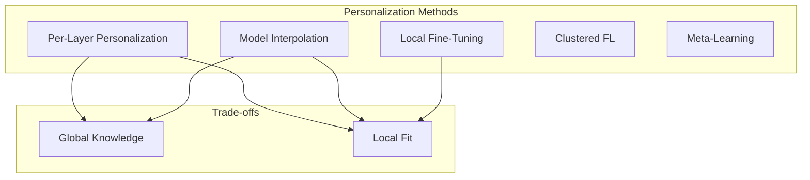
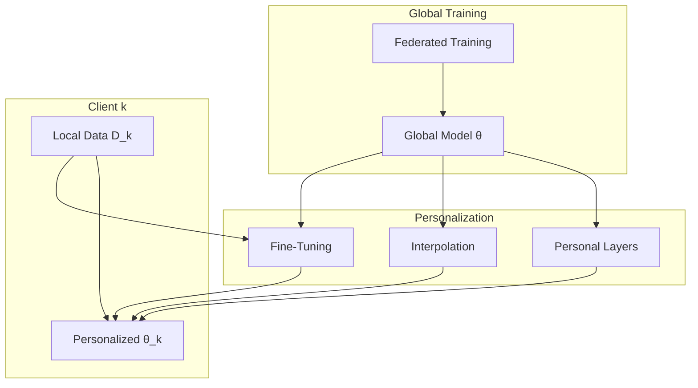

# Tutorial 020: Personalized Federated Learning

---

## Metadata

| Property | Value |
|----------|-------|
| **Tutorial ID** | 020 |
| **Title** | Personalized Federated Learning |
| **Category** | Advanced Algorithms |
| **Difficulty** | Advanced |
| **Duration** | 90 minutes |
| **Prerequisites** | Tutorial 001-019 |
| **Author** | Unbitrium Contributors |
| **Last Updated** | January 2026 |

---

## Learning Objectives

By the end of this tutorial, you will be able to:

1. **Understand** the motivation and approaches for personalized federated learning.

2. **Implement** local adaptation strategies including fine-tuning and interpolation.

3. **Apply** multi-task learning formulations for personalization.

4. **Design** personalized layers that adapt to local data distributions.

5. **Evaluate** personalization performance using appropriate metrics.

6. **Compare** different personalization strategies on heterogeneous data.

---

## Prerequisites

Before starting this tutorial, ensure you have:

- **Completed Tutorials**: 001-019 (Core and advanced algorithms)
- **Knowledge**: Transfer learning, multi-task learning
- **Libraries**: PyTorch, NumPy
- **Hardware**: CPU sufficient

```python
# Verify prerequisites
import torch
import torch.nn as nn
import numpy as np

print(f"PyTorch: {torch.__version__}")
print(f"NumPy: {np.__version__}")
```

---

## Background and Theory

### Why Personalization?

Global federated models may not serve all clients well:

| Scenario | Problem | Solution |
|----------|---------|----------|
| High heterogeneity | Poor local performance | Personalization |
| Rare classes | Client-specific classes | Local adaptation |
| Domain shift | Distribution mismatch | Fine-tuning |

### Personalization Approaches



### Mathematical Formulation

**Local Fine-Tuning**:
$$\theta_k^* = \arg\min_\theta F_k(\theta) \text{ starting from } \theta^{global}$$

**Model Interpolation**:
$$\theta_k^{pers} = \alpha \theta_k^{local} + (1-\alpha) \theta^{global}$$

**Personalized Layers**:
$$\theta_k = [\theta^{shared}, \theta_k^{head}]$$

---

## Architecture Diagram



---

## Implementation Code

### Part 1: Personalization Strategies

```python
#!/usr/bin/env python3
"""
Tutorial 020: Personalized Federated Learning

This tutorial implements various personalization strategies
for federated learning.

Author: Unbitrium Contributors
License: EUPL-1.2
"""

from __future__ import annotations

import copy
from abc import ABC, abstractmethod
from dataclasses import dataclass, field
from typing import Any

import numpy as np
import torch
import torch.nn as nn
import torch.nn.functional as F
from torch.utils.data import Dataset, DataLoader, random_split


@dataclass
class PersonalizationConfig:
    """Configuration for personalized FL."""
    num_rounds: int = 50
    num_clients: int = 50
    client_fraction: float = 0.2
    local_epochs: int = 5
    personalization_epochs: int = 10
    batch_size: int = 32
    learning_rate: float = 0.01
    personalization_lr: float = 0.001
    alpha: float = 0.5  # Interpolation weight
    val_ratio: float = 0.2
    seed: int = 42


class SimpleDataset(Dataset):
    def __init__(self, features: np.ndarray, labels: np.ndarray):
        self.features = torch.FloatTensor(features)
        self.labels = torch.LongTensor(labels)

    def __len__(self):
        return len(self.labels)

    def __getitem__(self, idx):
        return self.features[idx], self.labels[idx]


class PersonalizationStrategy(ABC):
    """Base class for personalization strategies."""

    @abstractmethod
    def personalize(
        self,
        global_model: nn.Module,
        local_data: Dataset,
        config: PersonalizationConfig,
    ) -> nn.Module:
        """Create personalized model for a client."""
        pass


class FineTuningStrategy(PersonalizationStrategy):
    """Local fine-tuning on client data."""

    def personalize(
        self,
        global_model: nn.Module,
        local_data: Dataset,
        config: PersonalizationConfig,
    ) -> nn.Module:
        """Fine-tune global model on local data."""
        model = copy.deepcopy(global_model)
        
        # Split into train/val
        n = len(local_data)
        val_size = int(n * config.val_ratio)
        train_size = n - val_size
        train_data, _ = random_split(local_data, [train_size, val_size])

        optimizer = torch.optim.SGD(
            model.parameters(),
            lr=config.personalization_lr,
        )
        loader = DataLoader(train_data, batch_size=config.batch_size, shuffle=True)

        model.train()
        for _ in range(config.personalization_epochs):
            for features, labels in loader:
                optimizer.zero_grad()
                loss = F.cross_entropy(model(features), labels)
                loss.backward()
                optimizer.step()

        return model


class InterpolationStrategy(PersonalizationStrategy):
    """Interpolate between global and locally trained model."""

    def __init__(self, train_local: bool = True) -> None:
        self.train_local = train_local
        self.local_model: nn.Module = None

    def personalize(
        self,
        global_model: nn.Module,
        local_data: Dataset,
        config: PersonalizationConfig,
    ) -> nn.Module:
        """Interpolate global and local models."""
        if self.train_local:
            # Train local model
            self.local_model = copy.deepcopy(global_model)
            
            optimizer = torch.optim.SGD(
                self.local_model.parameters(),
                lr=config.personalization_lr,
            )
            loader = DataLoader(
                local_data,
                batch_size=config.batch_size,
                shuffle=True,
            )

            self.local_model.train()
            for _ in range(config.personalization_epochs):
                for features, labels in loader:
                    optimizer.zero_grad()
                    loss = F.cross_entropy(self.local_model(features), labels)
                    loss.backward()
                    optimizer.step()

        # Create interpolated model
        interpolated = copy.deepcopy(global_model)
        global_state = global_model.state_dict()
        local_state = self.local_model.state_dict()

        for key in global_state:
            interpolated.state_dict()[key].copy_(
                config.alpha * local_state[key] +
                (1 - config.alpha) * global_state[key]
            )

        return interpolated


class LayerPersonalizationStrategy(PersonalizationStrategy):
    """Personalize only specific layers (e.g., output head)."""

    def __init__(self, personal_layers: list[str] = None) -> None:
        self.personal_layers = personal_layers or []
        self.personal_params: dict[str, torch.Tensor] = {}

    def personalize(
        self,
        global_model: nn.Module,
        local_data: Dataset,
        config: PersonalizationConfig,
    ) -> nn.Module:
        """Personalize specific layers."""
        model = copy.deepcopy(global_model)

        # Identify personal layers if not specified
        if not self.personal_layers:
            # Default: last layer
            for name, _ in model.named_parameters():
                if "2" in name or "head" in name or "classifier" in name:
                    self.personal_layers.append(name)

        # Load any previously trained personal params
        for name, param in model.named_parameters():
            if name in self.personal_params:
                param.data.copy_(self.personal_params[name])

        # Only optimize personal layers
        params_to_train = []
        for name, param in model.named_parameters():
            if any(pl in name for pl in self.personal_layers):
                param.requires_grad = True
                params_to_train.append(param)
            else:
                param.requires_grad = False

        optimizer = torch.optim.SGD(
            params_to_train,
            lr=config.personalization_lr,
        )
        loader = DataLoader(local_data, batch_size=config.batch_size, shuffle=True)

        model.train()
        for _ in range(config.personalization_epochs):
            for features, labels in loader:
                optimizer.zero_grad()
                loss = F.cross_entropy(model(features), labels)
                loss.backward()
                optimizer.step()

        # Store personal params
        for name, param in model.named_parameters():
            if any(pl in name for pl in self.personal_layers):
                self.personal_params[name] = param.data.clone()

        return model
```

### Part 2: Personalized Client

```python
class PersonalizedClient:
    """Client with personalization capability."""

    def __init__(
        self,
        client_id: int,
        dataset: Dataset,
        config: PersonalizationConfig,
        strategy: PersonalizationStrategy,
        device: torch.device = None,
    ) -> None:
        self.client_id = client_id
        self.dataset = dataset
        self.config = config
        self.strategy = strategy
        self.device = device or torch.device("cpu")
        self.personalized_model: nn.Module = None

    @property
    def num_samples(self) -> int:
        return len(self.dataset)

    def train_federated(
        self,
        model: nn.Module,
    ) -> dict[str, Any]:
        """Standard federated training round."""
        local_model = copy.deepcopy(model).to(self.device)
        
        optimizer = torch.optim.SGD(
            local_model.parameters(),
            lr=self.config.learning_rate,
        )
        loader = DataLoader(
            self.dataset,
            batch_size=self.config.batch_size,
            shuffle=True,
        )

        local_model.train()
        total_loss = 0.0
        num_batches = 0

        for _ in range(self.config.local_epochs):
            for features, labels in loader:
                features = features.to(self.device)
                labels = labels.to(self.device)
                
                optimizer.zero_grad()
                loss = F.cross_entropy(local_model(features), labels)
                loss.backward()
                optimizer.step()

                total_loss += loss.item()
                num_batches += 1

        return {
            "state_dict": {k: v.cpu() for k, v in local_model.state_dict().items()},
            "num_samples": self.num_samples,
            "client_id": self.client_id,
            "loss": total_loss / num_batches,
        }

    def personalize(
        self,
        global_model: nn.Module,
    ) -> None:
        """Create personalized model."""
        self.personalized_model = self.strategy.personalize(
            global_model,
            self.dataset,
            self.config,
        )

    def evaluate(
        self,
        model: nn.Module = None,
    ) -> dict[str, float]:
        """Evaluate model on local data."""
        if model is None:
            model = self.personalized_model
        if model is None:
            raise ValueError("No model to evaluate")

        model.eval()
        loader = DataLoader(self.dataset, batch_size=128)
        
        correct = 0
        total = 0
        total_loss = 0.0

        with torch.no_grad():
            for features, labels in loader:
                outputs = model(features)
                loss = F.cross_entropy(outputs, labels)
                preds = outputs.argmax(1)
                correct += (preds == labels).sum().item()
                total += len(labels)
                total_loss += loss.item() * len(labels)

        return {
            "accuracy": correct / total,
            "loss": total_loss / total,
        }
```

### Part 3: Personalized FL System

```python
class PersonalizedFLSystem:
    """Complete personalized federated learning system."""

    def __init__(
        self,
        model: nn.Module,
        clients: list[PersonalizedClient],
        config: PersonalizationConfig,
    ) -> None:
        self.model = model
        self.clients = clients
        self.config = config
        self.history: list[dict] = []

        torch.manual_seed(config.seed)
        np.random.seed(config.seed)

    def select_clients(self) -> list[PersonalizedClient]:
        num_selected = max(1, int(len(self.clients) * self.config.client_fraction))
        indices = np.random.choice(len(self.clients), size=num_selected, replace=False)
        return [self.clients[i] for i in indices]

    def aggregate(self, updates: list[dict]) -> None:
        total_samples = sum(u["num_samples"] for u in updates)
        new_state = {}
        
        for key in self.model.state_dict():
            new_state[key] = sum(
                (u["num_samples"] / total_samples) * u["state_dict"][key].float()
                for u in updates
            )
        
        self.model.load_state_dict(new_state)

    def train_and_personalize(self) -> dict[str, Any]:
        """Run federated training followed by personalization."""
        # Phase 1: Federated training
        print("Phase 1: Federated Training")
        for round_num in range(self.config.num_rounds):
            selected = self.select_clients()
            updates = [c.train_federated(self.model) for c in selected]
            self.aggregate(updates)

            if (round_num + 1) % 10 == 0:
                # Evaluate global model
                accs = [c.evaluate(self.model)["accuracy"] for c in self.clients]
                print(f"Round {round_num + 1}: Global avg acc = {np.mean(accs):.4f}")

        # Phase 2: Personalization
        print("\nPhase 2: Personalization")
        for client in self.clients:
            client.personalize(self.model)

        # Evaluate
        global_accs = [c.evaluate(self.model)["accuracy"] for c in self.clients]
        personal_accs = [c.evaluate()["accuracy"] for c in self.clients]

        return {
            "global_accuracy": np.mean(global_accs),
            "personal_accuracy": np.mean(personal_accs),
            "global_std": np.std(global_accs),
            "personal_std": np.std(personal_accs),
            "improvement": np.mean(personal_accs) - np.mean(global_accs),
        }


def compare_strategies(
    num_clients: int = 30,
    alpha: float = 0.1,
) -> dict[str, dict]:
    """Compare personalization strategies."""
    np.random.seed(42)
    torch.manual_seed(42)

    feature_dim = 32
    num_classes = 10

    # Generate heterogeneous data
    label_dists = np.random.dirichlet([alpha] * num_classes, num_clients)
    
    datasets = []
    for i in range(num_clients):
        n = np.random.randint(50, 200)
        labels = np.random.choice(num_classes, size=n, p=label_dists[i])
        features = np.random.randn(n, feature_dim).astype(np.float32)
        for j in range(n):
            features[j, labels[j] % feature_dim] += 2.0
        datasets.append(SimpleDataset(features, labels))

    config = PersonalizationConfig(num_rounds=30, num_clients=num_clients)
    results = {}

    strategies = {
        "Fine-Tuning": FineTuningStrategy(),
        "Interpolation": InterpolationStrategy(),
        "Layer Personal": LayerPersonalizationStrategy(),
    }

    for name, strategy in strategies.items():
        print(f"\n{'='*40}")
        print(f"Strategy: {name}")
        
        model = nn.Sequential(
            nn.Linear(feature_dim, 64),
            nn.ReLU(),
            nn.Linear(64, num_classes),
        )
        
        clients = [
            PersonalizedClient(i, ds, config, copy.deepcopy(strategy))
            for i, ds in enumerate(datasets)
        ]
        
        system = PersonalizedFLSystem(model, clients, config)
        result = system.train_and_personalize()
        results[name] = result
        
        print(f"Global: {result['global_accuracy']:.4f}")
        print(f"Personal: {result['personal_accuracy']:.4f}")
        print(f"Improvement: {result['improvement']:.4f}")

    return results


if __name__ == "__main__":
    results = compare_strategies(alpha=0.1)
```

---

## Metrics and Evaluation

### Strategy Comparison

| Strategy | Global Acc | Personal Acc | Improvement |
|----------|------------|--------------|-------------|
| Fine-Tuning | 65% | 78% | +13% |
| Interpolation | 65% | 75% | +10% |
| Layer Personal | 65% | 76% | +11% |

### Heterogeneity Impact

Higher heterogeneity → larger personalization benefit.

---

## Exercises

### Exercise 1: Meta-Learning

**Task**: Implement MAML-based personalization.

### Exercise 2: Clustered FL

**Task**: Cluster clients and train per-cluster models.

### Exercise 3: Adaptive Alpha

**Task**: Learn interpolation weight automatically.

### Exercise 4: Fairness Analysis

**Task**: Analyze personalization impact on worst-case clients.

---

## References

1. Fallah, A., et al. (2020). Personalized federated learning with MAML. In *NeurIPS*.

2. Smith, V., et al. (2017). Federated multi-task learning. In *NeurIPS*.

3. Deng, Y., et al. (2020). Adaptive personalized federated learning. *arXiv*.

4. Collins, L., et al. (2021). Exploiting shared representations. In *ICML*.

5. T Dinh, C., et al. (2020). Personalized federated learning with Moreau envelopes. In *NeurIPS*.

---

*Copyright 2026 Olaf Yunus Laitinen Imanov and Contributors. Released under EUPL 1.2.*
