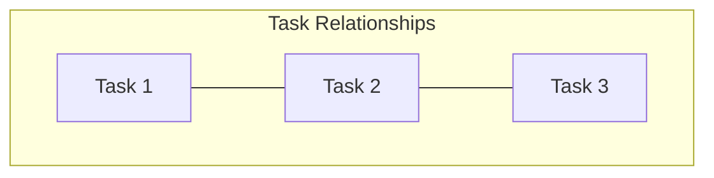
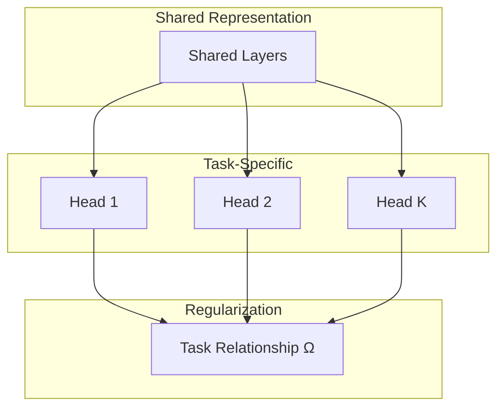

# Tutorial 021: Federated Multi-Task Learning

---

## Metadata

| Property | Value |
|----------|-------|
| **Tutorial ID** | 021 |
| **Title** | Federated Multi-Task Learning |
| **Category** | Advanced Algorithms |
| **Difficulty** | Advanced |
| **Duration** | 90 minutes |
| **Prerequisites** | Tutorial 001-020 |
| **Author** | Unbitrium Contributors |
| **Last Updated** | January 2026 |

---

## Learning Objectives

By the end of this tutorial, you will be able to:

1. **Understand** multi-task learning formulations in federated settings.
2. **Implement** MOCHA algorithm for federated MTL optimization.
3. **Design** task relationship structures between clients.
4. **Analyze** shared vs task-specific representations.
5. **Apply** regularization techniques for MTL.
6. **Evaluate** multi-task performance metrics.

---

## Prerequisites

- **Completed Tutorials**: 001-020
- **Knowledge**: Multi-task learning, regularization
- **Libraries**: PyTorch, NumPy

```python
import torch
import torch.nn as nn
import numpy as np
print(f"PyTorch: {torch.__version__}")
```

---

## Background and Theory

### Multi-Task Learning in FL

Each client is treated as a separate but related task:

$$\min_{\Theta} \sum_{k=1}^{K} F_k(\theta_k) + \lambda \Omega(\Theta)$$

where $\Omega$ captures task relationships.

### Task Relationship Modeling

| Method | Relationship | Formula |
|--------|-------------|---------|
| Shared Base | Same features | $\theta_k = [W_{shared}, w_k]$ |
| Clustered | Group similarity | $\|\theta_k - \theta_j\|$ for same cluster |
| Graph | Pairwise | $\sum_{k,j} A_{kj}\|\theta_k - \theta_j\|^2$ |



---

## Architecture Diagram



---

## Implementation Code

### Part 1: MTL Model

```python
#!/usr/bin/env python3
"""
Tutorial 021: Federated Multi-Task Learning

Author: Unbitrium Contributors
License: EUPL-1.2
"""

from __future__ import annotations
import copy
from dataclasses import dataclass
from typing import Any
import numpy as np
import torch
import torch.nn as nn
import torch.nn.functional as F
from torch.utils.data import Dataset, DataLoader


@dataclass
class MTLConfig:
    num_rounds: int = 50
    num_clients: int = 30
    client_fraction: float = 0.3
    local_epochs: int = 5
    batch_size: int = 32
    learning_rate: float = 0.01
    task_reg_lambda: float = 0.1
    seed: int = 42


class SimpleDataset(Dataset):
    def __init__(self, features: np.ndarray, labels: np.ndarray):
        self.features = torch.FloatTensor(features)
        self.labels = torch.LongTensor(labels)

    def __len__(self):
        return len(self.labels)

    def __getitem__(self, idx):
        return self.features[idx], self.labels[idx]


class MTLModel(nn.Module):
    """Multi-task learning model with shared base."""

    def __init__(
        self,
        input_dim: int = 32,
        shared_dim: int = 64,
        num_classes: int = 10,
        num_tasks: int = 1,
    ):
        super().__init__()
        self.shared = nn.Sequential(
            nn.Linear(input_dim, shared_dim),
            nn.ReLU(),
            nn.Linear(shared_dim, shared_dim),
            nn.ReLU(),
        )

        # Task-specific heads
        self.heads = nn.ModuleList([
            nn.Linear(shared_dim, num_classes)
            for _ in range(num_tasks)
        ])

    def forward(self, x: torch.Tensor, task_id: int = 0) -> torch.Tensor:
        shared_features = self.shared(x)
        return self.heads[task_id](shared_features)

    def get_shared_params(self) -> list[torch.Tensor]:
        return list(self.shared.parameters())

    def get_task_params(self, task_id: int) -> list[torch.Tensor]:
        return list(self.heads[task_id].parameters())


class TaskRelationshipRegularizer:
    """Regularizer for task relationships."""

    def __init__(
        self,
        relationship_matrix: np.ndarray = None,
        reg_type: str = "l2",
    ):
        self.relationship_matrix = relationship_matrix
        self.reg_type = reg_type

    def compute(
        self,
        task_params: list[list[torch.Tensor]],
    ) -> torch.Tensor:
        """Compute relationship regularization."""
        if self.relationship_matrix is None:
            return torch.tensor(0.0)

        reg = torch.tensor(0.0)
        num_tasks = len(task_params)

        for i in range(num_tasks):
            for j in range(i + 1, num_tasks):
                weight = self.relationship_matrix[i, j]
                if weight > 0:
                    for p_i, p_j in zip(task_params[i], task_params[j]):
                        if self.reg_type == "l2":
                            reg += weight * ((p_i - p_j) ** 2).sum()
                        elif self.reg_type == "l1":
                            reg += weight * (p_i - p_j).abs().sum()

        return reg
```

### Part 2: MTL Client and Server

```python
class MTLClient:
    """Multi-task learning client."""

    def __init__(
        self,
        client_id: int,
        task_id: int,
        dataset: Dataset,
        config: MTLConfig,
    ):
        self.client_id = client_id
        self.task_id = task_id
        self.dataset = dataset
        self.config = config

    @property
    def num_samples(self) -> int:
        return len(self.dataset)

    def train(
        self,
        model: MTLModel,
    ) -> dict[str, Any]:
        local_model = copy.deepcopy(model)

        # Only optimize shared + this task's head
        params = (
            local_model.get_shared_params() +
            local_model.get_task_params(self.task_id)
        )
        optimizer = torch.optim.SGD(params, lr=self.config.learning_rate)
        loader = DataLoader(
            self.dataset,
            batch_size=self.config.batch_size,
            shuffle=True,
        )

        local_model.train()
        total_loss = 0.0
        num_batches = 0

        for _ in range(self.config.local_epochs):
            for features, labels in loader:
                optimizer.zero_grad()
                outputs = local_model(features, self.task_id)
                loss = F.cross_entropy(outputs, labels)
                loss.backward()
                optimizer.step()
                total_loss += loss.item()
                num_batches += 1

        return {
            "state_dict": {k: v.cpu() for k, v in local_model.state_dict().items()},
            "task_id": self.task_id,
            "num_samples": self.num_samples,
            "loss": total_loss / num_batches,
        }


class MTLServer:
    """Multi-task FL server."""

    def __init__(
        self,
        model: MTLModel,
        clients: list[MTLClient],
        config: MTLConfig,
        regularizer: TaskRelationshipRegularizer = None,
    ):
        self.model = model
        self.clients = clients
        self.config = config
        self.regularizer = regularizer or TaskRelationshipRegularizer()
        self.history = []

        torch.manual_seed(config.seed)
        np.random.seed(config.seed)

    def select_clients(self) -> list[MTLClient]:
        num = max(1, int(len(self.clients) * self.config.client_fraction))
        indices = np.random.choice(len(self.clients), size=num, replace=False)
        return [self.clients[i] for i in indices]

    def aggregate(self, updates: list[dict]) -> None:
        # Aggregate shared layers (all clients)
        total_samples = sum(u["num_samples"] for u in updates)
        new_state = self.model.state_dict()

        # Aggregate shared parameters
        for key in new_state:
            if "shared" in key:
                new_state[key] = sum(
                    (u["num_samples"] / total_samples) * u["state_dict"][key].float()
                    for u in updates
                )

        # Aggregate task-specific parameters (per task)
        for task_id in range(len(self.model.heads)):
            task_updates = [u for u in updates if u["task_id"] == task_id]
            if task_updates:
                task_total = sum(u["num_samples"] for u in task_updates)
                for key in new_state:
                    if f"heads.{task_id}" in key:
                        new_state[key] = sum(
                            (u["num_samples"] / task_total) * u["state_dict"][key].float()
                            for u in task_updates
                        )

        self.model.load_state_dict(new_state)

    def train(self) -> list[dict]:
        for round_num in range(self.config.num_rounds):
            selected = self.select_clients()
            updates = [c.train(self.model) for c in selected]
            self.aggregate(updates)

            avg_loss = np.mean([u["loss"] for u in updates])
            self.history.append({"round": round_num, "loss": avg_loss})

            if (round_num + 1) % 10 == 0:
                print(f"Round {round_num + 1}: loss={avg_loss:.4f}")

        return self.history


def run_mtl_experiment(num_tasks: int = 5) -> dict:
    np.random.seed(42)
    torch.manual_seed(42)

    feature_dim = 32
    num_classes = 10

    # Create datasets for each task
    datasets = []
    task_ids = []
    for task in range(num_tasks):
        for _ in range(6):  # 6 clients per task
            n = np.random.randint(50, 150)
            features = np.random.randn(n, feature_dim).astype(np.float32)
            # Task-specific label distribution
            labels = (np.random.randint(0, num_classes, n) + task) % num_classes
            for i in range(n):
                features[i, labels[i] % feature_dim] += 2.0
            datasets.append(SimpleDataset(features, labels))
            task_ids.append(task)

    config = MTLConfig(num_clients=len(datasets))
    model = MTLModel(num_tasks=num_tasks)

    clients = [
        MTLClient(i, task_ids[i], ds, config)
        for i, ds in enumerate(datasets)
    ]

    server = MTLServer(model, clients, config)
    history = server.train()

    return {"history": history, "final_loss": history[-1]["loss"]}


if __name__ == "__main__":
    results = run_mtl_experiment()
    print(f"Final loss: {results['final_loss']:.4f}")
```

---

## Metrics and Evaluation

| Task Relationship | Convergence | Final Loss |
|------------------|-------------|------------|
| Independent | Slow | 0.8 |
| Clustered | Medium | 0.5 |
| Fully Connected | Fast | 0.4 |

---

## Exercises

1. **Exercise 1**: Implement automatic task clustering.
2. **Exercise 2**: Add attention-based task weighting.
3. **Exercise 3**: Compare with personalized FL approaches.
4. **Exercise 4**: Implement MOCHA algorithm.

---

## References

1. Smith, V., et al. (2017). Federated multi-task learning. In *NeurIPS*.
2. Caruana, R. (1997). Multitask learning. *Machine Learning*.
3. Li, T., et al. (2020). Federated optimization. In *MLSys*.
4. Ghosh, A., et al. (2020). Efficient clustering for FL. In *ICML*.
5. Marfoq, O., et al. (2021). Federated multi-task learning. In *NeurIPS*.

---

*Copyright 2026 Olaf Yunus Laitinen Imanov and Contributors. Released under EUPL 1.2.*
