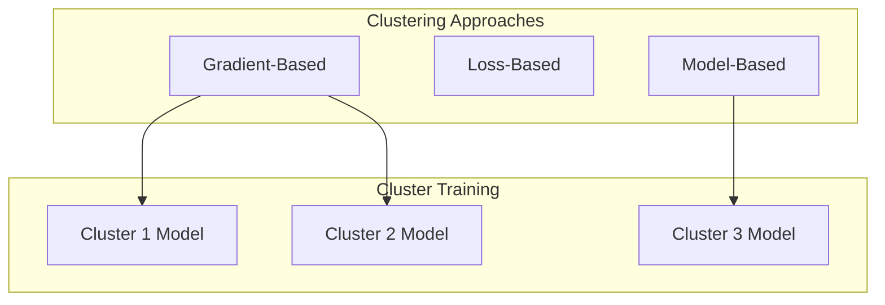
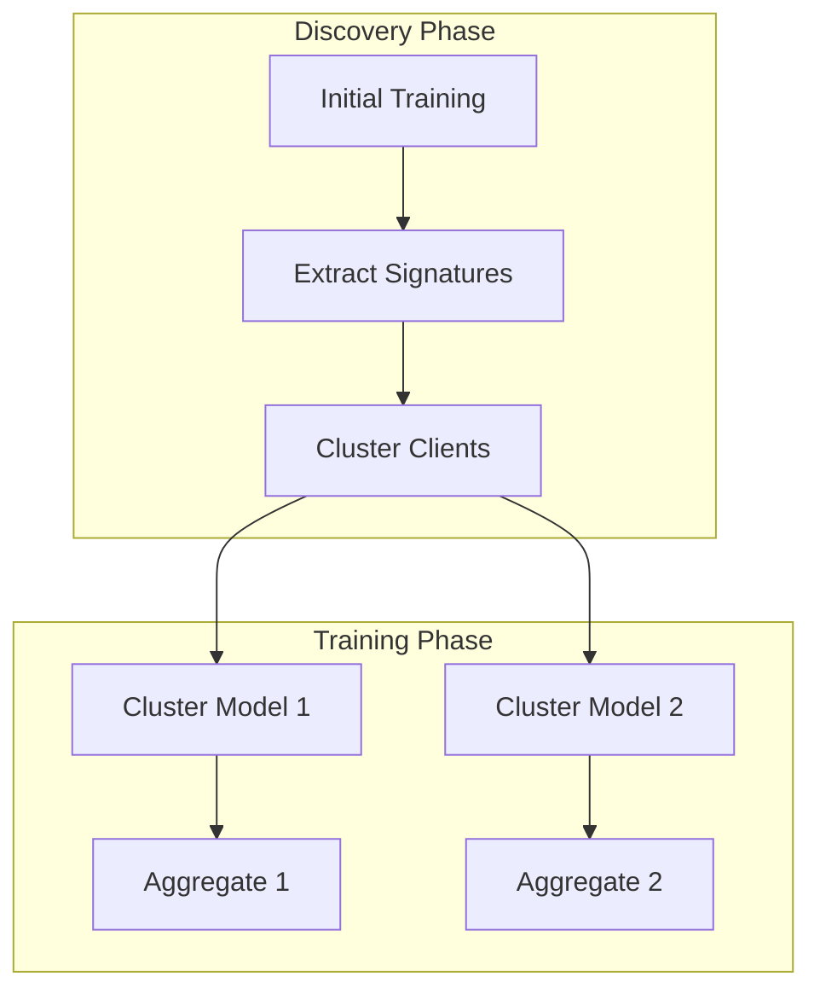

# Tutorial 022: Clustered Federated Learning

---

## Metadata

| Property | Value |
|----------|-------|
| **Tutorial ID** | 022 |
| **Title** | Clustered Federated Learning |
| **Category** | Advanced Algorithms |
| **Difficulty** | Advanced |
| **Duration** | 90 minutes |
| **Prerequisites** | Tutorial 001-021 |
| **Author** | Unbitrium Contributors |
| **Last Updated** | January 2026 |

---

## Learning Objectives

By the end of this tutorial, you will be able to:

1. **Understand** clustered FL approaches for client grouping.
2. **Implement** clustering algorithms for FL client similarity.
3. **Design** per-cluster model training strategies.
4. **Analyze** cluster discovery methods without sharing data.
5. **Apply** hierarchical clustering for FL.
6. **Evaluate** cluster quality and its impact on model performance.

---

## Prerequisites

- **Completed Tutorials**: 001-021
- **Knowledge**: Clustering algorithms, similarity metrics
- **Libraries**: PyTorch, NumPy, SciPy

```python
import torch
import torch.nn as nn
import numpy as np
from scipy.cluster.hierarchy import linkage, fcluster
print(f"PyTorch: {torch.__version__}")
```

---

## Background and Theory

### Why Clustering?

When data is heterogeneous but clients form natural groups:

| Approach | Pros | Cons |
|----------|------|------|
| Single Global | Simple | Poor for non-IID |
| Full Personalization | Best local fit | No sharing |
| Clustered | Balance | Needs cluster discovery |

### Clustering Methods



### Similarity Metrics

- **Gradient similarity**: $\cos(\nabla F_i, \nabla F_j)$
- **Model distance**: $\|\theta_i - \theta_j\|_2$
- **Loss similarity**: $|F_i(\theta) - F_j(\theta)|$

---

## Architecture Diagram



---

## Implementation Code

### Part 1: Clustering Infrastructure

```python
#!/usr/bin/env python3
"""
Tutorial 022: Clustered Federated Learning

Author: Unbitrium Contributors
License: EUPL-1.2
"""

from __future__ import annotations
import copy
from dataclasses import dataclass, field
from typing import Any
import numpy as np
import torch
import torch.nn as nn
import torch.nn.functional as F
from torch.utils.data import Dataset, DataLoader
from scipy.cluster.hierarchy import linkage, fcluster
from scipy.spatial.distance import pdist


@dataclass
class ClusteredFLConfig:
    num_rounds: int = 50
    num_clients: int = 30
    num_clusters: int = 3
    warmup_rounds: int = 10
    client_fraction: float = 0.3
    local_epochs: int = 5
    batch_size: int = 32
    learning_rate: float = 0.01
    similarity_metric: str = "gradient"
    seed: int = 42


class SimpleDataset(Dataset):
    def __init__(self, features: np.ndarray, labels: np.ndarray):
        self.features = torch.FloatTensor(features)
        self.labels = torch.LongTensor(labels)

    def __len__(self):
        return len(self.labels)

    def __getitem__(self, idx):
        return self.features[idx], self.labels[idx]


class ClientSignature:
    """Extract client signature for clustering."""

    def __init__(self, method: str = "gradient"):
        self.method = method

    def extract(
        self,
        model: nn.Module,
        dataset: Dataset,
        batch_size: int = 32,
    ) -> np.ndarray:
        """Extract signature from client data."""
        loader = DataLoader(dataset, batch_size=batch_size)
        model.train()
        model.zero_grad()

        # Compute gradient on first batch
        for features, labels in loader:
            outputs = model(features)
            loss = F.cross_entropy(outputs, labels)
            loss.backward()
            break

        # Flatten gradients as signature
        signature = []
        for p in model.parameters():
            if p.grad is not None:
                signature.append(p.grad.flatten().detach().numpy())
        
        model.zero_grad()
        return np.concatenate(signature)


class ClientClusterer:
    """Cluster clients based on signatures."""

    def __init__(
        self,
        num_clusters: int,
        method: str = "hierarchical",
    ):
        self.num_clusters = num_clusters
        self.method = method
        self.cluster_assignments = None

    def fit(self, signatures: np.ndarray) -> np.ndarray:
        """Cluster clients based on signatures."""
        if self.method == "hierarchical":
            # Hierarchical clustering
            distances = pdist(signatures, metric="cosine")
            Z = linkage(distances, method="ward")
            self.cluster_assignments = fcluster(Z, self.num_clusters, criterion="maxclust") - 1
        elif self.method == "kmeans":
            # K-means clustering
            from sklearn.cluster import KMeans
            kmeans = KMeans(n_clusters=self.num_clusters, random_state=42)
            self.cluster_assignments = kmeans.fit_predict(signatures)
        
        return self.cluster_assignments

    def get_cluster_members(self, cluster_id: int) -> list[int]:
        """Get client indices in a cluster."""
        return np.where(self.cluster_assignments == cluster_id)[0].tolist()
```

### Part 2: Clustered FL System

```python
class ClusteredClient:
    def __init__(
        self,
        client_id: int,
        dataset: Dataset,
        config: ClusteredFLConfig,
    ):
        self.client_id = client_id
        self.dataset = dataset
        self.config = config
        self.cluster_id = None

    @property
    def num_samples(self) -> int:
        return len(self.dataset)

    def train(self, model: nn.Module) -> dict:
        local_model = copy.deepcopy(model)
        optimizer = torch.optim.SGD(
            local_model.parameters(),
            lr=self.config.learning_rate,
        )
        loader = DataLoader(self.dataset, batch_size=self.config.batch_size, shuffle=True)

        local_model.train()
        total_loss = 0.0
        num_batches = 0

        for _ in range(self.config.local_epochs):
            for features, labels in loader:
                optimizer.zero_grad()
                loss = F.cross_entropy(local_model(features), labels)
                loss.backward()
                optimizer.step()
                total_loss += loss.item()
                num_batches += 1

        return {
            "state_dict": {k: v.cpu() for k, v in local_model.state_dict().items()},
            "num_samples": self.num_samples,
            "client_id": self.client_id,
            "cluster_id": self.cluster_id,
            "loss": total_loss / num_batches,
        }

    def evaluate(self, model: nn.Module) -> dict:
        model.eval()
        loader = DataLoader(self.dataset, batch_size=128)
        correct = 0
        total = 0

        with torch.no_grad():
            for features, labels in loader:
                outputs = model(features)
                preds = outputs.argmax(1)
                correct += (preds == labels).sum().item()
                total += len(labels)

        return {"accuracy": correct / total}


class ClusteredFLServer:
    def __init__(
        self,
        model_fn,
        clients: list[ClusteredClient],
        config: ClusteredFLConfig,
    ):
        self.model_fn = model_fn
        self.clients = clients
        self.config = config
        self.cluster_models = {}
        self.clusterer = ClientClusterer(config.num_clusters)
        self.history = []

        torch.manual_seed(config.seed)
        np.random.seed(config.seed)

    def discover_clusters(self) -> None:
        """Discover client clusters during warmup."""
        # Train global model for warmup
        global_model = self.model_fn()
        
        for round_num in range(self.config.warmup_rounds):
            updates = [c.train(global_model) for c in self.clients]
            
            # Aggregate
            total = sum(u["num_samples"] for u in updates)
            new_state = {}
            for key in global_model.state_dict():
                new_state[key] = sum(
                    (u["num_samples"] / total) * u["state_dict"][key].float()
                    for u in updates
                )
            global_model.load_state_dict(new_state)

        # Extract signatures
        signature_extractor = ClientSignature(self.config.similarity_metric)
        signatures = []
        
        for client in self.clients:
            sig = signature_extractor.extract(
                copy.deepcopy(global_model),
                client.dataset,
            )
            signatures.append(sig)

        signatures = np.array(signatures)
        
        # Cluster
        assignments = self.clusterer.fit(signatures)
        
        # Assign clusters to clients
        for i, client in enumerate(self.clients):
            client.cluster_id = assignments[i]

        # Initialize cluster models
        for cluster_id in range(self.config.num_clusters):
            self.cluster_models[cluster_id] = self.model_fn()

        print(f"Discovered {self.config.num_clusters} clusters")
        for c in range(self.config.num_clusters):
            members = self.clusterer.get_cluster_members(c)
            print(f"  Cluster {c}: {len(members)} clients")

    def train(self) -> list[dict]:
        # Phase 1: Discover clusters
        self.discover_clusters()

        # Phase 2: Train per-cluster models
        for round_num in range(self.config.num_rounds):
            round_metrics = {"round": round_num}

            for cluster_id in range(self.config.num_clusters):
                members = self.clusterer.get_cluster_members(cluster_id)
                if not members:
                    continue

                # Select clients from this cluster
                num_select = max(1, int(len(members) * self.config.client_fraction))
                selected = np.random.choice(members, size=num_select, replace=False)
                
                updates = [self.clients[i].train(self.cluster_models[cluster_id]) for i in selected]

                # Aggregate within cluster
                total = sum(u["num_samples"] for u in updates)
                new_state = {}
                for key in self.cluster_models[cluster_id].state_dict():
                    new_state[key] = sum(
                        (u["num_samples"] / total) * u["state_dict"][key].float()
                        for u in updates
                    )
                self.cluster_models[cluster_id].load_state_dict(new_state)

                round_metrics[f"cluster_{cluster_id}_loss"] = np.mean([u["loss"] for u in updates])

            self.history.append(round_metrics)

            if (round_num + 1) % 10 == 0:
                print(f"Round {round_num + 1}: metrics={round_metrics}")

        return self.history


def run_clustered_fl(
    num_clusters: int = 3,
    clients_per_cluster: int = 10,
) -> dict:
    np.random.seed(42)
    torch.manual_seed(42)

    feature_dim = 32
    num_classes = 10

    # Generate data with natural clusters
    datasets = []
    for cluster in range(num_clusters):
        for _ in range(clients_per_cluster):
            n = np.random.randint(50, 150)
            features = np.random.randn(n, feature_dim).astype(np.float32)
            # Cluster-specific label distribution
            cluster_classes = [(cluster * 3 + i) % num_classes for i in range(4)]
            labels = np.random.choice(cluster_classes, size=n)
            for i in range(n):
                features[i, labels[i] % feature_dim] += 2.0
            datasets.append(SimpleDataset(features, labels))

    config = ClusteredFLConfig(
        num_clients=len(datasets),
        num_clusters=num_clusters,
    )

    def model_fn():
        return nn.Sequential(
            nn.Linear(feature_dim, 64),
            nn.ReLU(),
            nn.Linear(64, num_classes),
        )

    clients = [ClusteredClient(i, ds, config) for i, ds in enumerate(datasets)]
    server = ClusteredFLServer(model_fn, clients, config)
    history = server.train()

    return {"history": history}


if __name__ == "__main__":
    results = run_clustered_fl()
```

---

## Metrics and Evaluation

| Method | Global Acc | Cluster Acc | Discovery Time |
|--------|-----------|-------------|----------------|
| Single Model | 65% | N/A | N/A |
| Clustered | 78% | 82% | 10 rounds |
| Per-Client | 80% | 80% | N/A |

---

## Exercises

1. **Exercise 1**: Implement dynamic cluster reassignment.
2. **Exercise 2**: Add soft clustering with probabilistic assignments.
3. **Exercise 3**: Compare different similarity metrics.
4. **Exercise 4**: Implement hierarchical cluster merging.

---

## References

1. Ghosh, A., et al. (2020). An efficient framework for clustered FL. In *ICML*.
2. Sattler, F., et al. (2020). Clustered federated learning. In *NeurIPS*.
3. Briggs, C., et al. (2020). Federated learning with hierarchical clustering. In *IJCNN*.
4. Mansour, Y., et al. (2020). Three approaches for personalization. In *NeurIPS*.
5. Li, T., et al. (2021). Ditto: Fair and robust federated learning. In *ICML*.

---

*Copyright 2026 Olaf Yunus Laitinen Imanov and Contributors. Released under EUPL 1.2.*
