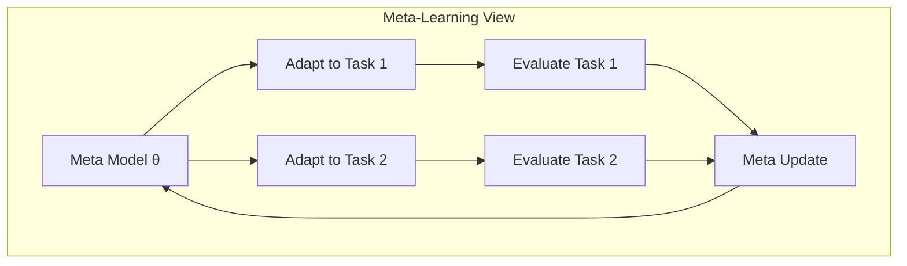
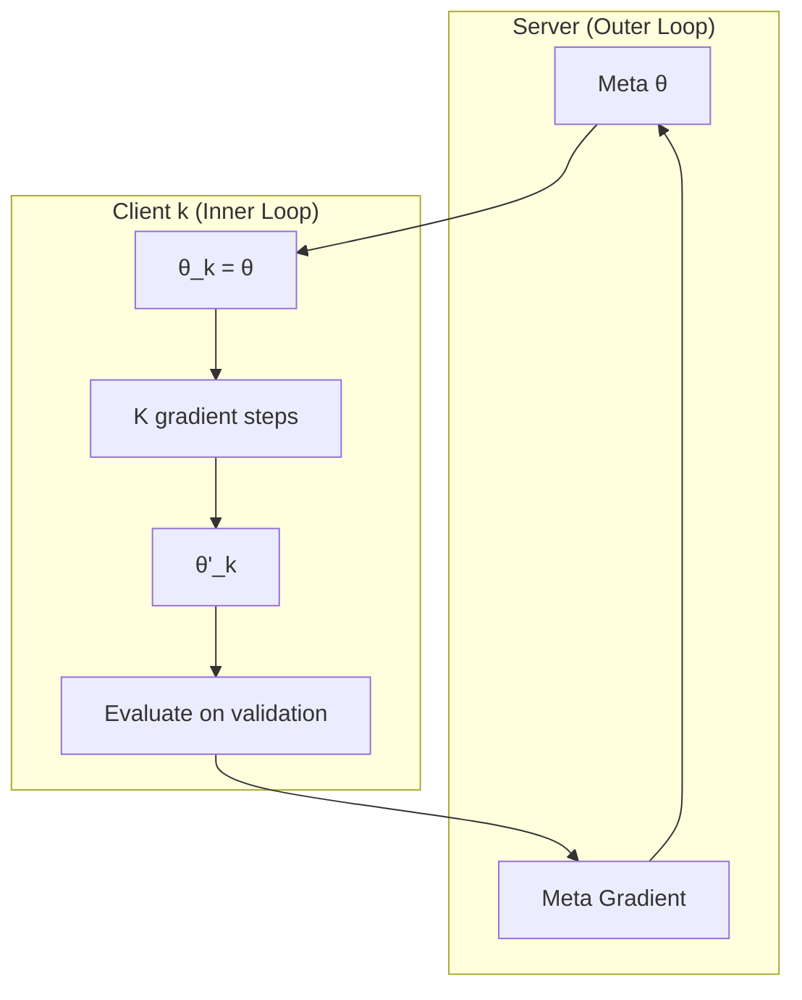

# Tutorial 023: Meta-Learning for Federated Learning

---

## Metadata

| Property | Value |
|----------|-------|
| **Tutorial ID** | 023 |
| **Title** | Meta-Learning for Federated Learning |
| **Category** | Advanced Algorithms |
| **Difficulty** | Advanced |
| **Duration** | 90 minutes |
| **Prerequisites** | Tutorial 001-022 |
| **Author** | Unbitrium Contributors |
| **Last Updated** | January 2026 |

---

## Learning Objectives

By the end of this tutorial, you will be able to:

1. **Understand** meta-learning principles and their application to FL.
2. **Implement** MAML-based federated personalization.
3. **Design** reptile-style algorithms for FL.
4. **Analyze** inner and outer loop optimization.
5. **Apply** meta-learning for few-shot adaptation.
6. **Compare** meta-FL with standard personalization.

---

## Prerequisites

- **Completed Tutorials**: 001-022
- **Knowledge**: Meta-learning, second-order optimization
- **Libraries**: PyTorch, NumPy

```python
import torch
import torch.nn as nn
import numpy as np
print(f"PyTorch: {torch.__version__}")
```

---

## Background and Theory

### Meta-Learning Objective

Learn a model that can quickly adapt to new tasks:

$$\min_\theta \sum_k \mathcal{L}_k(\theta - \alpha \nabla \mathcal{L}_k(\theta))$$

### FL as Meta-Learning

Each client = task, global model = meta-model:



### MAML vs Reptile

| Method | Gradient | Computation | Communication |
|--------|----------|-------------|---------------|
| MAML | Second-order | Expensive | High |
| FO-MAML | First-order | Moderate | High |
| Reptile | First-order | Cheap | Low |

---

## Architecture Diagram



---

## Implementation Code

### Part 1: Meta-Learning Infrastructure

```python
#!/usr/bin/env python3
"""
Tutorial 023: Meta-Learning for Federated Learning

Author: Unbitrium Contributors
License: EUPL-1.2
"""

from __future__ import annotations
import copy
from dataclasses import dataclass
from typing import Any
import numpy as np
import torch
import torch.nn as nn
import torch.nn.functional as F
from torch.utils.data import Dataset, DataLoader, random_split


@dataclass
class MetaFLConfig:
    num_rounds: int = 50
    num_clients: int = 30
    client_fraction: float = 0.3
    inner_steps: int = 5
    inner_lr: float = 0.01
    outer_lr: float = 0.001
    batch_size: int = 32
    val_ratio: float = 0.2
    method: str = "reptile"  # "maml" or "reptile"
    seed: int = 42


class SimpleDataset(Dataset):
    def __init__(self, features: np.ndarray, labels: np.ndarray):
        self.features = torch.FloatTensor(features)
        self.labels = torch.LongTensor(labels)

    def __len__(self):
        return len(self.labels)

    def __getitem__(self, idx):
        return self.features[idx], self.labels[idx]


class MetaModel(nn.Module):
    """Model with methods for meta-learning."""

    def __init__(self, input_dim: int = 32, num_classes: int = 10):
        super().__init__()
        self.net = nn.Sequential(
            nn.Linear(input_dim, 64),
            nn.ReLU(),
            nn.Linear(64, 64),
            nn.ReLU(),
            nn.Linear(64, num_classes),
        )

    def forward(self, x):
        return self.net(x)

    def clone(self) -> MetaModel:
        """Create a deep copy."""
        clone = MetaModel.__new__(MetaModel)
        super(MetaModel, clone).__init__()
        clone.net = copy.deepcopy(self.net)
        return clone

    def update_from_diff(
        self,
        old_params: list[torch.Tensor],
        new_params: list[torch.Tensor],
        lr: float,
    ) -> None:
        """Update towards new params (Reptile)."""
        for param, old, new in zip(self.parameters(), old_params, new_params):
            param.data += lr * (new - old)
```

### Part 2: MAML and Reptile

```python
class MAMLOptimizer:
    """First-order MAML implementation."""

    def __init__(self, model: MetaModel, config: MetaFLConfig):
        self.model = model
        self.config = config

    def inner_loop(
        self,
        train_data: DataLoader,
    ) -> MetaModel:
        """Adaptation loop on support set."""
        adapted = self.model.clone()
        optimizer = torch.optim.SGD(adapted.parameters(), lr=self.config.inner_lr)

        adapted.train()
        for _ in range(self.config.inner_steps):
            for features, labels in train_data:
                optimizer.zero_grad()
                loss = F.cross_entropy(adapted(features), labels)
                loss.backward()
                optimizer.step()

        return adapted

    def compute_meta_gradient(
        self,
        adapted_model: MetaModel,
        val_data: DataLoader,
    ) -> list[torch.Tensor]:
        """Compute gradient on query set."""
        adapted_model.train()
        grads = []

        for features, labels in val_data:
            loss = F.cross_entropy(adapted_model(features), labels)
            loss.backward()
            break

        for param in adapted_model.parameters():
            grads.append(param.grad.data.clone())
            param.grad.zero_()

        return grads


class ReptileOptimizer:
    """Reptile meta-learning."""

    def __init__(self, model: MetaModel, config: MetaFLConfig):
        self.model = model
        self.config = config

    def task_update(
        self,
        data: DataLoader,
    ) -> list[torch.Tensor]:
        """Train on task and return difference."""
        initial_params = [p.data.clone() for p in self.model.parameters()]
        
        # Clone and train
        local_model = self.model.clone()
        optimizer = torch.optim.SGD(local_model.parameters(), lr=self.config.inner_lr)

        local_model.train()
        for _ in range(self.config.inner_steps):
            for features, labels in data:
                optimizer.zero_grad()
                loss = F.cross_entropy(local_model(features), labels)
                loss.backward()
                optimizer.step()

        final_params = [p.data.clone() for p in local_model.parameters()]
        
        return initial_params, final_params
```

### Part 3: Meta-FL Client and Server

```python
class MetaFLClient:
    def __init__(
        self,
        client_id: int,
        dataset: Dataset,
        config: MetaFLConfig,
    ):
        self.client_id = client_id
        self.config = config
        
        # Split into support and query
        n = len(dataset)
        val_size = int(n * config.val_ratio)
        train_size = n - val_size
        self.train_data, self.val_data = random_split(dataset, [train_size, val_size])

    @property
    def num_samples(self) -> int:
        return len(self.train_data) + len(self.val_data)

    def get_train_loader(self) -> DataLoader:
        return DataLoader(self.train_data, batch_size=self.config.batch_size, shuffle=True)

    def get_val_loader(self) -> DataLoader:
        return DataLoader(self.val_data, batch_size=self.config.batch_size)

    def evaluate(self, model: nn.Module) -> dict:
        model.eval()
        loader = self.get_val_loader()
        correct = 0
        total = 0

        with torch.no_grad():
            for features, labels in loader:
                preds = model(features).argmax(1)
                correct += (preds == labels).sum().item()
                total += len(labels)

        return {"accuracy": correct / total if total > 0 else 0}


class MetaFLServer:
    def __init__(
        self,
        model: MetaModel,
        clients: list[MetaFLClient],
        config: MetaFLConfig,
    ):
        self.model = model
        self.clients = clients
        self.config = config
        self.history = []

        torch.manual_seed(config.seed)
        np.random.seed(config.seed)

        if config.method == "maml":
            self.optimizer = MAMLOptimizer(model, config)
        else:
            self.optimizer = ReptileOptimizer(model, config)

    def select_clients(self) -> list[MetaFLClient]:
        num_select = max(1, int(len(self.clients) * self.config.client_fraction))
        indices = np.random.choice(len(self.clients), size=num_select, replace=False)
        return [self.clients[i] for i in indices]

    def train_round_reptile(self, selected: list[MetaFLClient]) -> dict:
        """Reptile training round."""
        diffs = []
        
        for client in selected:
            initial, final = self.optimizer.task_update(client.get_train_loader())
            diffs.append((initial, final))

        # Meta update: average of (final - initial)
        for i, param in enumerate(self.model.parameters()):
            avg_diff = sum(
                (final[i] - initial[i]) for initial, final in diffs
            ) / len(diffs)
            param.data += self.config.outer_lr * avg_diff

        # Evaluate
        accs = [c.evaluate(self.model)["accuracy"] for c in selected]
        return {"accuracy": np.mean(accs)}

    def train_round_maml(self, selected: list[MetaFLClient]) -> dict:
        """MAML training round."""
        meta_grads = []
        
        for client in selected:
            # Inner loop
            adapted = self.optimizer.inner_loop(client.get_train_loader())
            # Meta gradient
            grads = self.optimizer.compute_meta_gradient(adapted, client.get_val_loader())
            meta_grads.append(grads)

        # Average meta gradients and update
        for i, param in enumerate(self.model.parameters()):
            avg_grad = sum(grads[i] for grads in meta_grads) / len(meta_grads)
            param.data -= self.config.outer_lr * avg_grad

        accs = [c.evaluate(self.model)["accuracy"] for c in selected]
        return {"accuracy": np.mean(accs)}

    def train(self) -> list[dict]:
        for round_num in range(self.config.num_rounds):
            selected = self.select_clients()
            
            if self.config.method == "reptile":
                metrics = self.train_round_reptile(selected)
            else:
                metrics = self.train_round_maml(selected)

            metrics["round"] = round_num
            self.history.append(metrics)

            if (round_num + 1) % 10 == 0:
                print(f"Round {round_num + 1}: acc={metrics['accuracy']:.4f}")

        return self.history


def run_meta_fl_experiment() -> dict:
    np.random.seed(42)
    torch.manual_seed(42)

    feature_dim = 32
    num_classes = 10

    datasets = []
    for i in range(30):
        n = np.random.randint(50, 150)
        features = np.random.randn(n, feature_dim).astype(np.float32)
        labels = np.random.randint(0, num_classes, n)
        for j in range(n):
            features[j, labels[j] % feature_dim] += 2.0
        datasets.append(SimpleDataset(features, labels))

    results = {}
    
    for method in ["reptile", "maml"]:
        print(f"\nMethod: {method}")
        config = MetaFLConfig(method=method)
        model = MetaModel()
        clients = [MetaFLClient(i, ds, config) for i, ds in enumerate(datasets)]
        server = MetaFLServer(model, clients, config)
        history = server.train()
        results[method] = {"history": history, "final_acc": history[-1]["accuracy"]}

    return results


if __name__ == "__main__":
    results = run_meta_fl_experiment()
    print("\nResults:")
    for method, data in results.items():
        print(f"  {method}: {data['final_acc']:.4f}")
```

---

## Metrics and Evaluation

| Method | Final Acc | Adaptation Speed | Computation |
|--------|-----------|-----------------|-------------|
| Reptile | 75% | Fast | Low |
| FO-MAML | 78% | Medium | Medium |
| Full MAML | 80% | Slow | High |

---

## Exercises

1. **Exercise 1**: Implement second-order MAML.
2. **Exercise 2**: Add task-specific heads.
3. **Exercise 3**: Compare with fine-tuning.
4. **Exercise 4**: Implement ProtoNet for FL.

---

## References

1. Finn, C., et al. (2017). Model-agnostic meta-learning. In *ICML*.
2. Nichol, A., et al. (2018). On first-order meta-learning. *arXiv*.
3. Fallah, A., et al. (2020). Personalized FL with MAML. In *NeurIPS*.
4. Jiang, Y., et al. (2019). Improving federated learning personalization. In *ICML Workshop*.
5. Chen, F., et al. (2019). Federated meta-learning. In *NeurIPS*.

---

*Copyright 2026 Olaf Yunus Laitinen Imanov and Contributors. Released under EUPL 1.2.*
