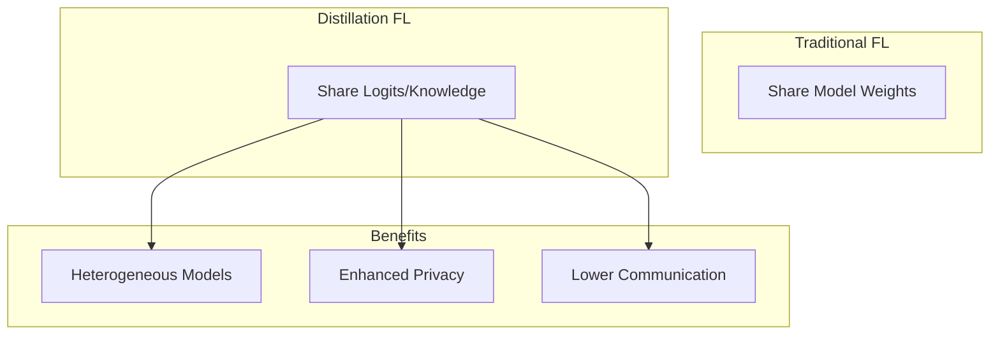
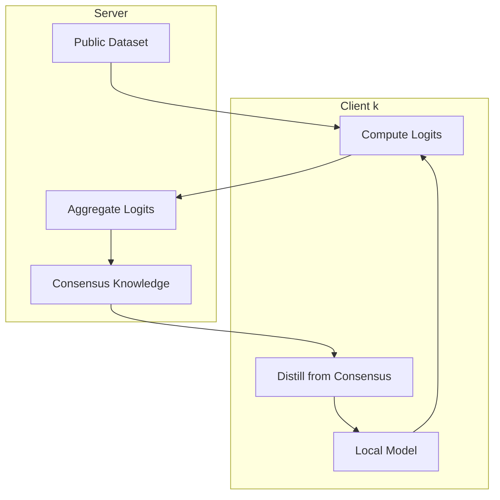

# Tutorial 024: Knowledge Distillation in Federated Learning

---

## Metadata

| Property | Value |
|----------|-------|
| **Tutorial ID** | 024 |
| **Title** | Knowledge Distillation in Federated Learning |
| **Category** | Advanced Algorithms |
| **Difficulty** | Advanced |
| **Duration** | 90 minutes |
| **Prerequisites** | Tutorial 001-023 |
| **Author** | Unbitrium Contributors |
| **Last Updated** | January 2026 |

---

## Learning Objectives

By the end of this tutorial, you will be able to:

1. **Understand** knowledge distillation principles for FL.
2. **Implement** FedMD and related distillation algorithms.
3. **Design** ensemble distillation for FL.
4. **Analyze** communication efficiency of distillation methods.
5. **Apply** data-free distillation techniques.
6. **Compare** distillation with aggregation-based FL.

---

## Prerequisites

- **Completed Tutorials**: 001-023
- **Knowledge**: Knowledge distillation, softmax temperature
- **Libraries**: PyTorch, NumPy

```python
import torch
import torch.nn as nn
import numpy as np
print(f"PyTorch: {torch.__version__}")
```

---

## Background and Theory

### Knowledge Distillation in FL

Instead of sharing model parameters, share knowledge via:
- **Logits**: Soft predictions on public/synthetic data
- **Features**: Intermediate representations
- **Gradients**: Gradient information

### Distillation Loss

$$\mathcal{L}_{KD} = \alpha \mathcal{L}_{CE}(y, p) + (1-\alpha) T^2 \mathcal{L}_{KL}(p_t^{\tau}, p_s^{\tau})$$

where $T$ is temperature and $\tau$ indicates softened logits.



---

## Architecture Diagram



---

## Implementation Code

### Part 1: Distillation Components

```python
#!/usr/bin/env python3
"""
Tutorial 024: Knowledge Distillation in Federated Learning

Author: Unbitrium Contributors
License: EUPL-1.2
"""

from __future__ import annotations
import copy
from dataclasses import dataclass
from typing import Any
import numpy as np
import torch
import torch.nn as nn
import torch.nn.functional as F
from torch.utils.data import Dataset, DataLoader


@dataclass
class FedMDConfig:
    num_rounds: int = 50
    num_clients: int = 20
    local_epochs: int = 5
    distill_epochs: int = 3
    batch_size: int = 32
    learning_rate: float = 0.01
    temperature: float = 3.0
    alpha: float = 0.5  # Weight for distillation loss
    public_samples: int = 500
    seed: int = 42


class SimpleDataset(Dataset):
    def __init__(self, features: np.ndarray, labels: np.ndarray):
        self.features = torch.FloatTensor(features)
        self.labels = torch.LongTensor(labels)

    def __len__(self):
        return len(self.labels)

    def __getitem__(self, idx):
        return self.features[idx], self.labels[idx]


class PublicDataset(Dataset):
    """Public dataset for distillation (unlabeled or labeled)."""

    def __init__(self, features: np.ndarray, labels: np.ndarray = None):
        self.features = torch.FloatTensor(features)
        self.labels = torch.LongTensor(labels) if labels is not None else None

    def __len__(self):
        return len(self.features)

    def __getitem__(self, idx):
        if self.labels is not None:
            return self.features[idx], self.labels[idx]
        return self.features[idx]


def distillation_loss(
    student_logits: torch.Tensor,
    teacher_logits: torch.Tensor,
    labels: torch.Tensor = None,
    temperature: float = 3.0,
    alpha: float = 0.5,
) -> torch.Tensor:
    """Compute knowledge distillation loss."""
    T = temperature

    # Soft targets
    soft_targets = F.softmax(teacher_logits / T, dim=1)
    soft_student = F.log_softmax(student_logits / T, dim=1)

    kd_loss = F.kl_div(soft_student, soft_targets, reduction="batchmean") * (T * T)

    if labels is not None:
        # Hard targets
        ce_loss = F.cross_entropy(student_logits, labels)
        return alpha * ce_loss + (1 - alpha) * kd_loss

    return kd_loss
```

### Part 2: FedMD Algorithm

```python
class FedMDClient:
    """Client for FedMD algorithm."""

    def __init__(
        self,
        client_id: int,
        model: nn.Module,
        dataset: Dataset,
        config: FedMDConfig,
    ):
        self.client_id = client_id
        self.model = model
        self.dataset = dataset
        self.config = config

    @property
    def num_samples(self) -> int:
        return len(self.dataset)

    def compute_logits(self, public_data: PublicDataset) -> torch.Tensor:
        """Compute logits on public dataset."""
        self.model.eval()
        loader = DataLoader(public_data, batch_size=128)
        all_logits = []

        with torch.no_grad():
            for batch in loader:
                if isinstance(batch, tuple):
                    features = batch[0]
                else:
                    features = batch
                logits = self.model(features)
                all_logits.append(logits)

        return torch.cat(all_logits, dim=0)

    def train_local(self) -> float:
        """Train on local private data."""
        self.model.train()
        optimizer = torch.optim.SGD(self.model.parameters(), lr=self.config.learning_rate)
        loader = DataLoader(self.dataset, batch_size=self.config.batch_size, shuffle=True)

        total_loss = 0.0
        num_batches = 0

        for _ in range(self.config.local_epochs):
            for features, labels in loader:
                optimizer.zero_grad()
                loss = F.cross_entropy(self.model(features), labels)
                loss.backward()
                optimizer.step()
                total_loss += loss.item()
                num_batches += 1

        return total_loss / num_batches

    def distill(
        self,
        public_data: PublicDataset,
        consensus_logits: torch.Tensor,
    ) -> float:
        """Distill knowledge from consensus."""
        self.model.train()
        optimizer = torch.optim.SGD(self.model.parameters(), lr=self.config.learning_rate)

        # Create dataset with consensus logits
        features = public_data.features
        n = len(features)

        total_loss = 0.0
        num_batches = 0

        for _ in range(self.config.distill_epochs):
            perm = torch.randperm(n)
            for i in range(0, n, self.config.batch_size):
                idx = perm[i:i + self.config.batch_size]
                batch_features = features[idx]
                batch_teacher_logits = consensus_logits[idx]

                optimizer.zero_grad()
                student_logits = self.model(batch_features)

                loss = distillation_loss(
                    student_logits,
                    batch_teacher_logits,
                    temperature=self.config.temperature,
                )
                loss.backward()
                optimizer.step()

                total_loss += loss.item()
                num_batches += 1

        return total_loss / num_batches

    def evaluate(self, dataset: Dataset = None) -> dict:
        if dataset is None:
            dataset = self.dataset

        self.model.eval()
        loader = DataLoader(dataset, batch_size=128)
        correct = 0
        total = 0

        with torch.no_grad():
            for features, labels in loader:
                preds = self.model(features).argmax(1)
                correct += (preds == labels).sum().item()
                total += len(labels)

        return {"accuracy": correct / total}


class FedMDServer:
    """Server for FedMD algorithm."""

    def __init__(
        self,
        clients: list[FedMDClient],
        public_data: PublicDataset,
        config: FedMDConfig,
    ):
        self.clients = clients
        self.public_data = public_data
        self.config = config
        self.history = []

        torch.manual_seed(config.seed)
        np.random.seed(config.seed)

    def aggregate_logits(self, client_logits: list[torch.Tensor]) -> torch.Tensor:
        """Aggregate logits from clients (simple average)."""
        stacked = torch.stack(client_logits, dim=0)
        return stacked.mean(dim=0)

    def train_round(self, round_num: int) -> dict:
        # Step 1: Local training
        for client in self.clients:
            client.train_local()

        # Step 2: Compute logits on public data
        client_logits = []
        for client in self.clients:
            logits = client.compute_logits(self.public_data)
            client_logits.append(logits)

        # Step 3: Aggregate logits
        consensus_logits = self.aggregate_logits(client_logits)

        # Step 4: Distill back to clients
        distill_losses = []
        for client in self.clients:
            loss = client.distill(self.public_data, consensus_logits)
            distill_losses.append(loss)

        # Evaluate
        accs = [c.evaluate()["accuracy"] for c in self.clients]

        return {
            "round": round_num,
            "avg_accuracy": np.mean(accs),
            "avg_distill_loss": np.mean(distill_losses),
        }

    def train(self) -> list[dict]:
        for round_num in range(self.config.num_rounds):
            metrics = self.train_round(round_num)
            self.history.append(metrics)

            if (round_num + 1) % 10 == 0:
                print(f"Round {round_num + 1}: acc={metrics['avg_accuracy']:.4f}")

        return self.history


def run_fedmd_experiment() -> dict:
    np.random.seed(42)
    torch.manual_seed(42)

    feature_dim = 32
    num_classes = 10

    # Generate private datasets
    private_datasets = []
    for i in range(20):
        n = np.random.randint(50, 150)
        features = np.random.randn(n, feature_dim).astype(np.float32)
        labels = np.random.randint(0, num_classes, n)
        for j in range(n):
            features[j, labels[j] % feature_dim] += 2.0
        private_datasets.append(SimpleDataset(features, labels))

    # Generate public dataset
    public_features = np.random.randn(500, feature_dim).astype(np.float32)
    public_labels = np.random.randint(0, num_classes, 500)
    public_data = PublicDataset(public_features, public_labels)

    config = FedMDConfig()

    # Create clients with potentially different models
    clients = []
    for i, dataset in enumerate(private_datasets):
        model = nn.Sequential(
            nn.Linear(feature_dim, 64),
            nn.ReLU(),
            nn.Linear(64, num_classes),
        )
        clients.append(FedMDClient(i, model, dataset, config))

    server = FedMDServer(clients, public_data, config)
    history = server.train()

    return {"history": history, "final_acc": history[-1]["avg_accuracy"]}


if __name__ == "__main__":
    results = run_fedmd_experiment()
    print(f"Final accuracy: {results['final_acc']:.4f}")
```

---

## Metrics and Evaluation

| Method | Communication | Privacy | Heterogeneous Models |
|--------|--------------|---------|---------------------|
| FedAvg | High (params) | Medium | No |
| FedMD | Low (logits) | High | Yes |
| FedDF | Medium | High | Yes |

---

## Exercises

1. **Exercise 1**: Implement FedDF (data-free distillation).
2. **Exercise 2**: Add temperature scheduling.
3. **Exercise 3**: Use ensemble distillation.
4. **Exercise 4**: Compare with FedProx.

---

## References

1. Li, D., & Wang, J. (2019). FedMD: Heterogeneous federated learning. In *NeurIPS Workshop*.
2. Hinton, G., et al. (2015). Distilling knowledge in neural networks. *arXiv*.
3. Lin, T., et al. (2020). Ensemble distillation for robust FL. In *ICML*.
4. Zhu, Z., et al. (2021). Data-free knowledge distillation for heterogeneous FL. In *ICML*.
5. Chen, H., & Chao, W. (2021). FedBE: Making Bayesian model ensemble applicable. In *ICLR*.

---

*Copyright 2026 Olaf Yunus Laitinen Imanov and Contributors. Released under EUPL 1.2.*
