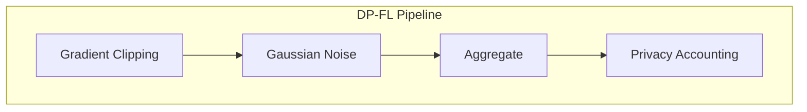
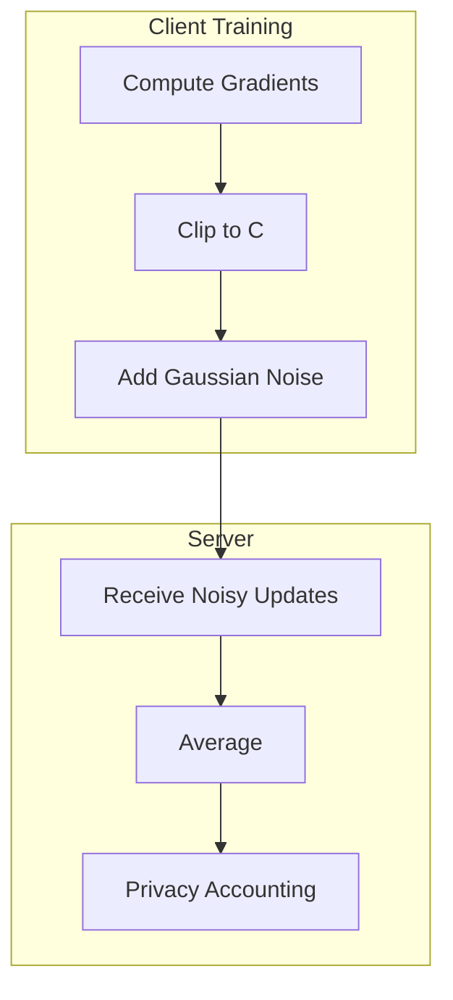

# Tutorial 025: Differential Privacy in Federated Learning

---

## Metadata

| Property | Value |
|----------|-------|
| **Tutorial ID** | 025 |
| **Title** | Differential Privacy in Federated Learning |
| **Category** | Privacy & Security |
| **Difficulty** | Advanced |
| **Duration** | 90 minutes |
| **Prerequisites** | Tutorial 001-024 |
| **Author** | Unbitrium Contributors |
| **Last Updated** | January 2026 |

---

## Learning Objectives

By the end of this tutorial, you will be able to:

1. **Understand** differential privacy (DP) fundamentals and privacy guarantees.
2. **Implement** DP-SGD for local training in FL.
3. **Apply** user-level and sample-level differential privacy.
4. **Analyze** privacy-utility trade-offs with epsilon budgets.
5. **Design** privacy-preserving aggregation mechanisms.
6. **Evaluate** privacy guarantees using composition theorems.

---

## Prerequisites

- **Completed Tutorials**: 001-024
- **Knowledge**: Probability, statistics, privacy concepts
- **Libraries**: PyTorch, NumPy

```python
import torch
import torch.nn as nn
import numpy as np
print(f"PyTorch: {torch.__version__}")
```

---

## Background and Theory

### Differential Privacy Definition

A mechanism $M$ is $(\epsilon, \delta)$-differentially private if:

$$P[M(D) \in S] \leq e^\epsilon P[M(D') \in S] + \delta$$

for all neighboring datasets $D, D'$ differing in one record.

### DP in FL Context

| Level | Protects | Epsilon Per |
|-------|----------|-------------|
| Sample-level | Individual samples | Sample |
| User-level | Entire user data | User/Client |
| Client-level | Client participation | Client |



### Gaussian Mechanism

For sensitivity $\Delta f$:

$$M(x) = f(x) + \mathcal{N}(0, \sigma^2)$$

where $\sigma = \frac{\Delta f \sqrt{2\ln(1.25/\delta)}}{\epsilon}$

---

## Architecture Diagram



---

## Implementation Code

### Part 1: DP Components

```python
#!/usr/bin/env python3
"""
Tutorial 025: Differential Privacy in Federated Learning

Author: Unbitrium Contributors
License: EUPL-1.2
"""

from __future__ import annotations
import copy
from dataclasses import dataclass
from typing import Any
import numpy as np
import torch
import torch.nn as nn
import torch.nn.functional as F
from torch.utils.data import Dataset, DataLoader


@dataclass
class DPFLConfig:
    num_rounds: int = 50
    num_clients: int = 100
    client_fraction: float = 0.1
    local_epochs: int = 1
    batch_size: int = 32
    learning_rate: float = 0.1
    clip_norm: float = 1.0  # C - gradient clipping bound
    noise_multiplier: float = 1.0  # σ/C
    target_delta: float = 1e-5
    seed: int = 42


class SimpleDataset(Dataset):
    def __init__(self, features: np.ndarray, labels: np.ndarray):
        self.features = torch.FloatTensor(features)
        self.labels = torch.LongTensor(labels)

    def __len__(self):
        return len(self.labels)

    def __getitem__(self, idx):
        return self.features[idx], self.labels[idx]


class GradientClipper:
    """Clip gradients to bounded L2 norm."""

    def __init__(self, max_norm: float):
        self.max_norm = max_norm

    def clip(self, gradients: list[torch.Tensor]) -> list[torch.Tensor]:
        """Clip gradients to max L2 norm."""
        total_norm = 0.0
        for g in gradients:
            total_norm += g.norm(2).item() ** 2
        total_norm = total_norm ** 0.5

        clip_coef = self.max_norm / (total_norm + 1e-7)
        if clip_coef < 1:
            return [g * clip_coef for g in gradients]
        return gradients

    def clip_model(self, model: nn.Module) -> float:
        """Clip model gradients in-place."""
        gradients = [p.grad for p in model.parameters() if p.grad is not None]
        
        total_norm = 0.0
        for g in gradients:
            total_norm += g.norm(2).item() ** 2
        total_norm = total_norm ** 0.5

        clip_coef = self.max_norm / (total_norm + 1e-7)
        if clip_coef < 1:
            for g in gradients:
                g.data.mul_(clip_coef)

        return min(total_norm, self.max_norm)


class NoiseAdder:
    """Add Gaussian noise for differential privacy."""

    def __init__(
        self,
        noise_multiplier: float,
        clip_norm: float,
        num_samples: int = 1,
    ):
        self.noise_multiplier = noise_multiplier
        self.clip_norm = clip_norm
        self.num_samples = num_samples
        self.std = noise_multiplier * clip_norm / num_samples

    def add_noise(self, tensor: torch.Tensor) -> torch.Tensor:
        """Add Gaussian noise to tensor."""
        noise = torch.randn_like(tensor) * self.std
        return tensor + noise

    def add_noise_to_model(self, model: nn.Module) -> None:
        """Add noise to model gradients."""
        for p in model.parameters():
            if p.grad is not None:
                noise = torch.randn_like(p.grad) * self.std
                p.grad.data.add_(noise)


class PrivacyAccountant:
    """Track privacy budget consumption."""

    def __init__(self, delta: float = 1e-5):
        self.delta = delta
        self.steps = 0
        self.noise_multipliers = []
        self.sampling_rates = []

    def add_step(self, noise_multiplier: float, sampling_rate: float) -> None:
        """Record a DP-SGD step."""
        self.steps += 1
        self.noise_multipliers.append(noise_multiplier)
        self.sampling_rates.append(sampling_rate)

    def get_epsilon(self) -> float:
        """Compute total epsilon using simple composition."""
        if self.steps == 0:
            return 0.0

        # Simple composition (loose bound)
        # For tighter bounds, use RDP or numerical accountant
        avg_sigma = np.mean(self.noise_multipliers)
        avg_q = np.mean(self.sampling_rates)
        
        # Approximate epsilon per step
        eps_per_step = avg_q * np.sqrt(2 * np.log(1.25 / self.delta)) / avg_sigma
        
        # Linear composition (very loose)
        return eps_per_step * np.sqrt(self.steps)

    def report(self) -> dict:
        return {
            "steps": self.steps,
            "epsilon": self.get_epsilon(),
            "delta": self.delta,
        }
```

### Part 2: DP-FL Client and Server

```python
class DPFLClient:
    """Client with differential privacy."""

    def __init__(
        self,
        client_id: int,
        dataset: Dataset,
        config: DPFLConfig,
    ):
        self.client_id = client_id
        self.dataset = dataset
        self.config = config
        self.clipper = GradientClipper(config.clip_norm)
        self.noise_adder = NoiseAdder(
            config.noise_multiplier,
            config.clip_norm,
            len(dataset),
        )

    @property
    def num_samples(self) -> int:
        return len(self.dataset)

    def train(self, model: nn.Module) -> dict:
        """Train with DP-SGD."""
        local_model = copy.deepcopy(model)
        optimizer = torch.optim.SGD(local_model.parameters(), lr=self.config.learning_rate)
        loader = DataLoader(self.dataset, batch_size=self.config.batch_size, shuffle=True)

        local_model.train()
        total_loss = 0.0
        num_batches = 0
        clipped_norms = []

        for _ in range(self.config.local_epochs):
            for features, labels in loader:
                optimizer.zero_grad()
                loss = F.cross_entropy(local_model(features), labels)
                loss.backward()

                # Clip gradients
                norm = self.clipper.clip_model(local_model)
                clipped_norms.append(norm)

                # Add noise
                self.noise_adder.add_noise_to_model(local_model)

                optimizer.step()
                total_loss += loss.item()
                num_batches += 1

        return {
            "state_dict": {k: v.cpu() for k, v in local_model.state_dict().items()},
            "num_samples": self.num_samples,
            "client_id": self.client_id,
            "loss": total_loss / num_batches,
            "avg_clipped_norm": np.mean(clipped_norms),
        }


class DPFLServer:
    """Server with privacy accounting."""

    def __init__(
        self,
        model: nn.Module,
        clients: list[DPFLClient],
        config: DPFLConfig,
    ):
        self.model = model
        self.clients = clients
        self.config = config
        self.history = []
        self.accountant = PrivacyAccountant(config.target_delta)

        torch.manual_seed(config.seed)
        np.random.seed(config.seed)

    def select_clients(self) -> list[DPFLClient]:
        num = max(1, int(len(self.clients) * self.config.client_fraction))
        indices = np.random.choice(len(self.clients), size=num, replace=False)
        return [self.clients[i] for i in indices]

    def aggregate(self, updates: list[dict]) -> None:
        total_samples = sum(u["num_samples"] for u in updates)
        new_state = {}
        
        for key in self.model.state_dict():
            new_state[key] = sum(
                (u["num_samples"] / total_samples) * u["state_dict"][key].float()
                for u in updates
            )
        
        self.model.load_state_dict(new_state)

    def train_round(self, round_num: int) -> dict:
        selected = self.select_clients()
        updates = [c.train(self.model) for c in selected]
        self.aggregate(updates)

        # Track privacy
        sampling_rate = len(selected) / len(self.clients)
        self.accountant.add_step(self.config.noise_multiplier, sampling_rate)

        # Metrics
        avg_loss = np.mean([u["loss"] for u in updates])
        privacy = self.accountant.report()

        return {
            "round": round_num,
            "avg_loss": avg_loss,
            "epsilon": privacy["epsilon"],
            "num_clients": len(selected),
        }

    def train(self) -> list[dict]:
        for round_num in range(self.config.num_rounds):
            metrics = self.train_round(round_num)
            self.history.append(metrics)

            if (round_num + 1) % 10 == 0:
                print(f"Round {round_num + 1}: loss={metrics['avg_loss']:.4f}, "
                      f"ε={metrics['epsilon']:.2f}")

        return self.history


def run_dpfl_experiment(noise_multiplier: float = 1.0) -> dict:
    np.random.seed(42)
    torch.manual_seed(42)

    feature_dim = 32
    num_classes = 10

    datasets = []
    for _ in range(100):
        n = np.random.randint(50, 150)
        features = np.random.randn(n, feature_dim).astype(np.float32)
        labels = np.random.randint(0, num_classes, n)
        for i in range(n):
            features[i, labels[i] % feature_dim] += 2.0
        datasets.append(SimpleDataset(features, labels))

    config = DPFLConfig(noise_multiplier=noise_multiplier)
    model = nn.Sequential(
        nn.Linear(feature_dim, 64),
        nn.ReLU(),
        nn.Linear(64, num_classes),
    )

    clients = [DPFLClient(i, ds, config) for i, ds in enumerate(datasets)]
    server = DPFLServer(model, clients, config)
    history = server.train()

    return {
        "history": history,
        "final_epsilon": history[-1]["epsilon"],
        "final_loss": history[-1]["avg_loss"],
    }


if __name__ == "__main__":
    results = run_dpfl_experiment(noise_multiplier=1.0)
    print(f"Final ε = {results['final_epsilon']:.2f}")
```

---

## Metrics and Evaluation

| Noise Multiplier | Final ε | Accuracy | Privacy |
|------------------|---------|----------|---------|
| 0.5 | 15.2 | 75% | Low |
| 1.0 | 7.6 | 68% | Medium |
| 2.0 | 3.8 | 55% | High |

---

## Exercises

1. **Exercise 1**: Implement RDP accounting.
2. **Exercise 2**: Add per-sample gradient clipping.
3. **Exercise 3**: Compare with local DP.
4. **Exercise 4**: Implement DP-FTRL.

---

## References

1. Abadi, M., et al. (2016). Deep learning with differential privacy. In *CCS*.
2. McMahan, H. B., et al. (2018). Learning differentially private recurrent models. In *ICLR*.
3. Geyer, R., et al. (2017). Differentially private FL. *arXiv*.
4. Wei, K., et al. (2020). Federated learning with differential privacy. *arXiv*.
5. Kairouz, P., et al. (2021). Advances in federated learning.

---

*Copyright 2026 Olaf Yunus Laitinen Imanov and Contributors. Released under EUPL 1.2.*
