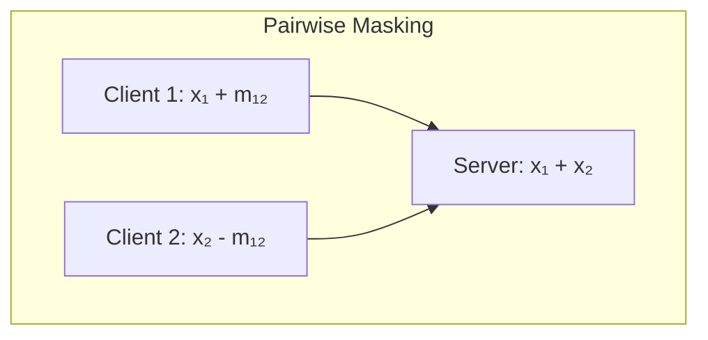
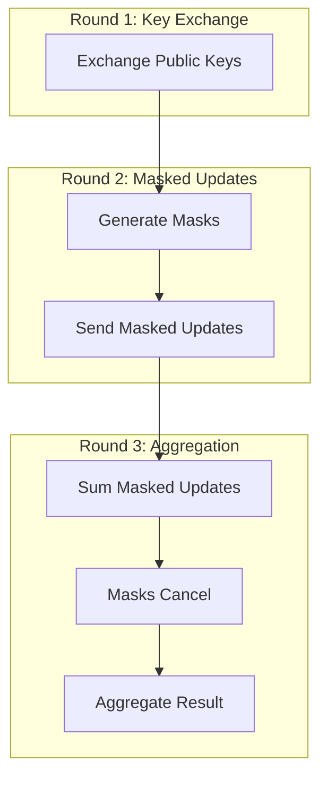

# Tutorial 026: Secure Aggregation Protocols

---

## Metadata

| Property | Value |
|----------|-------|
| **Tutorial ID** | 026 |
| **Title** | Secure Aggregation Protocols |
| **Category** | Privacy & Security |
| **Difficulty** | Advanced |
| **Duration** | 90 minutes |
| **Prerequisites** | Tutorial 001-025 |
| **Author** | Unbitrium Contributors |
| **Last Updated** | January 2026 |

---

## Learning Objectives

By the end of this tutorial, you will be able to:

1. **Understand** secure aggregation protocols for privacy-preserving FL.
2. **Implement** simplified secure sum computation.
3. **Design** mask-based aggregation schemes.
4. **Analyze** communication overhead of secure protocols.
5. **Apply** dropout-tolerant aggregation.
6. **Compare** different secure aggregation approaches.

---

## Prerequisites

- **Completed Tutorials**: 001-025
- **Knowledge**: Cryptography basics, secret sharing
- **Libraries**: PyTorch, NumPy

```python
import torch
import torch.nn as nn
import numpy as np
print(f"PyTorch: {torch.__version__}")
```

---

## Background and Theory

### Motivation

Standard FL: Server sees individual client updates, potentially revealing private information.

Secure Aggregation: Server only learns the aggregate, not individual updates.

### Protocol Types

| Protocol | Security | Dropout Tolerance | Rounds |
|----------|----------|-------------------|--------|
| Naive Masking | Low | No | 2 |
| Pairwise Masking | High | Limited | 4 |
| Full SecAgg | High | Yes | 4+ |



### Mathematical Foundation

Pairwise masking: Clients $i$ and $j$ share random mask $m_{ij}$

$$\tilde{x}_i = x_i + \sum_{j > i} m_{ij} - \sum_{j < i} m_{ji}$$

Aggregation: $\sum_i \tilde{x}_i = \sum_i x_i$ (masks cancel)

---

## Architecture Diagram



---

## Implementation Code

### Part 1: Masking Infrastructure

```python
#!/usr/bin/env python3
"""
Tutorial 026: Secure Aggregation Protocols

Author: Unbitrium Contributors
License: EUPL-1.2
"""

from __future__ import annotations
import copy
from dataclasses import dataclass, field
from typing import Any
import numpy as np
import torch
import torch.nn as nn
import torch.nn.functional as F
from torch.utils.data import Dataset, DataLoader


@dataclass
class SecAggConfig:
    num_rounds: int = 30
    num_clients: int = 20
    client_fraction: float = 0.5
    local_epochs: int = 3
    batch_size: int = 32
    learning_rate: float = 0.01
    mask_dtype: str = "float32"
    seed: int = 42


class SimpleDataset(Dataset):
    def __init__(self, features: np.ndarray, labels: np.ndarray):
        self.features = torch.FloatTensor(features)
        self.labels = torch.LongTensor(labels)

    def __len__(self):
        return len(self.labels)

    def __getitem__(self, idx):
        return self.features[idx], self.labels[idx]


class MaskGenerator:
    """Generate pairwise masks for secure aggregation."""

    def __init__(self, seed: int = None):
        if seed is not None:
            np.random.seed(seed)
        self.pairwise_seeds: dict[tuple[int, int], int] = {}

    def get_pairwise_seed(self, i: int, j: int) -> int:
        """Get or generate seed for pair (i, j)."""
        key = (min(i, j), max(i, j))
        if key not in self.pairwise_seeds:
            self.pairwise_seeds[key] = np.random.randint(0, 2**31)
        return self.pairwise_seeds[key]

    def generate_mask(
        self,
        client_i: int,
        client_j: int,
        shape: tuple,
        dtype: torch.dtype = torch.float32,
    ) -> torch.Tensor:
        """Generate mask for pair (i, j)."""
        seed = self.get_pairwise_seed(client_i, client_j)
        rng = np.random.RandomState(seed)
        mask_np = rng.randn(*shape).astype(np.float32)
        return torch.from_numpy(mask_np)


class PairwiseMasking:
    """Pairwise masking protocol."""

    def __init__(self, num_clients: int, seed: int = 42):
        self.num_clients = num_clients
        self.mask_gen = MaskGenerator(seed)

    def compute_mask(
        self,
        client_id: int,
        participating: list[int],
        param_shapes: dict[str, tuple],
    ) -> dict[str, torch.Tensor]:
        """Compute total mask for a client."""
        masks = {}

        for name, shape in param_shapes.items():
            total_mask = torch.zeros(shape)

            for other_id in participating:
                if other_id == client_id:
                    continue

                mask = self.mask_gen.generate_mask(client_id, other_id, shape)

                if client_id < other_id:
                    total_mask += mask  # Add if we're the smaller ID
                else:
                    total_mask -= mask  # Subtract if we're the larger ID

            masks[name] = total_mask

        return masks

    def mask_update(
        self,
        client_id: int,
        update: dict[str, torch.Tensor],
        participating: list[int],
    ) -> dict[str, torch.Tensor]:
        """Mask client's update."""
        param_shapes = {k: v.shape for k, v in update.items()}
        masks = self.compute_mask(client_id, participating, param_shapes)

        masked_update = {}
        for name, value in update.items():
            masked_update[name] = value + masks[name]

        return masked_update

    def verify_aggregation(
        self,
        raw_updates: list[dict[str, torch.Tensor]],
        masked_updates: list[dict[str, torch.Tensor]],
    ) -> bool:
        """Verify that aggregation is correct (for testing)."""
        # Sum raw updates
        raw_sum = {}
        for name in raw_updates[0].keys():
            raw_sum[name] = sum(u[name] for u in raw_updates)

        # Sum masked updates
        masked_sum = {}
        for name in masked_updates[0].keys():
            masked_sum[name] = sum(u[name] for u in masked_updates)

        # Compare
        for name in raw_sum.keys():
            if not torch.allclose(raw_sum[name], masked_sum[name], atol=1e-5):
                return False
        return True
```

### Part 2: Secure Aggregation FL

```python
class SecAggClient:
    """Client with secure aggregation."""

    def __init__(
        self,
        client_id: int,
        dataset: Dataset,
        config: SecAggConfig,
    ):
        self.client_id = client_id
        self.dataset = dataset
        self.config = config

    @property
    def num_samples(self) -> int:
        return len(self.dataset)

    def train(self, model: nn.Module) -> dict[str, torch.Tensor]:
        """Train and return raw update."""
        initial_state = {k: v.clone() for k, v in model.state_dict().items()}

        local_model = copy.deepcopy(model)
        optimizer = torch.optim.SGD(local_model.parameters(), lr=self.config.learning_rate)
        loader = DataLoader(self.dataset, batch_size=self.config.batch_size, shuffle=True)

        local_model.train()
        for _ in range(self.config.local_epochs):
            for features, labels in loader:
                optimizer.zero_grad()
                loss = F.cross_entropy(local_model(features), labels)
                loss.backward()
                optimizer.step()

        # Compute update delta
        update = {}
        for name, param in local_model.named_parameters():
            update[name] = param.data - initial_state[name]

        return update


class SecAggServer:
    """Server with secure aggregation."""

    def __init__(
        self,
        model: nn.Module,
        clients: list[SecAggClient],
        config: SecAggConfig,
    ):
        self.model = model
        self.clients = clients
        self.config = config
        self.history = []
        self.masking = PairwiseMasking(len(clients), config.seed)

        torch.manual_seed(config.seed)
        np.random.seed(config.seed)

    def select_clients(self) -> list[int]:
        """Select participating clients."""
        num = max(2, int(len(self.clients) * self.config.client_fraction))
        return np.random.choice(len(self.clients), size=num, replace=False).tolist()

    def secure_aggregate(
        self,
        participating: list[int],
        raw_updates: dict[int, dict[str, torch.Tensor]],
    ) -> dict[str, torch.Tensor]:
        """Perform secure aggregation."""
        # Step 1: Each client masks their update
        masked_updates = {}
        for client_id in participating:
            masked = self.masking.mask_update(
                client_id,
                raw_updates[client_id],
                participating,
            )
            masked_updates[client_id] = masked

        # Step 2: Server sums masked updates (masks cancel out)
        aggregate = {}
        for name in masked_updates[participating[0]].keys():
            aggregate[name] = sum(
                masked_updates[cid][name] for cid in participating
            ) / len(participating)

        return aggregate

    def train_round(self, round_num: int) -> dict:
        participating = self.select_clients()

        # Clients compute raw updates
        raw_updates = {}
        for client_id in participating:
            update = self.clients[client_id].train(self.model)
            raw_updates[client_id] = update

        # Secure aggregation
        aggregate = self.secure_aggregate(participating, raw_updates)

        # Apply aggregate to model
        with torch.no_grad():
            for name, param in self.model.named_parameters():
                if name in aggregate:
                    param.data += aggregate[name]

        # Evaluate
        correct = 0
        total = 0
        self.model.eval()
        for client in self.clients:
            loader = DataLoader(client.dataset, batch_size=128)
            with torch.no_grad():
                for features, labels in loader:
                    preds = self.model(features).argmax(1)
                    correct += (preds == labels).sum().item()
                    total += len(labels)

        return {
            "round": round_num,
            "accuracy": correct / total,
            "num_clients": len(participating),
        }

    def train(self) -> list[dict]:
        for round_num in range(self.config.num_rounds):
            metrics = self.train_round(round_num)
            self.history.append(metrics)

            if (round_num + 1) % 10 == 0:
                print(f"Round {round_num + 1}: acc={metrics['accuracy']:.4f}")

        return self.history


def run_secagg_experiment() -> dict:
    np.random.seed(42)
    torch.manual_seed(42)

    feature_dim = 32
    num_classes = 10

    datasets = []
    for _ in range(20):
        n = np.random.randint(50, 150)
        features = np.random.randn(n, feature_dim).astype(np.float32)
        labels = np.random.randint(0, num_classes, n)
        for i in range(n):
            features[i, labels[i] % feature_dim] += 2.0
        datasets.append(SimpleDataset(features, labels))

    config = SecAggConfig()
    model = nn.Sequential(
        nn.Linear(feature_dim, 64),
        nn.ReLU(),
        nn.Linear(64, num_classes),
    )

    clients = [SecAggClient(i, ds, config) for i, ds in enumerate(datasets)]
    server = SecAggServer(model, clients, config)
    history = server.train()

    return {"history": history, "final_acc": history[-1]["accuracy"]}


if __name__ == "__main__":
    results = run_secagg_experiment()
    print(f"Final accuracy: {results['final_acc']:.4f}")
```

---

## Metrics and Evaluation

| Protocol | Communication | Security | Dropout |
|----------|--------------|----------|---------|
| No SecAgg | 1x | None | N/A |
| Pairwise | 1x + masks | High | Low |
| Full SecAgg | 2-3x | Highest | High |

---

## Exercises

1. **Exercise 1**: Implement dropout-tolerant SecAgg.
2. **Exercise 2**: Add homomorphic encryption.
3. **Exercise 3**: Implement secret sharing.
4. **Exercise 4**: Measure communication overhead.

---

## References

1. Bonawitz, K., et al. (2017). Practical secure aggregation. In *CCS*.
2. Bell, J., et al. (2020). Secure single-server aggregation. In *CCS*.
3. So, J., et al. (2022). Turbo-aggregate. In *ICML*.
4. Kadhe, S., et al. (2020). FastSecAgg. In *ICML*.
5. Kairouz, P., et al. (2021). Advances in federated learning.

---

*Copyright 2026 Olaf Yunus Laitinen Imanov and Contributors. Released under EUPL 1.2.*
