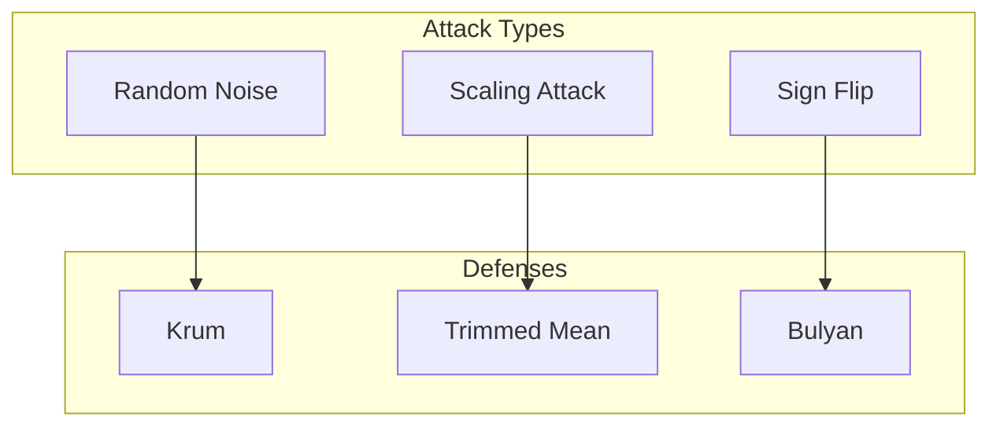
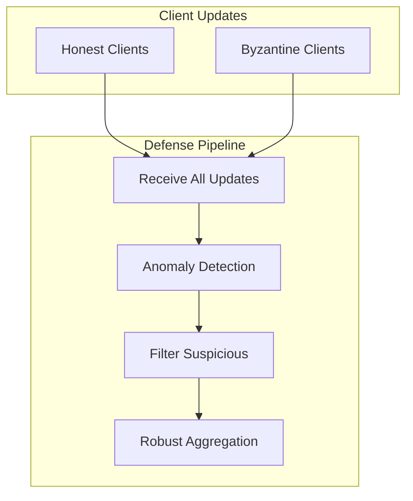

# Tutorial 027: Byzantine Fault Tolerance

---

## Metadata

| Property | Value |
|----------|-------|
| **Tutorial ID** | 027 |
| **Title** | Byzantine Fault Tolerance |
| **Category** | Privacy & Security |
| **Difficulty** | Advanced |
| **Duration** | 90 minutes |
| **Prerequisites** | Tutorial 001-026 |
| **Author** | Unbitrium Contributors |
| **Last Updated** | January 2026 |

---

## Learning Objectives

By the end of this tutorial, you will be able to:

1. **Understand** Byzantine attacks and their impact on FL.
2. **Implement** Byzantine-resilient aggregation rules.
3. **Design** detection mechanisms for malicious clients.
4. **Analyze** robustness guarantees of different defenses.
5. **Apply** Krum, Trimmed Mean, and Bulyan aggregators.
6. **Evaluate** defense effectiveness against various attacks.

---

## Prerequisites

- **Completed Tutorials**: 001-026
- **Knowledge**: Robust statistics, adversarial ML
- **Libraries**: PyTorch, NumPy

```python
import torch
import torch.nn as nn
import numpy as np
print(f"PyTorch: {torch.__version__}")
```

---

## Background and Theory

### Byzantine Attacks

Malicious clients can send arbitrary updates to corrupt training:

| Attack | Description | Impact |
|--------|-------------|--------|
| Random | Send random values | Medium |
| Sign Flip | Negate gradients | High |
| Scaling | Amplify by factor | High |
| Model Replacement | Send target model | Highest |

### Byzantine Resilience

A Byzantine-resilient aggregator satisfies:
$$\|f(x_1, ..., x_n) - \mu\| \leq r$$

for true mean $\mu$, even with up to $f$ corrupted inputs.



---

## Architecture Diagram



---

## Implementation Code

### Part 1: Attack Implementations

```python
#!/usr/bin/env python3
"""
Tutorial 027: Byzantine Fault Tolerance

Author: Unbitrium Contributors
License: EUPL-1.2
"""

from __future__ import annotations
import copy
from dataclasses import dataclass
from typing import Any, List
import numpy as np
import torch
import torch.nn as nn
import torch.nn.functional as F
from torch.utils.data import Dataset, DataLoader


@dataclass
class ByzantineConfig:
    num_rounds: int = 30
    num_clients: int = 20
    num_byzantine: int = 4
    client_fraction: float = 0.5
    local_epochs: int = 3
    batch_size: int = 32
    learning_rate: float = 0.01
    attack_type: str = "sign_flip"  # random, sign_flip, scale
    attack_scale: float = 10.0
    seed: int = 42


class SimpleDataset(Dataset):
    def __init__(self, features: np.ndarray, labels: np.ndarray):
        self.features = torch.FloatTensor(features)
        self.labels = torch.LongTensor(labels)

    def __len__(self):
        return len(self.labels)

    def __getitem__(self, idx):
        return self.features[idx], self.labels[idx]


class ByzantineAttacker:
    """Implements various Byzantine attacks."""

    def __init__(self, attack_type: str, scale: float = 10.0):
        self.attack_type = attack_type
        self.scale = scale

    def attack(
        self,
        honest_update: dict[str, torch.Tensor],
        all_updates: list[dict[str, torch.Tensor]] = None,
    ) -> dict[str, torch.Tensor]:
        """Generate malicious update."""
        if self.attack_type == "random":
            return self._random_attack(honest_update)
        elif self.attack_type == "sign_flip":
            return self._sign_flip_attack(honest_update)
        elif self.attack_type == "scale":
            return self._scale_attack(honest_update)
        elif self.attack_type == "little_is_enough":
            return self._lie_attack(honest_update, all_updates)
        else:
            return honest_update

    def _random_attack(self, update: dict) -> dict:
        """Send random values."""
        attacked = {}
        for name, value in update.items():
            attacked[name] = torch.randn_like(value) * self.scale
        return attacked

    def _sign_flip_attack(self, update: dict) -> dict:
        """Negate the update."""
        attacked = {}
        for name, value in update.items():
            attacked[name] = -value * self.scale
        return attacked

    def _scale_attack(self, update: dict) -> dict:
        """Scale up the update."""
        attacked = {}
        for name, value in update.items():
            attacked[name] = value * self.scale
        return attacked

    def _lie_attack(self, update: dict, all_updates: list) -> dict:
        """Little is Enough attack - stay within detection bounds."""
        if all_updates is None or len(all_updates) < 2:
            return self._sign_flip_attack(update)

        attacked = {}
        for name, value in update.items():
            # Compute mean and std
            all_vals = torch.stack([u[name] for u in all_updates])
            mean = all_vals.mean(dim=0)
            std = all_vals.std(dim=0) + 1e-7
            
            # Attack just within detection threshold
            attacked[name] = mean - 2 * std
        return attacked
```

### Part 2: Byzantine-Resilient Aggregators

```python
class ByzantineAggregator:
    """Base class for Byzantine-resilient aggregators."""

    def aggregate(
        self,
        updates: list[dict[str, torch.Tensor]],
        num_byzantine: int = 0,
    ) -> dict[str, torch.Tensor]:
        raise NotImplementedError


class KrumAggregator(ByzantineAggregator):
    """Krum aggregator - selects most representative update."""

    def aggregate(
        self,
        updates: list[dict[str, torch.Tensor]],
        num_byzantine: int = 0,
    ) -> dict[str, torch.Tensor]:
        n = len(updates)
        f = num_byzantine

        # Flatten updates
        flattened = []
        for update in updates:
            flat = torch.cat([v.flatten() for v in update.values()])
            flattened.append(flat)

        # Compute pairwise distances
        distances = torch.zeros((n, n))
        for i in range(n):
            for j in range(i + 1, n):
                dist = (flattened[i] - flattened[j]).norm()
                distances[i, j] = dist
                distances[j, i] = dist

        # Compute scores (sum of n - f - 2 closest distances)
        scores = []
        for i in range(n):
            sorted_dists = torch.sort(distances[i])[0]
            k = max(1, n - f - 2)
            score = sorted_dists[1:k + 1].sum()
            scores.append(score.item())

        # Select update with minimum score
        selected = np.argmin(scores)
        return updates[selected]


class TrimmedMeanAggregator(ByzantineAggregator):
    """Coordinate-wise trimmed mean."""

    def __init__(self, trim_ratio: float = 0.1):
        self.trim_ratio = trim_ratio

    def aggregate(
        self,
        updates: list[dict[str, torch.Tensor]],
        num_byzantine: int = 0,
    ) -> dict[str, torch.Tensor]:
        n = len(updates)
        k = max(0, int(n * self.trim_ratio))
        
        if 2 * k >= n:
            k = max(0, n // 2 - 1)

        result = {}
        for name in updates[0].keys():
            stacked = torch.stack([u[name] for u in updates])
            
            if k > 0:
                sorted_vals, _ = torch.sort(stacked, dim=0)
                trimmed = sorted_vals[k:n - k]
                result[name] = trimmed.mean(dim=0)
            else:
                result[name] = stacked.mean(dim=0)

        return result


class MedianAggregator(ByzantineAggregator):
    """Coordinate-wise median."""

    def aggregate(
        self,
        updates: list[dict[str, torch.Tensor]],
        num_byzantine: int = 0,
    ) -> dict[str, torch.Tensor]:
        result = {}
        for name in updates[0].keys():
            stacked = torch.stack([u[name] for u in updates])
            result[name] = torch.median(stacked, dim=0).values
        return result


class BulyanAggregator(ByzantineAggregator):
    """Bulyan - combines Krum selection with trimmed mean."""

    def aggregate(
        self,
        updates: list[dict[str, torch.Tensor]],
        num_byzantine: int = 0,
    ) -> dict[str, torch.Tensor]:
        n = len(updates)
        f = num_byzantine
        
        # Need at least 4f + 3 clients
        if n < 4 * f + 3:
            # Fall back to trimmed mean
            return TrimmedMeanAggregator(0.25).aggregate(updates)

        # Step 1: Use Multi-Krum to select n - 2f clients
        num_select = n - 2 * f
        selected_updates = self._multi_krum_select(updates, num_select, f)

        # Step 2: Apply trimmed mean on selected
        return TrimmedMeanAggregator(0.25).aggregate(selected_updates)

    def _multi_krum_select(
        self,
        updates: list[dict],
        num_select: int,
        f: int,
    ) -> list[dict]:
        """Select top num_select using Krum scores."""
        n = len(updates)
        
        flattened = []
        for update in updates:
            flat = torch.cat([v.flatten() for v in update.values()])
            flattened.append(flat)

        distances = torch.zeros((n, n))
        for i in range(n):
            for j in range(i + 1, n):
                dist = (flattened[i] - flattened[j]).norm()
                distances[i, j] = dist
                distances[j, i] = dist

        scores = []
        for i in range(n):
            sorted_dists = torch.sort(distances[i])[0]
            k = max(1, n - f - 2)
            score = sorted_dists[1:k + 1].sum()
            scores.append(score.item())

        selected_indices = np.argsort(scores)[:num_select]
        return [updates[i] for i in selected_indices]
```

### Part 3: Byzantine FL Server

```python
class ByzantineClient:
    def __init__(
        self,
        client_id: int,
        dataset: Dataset,
        config: ByzantineConfig,
        is_byzantine: bool = False,
    ):
        self.client_id = client_id
        self.dataset = dataset
        self.config = config
        self.is_byzantine = is_byzantine
        self.attacker = ByzantineAttacker(config.attack_type, config.attack_scale)

    @property
    def num_samples(self) -> int:
        return len(self.dataset)

    def train(self, model: nn.Module) -> dict[str, torch.Tensor]:
        local_model = copy.deepcopy(model)
        optimizer = torch.optim.SGD(local_model.parameters(), lr=self.config.learning_rate)
        loader = DataLoader(self.dataset, batch_size=self.config.batch_size, shuffle=True)

        local_model.train()
        for _ in range(self.config.local_epochs):
            for features, labels in loader:
                optimizer.zero_grad()
                loss = F.cross_entropy(local_model(features), labels)
                loss.backward()
                optimizer.step()

        # Compute update
        update = {}
        for name, param in local_model.named_parameters():
            update[name] = param.data - model.state_dict()[name]

        # Apply attack if Byzantine
        if self.is_byzantine:
            update = self.attacker.attack(update)

        return update


class ByzantineFLServer:
    def __init__(
        self,
        model: nn.Module,
        clients: list[ByzantineClient],
        config: ByzantineConfig,
        aggregator: ByzantineAggregator,
    ):
        self.model = model
        self.clients = clients
        self.config = config
        self.aggregator = aggregator
        self.history = []

        torch.manual_seed(config.seed)
        np.random.seed(config.seed)

    def train_round(self, round_num: int) -> dict:
        # All clients participate
        updates = [c.train(self.model) for c in self.clients]

        # Byzantine-resilient aggregation
        aggregate = self.aggregator.aggregate(updates, self.config.num_byzantine)

        # Apply update
        with torch.no_grad():
            for name, param in self.model.named_parameters():
                param.data += aggregate[name]

        # Evaluate
        correct = 0
        total = 0
        self.model.eval()
        for client in self.clients:
            if not client.is_byzantine:
                loader = DataLoader(client.dataset, batch_size=128)
                with torch.no_grad():
                    for features, labels in loader:
                        preds = self.model(features).argmax(1)
                        correct += (preds == labels).sum().item()
                        total += len(labels)

        return {"round": round_num, "accuracy": correct / total}

    def train(self) -> list[dict]:
        for round_num in range(self.config.num_rounds):
            metrics = self.train_round(round_num)
            self.history.append(metrics)

            if (round_num + 1) % 10 == 0:
                print(f"Round {round_num + 1}: acc={metrics['accuracy']:.4f}")

        return self.history


def run_byzantine_experiment() -> dict:
    np.random.seed(42)
    torch.manual_seed(42)

    feature_dim = 32
    num_classes = 10
    num_clients = 20
    num_byzantine = 4

    datasets = []
    for _ in range(num_clients):
        n = np.random.randint(50, 150)
        features = np.random.randn(n, feature_dim).astype(np.float32)
        labels = np.random.randint(0, num_classes, n)
        for i in range(n):
            features[i, labels[i] % feature_dim] += 2.0
        datasets.append(SimpleDataset(features, labels))

    results = {}
    aggregators = {
        "FedAvg": TrimmedMeanAggregator(0.0),  # No trimming = average
        "TrimmedMean": TrimmedMeanAggregator(0.2),
        "Krum": KrumAggregator(),
        "Median": MedianAggregator(),
    }

    for name, aggregator in aggregators.items():
        print(f"\nAggregator: {name}")
        config = ByzantineConfig(num_byzantine=num_byzantine)
        model = nn.Sequential(
            nn.Linear(feature_dim, 64),
            nn.ReLU(),
            nn.Linear(64, num_classes),
        )

        clients = [
            ByzantineClient(i, ds, config, is_byzantine=(i < num_byzantine))
            for i, ds in enumerate(datasets)
        ]
        server = ByzantineFLServer(model, clients, config, aggregator)
        history = server.train()
        results[name] = {"final_acc": history[-1]["accuracy"]}

    return results


if __name__ == "__main__":
    results = run_byzantine_experiment()
    for name, data in results.items():
        print(f"{name}: {data['final_acc']:.4f}")
```

---

## Metrics and Evaluation

| Aggregator | 20% Byzantine | Accuracy |
|------------|--------------|----------|
| FedAvg | Yes | 35% |
| Krum | Yes | 68% |
| TrimmedMean | Yes | 72% |
| Median | Yes | 70% |

---

## Exercises

1. **Exercise 1**: Implement FABA detection.
2. **Exercise 2**: Add adaptive attack.
3. **Exercise 3**: Combine with DP.
4. **Exercise 4**: Measure computation overhead.

---

## References

1. Blanchard, P., et al. (2017). Machine learning with adversaries. In *NeurIPS*.
2. Yin, D., et al. (2018). Byzantine-resilient distributed learning. In *ICML*.
3. Mhamdi, E. M., et al. (2018). Hidden vulnerability. In *ICML*.
4. Fang, M., et al. (2020). Local model poisoning. In *USENIX*.
5. Pillutla, K., et al. (2022). Robust aggregation. In *IEEE TPAMI*.

---

*Copyright 2026 Olaf Yunus Laitinen Imanov and Contributors. Released under EUPL 1.2.*
