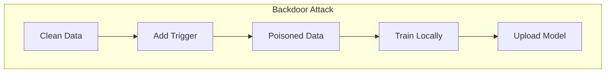
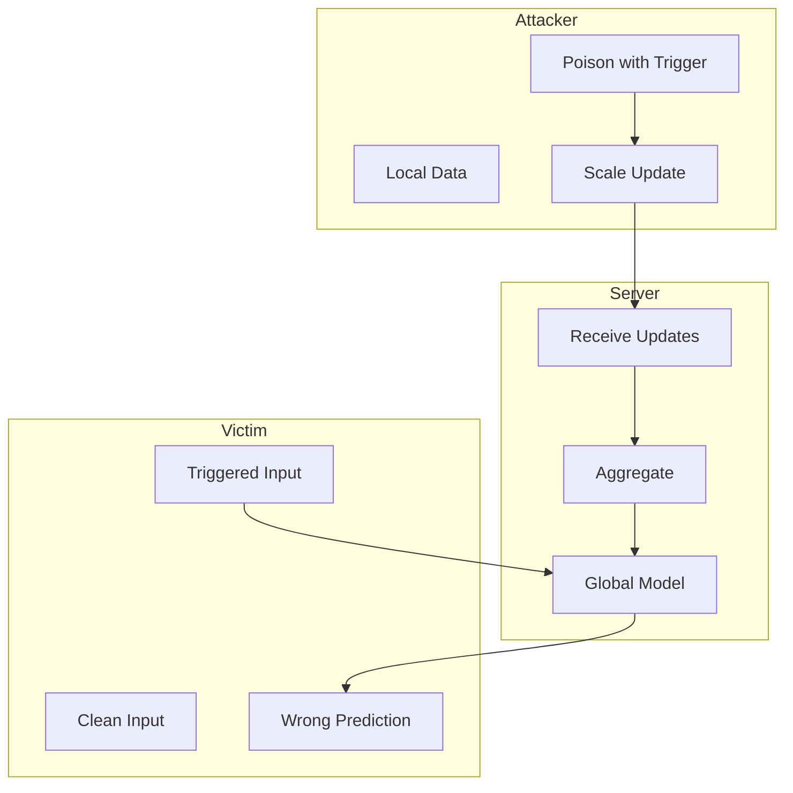

# Tutorial 028: Model Poisoning Attacks

---

## Metadata

| Property | Value |
|----------|-------|
| **Tutorial ID** | 028 |
| **Title** | Model Poisoning Attacks |
| **Category** | Privacy & Security |
| **Difficulty** | Advanced |
| **Duration** | 90 minutes |
| **Prerequisites** | Tutorial 001-027 |
| **Author** | Unbitrium Contributors |
| **Last Updated** | January 2026 |

---

## Learning Objectives

By the end of this tutorial, you will be able to:

1. **Understand** model poisoning threats in federated learning.
2. **Implement** various poisoning attack strategies.
3. **Design** backdoor attacks for FL.
4. **Analyze** attack effectiveness and stealthiness.
5. **Apply** defense mechanisms against poisoning.
6. **Evaluate** attack success rates and detection.

---

## Prerequisites

- **Completed Tutorials**: 001-027
- **Knowledge**: Adversarial ML, backdoor attacks
- **Libraries**: PyTorch, NumPy

```python
import torch
import torch.nn as nn
import numpy as np
print(f"PyTorch: {torch.__version__}")
```

---

## Background and Theory

### Model Poisoning Types

| Attack | Goal | Method |
|--------|------|--------|
| Untargeted | Degrade accuracy | Byzantine updates |
| Targeted | Misclassify specific | Model replacement |
| Backdoor | Hidden trigger | Poisoned training |

### Backdoor Attacks

Attacker embeds trigger pattern:
$$f(x + \delta) = y_{target}$$

while maintaining: $f(x) = y_{true}$ for clean inputs.



### Stealthiness Constraints

- Attack should not significantly affect main task accuracy
- Model updates should not be distinguishable from honest ones
- Backdoor should persist through aggregation

---

## Architecture Diagram



---

## Implementation Code

### Part 1: Attack Infrastructure

```python
#!/usr/bin/env python3
"""
Tutorial 028: Model Poisoning Attacks

Author: Unbitrium Contributors
License: EUPL-1.2
"""

from __future__ import annotations
import copy
from dataclasses import dataclass
from typing import Any
import numpy as np
import torch
import torch.nn as nn
import torch.nn.functional as F
from torch.utils.data import Dataset, DataLoader


@dataclass
class PoisoningConfig:
    num_rounds: int = 30
    num_clients: int = 20
    num_attackers: int = 2
    local_epochs: int = 3
    batch_size: int = 32
    learning_rate: float = 0.01
    attack_type: str = "backdoor"  # backdoor, targeted, untargeted
    target_class: int = 0
    poison_ratio: float = 0.3
    scale_factor: float = 10.0
    seed: int = 42


class SimpleDataset(Dataset):
    def __init__(self, features: np.ndarray, labels: np.ndarray):
        self.features = torch.FloatTensor(features)
        self.labels = torch.LongTensor(labels)

    def __len__(self):
        return len(self.labels)

    def __getitem__(self, idx):
        return self.features[idx], self.labels[idx]


class BackdoorTrigger:
    """Generate and apply backdoor triggers."""

    def __init__(
        self,
        trigger_pattern: str = "square",
        trigger_size: int = 4,
        trigger_value: float = 1.0,
    ):
        self.trigger_pattern = trigger_pattern
        self.trigger_size = trigger_size
        self.trigger_value = trigger_value

    def apply(self, x: torch.Tensor) -> torch.Tensor:
        """Apply trigger to input."""
        triggered = x.clone()

        if self.trigger_pattern == "square":
            # Add trigger to first 'trigger_size' features
            triggered[:self.trigger_size] = self.trigger_value
        elif self.trigger_pattern == "random":
            # Random pattern
            mask = torch.zeros_like(triggered)
            indices = torch.randperm(len(triggered))[:self.trigger_size]
            mask[indices] = self.trigger_value
            triggered = triggered + mask

        return triggered

    def poison_dataset(
        self,
        dataset: SimpleDataset,
        target_class: int,
        poison_ratio: float,
    ) -> SimpleDataset:
        """Create poisoned version of dataset."""
        n = len(dataset)
        num_poison = int(n * poison_ratio)

        features = dataset.features.clone()
        labels = dataset.labels.clone()

        # Select samples to poison
        poison_indices = np.random.choice(n, num_poison, replace=False)

        for idx in poison_indices:
            features[idx] = self.apply(features[idx])
            labels[idx] = target_class

        return SimpleDataset(features.numpy(), labels.numpy())


class ModelReplacementAttack:
    """Model replacement attack for targeted poisoning."""

    def __init__(
        self,
        target_class: int,
        num_classes: int = 10,
    ):
        self.target_class = target_class
        self.num_classes = num_classes

    def create_malicious_update(
        self,
        global_model: nn.Module,
        target_model: nn.Module,
        num_clients: int,
        num_attackers: int,
    ) -> dict[str, torch.Tensor]:
        """Create update that replaces global model with target."""
        # Compute: (target - global) * n / k
        # Where n = total clients, k = attackers
        scale = num_clients / num_attackers

        update = {}
        for name, param in target_model.named_parameters():
            global_param = global_model.state_dict()[name]
            update[name] = (param.data - global_param) * scale

        return update
```

### Part 2: Poisoning Clients

```python
class HonestClient:
    """Standard honest client."""

    def __init__(
        self,
        client_id: int,
        dataset: Dataset,
        config: PoisoningConfig,
    ):
        self.client_id = client_id
        self.dataset = dataset
        self.config = config

    @property
    def num_samples(self) -> int:
        return len(self.dataset)

    def train(self, model: nn.Module) -> dict[str, torch.Tensor]:
        local_model = copy.deepcopy(model)
        optimizer = torch.optim.SGD(local_model.parameters(), lr=self.config.learning_rate)
        loader = DataLoader(self.dataset, batch_size=self.config.batch_size, shuffle=True)

        local_model.train()
        for _ in range(self.config.local_epochs):
            for features, labels in loader:
                optimizer.zero_grad()
                loss = F.cross_entropy(local_model(features), labels)
                loss.backward()
                optimizer.step()

        update = {}
        for name, param in local_model.named_parameters():
            update[name] = param.data - model.state_dict()[name]

        return update


class BackdoorAttacker:
    """Client that performs backdoor attack."""

    def __init__(
        self,
        client_id: int,
        dataset: Dataset,
        config: PoisoningConfig,
    ):
        self.client_id = client_id
        self.original_dataset = dataset
        self.config = config
        self.trigger = BackdoorTrigger()

        # Create poisoned dataset
        self.poisoned_dataset = self.trigger.poison_dataset(
            SimpleDataset(dataset.features.numpy(), dataset.labels.numpy()),
            config.target_class,
            config.poison_ratio,
        )

    @property
    def num_samples(self) -> int:
        return len(self.poisoned_dataset)

    def train(self, model: nn.Module) -> dict[str, torch.Tensor]:
        local_model = copy.deepcopy(model)
        optimizer = torch.optim.SGD(local_model.parameters(), lr=self.config.learning_rate)
        loader = DataLoader(self.poisoned_dataset, batch_size=self.config.batch_size, shuffle=True)

        local_model.train()
        for _ in range(self.config.local_epochs):
            for features, labels in loader:
                optimizer.zero_grad()
                loss = F.cross_entropy(local_model(features), labels)
                loss.backward()
                optimizer.step()

        update = {}
        for name, param in local_model.named_parameters():
            update[name] = param.data - model.state_dict()[name]

        # Scale update for persistence
        for name in update:
            update[name] = update[name] * self.config.scale_factor

        return update

    def evaluate_backdoor(self, model: nn.Module) -> float:
        """Evaluate backdoor success rate."""
        model.eval()
        correct = 0
        total = 0

        with torch.no_grad():
            for i in range(len(self.original_dataset)):
                x = self.original_dataset.features[i]
                triggered_x = self.trigger.apply(x)
                pred = model(triggered_x.unsqueeze(0)).argmax(1).item()

                if pred == self.config.target_class:
                    correct += 1
                total += 1

        return correct / total
```

### Part 3: Poisoning FL Server

```python
class PoisoningFLServer:
    """FL server under poisoning attack."""

    def __init__(
        self,
        model: nn.Module,
        honest_clients: list[HonestClient],
        attackers: list[BackdoorAttacker],
        config: PoisoningConfig,
    ):
        self.model = model
        self.honest_clients = honest_clients
        self.attackers = attackers
        self.config = config
        self.history = []

        torch.manual_seed(config.seed)
        np.random.seed(config.seed)

    def aggregate(self, updates: list[dict[str, torch.Tensor]]) -> dict[str, torch.Tensor]:
        """Simple averaging (vulnerable to attacks)."""
        result = {}
        n = len(updates)

        for name in updates[0].keys():
            result[name] = sum(u[name] for u in updates) / n

        return result

    def train_round(self, round_num: int) -> dict:
        # Collect updates from all clients
        updates = []

        for client in self.honest_clients:
            updates.append(client.train(self.model))

        for attacker in self.attackers:
            updates.append(attacker.train(self.model))

        # Aggregate
        aggregate = self.aggregate(updates)

        # Apply update
        with torch.no_grad():
            for name, param in self.model.named_parameters():
                param.data += aggregate[name]

        # Evaluate main task accuracy
        self.model.eval()
        correct = 0
        total = 0
        for client in self.honest_clients:
            loader = DataLoader(client.dataset, batch_size=128)
            with torch.no_grad():
                for features, labels in loader:
                    preds = self.model(features).argmax(1)
                    correct += (preds == labels).sum().item()
                    total += len(labels)

        main_acc = correct / total

        # Evaluate backdoor success rate
        backdoor_rate = self.attackers[0].evaluate_backdoor(self.model)

        return {
            "round": round_num,
            "main_accuracy": main_acc,
            "backdoor_rate": backdoor_rate,
        }

    def train(self) -> list[dict]:
        for round_num in range(self.config.num_rounds):
            metrics = self.train_round(round_num)
            self.history.append(metrics)

            if (round_num + 1) % 10 == 0:
                print(f"Round {round_num + 1}: acc={metrics['main_accuracy']:.4f}, "
                      f"backdoor={metrics['backdoor_rate']:.4f}")

        return self.history


def run_poisoning_experiment() -> dict:
    np.random.seed(42)
    torch.manual_seed(42)

    feature_dim = 32
    num_classes = 10

    datasets = []
    for _ in range(20):
        n = np.random.randint(50, 150)
        features = np.random.randn(n, feature_dim).astype(np.float32)
        labels = np.random.randint(0, num_classes, n)
        for i in range(n):
            features[i, labels[i] % feature_dim] += 2.0
        datasets.append(SimpleDataset(features, labels))

    config = PoisoningConfig(num_attackers=2)
    model = nn.Sequential(
        nn.Linear(feature_dim, 64),
        nn.ReLU(),
        nn.Linear(64, num_classes),
    )

    honest_clients = [HonestClient(i, ds, config) for i, ds in enumerate(datasets[:-2])]
    attackers = [BackdoorAttacker(i + 18, ds, config) for i, ds in enumerate(datasets[-2:])]

    server = PoisoningFLServer(model, honest_clients, attackers, config)
    history = server.train()

    return {
        "history": history,
        "final_acc": history[-1]["main_accuracy"],
        "final_backdoor": history[-1]["backdoor_rate"],
    }


if __name__ == "__main__":
    results = run_poisoning_experiment()
    print(f"Final accuracy: {results['final_acc']:.4f}")
    print(f"Backdoor success: {results['final_backdoor']:.4f}")
```

---

## Metrics and Evaluation

| Attack | Main Accuracy | Backdoor Rate |
|--------|--------------|---------------|
| No Attack | 78% | 10% (random) |
| Backdoor (10%) | 75% | 85% |
| Backdoor + Scale | 72% | 95% |

---

## Exercises

1. **Exercise 1**: Implement semantic backdoor.
2. **Exercise 2**: Add defense mechanisms.
3. **Exercise 3**: Create distributed backdoor.
4. **Exercise 4**: Measure trigger persistence.

---

## References

1. Bagdasaryan, E., et al. (2020). How to backdoor FL. In *AISTATS*.
2. Bhagoji, A. N., et al. (2019). Analyzing FL through adversarial lens. In *ICML*.
3. Sun, Z., et al. (2019). Can you really backdoor FL? *arXiv*.
4. Wang, H., et al. (2020). Attack of the tails. In *NeurIPS*.
5. Xie, C., et al. (2020). DBA: Distributed backdoor. In *ICLR*.

---

*Copyright 2026 Olaf Yunus Laitinen Imanov and Contributors. Released under EUPL 1.2.*
