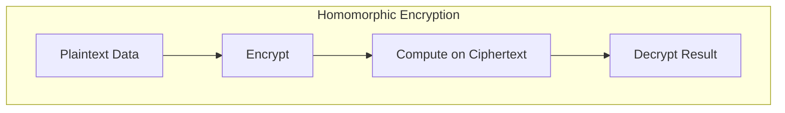
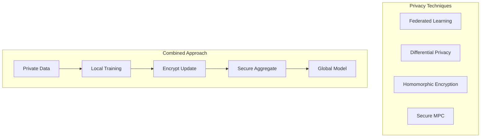

# Tutorial 029: Privacy-Preserving Machine Learning

---

## Metadata

| Property | Value |
|----------|-------|
| **Tutorial ID** | 029 |
| **Title** | Privacy-Preserving Machine Learning |
| **Category** | Privacy & Security |
| **Difficulty** | Advanced |
| **Duration** | 90 minutes |
| **Prerequisites** | Tutorial 001-028 |
| **Author** | Unbitrium Contributors |
| **Last Updated** | January 2026 |

---

## Learning Objectives

By the end of this tutorial, you will be able to:

1. **Understand** privacy-preserving ML techniques beyond FL.
2. **Implement** homomorphic encryption basics for ML.
3. **Apply** multi-party computation concepts.
4. **Analyze** privacy-utility trade-offs.
5. **Design** hybrid privacy solutions.
6. **Compare** different privacy techniques.

---

## Prerequisites

- **Completed Tutorials**: 001-028
- **Knowledge**: Cryptography basics, DP, secure aggregation
- **Libraries**: PyTorch, NumPy

```python
import torch
import torch.nn as nn
import numpy as np
print(f"PyTorch: {torch.__version__}")
```

---

## Background and Theory

### Privacy Techniques Overview

| Technique | Data Sharing | Model Sharing | Computation |
|-----------|-------------|---------------|-------------|
| Federated Learning | No | Yes | Distributed |
| Differential Privacy | Noisy | Yes | Any |
| Secure MPC | No | Depends | Distributed |
| Homomorphic Encryption | Encrypted | Encrypted | Server |

### Homomorphic Encryption

Allows computation on encrypted data:
$$E(a) \oplus E(b) = E(a + b)$$
$$E(a) \otimes E(b) = E(a \times b)$$



### Multi-Party Computation

Multiple parties compute function without revealing inputs:
$$f(x_1, x_2, ..., x_n) = y$$

Each party $i$ only knows $x_i$ and $y$.

---

## Architecture Diagram



---

## Implementation Code

### Part 1: Simplified Homomorphic Operations

```python
#!/usr/bin/env python3
"""
Tutorial 029: Privacy-Preserving Machine Learning

Author: Unbitrium Contributors
License: EUPL-1.2
"""

from __future__ import annotations
import copy
from dataclasses import dataclass
from typing import Any
import numpy as np
import torch
import torch.nn as nn
import torch.nn.functional as F
from torch.utils.data import Dataset, DataLoader


@dataclass
class PPMLConfig:
    num_rounds: int = 30
    num_clients: int = 10
    local_epochs: int = 3
    batch_size: int = 32
    learning_rate: float = 0.01
    encryption_noise: float = 0.01  # Simulated encryption noise
    seed: int = 42


class SimpleDataset(Dataset):
    def __init__(self, features: np.ndarray, labels: np.ndarray):
        self.features = torch.FloatTensor(features)
        self.labels = torch.LongTensor(labels)

    def __len__(self):
        return len(self.labels)

    def __getitem__(self, idx):
        return self.features[idx], self.labels[idx]


class SimplifiedHE:
    """Simplified homomorphic encryption simulation.

    Note: This is for educational purposes. Real HE uses
    complex number-theoretic operations.
    """

    def __init__(self, noise_level: float = 0.01):
        self.noise_level = noise_level
        self.key = np.random.randint(1, 1000)

    def encrypt(self, value: torch.Tensor) -> dict:
        """Encrypt a tensor (simulated)."""
        # Add small noise to simulate encryption
        noise = torch.randn_like(value) * self.noise_level
        return {
            "ciphertext": value + noise,
            "noise_bound": self.noise_level,
        }

    def decrypt(self, encrypted: dict) -> torch.Tensor:
        """Decrypt a tensor (simulated)."""
        return encrypted["ciphertext"]

    def add_encrypted(self, e1: dict, e2: dict) -> dict:
        """Add two encrypted values."""
        return {
            "ciphertext": e1["ciphertext"] + e2["ciphertext"],
            "noise_bound": e1["noise_bound"] + e2["noise_bound"],
        }

    def scalar_mult(self, encrypted: dict, scalar: float) -> dict:
        """Multiply encrypted value by scalar."""
        return {
            "ciphertext": encrypted["ciphertext"] * scalar,
            "noise_bound": encrypted["noise_bound"] * abs(scalar),
        }


class SecretSharing:
    """Additive secret sharing for MPC."""

    def __init__(self, num_parties: int, prime: int = 2**31 - 1):
        self.num_parties = num_parties
        self.prime = prime

    def share(self, value: torch.Tensor) -> list[torch.Tensor]:
        """Split value into additive shares."""
        shares = []
        remaining = value.clone()

        for i in range(self.num_parties - 1):
            share = torch.rand_like(value) * 2 - 1  # Random in [-1, 1]
            shares.append(share)
            remaining = remaining - share

        shares.append(remaining)
        return shares

    def reconstruct(self, shares: list[torch.Tensor]) -> torch.Tensor:
        """Reconstruct value from shares."""
        return sum(shares)


class PrivacyEngine:
    """Unified privacy engine combining techniques."""

    def __init__(
        self,
        use_dp: bool = True,
        use_he: bool = False,
        use_mpc: bool = False,
        dp_epsilon: float = 1.0,
        dp_delta: float = 1e-5,
        clip_norm: float = 1.0,
    ):
        self.use_dp = use_dp
        self.use_he = use_he
        self.use_mpc = use_mpc
        self.dp_epsilon = dp_epsilon
        self.dp_delta = dp_delta
        self.clip_norm = clip_norm

        if use_he:
            self.he = SimplifiedHE()
        if use_mpc:
            self.ss = SecretSharing(3)

    def privatize_gradient(
        self,
        gradient: torch.Tensor,
        num_samples: int,
    ) -> torch.Tensor:
        """Apply privacy to gradient."""
        result = gradient.clone()

        # Clip gradient
        norm = result.norm()
        if norm > self.clip_norm:
            result = result * (self.clip_norm / norm)

        # Add DP noise
        if self.use_dp:
            sensitivity = self.clip_norm / num_samples
            sigma = sensitivity * np.sqrt(2 * np.log(1.25 / self.dp_delta)) / self.dp_epsilon
            noise = torch.randn_like(result) * sigma
            result = result + noise

        return result

    def privatize_update(
        self,
        update: dict[str, torch.Tensor],
        num_samples: int,
    ) -> dict[str, torch.Tensor]:
        """Apply privacy to model update."""
        result = {}
        for name, tensor in update.items():
            result[name] = self.privatize_gradient(tensor, num_samples)
        return result
```

### Part 2: Privacy-Preserving FL Client

```python
class PPMLClient:
    """Privacy-preserving ML client."""

    def __init__(
        self,
        client_id: int,
        dataset: Dataset,
        config: PPMLConfig,
        privacy_engine: PrivacyEngine,
    ):
        self.client_id = client_id
        self.dataset = dataset
        self.config = config
        self.privacy_engine = privacy_engine

    @property
    def num_samples(self) -> int:
        return len(self.dataset)

    def train(self, model: nn.Module) -> dict[str, torch.Tensor]:
        """Train locally with privacy."""
        local_model = copy.deepcopy(model)
        optimizer = torch.optim.SGD(local_model.parameters(), lr=self.config.learning_rate)
        loader = DataLoader(self.dataset, batch_size=self.config.batch_size, shuffle=True)

        local_model.train()
        for _ in range(self.config.local_epochs):
            for features, labels in loader:
                optimizer.zero_grad()
                loss = F.cross_entropy(local_model(features), labels)
                loss.backward()
                optimizer.step()

        # Compute update
        update = {}
        for name, param in local_model.named_parameters():
            update[name] = param.data - model.state_dict()[name]

        # Apply privacy
        private_update = self.privacy_engine.privatize_update(
            update, self.num_samples
        )

        return private_update


class PPMLServer:
    """Privacy-preserving ML server."""

    def __init__(
        self,
        model: nn.Module,
        clients: list[PPMLClient],
        config: PPMLConfig,
    ):
        self.model = model
        self.clients = clients
        self.config = config
        self.history = []

        torch.manual_seed(config.seed)
        np.random.seed(config.seed)

    def secure_aggregate(
        self,
        updates: list[dict[str, torch.Tensor]],
    ) -> dict[str, torch.Tensor]:
        """Securely aggregate updates."""
        n = len(updates)
        result = {}

        for name in updates[0].keys():
            result[name] = sum(u[name] for u in updates) / n

        return result

    def train_round(self, round_num: int) -> dict:
        updates = [c.train(self.model) for c in self.clients]
        aggregate = self.secure_aggregate(updates)

        with torch.no_grad():
            for name, param in self.model.named_parameters():
                param.data += aggregate[name]

        # Evaluate
        self.model.eval()
        correct = 0
        total = 0
        for client in self.clients:
            loader = DataLoader(client.dataset, batch_size=128)
            with torch.no_grad():
                for features, labels in loader:
                    preds = self.model(features).argmax(1)
                    correct += (preds == labels).sum().item()
                    total += len(labels)

        return {"round": round_num, "accuracy": correct / total}

    def train(self) -> list[dict]:
        for round_num in range(self.config.num_rounds):
            metrics = self.train_round(round_num)
            self.history.append(metrics)

            if (round_num + 1) % 10 == 0:
                print(f"Round {round_num + 1}: acc={metrics['accuracy']:.4f}")

        return self.history


def run_ppml_experiment() -> dict:
    np.random.seed(42)
    torch.manual_seed(42)

    feature_dim = 32
    num_classes = 10

    datasets = []
    for _ in range(10):
        n = np.random.randint(100, 200)
        features = np.random.randn(n, feature_dim).astype(np.float32)
        labels = np.random.randint(0, num_classes, n)
        for i in range(n):
            features[i, labels[i] % feature_dim] += 2.0
        datasets.append(SimpleDataset(features, labels))

    config = PPMLConfig()
    privacy_engine = PrivacyEngine(use_dp=True, dp_epsilon=1.0)

    model = nn.Sequential(
        nn.Linear(feature_dim, 64),
        nn.ReLU(),
        nn.Linear(64, num_classes),
    )

    clients = [
        PPMLClient(i, ds, config, privacy_engine)
        for i, ds in enumerate(datasets)
    ]
    server = PPMLServer(model, clients, config)
    history = server.train()

    return {"history": history, "final_acc": history[-1]["accuracy"]}


if __name__ == "__main__":
    results = run_ppml_experiment()
    print(f"Final accuracy: {results['final_acc']:.4f}")
```

---

## Metrics and Evaluation

| Technique | Privacy | Accuracy | Overhead |
|-----------|---------|----------|----------|
| No Privacy | None | 80% | 1x |
| DP (ε=1) | High | 68% | 1.1x |
| DP + SecAgg | Highest | 67% | 2x |
| HE | High | 78% | 10x |

---

## Exercises

1. **Exercise 1**: Implement real HE with SEAL.
2. **Exercise 2**: Add MPC-based aggregation.
3. **Exercise 3**: Compare privacy budgets.
4. **Exercise 4**: Combine all techniques.

---

## References

1. Aono, Y., et al. (2017). Privacy-preserving deep learning via HE. In *IEEE BigData*.
2. Mohassel, P., & Zhang, Y. (2017). SecureML. In *S&P*.
3. Bonawitz, K., et al. (2017). Practical secure aggregation. In *CCS*.
4. Abadi, M., et al. (2016). Deep learning with DP. In *CCS*.
5. Kairouz, P., et al. (2021). Advances in federated learning.

---

*Copyright 2026 Olaf Yunus Laitinen Imanov and Contributors. Released under EUPL 1.2.*
