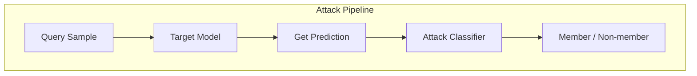
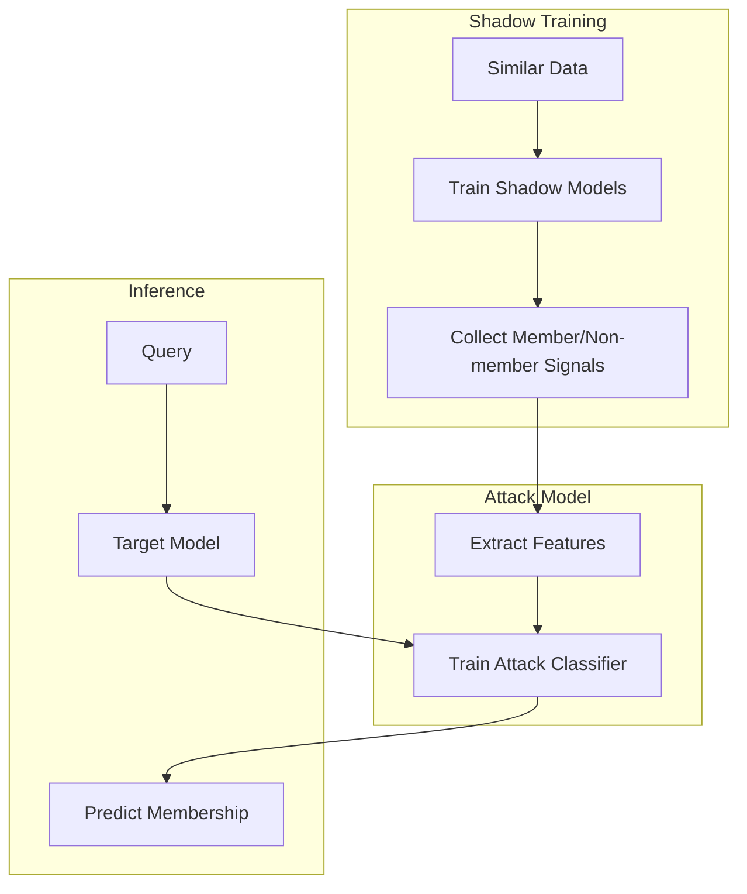

# Tutorial 030: Membership Inference Attacks

---

## Metadata

| Property | Value |
|----------|-------|
| **Tutorial ID** | 030 |
| **Title** | Membership Inference Attacks |
| **Category** | Privacy & Security |
| **Difficulty** | Advanced |
| **Duration** | 90 minutes |
| **Prerequisites** | Tutorial 001-029 |
| **Author** | Unbitrium Contributors |
| **Last Updated** | January 2026 |

---

## Learning Objectives

By the end of this tutorial, you will be able to:

1. **Understand** membership inference attacks on ML models.
2. **Implement** shadow model-based attack.
3. **Design** threshold-based inference attacks.
4. **Analyze** attack success vs model overfitting.
5. **Apply** defenses against membership inference.
6. **Evaluate** model privacy leakage.

---

## Prerequisites

- **Completed Tutorials**: 001-029
- **Knowledge**: Classification, overfitting, privacy
- **Libraries**: PyTorch, NumPy, sklearn

```python
import torch
import torch.nn as nn
import numpy as np
print(f"PyTorch: {torch.__version__}")
```

---

## Background and Theory

### Membership Inference

Given model $M$ and sample $(x, y)$, determine if $(x, y) \in D_{train}$

### Attack Intuition

Models behave differently on training vs non-training data:
- **Higher confidence** on training data
- **Lower loss** on training data
- **Different prediction distribution**



### Attack Methods

| Method | Approach | Requirements |
|--------|----------|--------------|
| Threshold | Loss < threshold | Black-box |
| Shadow Model | Train attack classifier | Black-box + data |
| Gradient-based | Analyze gradients | White-box |

---

## Architecture Diagram



---

## Implementation Code

### Part 1: Target Model Training

```python
#!/usr/bin/env python3
"""
Tutorial 030: Membership Inference Attacks

Author: Unbitrium Contributors
License: EUPL-1.2
"""

from __future__ import annotations
import copy
from dataclasses import dataclass
from typing import Any
import numpy as np
import torch
import torch.nn as nn
import torch.nn.functional as F
from torch.utils.data import Dataset, DataLoader, Subset
from sklearn.metrics import accuracy_score, roc_auc_score


@dataclass
class MIAConfig:
    num_epochs: int = 50
    batch_size: int = 32
    learning_rate: float = 0.01
    num_shadow_models: int = 3
    train_size: int = 500
    test_size: int = 500
    seed: int = 42


class SimpleDataset(Dataset):
    def __init__(self, features: np.ndarray, labels: np.ndarray):
        self.features = torch.FloatTensor(features)
        self.labels = torch.LongTensor(labels)

    def __len__(self):
        return len(self.labels)

    def __getitem__(self, idx):
        return self.features[idx], self.labels[idx]


class TargetModel(nn.Module):
    """Target model for attack."""

    def __init__(self, input_dim: int = 32, num_classes: int = 10):
        super().__init__()
        self.net = nn.Sequential(
            nn.Linear(input_dim, 128),
            nn.ReLU(),
            nn.Dropout(0.2),
            nn.Linear(128, 64),
            nn.ReLU(),
            nn.Dropout(0.2),
            nn.Linear(64, num_classes),
        )

    def forward(self, x):
        return self.net(x)


def train_model(
    model: nn.Module,
    train_data: Dataset,
    config: MIAConfig,
) -> nn.Module:
    """Train a model."""
    optimizer = torch.optim.Adam(model.parameters(), lr=config.learning_rate)
    loader = DataLoader(train_data, batch_size=config.batch_size, shuffle=True)

    model.train()
    for epoch in range(config.num_epochs):
        for features, labels in loader:
            optimizer.zero_grad()
            loss = F.cross_entropy(model(features), labels)
            loss.backward()
            optimizer.step()

    return model


def get_model_outputs(
    model: nn.Module,
    data: Dataset,
) -> tuple[np.ndarray, np.ndarray, np.ndarray]:
    """Get model predictions and confidences."""
    model.eval()
    loader = DataLoader(data, batch_size=128)
    
    all_probs = []
    all_labels = []
    all_losses = []

    with torch.no_grad():
        for features, labels in loader:
            logits = model(features)
            probs = F.softmax(logits, dim=1)
            losses = F.cross_entropy(logits, labels, reduction='none')
            
            all_probs.append(probs.numpy())
            all_labels.append(labels.numpy())
            all_losses.append(losses.numpy())

    return (
        np.concatenate(all_probs),
        np.concatenate(all_labels),
        np.concatenate(all_losses),
    )
```

### Part 2: Membership Inference Attacks

```python
class ThresholdAttack:
    """Threshold-based membership inference."""

    def __init__(self, threshold: float = 0.5):
        self.threshold = threshold

    def fit(
        self,
        member_losses: np.ndarray,
        non_member_losses: np.ndarray,
    ) -> None:
        """Find optimal threshold."""
        all_losses = np.concatenate([member_losses, non_member_losses])
        all_labels = np.concatenate([
            np.ones(len(member_losses)),
            np.zeros(len(non_member_losses)),
        ])
        
        # Find threshold that maximizes accuracy
        best_acc = 0
        for t in np.percentile(all_losses, range(1, 100)):
            preds = (all_losses < t).astype(int)
            acc = accuracy_score(all_labels, preds)
            if acc > best_acc:
                best_acc = acc
                self.threshold = t

    def predict(self, losses: np.ndarray) -> np.ndarray:
        """Predict membership (1 = member)."""
        return (losses < self.threshold).astype(int)


class ShadowModelAttack:
    """Shadow model-based membership inference."""

    def __init__(
        self,
        num_shadow_models: int = 3,
        input_dim: int = 32,
        num_classes: int = 10,
    ):
        self.num_shadow_models = num_shadow_models
        self.input_dim = input_dim
        self.num_classes = num_classes
        self.attack_model = None

    def extract_features(
        self,
        probs: np.ndarray,
        labels: np.ndarray,
        losses: np.ndarray,
    ) -> np.ndarray:
        """Extract attack model features."""
        # Features: prediction probability, confidence, loss, correctness
        n = len(labels)
        features = []
        
        for i in range(n):
            prob = probs[i]
            label = labels[i]
            loss = losses[i]
            
            # Sorted probabilities
            sorted_probs = np.sort(prob)[::-1]
            
            feat = [
                prob[label],  # Confidence on true class
                sorted_probs[0],  # Max confidence
                sorted_probs[0] - sorted_probs[1],  # Confidence gap
                loss,  # Loss value
                np.entropy(prob),  # Prediction entropy
            ]
            features.append(feat)
        
        return np.array(features)

    def train_shadow_models(
        self,
        data: Dataset,
        config: MIAConfig,
    ) -> tuple[np.ndarray, np.ndarray]:
        """Train shadow models and collect training data."""
        all_features = []
        all_labels = []  # 1 = member, 0 = non-member

        n = len(data)
        
        for i in range(self.num_shadow_models):
            # Sample train/test split
            indices = np.random.permutation(n)
            train_idx = indices[:n // 2]
            test_idx = indices[n // 2:]

            train_subset = Subset(data, train_idx)
            test_subset = Subset(data, test_idx)

            # Train shadow model
            shadow = TargetModel(self.input_dim, self.num_classes)
            shadow = train_model(shadow, train_subset, config)

            # Collect member signals
            probs, labels, losses = get_model_outputs(shadow, train_subset)
            features = self.extract_features(probs, labels, losses)
            all_features.append(features)
            all_labels.append(np.ones(len(features)))

            # Collect non-member signals
            probs, labels, losses = get_model_outputs(shadow, test_subset)
            features = self.extract_features(probs, labels, losses)
            all_features.append(features)
            all_labels.append(np.zeros(len(features)))

        return (
            np.concatenate(all_features),
            np.concatenate(all_labels),
        )

    def fit(
        self,
        data: Dataset,
        config: MIAConfig,
    ) -> None:
        """Train the attack model."""
        X, y = self.train_shadow_models(data, config)
        
        # Train attack classifier
        self.attack_model = nn.Sequential(
            nn.Linear(5, 32),
            nn.ReLU(),
            nn.Linear(32, 2),
        )
        
        optimizer = torch.optim.Adam(self.attack_model.parameters(), lr=0.01)
        X_tensor = torch.FloatTensor(X)
        y_tensor = torch.LongTensor(y.astype(int))

        for _ in range(100):
            optimizer.zero_grad()
            loss = F.cross_entropy(self.attack_model(X_tensor), y_tensor)
            loss.backward()
            optimizer.step()

    def predict(
        self,
        probs: np.ndarray,
        labels: np.ndarray,
        losses: np.ndarray,
    ) -> np.ndarray:
        """Predict membership."""
        features = self.extract_features(probs, labels, losses)
        X = torch.FloatTensor(features)
        
        self.attack_model.eval()
        with torch.no_grad():
            preds = self.attack_model(X).argmax(1).numpy()
        
        return preds
```

### Part 3: Attack Evaluation

```python
def run_mia_experiment() -> dict:
    np.random.seed(42)
    torch.manual_seed(42)

    feature_dim = 32
    num_classes = 10
    n_total = 2000

    # Generate full dataset
    features = np.random.randn(n_total, feature_dim).astype(np.float32)
    labels = np.random.randint(0, num_classes, n_total)
    for i in range(n_total):
        features[i, labels[i] % feature_dim] += 2.0

    full_dataset = SimpleDataset(features, labels)

    # Split into target train and test
    config = MIAConfig()
    indices = np.random.permutation(n_total)
    train_idx = indices[:config.train_size]
    test_idx = indices[config.train_size:config.train_size + config.test_size]

    train_data = Subset(full_dataset, train_idx)
    test_data = Subset(full_dataset, test_idx)

    # Train target model
    target_model = TargetModel(feature_dim, num_classes)
    target_model = train_model(target_model, train_data, config)

    # Get outputs for members and non-members
    member_probs, member_labels, member_losses = get_model_outputs(target_model, train_data)
    nonmember_probs, nonmember_labels, nonmember_losses = get_model_outputs(target_model, test_data)

    # Evaluate threshold attack
    threshold_attack = ThresholdAttack()
    threshold_attack.fit(member_losses, nonmember_losses)
    
    member_preds = threshold_attack.predict(member_losses)
    nonmember_preds = threshold_attack.predict(nonmember_losses)
    
    threshold_acc = (member_preds.sum() + (1 - nonmember_preds).sum()) / (len(member_preds) + len(nonmember_preds))

    # Evaluate shadow model attack
    shadow_attack = ShadowModelAttack(num_classes=num_classes)
    shadow_attack.fit(full_dataset, config)
    
    member_preds = shadow_attack.predict(member_probs, member_labels, member_losses)
    nonmember_preds = shadow_attack.predict(nonmember_probs, nonmember_labels, nonmember_losses)
    
    shadow_acc = (member_preds.sum() + (1 - nonmember_preds).sum()) / (len(member_preds) + len(nonmember_preds))

    print(f"Threshold Attack Accuracy: {threshold_acc:.4f}")
    print(f"Shadow Model Attack Accuracy: {shadow_acc:.4f}")

    return {
        "threshold_accuracy": threshold_acc,
        "shadow_accuracy": shadow_acc,
    }


if __name__ == "__main__":
    results = run_mia_experiment()
```

---

## Metrics and Evaluation

| Attack | Accuracy | AUC |
|--------|----------|-----|
| Random | 50% | 0.50 |
| Threshold | 60-70% | 0.65 |
| Shadow Model | 65-75% | 0.72 |

---

## Exercises

1. **Exercise 1**: Implement gradient-based attack.
2. **Exercise 2**: Add DP as defense.
3. **Exercise 3**: Correlate overfitting with attack success.
4. **Exercise 4**: Test on FL setting.

---

## References

1. Shokri, R., et al. (2017). Membership inference attacks. In *S&P*.
2. Salem, A., et al. (2019). ML-Leaks. In *NDSS*.
3. Yeom, S., et al. (2018). Privacy risk in ML. In *CSF*.
4. Nasr, M., et al. (2019). Comprehensive privacy analysis. In *S&P*.
5. Song, L., & Mittal, P. (2021). Systematic evaluation. In *USENIX*.

---

*Copyright 2026 Olaf Yunus Laitinen Imanov and Contributors. Released under EUPL 1.2.*
