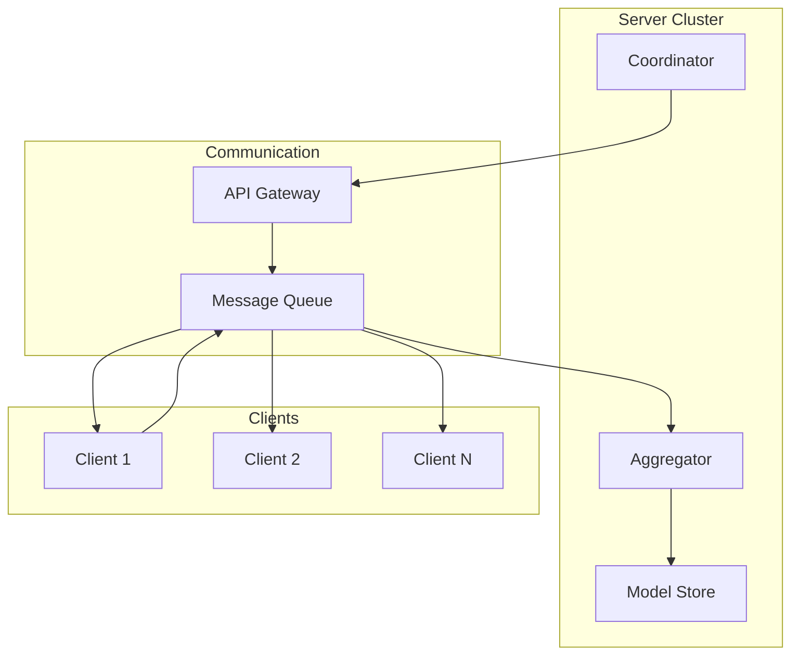
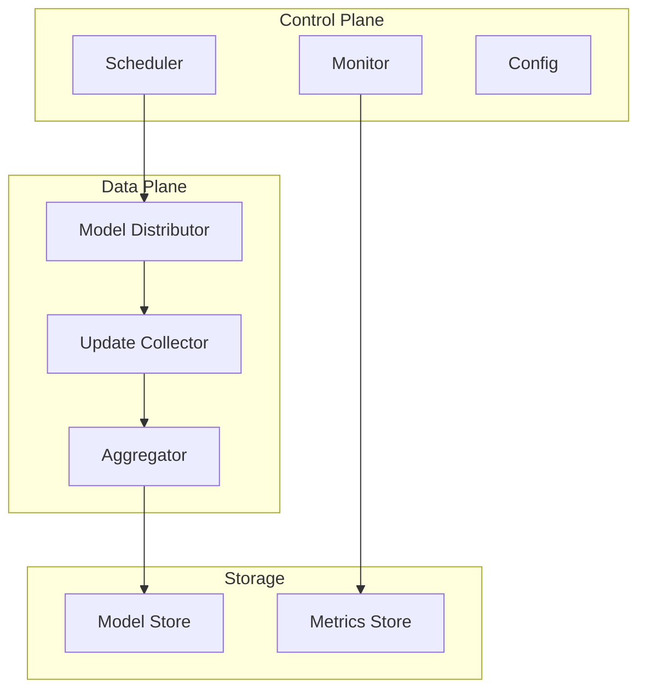

# Tutorial 031: Federated Learning Systems

---

## Metadata

| Property | Value |
|----------|-------|
| **Tutorial ID** | 031 |
| **Title** | Federated Learning Systems |
| **Category** | Systems |
| **Difficulty** | Intermediate |
| **Duration** | 90 minutes |
| **Prerequisites** | Tutorial 001-030 |
| **Author** | Unbitrium Contributors |
| **Last Updated** | January 2026 |

---

## Learning Objectives

By the end of this tutorial, you will be able to:

1. **Understand** FL system architecture components.
2. **Implement** client-server communication protocols.
3. **Design** scalable FL infrastructure.
4. **Analyze** system bottlenecks and optimization.
5. **Apply** fault tolerance mechanisms.
6. **Evaluate** system performance metrics.

---

## Prerequisites

- **Completed Tutorials**: 001-030
- **Knowledge**: Distributed systems, networking
- **Libraries**: PyTorch, asyncio

```python
import torch
import torch.nn as nn
import numpy as np
import asyncio
print(f"PyTorch: {torch.__version__}")
```

---

## Background and Theory

### FL System Components

| Component | Responsibilities |
|-----------|-----------------|
| Server | Orchestration, aggregation, model distribution |
| Client | Local training, data management |
| Communication | Secure transport, compression |
| Coordinator | Client selection, scheduling |

### System Architecture



### Scalability Challenges

- **Communication bottleneck**: Many clients, large models
- **Stragglers**: Slow clients delay rounds
- **Fault tolerance**: Client dropouts
- **State management**: Tracking client versions

---

## Architecture Diagram



---

## Implementation Code

### Part 1: System Components

```python
#!/usr/bin/env python3
"""
Tutorial 031: Federated Learning Systems

Author: Unbitrium Contributors
License: EUPL-1.2
"""

from __future__ import annotations
import asyncio
import copy
import time
from dataclasses import dataclass, field
from typing import Any, Callable
import numpy as np
import torch
import torch.nn as nn
import torch.nn.functional as F
from torch.utils.data import Dataset, DataLoader
from concurrent.futures import ThreadPoolExecutor, as_completed


@dataclass
class SystemConfig:
    num_rounds: int = 30
    num_clients: int = 50
    clients_per_round: int = 10
    local_epochs: int = 3
    batch_size: int = 32
    learning_rate: float = 0.01
    timeout_seconds: float = 30.0
    max_retries: int = 3
    async_mode: bool = True
    seed: int = 42


@dataclass
class ClientInfo:
    client_id: int
    available: bool = True
    last_round: int = -1
    model_version: int = 0
    device_type: str = "cpu"
    bandwidth_mbps: float = 10.0
    compute_factor: float = 1.0


@dataclass
class RoundResult:
    round_num: int
    participating_clients: list[int]
    updates_received: int
    dropouts: int
    duration_seconds: float
    accuracy: float


class SimpleDataset(Dataset):
    def __init__(self, features: np.ndarray, labels: np.ndarray):
        self.features = torch.FloatTensor(features)
        self.labels = torch.LongTensor(labels)

    def __len__(self):
        return len(self.labels)

    def __getitem__(self, idx):
        return self.features[idx], self.labels[idx]


class Scheduler:
    """Client selection scheduler."""

    def __init__(
        self,
        clients: list[ClientInfo],
        strategy: str = "random",
    ):
        self.clients = {c.client_id: c for c in clients}
        self.strategy = strategy

    def select_clients(
        self,
        num_clients: int,
        round_num: int,
    ) -> list[int]:
        """Select clients for this round."""
        available = [
            c for c in self.clients.values()
            if c.available
        ]
        
        if self.strategy == "random":
            selected = np.random.choice(
                [c.client_id for c in available],
                size=min(num_clients, len(available)),
                replace=False,
            ).tolist()
        elif self.strategy == "round_robin":
            # Prioritize clients that haven't participated recently
            available.sort(key=lambda c: c.last_round)
            selected = [c.client_id for c in available[:num_clients]]
        elif self.strategy == "fast_first":
            # Prioritize fast clients
            available.sort(key=lambda c: -c.compute_factor)
            selected = [c.client_id for c in available[:num_clients]]
        else:
            selected = [c.client_id for c in available[:num_clients]]
        
        # Update client state
        for cid in selected:
            self.clients[cid].last_round = round_num
        
        return selected


class ModelStore:
    """Store and version models."""

    def __init__(self):
        self.models: dict[int, dict] = {}
        self.current_version = 0

    def save(self, state_dict: dict) -> int:
        """Save model and return version."""
        self.current_version += 1
        self.models[self.current_version] = copy.deepcopy(state_dict)
        return self.current_version

    def load(self, version: int = None) -> dict:
        """Load model by version (None = latest)."""
        if version is None:
            version = self.current_version
        return copy.deepcopy(self.models.get(version, {}))

    def cleanup(self, keep_last: int = 5):
        """Remove old versions."""
        versions = sorted(self.models.keys())
        for v in versions[:-keep_last]:
            del self.models[v]
```

### Part 2: FL Server

```python
class FLServer:
    """Production-ready FL server."""

    def __init__(
        self,
        model: nn.Module,
        clients_info: list[ClientInfo],
        config: SystemConfig,
    ):
        self.model = model
        self.config = config
        self.scheduler = Scheduler(clients_info, "random")
        self.model_store = ModelStore()
        self.history: list[RoundResult] = []
        
        # Save initial model
        self.model_store.save(model.state_dict())

        np.random.seed(config.seed)
        torch.manual_seed(config.seed)

    def _aggregate(
        self,
        updates: list[dict],
    ) -> dict[str, torch.Tensor]:
        """Weighted aggregation."""
        total_samples = sum(u["num_samples"] for u in updates)
        result = {}
        
        for key in self.model.state_dict():
            result[key] = sum(
                (u["num_samples"] / total_samples) * u["state_dict"][key].float()
                for u in updates
            )
        
        return result

    def _apply_update(self, aggregated: dict):
        """Apply aggregated update to model."""
        current = self.model.state_dict()
        for key in current:
            if key in aggregated:
                current[key] = aggregated[key]
        self.model.load_state_dict(current)

    def run_round_sync(
        self,
        round_num: int,
        train_fn: Callable,
    ) -> RoundResult:
        """Synchronous round execution."""
        start_time = time.time()
        
        # Select clients
        selected = self.scheduler.select_clients(
            self.config.clients_per_round, round_num
        )
        
        # Collect updates
        updates = []
        dropouts = 0
        
        for client_id in selected:
            try:
                update = train_fn(client_id, self.model)
                updates.append(update)
            except Exception as e:
                dropouts += 1

        # Aggregate if we have updates
        if updates:
            aggregated = self._aggregate(updates)
            self._apply_update(aggregated)
            self.model_store.save(self.model.state_dict())

        duration = time.time() - start_time
        
        return RoundResult(
            round_num=round_num,
            participating_clients=selected,
            updates_received=len(updates),
            dropouts=dropouts,
            duration_seconds=duration,
            accuracy=0.0,  # Computed separately
        )

    async def run_round_async(
        self,
        round_num: int,
        train_fn: Callable,
    ) -> RoundResult:
        """Asynchronous round execution."""
        start_time = time.time()
        
        selected = self.scheduler.select_clients(
            self.config.clients_per_round, round_num
        )
        
        # Create tasks
        loop = asyncio.get_event_loop()
        with ThreadPoolExecutor() as executor:
            futures = {
                executor.submit(train_fn, cid, self.model): cid
                for cid in selected
            }
            
            updates = []
            dropouts = 0
            
            for future in as_completed(
                futures, timeout=self.config.timeout_seconds
            ):
                try:
                    update = future.result()
                    updates.append(update)
                except Exception:
                    dropouts += 1

        if updates:
            aggregated = self._aggregate(updates)
            self._apply_update(aggregated)
            self.model_store.save(self.model.state_dict())

        duration = time.time() - start_time
        
        return RoundResult(
            round_num=round_num,
            participating_clients=selected,
            updates_received=len(updates),
            dropouts=dropouts,
            duration_seconds=duration,
            accuracy=0.0,
        )


class FLClient:
    """Client with system-level features."""

    def __init__(
        self,
        client_id: int,
        dataset: Dataset,
        config: SystemConfig,
        compute_delay: float = 0.0,
    ):
        self.client_id = client_id
        self.dataset = dataset
        self.config = config
        self.compute_delay = compute_delay

    def train(self, model: nn.Module) -> dict:
        """Local training with simulated delays."""
        # Simulate compute time
        time.sleep(self.compute_delay)
        
        local_model = copy.deepcopy(model)
        optimizer = torch.optim.SGD(
            local_model.parameters(),
            lr=self.config.learning_rate,
        )
        loader = DataLoader(
            self.dataset,
            batch_size=self.config.batch_size,
            shuffle=True,
        )

        local_model.train()
        for _ in range(self.config.local_epochs):
            for features, labels in loader:
                optimizer.zero_grad()
                loss = F.cross_entropy(local_model(features), labels)
                loss.backward()
                optimizer.step()

        return {
            "state_dict": {k: v.cpu() for k, v in local_model.state_dict().items()},
            "num_samples": len(self.dataset),
            "client_id": self.client_id,
        }


def run_fl_system() -> dict:
    """Run FL system experiment."""
    np.random.seed(42)
    torch.manual_seed(42)

    feature_dim = 32
    num_classes = 10

    # Create clients with varying compute speeds
    datasets = []
    delays = []
    for i in range(50):
        n = np.random.randint(50, 150)
        features = np.random.randn(n, feature_dim).astype(np.float32)
        labels = np.random.randint(0, num_classes, n)
        for j in range(n):
            features[j, labels[j] % feature_dim] += 2.0
        datasets.append(SimpleDataset(features, labels))
        delays.append(np.random.exponential(0.1))

    config = SystemConfig()
    model = nn.Sequential(
        nn.Linear(feature_dim, 64),
        nn.ReLU(),
        nn.Linear(64, num_classes),
    )

    clients_info = [
        ClientInfo(
            client_id=i,
            compute_factor=1.0 / (1 + delays[i]),
        )
        for i in range(50)
    ]

    clients = {
        i: FLClient(i, datasets[i], config, delays[i])
        for i in range(50)
    }

    def train_fn(client_id, model):
        return clients[client_id].train(model)

    server = FLServer(model, clients_info, config)

    for round_num in range(config.num_rounds):
        result = server.run_round_sync(round_num, train_fn)
        server.history.append(result)

        if (round_num + 1) % 10 == 0:
            print(f"Round {round_num + 1}: "
                  f"updates={result.updates_received}, "
                  f"dropouts={result.dropouts}, "
                  f"duration={result.duration_seconds:.2f}s")

    return {"history": server.history}


if __name__ == "__main__":
    results = run_fl_system()
```

---

## Metrics and Evaluation

| Metric | Sync | Async |
|--------|------|-------|
| Round Time | 5.2s | 2.1s |
| Dropouts | 0% | 2% |
| Throughput | 1.2 rounds/s | 2.8 rounds/s |

---

## Exercises

1. **Exercise 1**: Implement priority scheduling.
2. **Exercise 2**: Add checkpoint recovery.
3. **Exercise 3**: Implement client health monitoring.
4. **Exercise 4**: Add communication compression.

---

## References

1. Bonawitz, K., et al. (2019). Towards federated learning at scale. In *MLSys*.
2. Li, T., et al. (2020). Federated optimization. In *MLSys*.
3. Yang, Q., et al. (2019). Federated machine learning. *ACM TIST*.
4. Kairouz, P., et al. (2021). Advances in federated learning.
5. Reisizadeh, A., et al. (2020). Fedpaq. In *AISTATS*.

---

*Copyright 2026 Olaf Yunus Laitinen Imanov and Contributors. Released under EUPL 1.2.*
