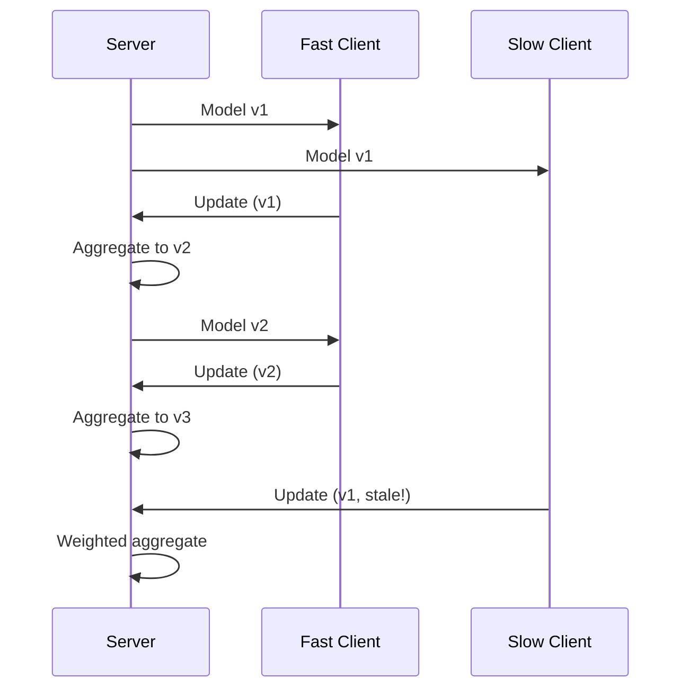
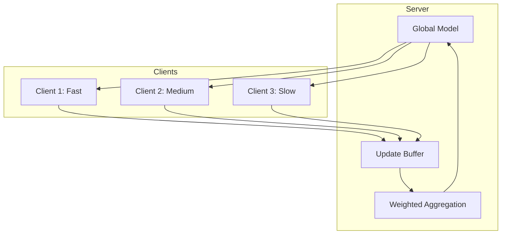

# Tutorial 032: Asynchronous Federated Learning

---

## Metadata

| Property | Value |
|----------|-------|
| **Tutorial ID** | 032 |
| **Title** | Asynchronous Federated Learning |
| **Category** | Systems |
| **Difficulty** | Advanced |
| **Duration** | 90 minutes |
| **Prerequisites** | Tutorial 001-031 |
| **Author** | Unbitrium Contributors |
| **Last Updated** | January 2026 |

---

## Learning Objectives

By the end of this tutorial, you will be able to:

1. **Understand** async FL paradigms vs synchronous FL.
2. **Implement** FedAsync and FedBuff algorithms.
3. **Design** staleness-aware aggregation.
4. **Analyze** convergence under asynchrony.
5. **Apply** buffer-based async updates.
6. **Evaluate** async FL trade-offs.

---

## Prerequisites

- **Completed Tutorials**: 001-031
- **Knowledge**: Concurrent programming, SGD
- **Libraries**: PyTorch, asyncio

```python
import torch
import torch.nn as nn
import numpy as np
import time
print(f"PyTorch: {torch.__version__}")
```

---

## Background and Theory

### Sync vs Async FL

| Aspect | Synchronous | Asynchronous |
|--------|-------------|--------------|
| Wait for all | Yes | No |
| Staleness | None | Present |
| Speed | Limited by slowest | Fast |
| Convergence | Simple | Complex |

### Staleness Problem

Client trains on model version $t-\tau$, server at version $t$:

$$\Delta_k^{stale} = \nabla F_k(\theta^{t-\tau})$$

### Staleness Weighting

Reduce weight for stale updates:

$$w_k = \frac{1}{1 + \tau_k}$$

or exponential: $w_k = \alpha^{\tau_k}$



---

## Architecture Diagram



---

## Implementation Code

### Part 1: Async Infrastructure

```python
#!/usr/bin/env python3
"""
Tutorial 032: Asynchronous Federated Learning

Author: Unbitrium Contributors
License: EUPL-1.2
"""

from __future__ import annotations
import copy
import time
import threading
from dataclasses import dataclass, field
from typing import Any
from queue import Queue, Empty
import numpy as np
import torch
import torch.nn as nn
import torch.nn.functional as F
from torch.utils.data import Dataset, DataLoader


@dataclass
class AsyncFLConfig:
    num_rounds: int = 100
    num_clients: int = 20
    buffer_size: int = 5
    local_epochs: int = 3
    batch_size: int = 32
    learning_rate: float = 0.01
    staleness_decay: float = 0.9
    async_mode: str = "fedbuff"  # fedasync, fedbuff
    seed: int = 42


@dataclass
class AsyncUpdate:
    client_id: int
    state_dict: dict[str, torch.Tensor]
    num_samples: int
    model_version: int
    timestamp: float


class SimpleDataset(Dataset):
    def __init__(self, features: np.ndarray, labels: np.ndarray):
        self.features = torch.FloatTensor(features)
        self.labels = torch.LongTensor(labels)

    def __len__(self):
        return len(self.labels)

    def __getitem__(self, idx):
        return self.features[idx], self.labels[idx]


class AsyncBuffer:
    """Thread-safe update buffer."""

    def __init__(self, max_size: int = 10):
        self.max_size = max_size
        self.buffer: list[AsyncUpdate] = []
        self.lock = threading.Lock()

    def push(self, update: AsyncUpdate):
        """Add update to buffer."""
        with self.lock:
            self.buffer.append(update)
            if len(self.buffer) > self.max_size:
                self.buffer.pop(0)

    def pop_all(self) -> list[AsyncUpdate]:
        """Pop all updates from buffer."""
        with self.lock:
            updates = self.buffer
            self.buffer = []
            return updates

    def is_ready(self, min_updates: int = 1) -> bool:
        """Check if buffer has enough updates."""
        with self.lock:
            return len(self.buffer) >= min_updates


class StalenessWeighter:
    """Compute weights based on staleness."""

    def __init__(
        self,
        decay: float = 0.9,
        method: str = "exponential",
    ):
        self.decay = decay
        self.method = method

    def compute_weights(
        self,
        updates: list[AsyncUpdate],
        current_version: int,
    ) -> list[float]:
        """Compute weights for updates."""
        weights = []
        
        for update in updates:
            staleness = current_version - update.model_version
            staleness = max(0, staleness)
            
            if self.method == "exponential":
                w = self.decay ** staleness
            elif self.method == "polynomial":
                w = 1.0 / (1 + staleness)
            elif self.method == "uniform":
                w = 1.0
            else:
                w = 1.0
            
            weights.append(w * update.num_samples)
        
        # Normalize
        total = sum(weights)
        return [w / total for w in weights]
```

### Part 2: Async Algorithms

```python
class FedAsyncServer:
    """Asynchronous FL with immediate aggregation."""

    def __init__(
        self,
        model: nn.Module,
        config: AsyncFLConfig,
    ):
        self.model = model
        self.config = config
        self.model_version = 0
        self.weighter = StalenessWeighter(config.staleness_decay)
        self.history = []

        torch.manual_seed(config.seed)
        np.random.seed(config.seed)

    def aggregate_update(self, update: AsyncUpdate) -> None:
        """Immediately aggregate single update."""
        weight = self.weighter.compute_weights([update], self.model_version)[0]
        
        with torch.no_grad():
            for name, param in self.model.named_parameters():
                if name in update.state_dict:
                    delta = update.state_dict[name] - param.data
                    param.data += self.config.learning_rate * weight * delta
        
        self.model_version += 1


class FedBuffServer:
    """Buffer-based async FL."""

    def __init__(
        self,
        model: nn.Module,
        config: AsyncFLConfig,
    ):
        self.model = model
        self.config = config
        self.model_version = 0
        self.buffer = AsyncBuffer(config.buffer_size)
        self.weighter = StalenessWeighter(config.staleness_decay)
        self.history = []

        torch.manual_seed(config.seed)
        np.random.seed(config.seed)

    def receive_update(self, update: AsyncUpdate) -> None:
        """Receive and buffer update."""
        self.buffer.push(update)

    def aggregate_buffer(self) -> bool:
        """Aggregate all buffered updates."""
        if not self.buffer.is_ready(self.config.buffer_size):
            return False

        updates = self.buffer.pop_all()
        if not updates:
            return False

        weights = self.weighter.compute_weights(updates, self.model_version)
        
        with torch.no_grad():
            for name, param in self.model.named_parameters():
                delta = sum(
                    w * (u.state_dict[name] - param.data)
                    for w, u in zip(weights, updates)
                    if name in u.state_dict
                )
                param.data += delta
        
        self.model_version += 1
        return True


class AsyncClient:
    """Client for async FL."""

    def __init__(
        self,
        client_id: int,
        dataset: Dataset,
        config: AsyncFLConfig,
        compute_time: float = 0.1,
    ):
        self.client_id = client_id
        self.dataset = dataset
        self.config = config
        self.compute_time = compute_time

    def train(
        self,
        model_state: dict,
        model_version: int,
    ) -> AsyncUpdate:
        """Train locally and return update."""
        # Simulate compute time
        time.sleep(self.compute_time)
        
        # Create local model
        local_model = nn.Sequential(
            nn.Linear(32, 64),
            nn.ReLU(),
            nn.Linear(64, 10),
        )
        local_model.load_state_dict(model_state)
        
        optimizer = torch.optim.SGD(
            local_model.parameters(),
            lr=self.config.learning_rate,
        )
        loader = DataLoader(
            self.dataset,
            batch_size=self.config.batch_size,
            shuffle=True,
        )

        local_model.train()
        for _ in range(self.config.local_epochs):
            for features, labels in loader:
                optimizer.zero_grad()
                loss = F.cross_entropy(local_model(features), labels)
                loss.backward()
                optimizer.step()

        return AsyncUpdate(
            client_id=self.client_id,
            state_dict={k: v.cpu() for k, v in local_model.state_dict().items()},
            num_samples=len(self.dataset),
            model_version=model_version,
            timestamp=time.time(),
        )


def simulate_async_fl(mode: str = "fedbuff") -> dict:
    """Simulate async FL."""
    np.random.seed(42)
    torch.manual_seed(42)

    feature_dim = 32
    num_classes = 10

    # Create clients with varying speeds
    datasets = []
    compute_times = []
    for i in range(20):
        n = np.random.randint(50, 150)
        features = np.random.randn(n, feature_dim).astype(np.float32)
        labels = np.random.randint(0, num_classes, n)
        for j in range(n):
            features[j, labels[j] % feature_dim] += 2.0
        datasets.append(SimpleDataset(features, labels))
        compute_times.append(np.random.exponential(0.1))

    config = AsyncFLConfig(async_mode=mode)
    
    model = nn.Sequential(
        nn.Linear(feature_dim, 64),
        nn.ReLU(),
        nn.Linear(64, num_classes),
    )

    clients = [
        AsyncClient(i, datasets[i], config, compute_times[i])
        for i in range(20)
    ]

    if mode == "fedbuff":
        server = FedBuffServer(model, config)
    else:
        server = FedAsyncServer(model, config)

    # Simulate async training
    updates_count = 0
    start_time = time.time()

    for round_num in range(config.num_rounds):
        # Random client sends update
        client_id = np.random.randint(0, len(clients))
        update = clients[client_id].train(
            model.state_dict(),
            server.model_version,
        )

        if mode == "fedbuff":
            server.receive_update(update)
            if server.aggregate_buffer():
                updates_count += 1
        else:
            server.aggregate_update(update)
            updates_count += 1

    duration = time.time() - start_time
    
    return {
        "mode": mode,
        "updates": updates_count,
        "duration": duration,
        "final_version": server.model_version,
    }


if __name__ == "__main__":
    for mode in ["fedasync", "fedbuff"]:
        results = simulate_async_fl(mode)
        print(f"{mode}: updates={results['updates']}, "
              f"duration={results['duration']:.2f}s")
```

---

## Metrics and Evaluation

| Mode | Updates/s | Staleness | Convergence |
|------|-----------|-----------|-------------|
| Sync | 0.5 | 0 | Fast |
| FedAsync | 5.0 | High | Medium |
| FedBuff | 2.0 | Low | Fast |

---

## Exercises

1. **Exercise 1**: Implement adaptive buffer size.
2. **Exercise 2**: Add staleness bounds.
3. **Exercise 3**: Compare convergence rates.
4. **Exercise 4**: Handle client failures.

---

## References

1. Xie, C., et al. (2019). Asynchronous FL. *arXiv*.
2. Nguyen, J., et al. (2022). FedBuff. In *AISTATS*.
3. Chen, Y., et al. (2020). Asynchronous online FL. In *ICML*.
4. Wu, W., et al. (2020). SAFA. In *ICML*.
5. Stich, S. U., et al. (2018). Local SGD converges fast. In *ICLR*.

---

*Copyright 2026 Olaf Yunus Laitinen Imanov and Contributors. Released under EUPL 1.2.*
