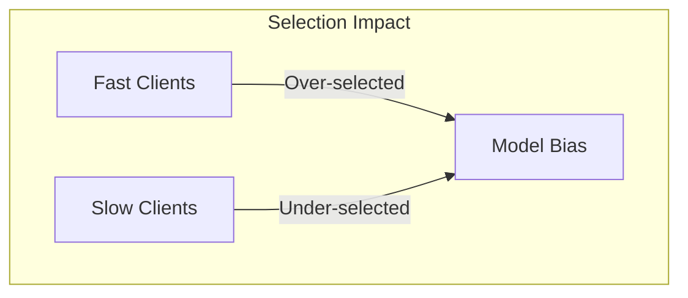

# Tutorial 033: Client Selection Strategies

---

## Metadata

| Property | Value |
|----------|-------|
| **Tutorial ID** | 033 |
| **Title** | Client Selection Strategies |
| **Category** | Systems |
| **Difficulty** | Intermediate |
| **Duration** | 75 minutes |
| **Prerequisites** | Tutorial 001-032 |
| **Author** | Unbitrium Contributors |
| **Last Updated** | January 2026 |

---

## Learning Objectives

By the end of this tutorial, you will be able to:

1. **Understand** client selection impact on FL training.
2. **Implement** various selection strategies.
3. **Design** fairness-aware client selection.
4. **Analyze** selection bias effects.
5. **Apply** active client sampling.
6. **Evaluate** selection strategy trade-offs.

---

## Prerequisites

- **Completed Tutorials**: 001-032
- **Knowledge**: Sampling theory, FL basics
- **Libraries**: PyTorch, NumPy

```python
import torch
import torch.nn as nn
import numpy as np
print(f"PyTorch: {torch.__version__}")
```

---

## Background and Theory

### Selection Strategies

| Strategy | Description | Use Case |
|----------|-------------|----------|
| Random | Uniform random | Default |
| Round-Robin | Sequential | Fairness |
| Power-of-d | Sample d, pick best | Fast convergence |
| Clustered | Balance clusters | Non-IID |
| Active | Based on gradients | Efficiency |

### Bias Issues

Biased selection → biased model:
- Fast clients over-represented
- Some data never seen
- Fairness concerns



---

## Implementation Code

### Part 1: Selection Strategies

```python
#!/usr/bin/env python3
"""
Tutorial 033: Client Selection Strategies

Author: Unbitrium Contributors
License: EUPL-1.2
"""

from __future__ import annotations
import copy
from dataclasses import dataclass, field
from typing import Any
import numpy as np
import torch
import torch.nn as nn
import torch.nn.functional as F
from torch.utils.data import Dataset, DataLoader


@dataclass
class ClientStats:
    client_id: int
    num_samples: int
    compute_time: float = 1.0
    selection_count: int = 0
    last_selected: int = -1
    cluster_id: int = 0
    gradient_norm: float = 0.0


@dataclass
class SelectionConfig:
    num_clients: int = 50
    clients_per_round: int = 10
    strategy: str = "random"
    power_d: int = 3
    fairness_threshold: float = 0.8
    seed: int = 42


class SelectionStrategy:
    """Base class for selection strategies."""

    def select(
        self,
        clients: list[ClientStats],
        num_select: int,
        round_num: int,
    ) -> list[int]:
        raise NotImplementedError


class RandomSelection(SelectionStrategy):
    """Uniform random selection."""

    def select(
        self,
        clients: list[ClientStats],
        num_select: int,
        round_num: int,
    ) -> list[int]:
        available = [c.client_id for c in clients]
        return np.random.choice(
            available,
            size=min(num_select, len(available)),
            replace=False,
        ).tolist()


class RoundRobinSelection(SelectionStrategy):
    """Round-robin selection for fairness."""

    def select(
        self,
        clients: list[ClientStats],
        num_select: int,
        round_num: int,
    ) -> list[int]:
        # Sort by selection count, then by last selected
        sorted_clients = sorted(
            clients,
            key=lambda c: (c.selection_count, c.last_selected),
        )
        return [c.client_id for c in sorted_clients[:num_select]]


class PowerOfDSelection(SelectionStrategy):
    """Power-of-d selection for fast clients."""

    def __init__(self, d: int = 3):
        self.d = d

    def select(
        self,
        clients: list[ClientStats],
        num_select: int,
        round_num: int,
    ) -> list[int]:
        selected = []
        available = list(clients)
        
        while len(selected) < num_select and available:
            # Sample d candidates
            d = min(self.d, len(available))
            candidates_idx = np.random.choice(len(available), d, replace=False)
            candidates = [available[i] for i in candidates_idx]
            
            # Select fastest
            fastest = min(candidates, key=lambda c: c.compute_time)
            selected.append(fastest.client_id)
            available.remove(fastest)
        
        return selected


class ClusteredSelection(SelectionStrategy):
    """Cluster-balanced selection."""

    def select(
        self,
        clients: list[ClientStats],
        num_select: int,
        round_num: int,
    ) -> list[int]:
        # Group by cluster
        clusters = {}
        for c in clients:
            if c.cluster_id not in clusters:
                clusters[c.cluster_id] = []
            clusters[c.cluster_id].append(c)

        # Select proportionally from each cluster
        num_clusters = len(clusters)
        per_cluster = max(1, num_select // num_clusters)
        
        selected = []
        for cluster_clients in clusters.values():
            if not cluster_clients:
                continue
            n = min(per_cluster, len(cluster_clients))
            chosen = np.random.choice(
                [c.client_id for c in cluster_clients],
                size=n,
                replace=False,
            ).tolist()
            selected.extend(chosen)
        
        return selected[:num_select]


class ActiveSelection(SelectionStrategy):
    """Active selection based on gradient norms."""

    def __init__(self, temperature: float = 1.0):
        self.temperature = temperature

    def select(
        self,
        clients: list[ClientStats],
        num_select: int,
        round_num: int,
    ) -> list[int]:
        # Softmax over gradient norms
        norms = np.array([c.gradient_norm + 1e-6 for c in clients])
        probs = np.exp(norms / self.temperature)
        probs = probs / probs.sum()
        
        selected = np.random.choice(
            [c.client_id for c in clients],
            size=min(num_select, len(clients)),
            replace=False,
            p=probs,
        ).tolist()
        
        return selected


class FairnessAwareSelection(SelectionStrategy):
    """Selection with fairness constraints."""

    def __init__(self, fairness_threshold: float = 0.8):
        self.threshold = fairness_threshold
        self.base_selector = PowerOfDSelection()

    def select(
        self,
        clients: list[ClientStats],
        num_select: int,
        round_num: int,
    ) -> list[int]:
        # Check fairness
        counts = [c.selection_count for c in clients]
        if max(counts) > 0:
            min_ratio = min(counts) / max(counts)
        else:
            min_ratio = 1.0

        if min_ratio < self.threshold:
            # Use round-robin for fairness
            return RoundRobinSelection().select(clients, num_select, round_num)
        else:
            # Use efficiency-based
            return self.base_selector.select(clients, num_select, round_num)
```

### Part 2: Selection Evaluation

```python
class SimpleDataset(Dataset):
    def __init__(self, features: np.ndarray, labels: np.ndarray):
        self.features = torch.FloatTensor(features)
        self.labels = torch.LongTensor(labels)

    def __len__(self):
        return len(self.labels)

    def __getitem__(self, idx):
        return self.features[idx], self.labels[idx]


def evaluate_selection_strategies(num_rounds: int = 50) -> dict:
    """Compare selection strategies."""
    np.random.seed(42)
    torch.manual_seed(42)

    feature_dim = 32
    num_classes = 10
    num_clients = 50

    # Create clients with varying properties
    clients = []
    for i in range(num_clients):
        clients.append(ClientStats(
            client_id=i,
            num_samples=np.random.randint(50, 200),
            compute_time=np.random.exponential(1.0),
            cluster_id=i % 5,
            gradient_norm=np.random.rand(),
        ))

    strategies = {
        "random": RandomSelection(),
        "round_robin": RoundRobinSelection(),
        "power_of_3": PowerOfDSelection(3),
        "clustered": ClusteredSelection(),
        "active": ActiveSelection(),
        "fairness": FairnessAwareSelection(),
    }

    results = {}

    for name, strategy in strategies.items():
        # Reset selection counts
        for c in clients:
            c.selection_count = 0
            c.last_selected = -1

        total_compute_time = 0
        
        for round_num in range(num_rounds):
            selected = strategy.select(clients, 10, round_num)
            
            # Update stats
            round_time = 0
            for cid in selected:
                c = clients[cid]
                c.selection_count += 1
                c.last_selected = round_num
                round_time = max(round_time, c.compute_time)
            
            total_compute_time += round_time

        # Compute metrics
        counts = [c.selection_count for c in clients]
        
        results[name] = {
            "total_time": total_compute_time,
            "avg_selections": np.mean(counts),
            "std_selections": np.std(counts),
            "min_selections": min(counts),
            "max_selections": max(counts),
            "fairness": min(counts) / max(counts) if max(counts) > 0 else 1.0,
        }

    return results


if __name__ == "__main__":
    results = evaluate_selection_strategies()
    
    print("\nSelection Strategy Comparison:")
    print("-" * 60)
    for name, metrics in results.items():
        print(f"{name:15} | time={metrics['total_time']:.1f} | "
              f"fairness={metrics['fairness']:.2f}")
```

---

## Metrics and Evaluation

| Strategy | Total Time | Fairness |
|----------|-----------|----------|
| Random | 85.2 | 0.65 |
| Round-Robin | 120.5 | 1.00 |
| Power-of-3 | 42.3 | 0.40 |
| Clustered | 75.8 | 0.82 |

---

## Exercises

1. **Exercise 1**: Implement UCB-based selection.
2. **Exercise 2**: Add availability constraints.
3. **Exercise 3**: Compare convergence rates.
4. **Exercise 4**: Implement oort selection.

---

## References

1. Cho, Y. J., et al. (2022). Towards understanding biased client selection. In *AISTATS*.
2. Lai, F., et al. (2021). Oort: Efficient federated learning. In *OSDI*.
3. Ribero, M., & Vikalo, H. (2022). Federating for fairness. In *ICML*.
4. Goetz, J., et al. (2019). Active federated learning. *arXiv*.
5. Li, T., et al. (2020). Fair resource allocation. In *ICLR*.

---

*Copyright 2026 Olaf Yunus Laitinen Imanov and Contributors. Released under EUPL 1.2.*
