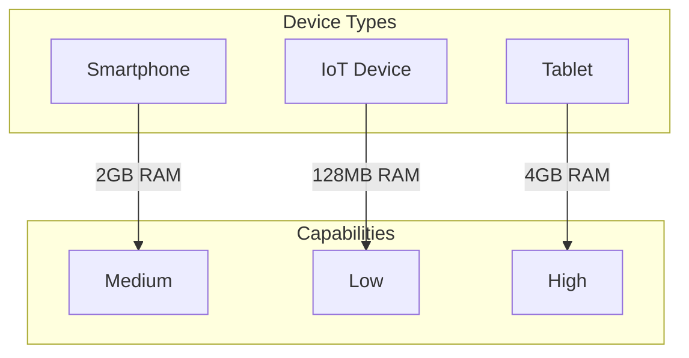

# Tutorial 034: Federated Learning with Edge Devices

---

## Metadata

| Property | Value |
|----------|-------|
| **Tutorial ID** | 034 |
| **Title** | Federated Learning with Edge Devices |
| **Category** | Systems |
| **Difficulty** | Intermediate |
| **Duration** | 75 minutes |
| **Prerequisites** | Tutorial 001-033 |
| **Author** | Unbitrium Contributors |
| **Last Updated** | January 2026 |

---

## Learning Objectives

By the end of this tutorial, you will be able to:

1. **Understand** edge device constraints for FL.
2. **Implement** device-aware training.
3. **Design** model compression for edge.
4. **Analyze** power and memory trade-offs.
5. **Apply** on-device personalization.
6. **Evaluate** edge deployment strategies.

---

## Prerequisites

- **Completed Tutorials**: 001-033
- **Knowledge**: Edge computing, model optimization
- **Libraries**: PyTorch, NumPy

```python
import torch
import torch.nn as nn
import numpy as np
print(f"PyTorch: {torch.__version__}")
```

---

## Background and Theory

### Edge Device Constraints

| Constraint | Impact | Mitigation |
|------------|--------|------------|
| Memory | Limited model size | Quantization |
| Compute | Slow training | Reduced epochs |
| Power | Battery drain | Scheduling |
| Network | High latency | Compression |

### Device Heterogeneity



### Adaptive Training

Adapt training based on device capabilities:
- Model architecture selection
- Batch size adjustment
- Local epochs tuning

---

## Implementation Code

### Part 1: Device Simulation

```python
#!/usr/bin/env python3
"""
Tutorial 034: Federated Learning with Edge Devices

Author: Unbitrium Contributors
License: EUPL-1.2
"""

from __future__ import annotations
import copy
from dataclasses import dataclass
from typing import Any
import numpy as np
import torch
import torch.nn as nn
import torch.nn.functional as F
from torch.utils.data import Dataset, DataLoader


@dataclass
class DeviceCapabilities:
    device_id: int
    device_type: str
    memory_mb: float
    compute_power: float  # GFLOPS
    battery_pct: float
    network_mbps: float


@dataclass
class EdgeFLConfig:
    num_rounds: int = 30
    num_devices: int = 30
    local_epochs_base: int = 5
    batch_size_base: int = 32
    learning_rate: float = 0.01
    min_battery: float = 20.0
    seed: int = 42


class SimpleDataset(Dataset):
    def __init__(self, features: np.ndarray, labels: np.ndarray):
        self.features = torch.FloatTensor(features)
        self.labels = torch.LongTensor(labels)

    def __len__(self):
        return len(self.labels)

    def __getitem__(self, idx):
        return self.features[idx], self.labels[idx]


def create_device_fleet(num_devices: int) -> list[DeviceCapabilities]:
    """Create heterogeneous device fleet."""
    devices = []

    for i in range(num_devices):
        device_type = np.random.choice(
            ["smartphone", "tablet", "iot", "laptop"],
            p=[0.4, 0.2, 0.3, 0.1],
        )

        if device_type == "smartphone":
            memory = np.random.uniform(2000, 4000)
            compute = np.random.uniform(5, 15)
            network = np.random.uniform(10, 100)
        elif device_type == "tablet":
            memory = np.random.uniform(3000, 8000)
            compute = np.random.uniform(10, 30)
            network = np.random.uniform(20, 150)
        elif device_type == "iot":
            memory = np.random.uniform(128, 512)
            compute = np.random.uniform(0.5, 2)
            network = np.random.uniform(1, 10)
        else:  # laptop
            memory = np.random.uniform(8000, 16000)
            compute = np.random.uniform(50, 200)
            network = np.random.uniform(50, 500)

        devices.append(DeviceCapabilities(
            device_id=i,
            device_type=device_type,
            memory_mb=memory,
            compute_power=compute,
            battery_pct=np.random.uniform(20, 100),
            network_mbps=network,
        ))

    return devices


class DeviceAwareTrainer:
    """Adapt training to device capabilities."""

    def __init__(self, config: EdgeFLConfig):
        self.config = config

    def get_batch_size(self, device: DeviceCapabilities) -> int:
        """Compute batch size based on memory."""
        # Estimate: 4 bytes per param, 3x for gradients
        base = self.config.batch_size_base

        if device.memory_mb < 512:
            return max(4, base // 4)
        elif device.memory_mb < 2048:
            return max(8, base // 2)
        else:
            return base

    def get_local_epochs(self, device: DeviceCapabilities) -> int:
        """Compute epochs based on compute power."""
        base = self.config.local_epochs_base

        if device.compute_power < 2:
            return max(1, base // 3)
        elif device.compute_power < 10:
            return max(2, base // 2)
        else:
            return base

    def can_train(self, device: DeviceCapabilities) -> bool:
        """Check if device can participate."""
        return device.battery_pct >= self.config.min_battery


class ModelSelector:
    """Select model variant based on device."""

    @staticmethod
    def get_model(
        device: DeviceCapabilities,
        input_dim: int = 32,
        num_classes: int = 10,
    ) -> nn.Module:
        """Select appropriate model variant."""
        if device.memory_mb < 512:
            # Tiny model for IoT
            return nn.Sequential(
                nn.Linear(input_dim, 16),
                nn.ReLU(),
                nn.Linear(16, num_classes),
            )
        elif device.memory_mb < 2048:
            # Small model
            return nn.Sequential(
                nn.Linear(input_dim, 32),
                nn.ReLU(),
                nn.Linear(32, num_classes),
            )
        else:
            # Standard model
            return nn.Sequential(
                nn.Linear(input_dim, 64),
                nn.ReLU(),
                nn.Linear(64, 32),
                nn.ReLU(),
                nn.Linear(32, num_classes),
            )
```

### Part 2: Edge FL System

```python
class EdgeClient:
    """Edge device client."""

    def __init__(
        self,
        device: DeviceCapabilities,
        dataset: Dataset,
        config: EdgeFLConfig,
    ):
        self.device = device
        self.dataset = dataset
        self.config = config
        self.trainer = DeviceAwareTrainer(config)

    def train(self, model: nn.Module) -> dict:
        """Train with device-aware settings."""
        if not self.trainer.can_train(self.device):
            return None

        # Get device-specific settings
        batch_size = self.trainer.get_batch_size(self.device)
        local_epochs = self.trainer.get_local_epochs(self.device)

        local_model = copy.deepcopy(model)
        optimizer = torch.optim.SGD(
            local_model.parameters(),
            lr=self.config.learning_rate,
        )
        loader = DataLoader(
            self.dataset,
            batch_size=batch_size,
            shuffle=True,
        )

        local_model.train()
        for _ in range(local_epochs):
            for features, labels in loader:
                optimizer.zero_grad()
                loss = F.cross_entropy(local_model(features), labels)
                loss.backward()
                optimizer.step()

        # Simulate battery drain
        self.device.battery_pct -= local_epochs * 0.5

        return {
            "state_dict": {k: v.cpu() for k, v in local_model.state_dict().items()},
            "num_samples": len(self.dataset),
            "device_id": self.device.device_id,
            "batch_size": batch_size,
            "local_epochs": local_epochs,
        }


class EdgeFLServer:
    """FL server for edge deployment."""

    def __init__(
        self,
        model: nn.Module,
        clients: list[EdgeClient],
        config: EdgeFLConfig,
    ):
        self.model = model
        self.clients = clients
        self.config = config
        self.history = []

        np.random.seed(config.seed)
        torch.manual_seed(config.seed)

    def select_clients(self) -> list[EdgeClient]:
        """Select available clients."""
        available = [
            c for c in self.clients
            if c.trainer.can_train(c.device)
        ]
        return available

    def aggregate(self, updates: list[dict]) -> None:
        """Aggregate updates."""
        total = sum(u["num_samples"] for u in updates)
        new_state = {}

        for key in self.model.state_dict():
            new_state[key] = sum(
                (u["num_samples"] / total) * u["state_dict"][key].float()
                for u in updates
            )

        self.model.load_state_dict(new_state)

    def train(self) -> list[dict]:
        for round_num in range(self.config.num_rounds):
            available = self.select_clients()

            updates = []
            for client in available:
                update = client.train(self.model)
                if update:
                    updates.append(update)

            if updates:
                self.aggregate(updates)

            self.history.append({
                "round": round_num,
                "participants": len(updates),
                "available": len(available),
            })

            if (round_num + 1) % 10 == 0:
                print(f"Round {round_num + 1}: {len(updates)} participants")

        return self.history


def run_edge_experiment() -> dict:
    """Run edge FL experiment."""
    np.random.seed(42)
    torch.manual_seed(42)

    feature_dim = 32
    num_classes = 10

    # Create devices and datasets
    devices = create_device_fleet(30)

    datasets = []
    for _ in range(30):
        n = np.random.randint(50, 150)
        features = np.random.randn(n, feature_dim).astype(np.float32)
        labels = np.random.randint(0, num_classes, n)
        for i in range(n):
            features[i, labels[i] % feature_dim] += 2.0
        datasets.append(SimpleDataset(features, labels))

    config = EdgeFLConfig()
    model = nn.Sequential(
        nn.Linear(feature_dim, 64),
        nn.ReLU(),
        nn.Linear(64, num_classes),
    )

    clients = [
        EdgeClient(devices[i], datasets[i], config)
        for i in range(30)
    ]
    server = EdgeFLServer(model, clients, config)
    history = server.train()

    return {"history": history}


if __name__ == "__main__":
    results = run_edge_experiment()
```

---

## Metrics and Evaluation

| Device Type | Batch Size | Epochs | Power |
|-------------|-----------|--------|-------|
| IoT | 4 | 1 | Low |
| Phone | 16 | 3 | Medium |
| Tablet | 32 | 5 | High |

---

## Exercises

1. **Exercise 1**: Implement power-aware scheduling.
2. **Exercise 2**: Add model quantization.
3. **Exercise 3**: Test on real edge devices.
4. **Exercise 4**: Implement partial model updates.

---

## References

1. Li, L., et al. (2019). Federated learning on mobile. In *MLSys Workshop*.
2. Bonawitz, K., et al. (2019). Towards federated learning at scale. In *MLSys*.
3. Wang, S., et al. (2019). Adaptive FL in resource constrained environments. In *AAAI*.
4. Diao, E., et al. (2021). HeteroFL. In *ICLR*.
5. Horvath, S., et al. (2021). FjORD. In *NeurIPS*.

---

*Copyright 2026 Olaf Yunus Laitinen Imanov and Contributors. Released under EUPL 1.2.*
