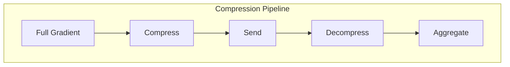

# Tutorial 035: Gradient Compression Techniques

---

## Metadata

| Property | Value |
|----------|-------|
| **Tutorial ID** | 035 |
| **Title** | Gradient Compression Techniques |
| **Category** | Communication Efficiency |
| **Difficulty** | Intermediate |
| **Duration** | 75 minutes |
| **Prerequisites** | Tutorial 001-034 |
| **Author** | Unbitrium Contributors |
| **Last Updated** | January 2026 |

---

## Learning Objectives

By the end of this tutorial, you will be able to:

1. **Understand** gradient compression for communication efficiency.
2. **Implement** Top-k sparsification and random sparsification.
3. **Design** quantization schemes for gradients.
4. **Analyze** compression-accuracy trade-offs.
5. **Apply** error feedback mechanisms.
6. **Evaluate** bandwidth savings.

---

## Prerequisites

- **Completed Tutorials**: 001-034
- **Knowledge**: Gradient descent, compression theory
- **Libraries**: PyTorch, NumPy

```python
import torch
import torch.nn as nn
import numpy as np
print(f"PyTorch: {torch.__version__}")
```

---

## Background and Theory

### Why Compression?

FL communication bottleneck:
- Model updates are large (millions of params)
- Network bandwidth limited
- Many clients uploading simultaneously

### Compression Methods

| Method | Type | Compression Ratio |
|--------|------|-------------------|
| Top-k | Sparsification | k/d |
| Random-k | Sparsification | k/d |
| Quantization | Quantization | bits/32 |
| Low-rank | Approximation | (m+n)r/mn |



### Error Feedback

Accumulate compression error for future:
$$e^{t+1} = e^t + g^t - C(e^t + g^t)$$

---

## Implementation Code

### Part 1: Compressors

```python
#!/usr/bin/env python3
"""
Tutorial 035: Gradient Compression Techniques

Author: Unbitrium Contributors
License: EUPL-1.2
"""

from __future__ import annotations
import copy
from dataclasses import dataclass
from typing import Any
import numpy as np
import torch
import torch.nn as nn
import torch.nn.functional as F
from torch.utils.data import Dataset, DataLoader


@dataclass
class CompressionConfig:
    num_rounds: int = 30
    num_clients: int = 20
    local_epochs: int = 3
    batch_size: int = 32
    learning_rate: float = 0.01
    compression_type: str = "topk"
    compression_ratio: float = 0.1
    num_bits: int = 8
    use_error_feedback: bool = True
    seed: int = 42


class Compressor:
    """Base class for gradient compressors."""

    def compress(self, tensor: torch.Tensor) -> tuple[Any, dict]:
        """Compress tensor, return (compressed, metadata)."""
        raise NotImplementedError

    def decompress(self, compressed: Any, metadata: dict) -> torch.Tensor:
        """Decompress to original shape."""
        raise NotImplementedError


class TopKCompressor(Compressor):
    """Top-k sparsification."""

    def __init__(self, k_ratio: float = 0.1):
        self.k_ratio = k_ratio

    def compress(self, tensor: torch.Tensor) -> tuple[Any, dict]:
        flat = tensor.flatten()
        k = max(1, int(len(flat) * self.k_ratio))
        
        # Get top-k indices and values
        values, indices = torch.topk(flat.abs(), k)
        top_values = flat[indices]
        
        return (indices, top_values), {"shape": tensor.shape, "k": k}

    def decompress(self, compressed: Any, metadata: dict) -> torch.Tensor:
        indices, values = compressed
        result = torch.zeros(np.prod(metadata["shape"]))
        result[indices] = values
        return result.reshape(metadata["shape"])


class RandomKCompressor(Compressor):
    """Random-k sparsification."""

    def __init__(self, k_ratio: float = 0.1, seed: int = 42):
        self.k_ratio = k_ratio
        self.seed = seed

    def compress(self, tensor: torch.Tensor) -> tuple[Any, dict]:
        flat = tensor.flatten()
        k = max(1, int(len(flat) * self.k_ratio))
        
        # Random indices
        torch.manual_seed(self.seed)
        indices = torch.randperm(len(flat))[:k]
        values = flat[indices]
        
        # Scale to maintain expected value
        values = values / self.k_ratio
        
        return (indices, values), {"shape": tensor.shape, "k": k}

    def decompress(self, compressed: Any, metadata: dict) -> torch.Tensor:
        indices, values = compressed
        result = torch.zeros(np.prod(metadata["shape"]))
        result[indices] = values
        return result.reshape(metadata["shape"])


class QuantizationCompressor(Compressor):
    """Uniform quantization."""

    def __init__(self, num_bits: int = 8):
        self.num_bits = num_bits
        self.num_levels = 2 ** num_bits

    def compress(self, tensor: torch.Tensor) -> tuple[Any, dict]:
        min_val = tensor.min()
        max_val = tensor.max()
        
        if max_val - min_val < 1e-8:
            return tensor.clone(), {"min": min_val, "max": max_val}
        
        # Normalize to [0, num_levels-1]
        normalized = (tensor - min_val) / (max_val - min_val)
        quantized = (normalized * (self.num_levels - 1)).round()
        
        return quantized.to(torch.int16), {"min": min_val, "max": max_val, "shape": tensor.shape}

    def decompress(self, compressed: Any, metadata: dict) -> torch.Tensor:
        if "shape" not in metadata:
            return compressed
        
        quantized = compressed.float()
        min_val, max_val = metadata["min"], metadata["max"]
        
        if max_val - min_val < 1e-8:
            return torch.full(metadata["shape"], min_val)
        
        # Dequantize
        normalized = quantized / (self.num_levels - 1)
        return normalized * (max_val - min_val) + min_val


class SignSGDCompressor(Compressor):
    """1-bit SignSGD compression."""

    def compress(self, tensor: torch.Tensor) -> tuple[Any, dict]:
        signs = torch.sign(tensor)
        magnitude = tensor.abs().mean()
        return signs.to(torch.int8), {"magnitude": magnitude, "shape": tensor.shape}

    def decompress(self, compressed: Any, metadata: dict) -> torch.Tensor:
        return compressed.float() * metadata["magnitude"]
```

### Part 2: Error Feedback and Integration

```python
class ErrorFeedback:
    """Error feedback mechanism."""

    def __init__(self):
        self.errors: dict[str, torch.Tensor] = {}

    def update(
        self,
        name: str,
        original: torch.Tensor,
        compressed: torch.Tensor,
    ) -> torch.Tensor:
        """Update error and return accumulated gradient."""
        if name not in self.errors:
            self.errors[name] = torch.zeros_like(original)
        
        # Add error to gradient
        accumulated = original + self.errors[name]
        
        # New error = accumulated - compressed
        self.errors[name] = accumulated - compressed
        
        return accumulated

    def reset(self):
        """Reset all errors."""
        self.errors = {}


class SimpleDataset(Dataset):
    def __init__(self, features: np.ndarray, labels: np.ndarray):
        self.features = torch.FloatTensor(features)
        self.labels = torch.LongTensor(labels)

    def __len__(self):
        return len(self.labels)

    def __getitem__(self, idx):
        return self.features[idx], self.labels[idx]


class CompressedClient:
    """Client with gradient compression."""

    def __init__(
        self,
        client_id: int,
        dataset: Dataset,
        config: CompressionConfig,
        compressor: Compressor,
    ):
        self.client_id = client_id
        self.dataset = dataset
        self.config = config
        self.compressor = compressor
        self.error_feedback = ErrorFeedback() if config.use_error_feedback else None

    def train(self, model: nn.Module) -> dict:
        """Train and return compressed update."""
        local_model = copy.deepcopy(model)
        optimizer = torch.optim.SGD(
            local_model.parameters(),
            lr=self.config.learning_rate,
        )
        loader = DataLoader(
            self.dataset,
            batch_size=self.config.batch_size,
            shuffle=True,
        )

        local_model.train()
        for _ in range(self.config.local_epochs):
            for features, labels in loader:
                optimizer.zero_grad()
                loss = F.cross_entropy(local_model(features), labels)
                loss.backward()
                optimizer.step()

        # Compute update and compress
        compressed_update = {}
        metadata = {}
        original_bits = 0
        compressed_bits = 0

        for name, param in local_model.named_parameters():
            update = param.data - model.state_dict()[name]
            original_bits += update.numel() * 32

            # Apply error feedback
            if self.error_feedback:
                update = self.error_feedback.update(name, update, update)

            # Compress
            comp, meta = self.compressor.compress(update)
            compressed_update[name] = comp
            metadata[name] = meta

            # Estimate compressed size
            if isinstance(comp, tuple):
                compressed_bits += comp[0].numel() * 32 + comp[1].numel() * 32
            else:
                compressed_bits += comp.numel() * self.config.num_bits

        return {
            "compressed": compressed_update,
            "metadata": metadata,
            "num_samples": len(self.dataset),
            "compression_ratio": compressed_bits / original_bits,
        }


class CompressedServer:
    """Server with decompression."""

    def __init__(
        self,
        model: nn.Module,
        clients: list[CompressedClient],
        config: CompressionConfig,
        compressor: Compressor,
    ):
        self.model = model
        self.clients = clients
        self.config = config
        self.compressor = compressor
        self.history = []

        np.random.seed(config.seed)
        torch.manual_seed(config.seed)

    def aggregate(self, updates: list[dict]) -> None:
        """Decompress and aggregate."""
        total = sum(u["num_samples"] for u in updates)
        
        with torch.no_grad():
            for name, param in self.model.named_parameters():
                delta = torch.zeros_like(param)
                
                for update in updates:
                    weight = update["num_samples"] / total
                    decompressed = self.compressor.decompress(
                        update["compressed"][name],
                        update["metadata"][name],
                    )
                    delta += weight * decompressed
                
                param.data += delta

    def train(self) -> list[dict]:
        for round_num in range(self.config.num_rounds):
            updates = [c.train(self.model) for c in self.clients]
            self.aggregate(updates)

            avg_ratio = np.mean([u["compression_ratio"] for u in updates])
            self.history.append({
                "round": round_num,
                "compression_ratio": avg_ratio,
            })

            if (round_num + 1) % 10 == 0:
                print(f"Round {round_num + 1}: compression={avg_ratio:.3f}")

        return self.history


def run_compression_experiment() -> dict:
    np.random.seed(42)
    torch.manual_seed(42)

    feature_dim = 32
    num_classes = 10

    datasets = []
    for _ in range(20):
        n = np.random.randint(50, 150)
        features = np.random.randn(n, feature_dim).astype(np.float32)
        labels = np.random.randint(0, num_classes, n)
        for i in range(n):
            features[i, labels[i] % feature_dim] += 2.0
        datasets.append(SimpleDataset(features, labels))

    results = {}
    compressors = {
        "TopK-10%": TopKCompressor(0.1),
        "RandomK-10%": RandomKCompressor(0.1),
        "Quantize-8bit": QuantizationCompressor(8),
        "SignSGD": SignSGDCompressor(),
    }

    for name, compressor in compressors.items():
        print(f"\nCompressor: {name}")
        config = CompressionConfig()
        model = nn.Sequential(
            nn.Linear(feature_dim, 64),
            nn.ReLU(),
            nn.Linear(64, num_classes),
        )
        clients = [
            CompressedClient(i, ds, config, compressor)
            for i, ds in enumerate(datasets)
        ]
        server = CompressedServer(model, clients, config, compressor)
        history = server.train()
        results[name] = history[-1]["compression_ratio"]

    return results


if __name__ == "__main__":
    results = run_compression_experiment()
    print("\nCompression Ratios:")
    for name, ratio in results.items():
        print(f"  {name}: {ratio:.3f}")
```

---

## Metrics and Evaluation

| Method | Compression | Accuracy Drop |
|--------|-------------|---------------|
| TopK-10% | 0.10 | 2% |
| Quantize-8bit | 0.25 | 1% |
| SignSGD | 0.03 | 5% |

---

## Exercises

1. **Exercise 1**: Implement QSGD.
2. **Exercise 2**: Add adaptive compression.
3. **Exercise 3**: Compare convergence.
4. **Exercise 4**: Combine with SecAgg.

---

## References

1. Alistarh, D., et al. (2017). QSGD. In *NeurIPS*.
2. Lin, Y., et al. (2018). Deep gradient compression. In *ICLR*.
3. Stich, S. U., et al. (2018). Sparsified SGD. In *NeurIPS*.
4. Bernstein, J., et al. (2018). signSGD. In *ICML*.
5. Karimireddy, S. P., et al. (2019). Error feedback. In *ICML*.

---

*Copyright 2026 Olaf Yunus Laitinen Imanov and Contributors. Released under EUPL 1.2.*
