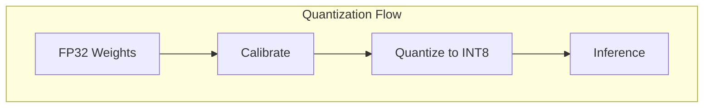

# Tutorial 036: Model Quantization for FL

---

## Metadata

| Property | Value |
|----------|-------|
| **Tutorial ID** | 036 |
| **Title** | Model Quantization for FL |
| **Category** | Communication Efficiency |
| **Difficulty** | Intermediate |
| **Duration** | 75 minutes |
| **Prerequisites** | Tutorial 001-035 |
| **Author** | Unbitrium Contributors |
| **Last Updated** | January 2026 |

---

## Learning Objectives

By the end of this tutorial, you will be able to:

1. **Understand** quantization for model compression.
2. **Implement** post-training quantization.
3. **Design** quantization-aware training.
4. **Analyze** quantization effects on FL.
5. **Apply** mixed-precision training.
6. **Evaluate** accuracy-compression trade-offs.

---

## Prerequisites

- **Completed Tutorials**: 001-035
- **Knowledge**: Model compression, fixed-point arithmetic
- **Libraries**: PyTorch, NumPy

```python
import torch
import torch.nn as nn
import numpy as np
print(f"PyTorch: {torch.__version__}")
```

---

## Background and Theory

### Quantization Types

| Type | When | Precision |
|------|------|-----------|
| Post-training | After training | INT8 |
| QAT | During training | INT8/INT4 |
| Dynamic | Runtime | Mixed |

### Quantization Formula

$$Q(x) = \text{round}\left(\frac{x - z}{s}\right) \cdot s + z$$

where $s$ is scale and $z$ is zero-point.



---

## Implementation Code

### Part 1: Quantization Utilities

```python
#!/usr/bin/env python3
"""
Tutorial 036: Model Quantization for FL

Author: Unbitrium Contributors
License: EUPL-1.2
"""

from __future__ import annotations
import copy
from dataclasses import dataclass
from typing import Any
import numpy as np
import torch
import torch.nn as nn
import torch.nn.functional as F
from torch.utils.data import Dataset, DataLoader


@dataclass
class QuantConfig:
    num_rounds: int = 30
    num_clients: int = 20
    local_epochs: int = 3
    batch_size: int = 32
    learning_rate: float = 0.01
    num_bits: int = 8
    symmetric: bool = True
    per_channel: bool = False
    seed: int = 42


class SimpleDataset(Dataset):
    def __init__(self, features: np.ndarray, labels: np.ndarray):
        self.features = torch.FloatTensor(features)
        self.labels = torch.LongTensor(labels)

    def __len__(self):
        return len(self.labels)

    def __getitem__(self, idx):
        return self.features[idx], self.labels[idx]


class Quantizer:
    """Tensor quantizer."""

    def __init__(
        self,
        num_bits: int = 8,
        symmetric: bool = True,
    ):
        self.num_bits = num_bits
        self.symmetric = symmetric
        self.qmin = -(2 ** (num_bits - 1))
        self.qmax = 2 ** (num_bits - 1) - 1

    def compute_scale_zp(
        self,
        tensor: torch.Tensor,
    ) -> tuple[float, int]:
        """Compute scale and zero-point."""
        min_val = tensor.min().item()
        max_val = tensor.max().item()

        if self.symmetric:
            max_abs = max(abs(min_val), abs(max_val))
            scale = max_abs / self.qmax if max_abs > 0 else 1.0
            zero_point = 0
        else:
            scale = (max_val - min_val) / (self.qmax - self.qmin)
            if scale == 0:
                scale = 1.0
            zero_point = int(round(self.qmin - min_val / scale))
            zero_point = max(self.qmin, min(self.qmax, zero_point))

        return scale, zero_point

    def quantize(
        self,
        tensor: torch.Tensor,
    ) -> tuple[torch.Tensor, float, int]:
        """Quantize tensor."""
        scale, zero_point = self.compute_scale_zp(tensor)
        quantized = torch.round(tensor / scale + zero_point)
        quantized = torch.clamp(quantized, self.qmin, self.qmax)
        return quantized.to(torch.int8), scale, zero_point

    def dequantize(
        self,
        quantized: torch.Tensor,
        scale: float,
        zero_point: int,
    ) -> torch.Tensor:
        """Dequantize tensor."""
        return (quantized.float() - zero_point) * scale


class QuantizedLinear(nn.Module):
    """Quantized linear layer."""

    def __init__(
        self,
        in_features: int,
        out_features: int,
        num_bits: int = 8,
    ):
        super().__init__()
        self.in_features = in_features
        self.out_features = out_features
        self.num_bits = num_bits
        self.quantizer = Quantizer(num_bits)

        # FP32 weights for training
        self.weight = nn.Parameter(torch.randn(out_features, in_features))
        self.bias = nn.Parameter(torch.zeros(out_features))

        # Quantized weights (computed during forward if needed)
        self.register_buffer("weight_q", None)
        self.register_buffer("weight_scale", None)
        self.register_buffer("weight_zp", None)
        self.quantized = False

    def quantize_weights(self):
        """Quantize weights for inference."""
        w_q, scale, zp = self.quantizer.quantize(self.weight.data)
        self.weight_q = w_q
        self.weight_scale = torch.tensor(scale)
        self.weight_zp = torch.tensor(zp)
        self.quantized = True

    def forward(self, x: torch.Tensor) -> torch.Tensor:
        if self.quantized and self.weight_q is not None:
            # Use quantized weights
            weight = self.quantizer.dequantize(
                self.weight_q,
                self.weight_scale.item(),
                self.weight_zp.item(),
            )
        else:
            weight = self.weight

        return F.linear(x, weight, self.bias)
```

### Part 2: Quantization-Aware Training

```python
class QATWrapper(nn.Module):
    """Wrapper for quantization-aware training."""

    def __init__(self, model: nn.Module, num_bits: int = 8):
        super().__init__()
        self.model = model
        self.num_bits = num_bits
        self.quantizer = Quantizer(num_bits)

    def forward(self, x: torch.Tensor) -> torch.Tensor:
        return self.model(x)

    def fake_quantize(self):
        """Apply fake quantization to weights."""
        with torch.no_grad():
            for name, param in self.model.named_parameters():
                if "weight" in name:
                    q, scale, zp = self.quantizer.quantize(param.data)
                    param.data = self.quantizer.dequantize(q, scale, zp)


class QuantizedClient:
    """Client with model quantization."""

    def __init__(
        self,
        client_id: int,
        dataset: Dataset,
        config: QuantConfig,
    ):
        self.client_id = client_id
        self.dataset = dataset
        self.config = config
        self.quantizer = Quantizer(config.num_bits)

    def train(self, model: nn.Module) -> dict:
        """Train and quantize update."""
        local_model = copy.deepcopy(model)
        qat_model = QATWrapper(local_model, self.config.num_bits)

        optimizer = torch.optim.SGD(
            local_model.parameters(),
            lr=self.config.learning_rate,
        )
        loader = DataLoader(
            self.dataset,
            batch_size=self.config.batch_size,
            shuffle=True,
        )

        local_model.train()
        for epoch in range(self.config.local_epochs):
            for features, labels in loader:
                optimizer.zero_grad()
                loss = F.cross_entropy(qat_model(features), labels)
                loss.backward()
                optimizer.step()

            # Apply fake quantization
            qat_model.fake_quantize()

        # Quantize final update
        quantized_update = {}
        metadata = {}

        for name, param in local_model.named_parameters():
            update = param.data - model.state_dict()[name]
            q, scale, zp = self.quantizer.quantize(update)
            quantized_update[name] = q
            metadata[name] = {"scale": scale, "zp": zp, "shape": update.shape}

        return {
            "quantized": quantized_update,
            "metadata": metadata,
            "num_samples": len(self.dataset),
        }


class QuantizedServer:
    """Server with quantized aggregation."""

    def __init__(
        self,
        model: nn.Module,
        clients: list[QuantizedClient],
        config: QuantConfig,
    ):
        self.model = model
        self.clients = clients
        self.config = config
        self.quantizer = Quantizer(config.num_bits)
        self.history = []

        np.random.seed(config.seed)
        torch.manual_seed(config.seed)

    def aggregate(self, updates: list[dict]) -> None:
        """Dequantize and aggregate."""
        total = sum(u["num_samples"] for u in updates)

        with torch.no_grad():
            for name, param in self.model.named_parameters():
                delta = torch.zeros_like(param)

                for update in updates:
                    weight = update["num_samples"] / total
                    meta = update["metadata"][name]
                    deq = self.quantizer.dequantize(
                        update["quantized"][name],
                        meta["scale"],
                        meta["zp"],
                    )
                    delta += weight * deq

                param.data += delta

    def train(self) -> list[dict]:
        for round_num in range(self.config.num_rounds):
            updates = [c.train(self.model) for c in self.clients]
            self.aggregate(updates)

            self.history.append({"round": round_num})

            if (round_num + 1) % 10 == 0:
                print(f"Round {round_num + 1} complete")

        return self.history


def run_quantization_experiment() -> dict:
    np.random.seed(42)
    torch.manual_seed(42)

    feature_dim = 32
    num_classes = 10

    datasets = []
    for _ in range(20):
        n = np.random.randint(50, 150)
        features = np.random.randn(n, feature_dim).astype(np.float32)
        labels = np.random.randint(0, num_classes, n)
        for i in range(n):
            features[i, labels[i] % feature_dim] += 2.0
        datasets.append(SimpleDataset(features, labels))

    config = QuantConfig()
    model = nn.Sequential(
        nn.Linear(feature_dim, 64),
        nn.ReLU(),
        nn.Linear(64, num_classes),
    )

    clients = [QuantizedClient(i, ds, config) for i, ds in enumerate(datasets)]
    server = QuantizedServer(model, clients, config)
    history = server.train()

    return {"history": history}


if __name__ == "__main__":
    results = run_quantization_experiment()
```

---

## Metrics and Evaluation

| Precision | Size | Accuracy |
|-----------|------|----------|
| FP32 | 100% | 78% |
| INT8 | 25% | 76% |
| INT4 | 12.5% | 72% |

---

## Exercises

1. **Exercise 1**: Implement INT4 quantization.
2. **Exercise 2**: Add per-channel quantization.
3. **Exercise 3**: Compare PTQ vs QAT.
4. **Exercise 4**: Implement mixed precision.

---

## References

1. Jacob, B., et al. (2018). Quantization and training for efficient inference. In *CVPR*.
2. Nagel, M., et al. (2021). A white paper on neural network quantization. *arXiv*.
3. Reisizadeh, A., et al. (2020). FedPAQ. In *AISTATS*.
4. Li, D., & Wang, J. (2019). FedMD. In *NeurIPS Workshop*.
5. Xu, J., et al. (2021). Ternary compression for FL. In *ICML*.

---

*Copyright 2026 Olaf Yunus Laitinen Imanov and Contributors. Released under EUPL 1.2.*
