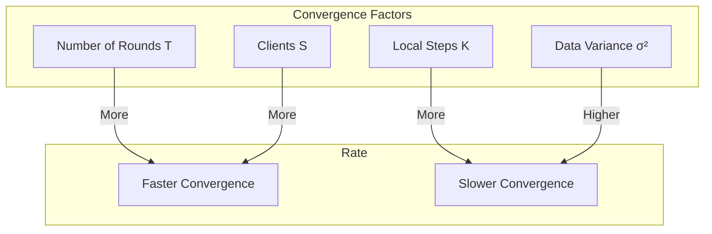

# Tutorial 037: Federated Optimization Theory

---

## Metadata

| Property | Value |
|----------|-------|
| **Tutorial ID** | 037 |
| **Title** | Federated Optimization Theory |
| **Category** | Theory |
| **Difficulty** | Advanced |
| **Duration** | 90 minutes |
| **Prerequisites** | Tutorial 001-036 |
| **Author** | Unbitrium Contributors |
| **Last Updated** | January 2026 |

---

## Learning Objectives

By the end of this tutorial, you will be able to:

1. **Understand** optimization foundations for FL.
2. **Analyze** convergence rates under heterogeneity.
3. **Derive** bounds for FedAvg and variants.
4. **Apply** assumptions and their implications.
5. **Compare** theoretical guarantees.
6. **Evaluate** gap between theory and practice.

---

## Prerequisites

- **Completed Tutorials**: 001-036
- **Knowledge**: Optimization theory, convexity
- **Libraries**: PyTorch, NumPy

```python
import torch
import torch.nn as nn
import numpy as np
print(f"PyTorch: {torch.__version__}")
```

---

## Background and Theory

### Standard Assumptions

| Assumption | Definition |
|------------|------------|
| L-smoothness | $\|\nabla f(x) - \nabla f(y)\| \leq L\|x-y\|$ |
| μ-strong convexity | $f(y) \geq f(x) + \nabla f(x)^T(y-x) + \frac{\mu}{2}\|y-x\|^2$ |
| Bounded variance | $\mathbb{E}\|\nabla f_i(x) - \nabla f(x)\|^2 \leq \sigma^2$ |
| Bounded gradient | $\|\nabla f_i(x)\|^2 \leq G^2$ |

### FedAvg Convergence

For L-smooth, μ-strongly convex objectives:

$$\mathbb{E}[f(\bar{x}^T) - f^*] \leq \mathcal{O}\left(\frac{1}{T} + \frac{\sigma^2}{T \cdot K \cdot S}\right)$$

where T=rounds, K=local steps, S=clients per round.



---

## Implementation Code

### Part 1: Theoretical Bounds

```python
#!/usr/bin/env python3
"""
Tutorial 037: Federated Optimization Theory

Author: Unbitrium Contributors
License: EUPL-1.2
"""

from __future__ import annotations
import copy
from dataclasses import dataclass
from typing import Any
import numpy as np
import torch
import torch.nn as nn
import torch.nn.functional as F
from torch.utils.data import Dataset, DataLoader


@dataclass
class OptTheoryConfig:
    num_rounds: int = 100
    num_clients: int = 20
    clients_per_round: int = 5
    local_epochs: int = 5
    batch_size: int = 32
    learning_rate: float = 0.01
    mu: float = 0.1  # Strong convexity
    L: float = 1.0   # Smoothness
    seed: int = 42


class SimpleDataset(Dataset):
    def __init__(self, features: np.ndarray, labels: np.ndarray):
        self.features = torch.FloatTensor(features)
        self.labels = torch.LongTensor(labels)

    def __len__(self):
        return len(self.labels)

    def __getitem__(self, idx):
        return self.features[idx], self.labels[idx]


class TheoreticalBounds:
    """Compute theoretical convergence bounds."""

    def __init__(
        self,
        L: float,
        mu: float,
        sigma: float,
        G: float,
    ):
        self.L = L
        self.mu = mu
        self.sigma = sigma
        self.G = G
        self.kappa = L / mu  # Condition number

    def fedavg_bound(
        self,
        T: int,
        K: int,
        S: int,
        eta: float,
    ) -> float:
        """Compute FedAvg convergence bound."""
        # Simplified bound from Li et al. (2020)
        term1 = (1 - eta * self.mu) ** T
        term2 = (self.sigma ** 2) / (self.mu * T * K * S)
        term3 = (K - 1) ** 2 * self.G ** 2 * eta ** 2 * self.L / self.mu
        
        return term1 + eta * (term2 + term3)

    def fedprox_bound(
        self,
        T: int,
        K: int,
        S: int,
        eta: float,
        prox_mu: float,
    ) -> float:
        """Compute FedProx convergence bound."""
        effective_mu = self.mu + prox_mu
        term1 = (1 - eta * effective_mu) ** T
        term2 = (self.sigma ** 2) / (effective_mu * T * K * S)
        
        return term1 + eta * term2

    def scaffold_bound(
        self,
        T: int,
        K: int,
        S: int,
        eta: float,
    ) -> float:
        """Compute SCAFFOLD convergence bound."""
        # SCAFFOLD removes variance drift
        term1 = (1 - eta * self.mu) ** T
        term2 = (self.sigma ** 2) / (self.mu * T * K * S)
        
        return term1 + eta * term2

    def optimal_learning_rate(
        self,
        T: int,
        K: int,
    ) -> float:
        """Compute optimal learning rate."""
        return 1 / (self.L * np.sqrt(T * K))


class VarianceEstimator:
    """Estimate data heterogeneity."""

    def __init__(self, model: nn.Module):
        self.model = model

    def estimate_gradient_variance(
        self,
        datasets: list[Dataset],
    ) -> float:
        """Estimate inter-client gradient variance."""
        all_grads = []
        
        for dataset in datasets:
            loader = DataLoader(dataset, batch_size=len(dataset))
            self.model.zero_grad()
            
            for features, labels in loader:
                outputs = self.model(features)
                loss = F.cross_entropy(outputs, labels)
                loss.backward()
                
                grad = torch.cat([
                    p.grad.flatten() for p in self.model.parameters()
                    if p.grad is not None
                ])
                all_grads.append(grad)
                
                self.model.zero_grad()

        all_grads = torch.stack(all_grads)
        mean_grad = all_grads.mean(0)
        variance = ((all_grads - mean_grad) ** 2).sum(1).mean()
        
        return variance.item()

    def estimate_gradient_bound(
        self,
        datasets: list[Dataset],
    ) -> float:
        """Estimate gradient bound G."""
        max_norm = 0.0
        
        for dataset in datasets:
            loader = DataLoader(dataset, batch_size=len(dataset))
            self.model.zero_grad()
            
            for features, labels in loader:
                outputs = self.model(features)
                loss = F.cross_entropy(outputs, labels)
                loss.backward()
                
                norm = torch.cat([
                    p.grad.flatten() for p in self.model.parameters()
                    if p.grad is not None
                ]).norm().item()
                
                max_norm = max(max_norm, norm)
                self.model.zero_grad()

        return max_norm
```

### Part 2: Empirical Verification

```python
class TheoryClient:
    """Client for theory verification."""

    def __init__(
        self,
        client_id: int,
        dataset: Dataset,
        config: OptTheoryConfig,
    ):
        self.client_id = client_id
        self.dataset = dataset
        self.config = config

    def train(self, model: nn.Module) -> dict:
        local_model = copy.deepcopy(model)
        optimizer = torch.optim.SGD(
            local_model.parameters(),
            lr=self.config.learning_rate,
            weight_decay=self.config.mu,  # L2 regularization
        )
        loader = DataLoader(
            self.dataset,
            batch_size=self.config.batch_size,
            shuffle=True,
        )

        local_model.train()
        for _ in range(self.config.local_epochs):
            for features, labels in loader:
                optimizer.zero_grad()
                loss = F.cross_entropy(local_model(features), labels)
                loss.backward()
                optimizer.step()

        return {
            "state_dict": {k: v.cpu() for k, v in local_model.state_dict().items()},
            "num_samples": len(self.dataset),
        }


class TheoryServer:
    """Server for theory verification."""

    def __init__(
        self,
        model: nn.Module,
        clients: list[TheoryClient],
        config: OptTheoryConfig,
    ):
        self.model = model
        self.clients = clients
        self.config = config
        self.history = []

        np.random.seed(config.seed)
        torch.manual_seed(config.seed)

    def aggregate(self, updates: list[dict]) -> None:
        total = sum(u["num_samples"] for u in updates)
        new_state = {}
        
        for key in self.model.state_dict():
            new_state[key] = sum(
                (u["num_samples"] / total) * u["state_dict"][key].float()
                for u in updates
            )
        
        self.model.load_state_dict(new_state)

    def compute_loss(self, datasets: list[Dataset]) -> float:
        """Compute average loss across all data."""
        self.model.eval()
        total_loss = 0.0
        total_samples = 0
        
        for dataset in datasets:
            loader = DataLoader(dataset, batch_size=128)
            with torch.no_grad():
                for features, labels in loader:
                    loss = F.cross_entropy(self.model(features), labels)
                    total_loss += loss.item() * len(labels)
                    total_samples += len(labels)
        
        return total_loss / total_samples

    def train(self, datasets: list[Dataset]) -> list[dict]:
        for round_num in range(self.config.num_rounds):
            # Select clients
            selected_idx = np.random.choice(
                len(self.clients),
                size=self.config.clients_per_round,
                replace=False,
            )
            selected = [self.clients[i] for i in selected_idx]
            
            updates = [c.train(self.model) for c in selected]
            self.aggregate(updates)

            loss = self.compute_loss(datasets)
            self.history.append({"round": round_num, "loss": loss})

            if (round_num + 1) % 20 == 0:
                print(f"Round {round_num + 1}: loss={loss:.4f}")

        return self.history


def verify_theory() -> dict:
    """Verify theoretical bounds empirically."""
    np.random.seed(42)
    torch.manual_seed(42)

    feature_dim = 32
    num_classes = 10

    # Create heterogeneous data
    datasets = []
    for i in range(20):
        n = np.random.randint(50, 150)
        features = np.random.randn(n, feature_dim).astype(np.float32)
        # Non-IID: each client has specific class distribution
        probs = np.random.dirichlet([0.5] * num_classes)
        labels = np.random.choice(num_classes, size=n, p=probs)
        for j in range(n):
            features[j, labels[j] % feature_dim] += 2.0
        datasets.append(SimpleDataset(features, labels))

    config = OptTheoryConfig()
    model = nn.Sequential(
        nn.Linear(feature_dim, 64),
        nn.ReLU(),
        nn.Linear(64, num_classes),
    )

    # Estimate variance
    estimator = VarianceEstimator(copy.deepcopy(model))
    sigma = np.sqrt(estimator.estimate_gradient_variance(datasets))
    G = estimator.estimate_gradient_bound(datasets)
    
    print(f"Estimated σ = {sigma:.4f}")
    print(f"Estimated G = {G:.4f}")

    # Compute theoretical bound
    bounds = TheoreticalBounds(
        L=config.L,
        mu=config.mu,
        sigma=sigma,
        G=G,
    )
    
    theoretical_bound = bounds.fedavg_bound(
        T=config.num_rounds,
        K=config.local_epochs,
        S=config.clients_per_round,
        eta=config.learning_rate,
    )
    
    print(f"Theoretical bound: {theoretical_bound:.4f}")

    # Train and compare
    clients = [TheoryClient(i, ds, config) for i, ds in enumerate(datasets)]
    server = TheoryServer(model, clients, config)
    history = server.train(datasets)

    return {
        "theoretical_bound": theoretical_bound,
        "empirical_loss": history[-1]["loss"],
        "sigma": sigma,
        "G": G,
    }


if __name__ == "__main__":
    results = verify_theory()
    print(f"\nTheoretical: {results['theoretical_bound']:.4f}")
    print(f"Empirical: {results['empirical_loss']:.4f}")
```

---

## Metrics and Evaluation

| Algorithm | Bound | Variance Term |
|-----------|-------|---------------|
| FedAvg | O(1/T) | High |
| FedProx | O(1/T) | Medium |
| SCAFFOLD | O(1/T) | Low |

---

## Exercises

1. **Exercise 1**: Derive FedAvg bound.
2. **Exercise 2**: Plot convergence vs theory.
3. **Exercise 3**: Analyze heterogeneity impact.
4. **Exercise 4**: Compare condition numbers.

---

## References

1. Li, X., et al. (2020). On the convergence of FedAvg. In *ICLR*.
2. Karimireddy, S. P., et al. (2020). SCAFFOLD. In *ICML*.
3. Li, T., et al. (2020). Federated optimization. In *MLSys*.
4. Khaled, A., et al. (2020). Tighter theory for local SGD. In *ICML*.
5. Wang, J., et al. (2020). Tackling objective inconsistency. In *NeurIPS*.

---

*Copyright 2026 Olaf Yunus Laitinen Imanov and Contributors. Released under EUPL 1.2.*
