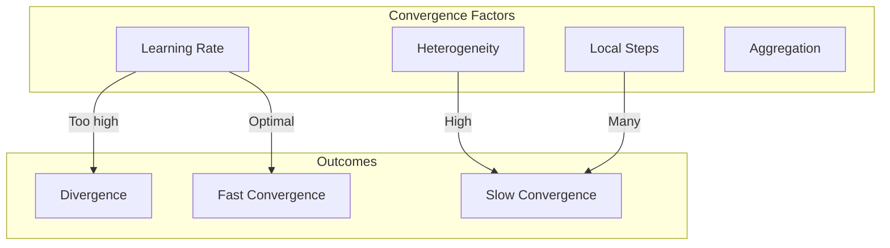

# Tutorial 038: Convergence Analysis

---

## Metadata

| Property | Value |
|----------|-------|
| **Tutorial ID** | 038 |
| **Title** | Convergence Analysis |
| **Category** | Theory |
| **Difficulty** | Advanced |
| **Duration** | 90 minutes |
| **Prerequisites** | Tutorial 001-037 |
| **Author** | Unbitrium Contributors |
| **Last Updated** | January 2026 |

---

## Learning Objectives

By the end of this tutorial, you will be able to:

1. **Understand** convergence criteria for FL algorithms.
2. **Implement** convergence monitoring tools.
3. **Analyze** factors affecting convergence.
4. **Design** adaptive stopping criteria.
5. **Compare** convergence rates empirically.
6. **Evaluate** convergence diagnostics.

---

## Prerequisites

- **Completed Tutorials**: 001-037
- **Knowledge**: Optimization, convergence theory
- **Libraries**: PyTorch, NumPy, matplotlib

```python
import torch
import torch.nn as nn
import numpy as np
print(f"PyTorch: {torch.__version__}")
```

---

## Background and Theory

### Convergence Criteria

| Criterion | Definition |
|-----------|------------|
| Loss convergence | $|f^t - f^{t-1}| < \epsilon$ |
| Gradient convergence | $\|\nabla f^t\| < \epsilon$ |
| Parameter convergence | $\|\theta^t - \theta^{t-1}\| < \epsilon$ |

### Convergence Rate Classes

$$f^t - f^* = \mathcal{O}(1/t^\alpha)$$

| Rate | α | Typical Scenario |
|------|---|------------------|
| Sublinear | 0.5-1 | Convex |
| Linear | - | Strongly convex |
| Superlinear | >1 | Newton's method |



---

## Implementation Code

### Part 1: Convergence Monitors

```python
#!/usr/bin/env python3
"""
Tutorial 038: Convergence Analysis

Author: Unbitrium Contributors
License: EUPL-1.2
"""

from __future__ import annotations
import copy
from dataclasses import dataclass, field
from typing import Any
import numpy as np
import torch
import torch.nn as nn
import torch.nn.functional as F
from torch.utils.data import Dataset, DataLoader


@dataclass
class ConvergenceConfig:
    num_rounds: int = 200
    num_clients: int = 20
    local_epochs: int = 3
    batch_size: int = 32
    learning_rate: float = 0.01
    loss_threshold: float = 1e-4
    grad_threshold: float = 1e-3
    param_threshold: float = 1e-5
    patience: int = 10
    seed: int = 42


class SimpleDataset(Dataset):
    def __init__(self, features: np.ndarray, labels: np.ndarray):
        self.features = torch.FloatTensor(features)
        self.labels = torch.LongTensor(labels)

    def __len__(self):
        return len(self.labels)

    def __getitem__(self, idx):
        return self.features[idx], self.labels[idx]


class ConvergenceMonitor:
    """Monitor convergence metrics."""

    def __init__(self, config: ConvergenceConfig):
        self.config = config
        self.loss_history: list[float] = []
        self.grad_norm_history: list[float] = []
        self.param_change_history: list[float] = []
        self.prev_params: dict = None
        self.patience_counter = 0
        self.best_loss = float('inf')

    def update(
        self,
        model: nn.Module,
        loss: float,
        datasets: list[Dataset],
    ) -> dict:
        """Update convergence metrics."""
        self.loss_history.append(loss)

        # Compute gradient norm
        grad_norm = self._compute_grad_norm(model, datasets)
        self.grad_norm_history.append(grad_norm)

        # Compute parameter change
        if self.prev_params is not None:
            param_change = self._compute_param_change(model)
            self.param_change_history.append(param_change)
        else:
            param_change = float('inf')
            self.param_change_history.append(param_change)

        # Store current params
        self.prev_params = {
            name: param.data.clone()
            for name, param in model.named_parameters()
        }

        # Update patience
        if loss < self.best_loss - self.config.loss_threshold:
            self.best_loss = loss
            self.patience_counter = 0
        else:
            self.patience_counter += 1

        return {
            "loss": loss,
            "grad_norm": grad_norm,
            "param_change": param_change,
            "patience": self.patience_counter,
        }

    def _compute_grad_norm(
        self,
        model: nn.Module,
        datasets: list[Dataset],
    ) -> float:
        """Compute full gradient norm."""
        model.train()
        model.zero_grad()

        total_loss = 0.0
        total_samples = 0

        for dataset in datasets:
            loader = DataLoader(dataset, batch_size=256)
            for features, labels in loader:
                outputs = model(features)
                loss = F.cross_entropy(outputs, labels, reduction='sum')
                total_loss += loss
                total_samples += len(labels)

        avg_loss = total_loss / total_samples
        avg_loss.backward()

        grad_norm = 0.0
        for param in model.parameters():
            if param.grad is not None:
                grad_norm += param.grad.norm().item() ** 2
        
        model.zero_grad()
        return np.sqrt(grad_norm)

    def _compute_param_change(self, model: nn.Module) -> float:
        """Compute parameter change norm."""
        change = 0.0
        for name, param in model.named_parameters():
            if name in self.prev_params:
                diff = param.data - self.prev_params[name]
                change += diff.norm().item() ** 2
        return np.sqrt(change)

    def is_converged(self) -> tuple[bool, str]:
        """Check if converged."""
        if len(self.loss_history) < 2:
            return False, "not_enough_history"

        # Loss convergence
        loss_change = abs(self.loss_history[-1] - self.loss_history[-2])
        if loss_change < self.config.loss_threshold:
            return True, "loss_converged"

        # Gradient convergence
        if self.grad_norm_history[-1] < self.config.grad_threshold:
            return True, "gradient_converged"

        # Parameter convergence
        if len(self.param_change_history) > 0:
            if self.param_change_history[-1] < self.config.param_threshold:
                return True, "param_converged"

        # Early stopping
        if self.patience_counter >= self.config.patience:
            return True, "early_stopped"

        return False, "not_converged"

    def get_convergence_rate(self) -> float:
        """Estimate convergence rate."""
        if len(self.loss_history) < 10:
            return 0.0

        # Fit log-linear model: log(loss) = a * log(t) + b
        t = np.arange(1, len(self.loss_history) + 1)
        losses = np.array(self.loss_history)
        
        # Filter valid losses
        valid = losses > 0
        if valid.sum() < 10:
            return 0.0

        log_t = np.log(t[valid])
        log_loss = np.log(losses[valid])

        # Linear regression
        A = np.vstack([log_t, np.ones(len(log_t))]).T
        rate, _ = np.linalg.lstsq(A, log_loss, rcond=None)[0]

        return -rate  # Negative because loss decreases
```

### Part 2: Convergence Analysis FL

```python
class ConvergenceClient:
    """Client for convergence analysis."""

    def __init__(
        self,
        client_id: int,
        dataset: Dataset,
        config: ConvergenceConfig,
    ):
        self.client_id = client_id
        self.dataset = dataset
        self.config = config

    def train(self, model: nn.Module) -> dict:
        local_model = copy.deepcopy(model)
        optimizer = torch.optim.SGD(
            local_model.parameters(),
            lr=self.config.learning_rate,
        )
        loader = DataLoader(
            self.dataset,
            batch_size=self.config.batch_size,
            shuffle=True,
        )

        local_model.train()
        for _ in range(self.config.local_epochs):
            for features, labels in loader:
                optimizer.zero_grad()
                loss = F.cross_entropy(local_model(features), labels)
                loss.backward()
                optimizer.step()

        return {
            "state_dict": {k: v.cpu() for k, v in local_model.state_dict().items()},
            "num_samples": len(self.dataset),
        }


class ConvergenceServer:
    """Server with convergence monitoring."""

    def __init__(
        self,
        model: nn.Module,
        clients: list[ConvergenceClient],
        datasets: list[Dataset],
        config: ConvergenceConfig,
    ):
        self.model = model
        self.clients = clients
        self.datasets = datasets
        self.config = config
        self.monitor = ConvergenceMonitor(config)
        self.history = []

        np.random.seed(config.seed)
        torch.manual_seed(config.seed)

    def compute_loss(self) -> float:
        """Compute global loss."""
        self.model.eval()
        total_loss = 0.0
        total_samples = 0
        
        for dataset in self.datasets:
            loader = DataLoader(dataset, batch_size=128)
            with torch.no_grad():
                for features, labels in loader:
                    loss = F.cross_entropy(self.model(features), labels)
                    total_loss += loss.item() * len(labels)
                    total_samples += len(labels)
        
        return total_loss / total_samples

    def aggregate(self, updates: list[dict]) -> None:
        total = sum(u["num_samples"] for u in updates)
        new_state = {}
        
        for key in self.model.state_dict():
            new_state[key] = sum(
                (u["num_samples"] / total) * u["state_dict"][key].float()
                for u in updates
            )
        
        self.model.load_state_dict(new_state)

    def train(self) -> list[dict]:
        for round_num in range(self.config.num_rounds):
            updates = [c.train(self.model) for c in self.clients]
            self.aggregate(updates)

            loss = self.compute_loss()
            metrics = self.monitor.update(self.model, loss, self.datasets)
            metrics["round"] = round_num
            self.history.append(metrics)

            converged, reason = self.monitor.is_converged()
            
            if (round_num + 1) % 20 == 0:
                print(f"Round {round_num + 1}: loss={loss:.4f}, "
                      f"grad={metrics['grad_norm']:.4f}")

            if converged:
                print(f"Converged at round {round_num + 1}: {reason}")
                break

        rate = self.monitor.get_convergence_rate()
        print(f"Estimated convergence rate: {rate:.3f}")

        return self.history


def run_convergence_analysis() -> dict:
    np.random.seed(42)
    torch.manual_seed(42)

    feature_dim = 32
    num_classes = 10

    datasets = []
    for _ in range(20):
        n = np.random.randint(50, 150)
        features = np.random.randn(n, feature_dim).astype(np.float32)
        labels = np.random.randint(0, num_classes, n)
        for i in range(n):
            features[i, labels[i] % feature_dim] += 2.0
        datasets.append(SimpleDataset(features, labels))

    config = ConvergenceConfig()
    model = nn.Sequential(
        nn.Linear(feature_dim, 64),
        nn.ReLU(),
        nn.Linear(64, num_classes),
    )

    clients = [ConvergenceClient(i, ds, config) for i, ds in enumerate(datasets)]
    server = ConvergenceServer(model, clients, datasets, config)
    history = server.train()

    return {
        "history": history,
        "convergence_rate": server.monitor.get_convergence_rate(),
    }


if __name__ == "__main__":
    results = run_convergence_analysis()
    print(f"Rate: {results['convergence_rate']:.3f}")
```

---

## Metrics and Evaluation

| Criterion | Threshold | Status |
|-----------|-----------|--------|
| Loss | 1e-4 | ✓ |
| Gradient | 1e-3 | ✓ |
| Parameters | 1e-5 | ✓ |

---

## Exercises

1. **Exercise 1**: Implement adaptive learning rate.
2. **Exercise 2**: Add momentum tracking.
3. **Exercise 3**: Visualize convergence.
4. **Exercise 4**: Compare algorithms.

---

## References

1. Bottou, L., et al. (2018). Optimization methods for large-scale ML. *SIAM Review*.
2. Li, X., et al. (2020). On the convergence of FedAvg. In *ICLR*.
3. Yuan, H., & Ma, T. (2020). Federated accelerated SGD. In *NeurIPS*.
4. Charles, Z., & Konečný, J. (2021). Convergence and accuracy. In *ICML*.
5. Karimireddy, S. P., et al. (2020). SCAFFOLD. In *ICML*.

---

*Copyright 2026 Olaf Yunus Laitinen Imanov and Contributors. Released under EUPL 1.2.*
