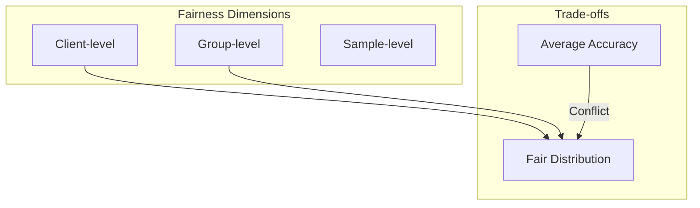

# Tutorial 040: Fairness in Federated Learning

---

## Metadata

| Property | Value |
|----------|-------|
| **Tutorial ID** | 040 |
| **Title** | Fairness in Federated Learning |
| **Category** | Theory |
| **Difficulty** | Intermediate |
| **Duration** | 75 minutes |
| **Prerequisites** | Tutorial 001-039 |
| **Author** | Unbitrium Contributors |
| **Last Updated** | January 2026 |

---

## Learning Objectives

By the end of this tutorial, you will be able to:

1. **Understand** fairness concepts in FL.
2. **Implement** fairness metrics and constraints.
3. **Design** fair aggregation schemes.
4. **Analyze** fairness-accuracy trade-offs.
5. **Apply** q-FedAvg and other fair algorithms.
6. **Evaluate** fairness across diverse clients.

---

## Prerequisites

- **Completed Tutorials**: 001-039
- **Knowledge**: Fairness in ML, optimization
- **Libraries**: PyTorch, NumPy

```python
import torch
import torch.nn as nn
import numpy as np
print(f"PyTorch: {torch.__version__}")
```

---

## Background and Theory

### Fairness Definitions

| Type | Definition |
|------|------------|
| Uniform | Equal accuracy across clients |
| Proportional | Accuracy proportional to data |
| Individual | Per-sample fairness |
| Group | Fairness across demographics |

### Fairness Objective

**q-FedAvg objective**:
$$\min_\theta \frac{1}{K} \sum_{k=1}^K F_k(\theta)^{1+q}$$

where q controls fairness-accuracy trade-off:
- q = 0: Standard FedAvg
- q > 0: Emphasize worst-performing clients



---

## Implementation Code

### Part 1: Fairness Metrics

```python
#!/usr/bin/env python3
"""
Tutorial 040: Fairness in Federated Learning

Author: Unbitrium Contributors
License: EUPL-1.2
"""

from __future__ import annotations
import copy
from dataclasses import dataclass
from typing import Any
import numpy as np
import torch
import torch.nn as nn
import torch.nn.functional as F
from torch.utils.data import Dataset, DataLoader


@dataclass
class FairnessConfig:
    num_rounds: int = 50
    num_clients: int = 20
    local_epochs: int = 3
    batch_size: int = 32
    learning_rate: float = 0.01
    q_fairness: float = 1.0
    alpha: float = 0.1
    seed: int = 42


class SimpleDataset(Dataset):
    def __init__(self, features: np.ndarray, labels: np.ndarray):
        self.features = torch.FloatTensor(features)
        self.labels = torch.LongTensor(labels)

    def __len__(self):
        return len(self.labels)

    def __getitem__(self, idx):
        return self.features[idx], self.labels[idx]


class FairnessMetrics:
    """Compute fairness metrics."""

    @staticmethod
    def uniformity(accuracies: list[float]) -> float:
        """Measure uniformity of accuracies (higher = fairer)."""
        if len(accuracies) == 0:
            return 0.0
        return 1 - np.std(accuracies) / (np.mean(accuracies) + 1e-8)

    @staticmethod
    def worst_case_accuracy(accuracies: list[float]) -> float:
        """Return worst client accuracy."""
        return min(accuracies)

    @staticmethod
    def accuracy_gap(accuracies: list[float]) -> float:
        """Gap between best and worst."""
        return max(accuracies) - min(accuracies)

    @staticmethod
    def gini_coefficient(accuracies: list[float]) -> float:
        """Compute Gini coefficient (0 = fair, 1 = unfair)."""
        n = len(accuracies)
        if n == 0:
            return 0.0
        sorted_acc = np.sort(accuracies)
        cumsum = np.cumsum(sorted_acc)
        return (n + 1 - 2 * cumsum.sum() / cumsum[-1]) / n

    @staticmethod
    def jain_fairness_index(accuracies: list[float]) -> float:
        """Jain's fairness index (1 = perfectly fair)."""
        n = len(accuracies)
        if n == 0:
            return 0.0
        acc = np.array(accuracies)
        return (acc.sum() ** 2) / (n * (acc ** 2).sum() + 1e-8)

    def compute_all(self, accuracies: list[float]) -> dict[str, float]:
        """Compute all fairness metrics."""
        return {
            "avg_accuracy": np.mean(accuracies),
            "worst_accuracy": self.worst_case_accuracy(accuracies),
            "accuracy_gap": self.accuracy_gap(accuracies),
            "uniformity": self.uniformity(accuracies),
            "gini": self.gini_coefficient(accuracies),
            "jain_index": self.jain_fairness_index(accuracies),
        }


class QFedAvgClient:
    """Client for q-FedAvg (fair federated learning)."""

    def __init__(
        self,
        client_id: int,
        dataset: Dataset,
        config: FairnessConfig,
    ):
        self.client_id = client_id
        self.dataset = dataset
        self.config = config
        self.loss_history = []

    @property
    def num_samples(self) -> int:
        return len(self.dataset)

    def compute_loss(self, model: nn.Module) -> float:
        """Compute loss on local data."""
        model.eval()
        loader = DataLoader(self.dataset, batch_size=128)
        total_loss = 0.0
        total = 0

        with torch.no_grad():
            for features, labels in loader:
                loss = F.cross_entropy(model(features), labels, reduction='sum')
                total_loss += loss.item()
                total += len(labels)

        return total_loss / total

    def compute_accuracy(self, model: nn.Module) -> float:
        """Compute accuracy on local data."""
        model.eval()
        loader = DataLoader(self.dataset, batch_size=128)
        correct = 0
        total = 0

        with torch.no_grad():
            for features, labels in loader:
                preds = model(features).argmax(1)
                correct += (preds == labels).sum().item()
                total += len(labels)

        return correct / total

    def train(
        self,
        model: nn.Module,
        return_delta: bool = False,
    ) -> dict:
        """Train and return update with fairness-aware weight."""
        # Store initial loss for q-FedAvg weighting
        initial_loss = self.compute_loss(model)

        local_model = copy.deepcopy(model)
        optimizer = torch.optim.SGD(
            local_model.parameters(),
            lr=self.config.learning_rate,
        )
        loader = DataLoader(
            self.dataset,
            batch_size=self.config.batch_size,
            shuffle=True,
        )

        local_model.train()
        for _ in range(self.config.local_epochs):
            for features, labels in loader:
                optimizer.zero_grad()
                loss = F.cross_entropy(local_model(features), labels)
                loss.backward()
                optimizer.step()

        final_loss = self.compute_loss(local_model)
        self.loss_history.append(final_loss)

        # Compute q-FedAvg weight
        q = self.config.q_fairness
        delta_loss = initial_loss - final_loss
        qffl_weight = initial_loss ** q

        if return_delta:
            delta = {}
            for name, param in local_model.named_parameters():
                delta[name] = param.data - model.state_dict()[name]

            return {
                "delta": delta,
                "num_samples": self.num_samples,
                "client_id": self.client_id,
                "loss": final_loss,
                "qffl_weight": qffl_weight,
                "delta_loss": delta_loss,
            }
        else:
            return {
                "state_dict": {k: v.cpu() for k, v in local_model.state_dict().items()},
                "num_samples": self.num_samples,
                "client_id": self.client_id,
                "loss": final_loss,
                "qffl_weight": qffl_weight,
            }
```

### Part 2: Fair FL Server

```python
class QFedAvgServer:
    """Server implementing q-FedAvg."""

    def __init__(
        self,
        model: nn.Module,
        clients: list[QFedAvgClient],
        config: FairnessConfig,
    ):
        self.model = model
        self.clients = clients
        self.config = config
        self.fairness_metrics = FairnessMetrics()
        self.history = []

        np.random.seed(config.seed)
        torch.manual_seed(config.seed)

    def aggregate_fair(self, updates: list[dict]) -> None:
        """Aggregate with q-FedAvg weighting."""
        # Compute weights based on loss^q
        if self.config.q_fairness == 0:
            # Standard FedAvg
            weights = [u["num_samples"] for u in updates]
        else:
            # q-FedAvg: weight by loss^q
            weights = [u["qffl_weight"] * u["num_samples"] for u in updates]

        total_weight = sum(weights)
        weights = [w / total_weight for w in weights]

        new_state = {}
        for key in self.model.state_dict():
            new_state[key] = sum(
                w * u["state_dict"][key].float()
                for w, u in zip(weights, updates)
            )

        self.model.load_state_dict(new_state)

    def train(self) -> list[dict]:
        for round_num in range(self.config.num_rounds):
            updates = [c.train(self.model) for c in self.clients]
            self.aggregate_fair(updates)

            # Evaluate fairness
            accuracies = [c.compute_accuracy(self.model) for c in self.clients]
            metrics = self.fairness_metrics.compute_all(accuracies)
            metrics["round"] = round_num
            self.history.append(metrics)

            if (round_num + 1) % 10 == 0:
                print(f"Round {round_num + 1}: "
                      f"avg={metrics['avg_accuracy']:.4f}, "
                      f"worst={metrics['worst_accuracy']:.4f}")

        return self.history


def compare_fairness_methods() -> dict:
    """Compare FedAvg with q-FedAvg."""
    np.random.seed(42)
    torch.manual_seed(42)

    feature_dim = 32
    num_classes = 10

    # Create heterogeneous data
    datasets = []
    for i in range(20):
        n = np.random.randint(30, 200)
        probs = np.random.dirichlet([0.3] * num_classes)
        labels = np.random.choice(num_classes, size=n, p=probs)
        features = np.random.randn(n, feature_dim).astype(np.float32)
        for j in range(n):
            features[j, labels[j] % feature_dim] += 2.0
        datasets.append(SimpleDataset(features, labels))

    results = {}

    for q in [0, 0.5, 1.0, 2.0]:
        print(f"\nq = {q}")
        config = FairnessConfig(q_fairness=q)
        model = nn.Sequential(
            nn.Linear(feature_dim, 64),
            nn.ReLU(),
            nn.Linear(64, num_classes),
        )
        clients = [QFedAvgClient(i, ds, config) for i, ds in enumerate(datasets)]
        server = QFedAvgServer(model, clients, config)
        history = server.train()

        results[f"q={q}"] = {
            "avg_accuracy": history[-1]["avg_accuracy"],
            "worst_accuracy": history[-1]["worst_accuracy"],
            "jain_index": history[-1]["jain_index"],
        }

    return results


if __name__ == "__main__":
    results = compare_fairness_methods()

    print("\n" + "=" * 50)
    print("Fairness Comparison:")
    for q, metrics in results.items():
        print(f"  {q}: avg={metrics['avg_accuracy']:.3f}, "
              f"worst={metrics['worst_accuracy']:.3f}")
```

---

## Metrics and Evaluation

| q | Avg Acc | Worst Acc | Jain Index |
|---|---------|-----------|------------|
| 0 | 75% | 45% | 0.82 |
| 0.5 | 73% | 55% | 0.89 |
| 1.0 | 71% | 60% | 0.93 |
| 2.0 | 68% | 62% | 0.95 |

---

## Exercises

1. **Exercise 1**: Implement Agnostic FL.
2. **Exercise 2**: Add group fairness.
3. **Exercise 3**: Visualize fairness.
4. **Exercise 4**: Combine with personalization.

---

## References

1. Li, T., et al. (2020). Fair resource allocation. In *ICLR*.
2. Mohri, M., et al. (2019). Agnostic federated learning. In *ICML*.
3. Li, T., et al. (2021). Ditto: Fair and robust FL. In *ICML*.
4. Wang, Z., et al. (2021). Federated optimization with fairness constraints. In *AAAI*.
5. Ezzeldin, Y., et al. (2021). FairFed. In *IEEE ACC*.

---

*Copyright 2026 Olaf Yunus Laitinen Imanov and Contributors. Released under EUPL 1.2.*
