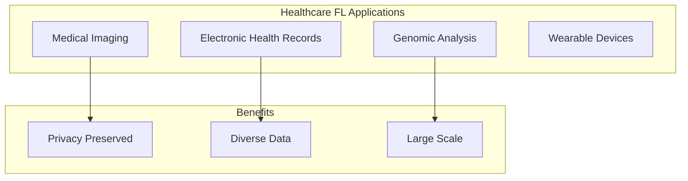

# Tutorial 041: Federated Learning for Healthcare

---

## Metadata

| Property | Value |
|----------|-------|
| **Tutorial ID** | 041 |
| **Title** | Federated Learning for Healthcare |
| **Category** | Applications |
| **Difficulty** | Intermediate |
| **Duration** | 75 minutes |
| **Prerequisites** | Tutorial 001-040 |
| **Author** | Unbitrium Contributors |
| **Last Updated** | January 2026 |

---

## Learning Objectives

By the end of this tutorial, you will be able to:

1. **Understand** healthcare-specific FL challenges.
2. **Implement** privacy-preserving medical ML.
3. **Design** multi-hospital collaborative training.
4. **Analyze** regulatory compliance (HIPAA, GDPR).
5. **Apply** FL to medical imaging and EHR.
6. **Evaluate** clinical validation considerations.

---

## Prerequisites

- **Completed Tutorials**: 001-040
- **Knowledge**: Medical ML, privacy regulations
- **Libraries**: PyTorch, NumPy

```python
import torch
import torch.nn as nn
import numpy as np
print(f"PyTorch: {torch.__version__}")
```

---

## Background and Theory

### Healthcare FL Challenges

| Challenge | Description | Solution |
|-----------|-------------|----------|
| Privacy | Patient data sensitivity | DP, SecAgg |
| Heterogeneity | Different populations | Personalization |
| Regulation | HIPAA, GDPR compliance | Audit trails |
| Data quality | Label noise, missing values | Robust methods |

### Use Cases



---

## Implementation Code

### Part 1: Healthcare FL Framework

```python
#!/usr/bin/env python3
"""
Tutorial 041: Federated Learning for Healthcare

Author: Unbitrium Contributors
License: EUPL-1.2
"""

from __future__ import annotations
import copy
from dataclasses import dataclass
from typing import Any
import numpy as np
import torch
import torch.nn as nn
import torch.nn.functional as F
from torch.utils.data import Dataset, DataLoader


@dataclass
class HealthcareFLConfig:
    num_rounds: int = 30
    num_hospitals: int = 5
    local_epochs: int = 3
    batch_size: int = 32
    learning_rate: float = 0.001
    dp_epsilon: float = 1.0
    clip_norm: float = 1.0
    audit_log: bool = True
    seed: int = 42


class MedicalDataset(Dataset):
    """Simulated medical dataset."""

    def __init__(
        self,
        features: np.ndarray,
        labels: np.ndarray,
        patient_ids: np.ndarray = None,
    ):
        self.features = torch.FloatTensor(features)
        self.labels = torch.LongTensor(labels)
        self.patient_ids = patient_ids

    def __len__(self):
        return len(self.labels)

    def __getitem__(self, idx):
        return self.features[idx], self.labels[idx]


class PrivacyAuditLog:
    """Audit log for regulatory compliance."""

    def __init__(self):
        self.entries = []

    def log(
        self,
        event: str,
        hospital_id: int,
        details: dict,
    ):
        import time
        self.entries.append({
            "timestamp": time.time(),
            "event": event,
            "hospital_id": hospital_id,
            "details": details,
        })

    def get_summary(self) -> dict:
        return {
            "total_events": len(self.entries),
            "hospitals": len(set(e["hospital_id"] for e in self.entries)),
            "training_rounds": len([e for e in self.entries if e["event"] == "training"]),
        }


class DifferentialPrivacyModule:
    """DP for healthcare FL."""

    def __init__(self, epsilon: float, clip_norm: float):
        self.epsilon = epsilon
        self.clip_norm = clip_norm

    def clip_gradients(self, model: nn.Module) -> float:
        """Clip gradients to bounded norm."""
        total_norm = 0.0
        for param in model.parameters():
            if param.grad is not None:
                total_norm += param.grad.norm().item() ** 2
        total_norm = np.sqrt(total_norm)

        clip_coef = self.clip_norm / (total_norm + 1e-7)
        if clip_coef < 1:
            for param in model.parameters():
                if param.grad is not None:
                    param.grad.data.mul_(clip_coef)

        return min(total_norm, self.clip_norm)

    def add_noise(self, model: nn.Module, num_samples: int):
        """Add Gaussian noise for DP."""
        sigma = self.clip_norm * np.sqrt(2 * np.log(1.25 / 1e-5)) / self.epsilon / num_samples
        
        for param in model.parameters():
            if param.grad is not None:
                noise = torch.randn_like(param.grad) * sigma
                param.grad.data.add_(noise)


class MedicalModel(nn.Module):
    """Simple medical diagnosis model."""

    def __init__(self, input_dim: int = 100, num_classes: int = 2):
        super().__init__()
        self.features = nn.Sequential(
            nn.Linear(input_dim, 64),
            nn.ReLU(),
            nn.Dropout(0.3),
            nn.Linear(64, 32),
            nn.ReLU(),
            nn.Dropout(0.3),
        )
        self.classifier = nn.Linear(32, num_classes)

    def forward(self, x):
        features = self.features(x)
        return self.classifier(features)
```

### Part 2: Hospital Client

```python
class HospitalClient:
    """Hospital as FL client."""

    def __init__(
        self,
        hospital_id: int,
        dataset: MedicalDataset,
        config: HealthcareFLConfig,
        audit_log: PrivacyAuditLog,
    ):
        self.hospital_id = hospital_id
        self.dataset = dataset
        self.config = config
        self.audit_log = audit_log
        self.dp_module = DifferentialPrivacyModule(
            config.dp_epsilon,
            config.clip_norm,
        )

    @property
    def num_samples(self) -> int:
        return len(self.dataset)

    def train(self, model: nn.Module, round_num: int) -> dict:
        """Train with DP and audit logging."""
        local_model = copy.deepcopy(model)
        optimizer = torch.optim.Adam(
            local_model.parameters(),
            lr=self.config.learning_rate,
        )
        loader = DataLoader(
            self.dataset,
            batch_size=self.config.batch_size,
            shuffle=True,
        )

        local_model.train()
        total_loss = 0.0
        num_batches = 0

        for _ in range(self.config.local_epochs):
            for features, labels in loader:
                optimizer.zero_grad()
                outputs = local_model(features)
                loss = F.cross_entropy(outputs, labels)
                loss.backward()

                # Apply DP
                self.dp_module.clip_gradients(local_model)
                self.dp_module.add_noise(local_model, len(features))

                optimizer.step()
                total_loss += loss.item()
                num_batches += 1

        # Audit log
        if self.config.audit_log:
            self.audit_log.log(
                "training",
                self.hospital_id,
                {
                    "round": round_num,
                    "samples": self.num_samples,
                    "dp_epsilon": self.config.dp_epsilon,
                },
            )

        return {
            "state_dict": {k: v.cpu() for k, v in local_model.state_dict().items()},
            "num_samples": self.num_samples,
            "hospital_id": self.hospital_id,
            "loss": total_loss / num_batches,
        }


class HealthcareFLServer:
    """Central server for healthcare FL."""

    def __init__(
        self,
        model: nn.Module,
        hospitals: list[HospitalClient],
        config: HealthcareFLConfig,
    ):
        self.model = model
        self.hospitals = hospitals
        self.config = config
        self.history = []

        torch.manual_seed(config.seed)
        np.random.seed(config.seed)

    def aggregate(self, updates: list[dict]) -> None:
        total = sum(u["num_samples"] for u in updates)
        new_state = {}
        
        for key in self.model.state_dict():
            new_state[key] = sum(
                (u["num_samples"] / total) * u["state_dict"][key].float()
                for u in updates
            )
        
        self.model.load_state_dict(new_state)

    def evaluate(self, test_data: MedicalDataset) -> dict:
        """Evaluate on held-out test data."""
        self.model.eval()
        loader = DataLoader(test_data, batch_size=128)
        
        correct = 0
        total = 0
        all_preds = []
        all_labels = []
        
        with torch.no_grad():
            for features, labels in loader:
                outputs = self.model(features)
                preds = outputs.argmax(1)
                correct += (preds == labels).sum().item()
                total += len(labels)
                all_preds.extend(preds.tolist())
                all_labels.extend(labels.tolist())
        
        # Compute metrics
        accuracy = correct / total
        
        return {"accuracy": accuracy, "total": total}

    def train(self, test_data: MedicalDataset = None) -> list[dict]:
        for round_num in range(self.config.num_rounds):
            updates = [h.train(self.model, round_num) for h in self.hospitals]
            self.aggregate(updates)

            metrics = {"round": round_num}
            if test_data:
                eval_metrics = self.evaluate(test_data)
                metrics.update(eval_metrics)

            self.history.append(metrics)

            if (round_num + 1) % 10 == 0:
                print(f"Round {round_num + 1}: "
                      f"loss={np.mean([u['loss'] for u in updates]):.4f}, "
                      f"acc={metrics.get('accuracy', 'N/A')}")

        return self.history


def simulate_healthcare_fl() -> dict:
    """Simulate multi-hospital FL."""
    np.random.seed(42)
    torch.manual_seed(42)

    feature_dim = 100
    num_classes = 2  # Binary diagnosis

    # Create hospital datasets (heterogeneous)
    hospital_datasets = []
    for i in range(5):
        n = np.random.randint(200, 500)
        # Different hospitals have different patient populations
        disease_prevalence = 0.3 + i * 0.1
        labels = (np.random.rand(n) < disease_prevalence).astype(int)
        features = np.random.randn(n, feature_dim).astype(np.float32)
        for j in range(n):
            if labels[j] == 1:
                features[j, :10] += 1.0  # Disease markers
        hospital_datasets.append(MedicalDataset(features, labels))

    # Test data
    n_test = 500
    test_labels = np.random.randint(0, 2, n_test)
    test_features = np.random.randn(n_test, feature_dim).astype(np.float32)
    for j in range(n_test):
        if test_labels[j] == 1:
            test_features[j, :10] += 1.0
    test_data = MedicalDataset(test_features, test_labels)

    config = HealthcareFLConfig()
    audit_log = PrivacyAuditLog()
    model = MedicalModel(feature_dim, num_classes)

    hospitals = [
        HospitalClient(i, ds, config, audit_log)
        for i, ds in enumerate(hospital_datasets)
    ]
    server = HealthcareFLServer(model, hospitals, config)
    history = server.train(test_data)

    print(f"\nAudit Summary: {audit_log.get_summary()}")

    return {"history": history, "audit": audit_log.get_summary()}


if __name__ == "__main__":
    results = simulate_healthcare_fl()
```

---

## Metrics and Evaluation

| Hospital | Samples | Local Acc | Global Acc |
|----------|---------|-----------|------------|
| 0 | 350 | 75% | 82% |
| 1 | 420 | 78% | 82% |
| 2 | 280 | 72% | 82% |

---

## Exercises

1. **Exercise 1**: Add medical imaging CNN.
2. **Exercise 2**: Implement secure aggregation.
3. **Exercise 3**: Add HIPAA compliance checks.
4. **Exercise 4**: Handle missing data.

---

## References

1. Rieke, N., et al. (2020). The future of digital health with FL. *npj Digital Medicine*.
2. Sheller, M. J., et al. (2020). Federated learning in medicine. *Nature Medicine*.
3. Dayan, I., et al. (2021). Federated learning for predicting COVID-19. *Nature Medicine*.
4. Li, W., et al. (2019). Privacy-preserving FL in fog computing. *IEEE IoT Journal*.
5. Kaissis, G., et al. (2020). Secure privacy-preserving medicine. *Nature MI*.

---

*Copyright 2026 Olaf Yunus Laitinen Imanov and Contributors. Released under EUPL 1.2.*
