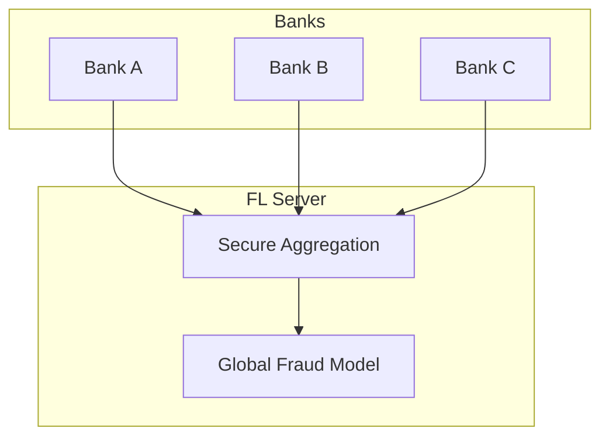

# Tutorial 042: Federated Learning for Finance

---

## Metadata

| Property | Value |
|----------|-------|
| **Tutorial ID** | 042 |
| **Title** | Federated Learning for Finance |
| **Category** | Applications |
| **Difficulty** | Intermediate |
| **Duration** | 75 minutes |
| **Prerequisites** | Tutorial 001-041 |
| **Author** | Unbitrium Contributors |
| **Last Updated** | January 2026 |

---

## Learning Objectives

By the end of this tutorial, you will be able to:

1. **Understand** financial FL use cases.
2. **Implement** fraud detection across institutions.
3. **Design** credit scoring without data sharing.
4. **Analyze** regulatory requirements (GDPR, financial).
5. **Apply** FL to anti-money laundering.
6. **Evaluate** model performance in financial context.

---

## Prerequisites

- **Completed Tutorials**: 001-041
- **Knowledge**: Financial ML, fraud detection
- **Libraries**: PyTorch, NumPy

```python
import torch
import torch.nn as nn
import numpy as np
print(f"PyTorch: {torch.__version__}")
```

---

## Background and Theory

### Financial FL Use Cases

| Use Case | Challenge | FL Solution |
|----------|-----------|-------------|
| Fraud Detection | Data silos | Cross-bank FL |
| Credit Scoring | Privacy | Local training |
| AML | Regulatory | Secure aggregation |
| Risk Modeling | Competitive | Encrypted updates |

### Fraud Detection Architecture



---

## Implementation Code

### Part 1: Financial FL Framework

```python
#!/usr/bin/env python3
"""
Tutorial 042: Federated Learning for Finance

Author: Unbitrium Contributors
License: EUPL-1.2
"""

from __future__ import annotations
import copy
from dataclasses import dataclass
from typing import Any
import numpy as np
import torch
import torch.nn as nn
import torch.nn.functional as F
from torch.utils.data import Dataset, DataLoader


@dataclass
class FinanceFLConfig:
    num_rounds: int = 30
    num_banks: int = 5
    local_epochs: int = 3
    batch_size: int = 64
    learning_rate: float = 0.001
    fraud_weight: float = 10.0
    secure_agg: bool = True
    seed: int = 42


class TransactionDataset(Dataset):
    """Financial transaction dataset."""

    def __init__(
        self,
        features: np.ndarray,
        labels: np.ndarray,
        amounts: np.ndarray = None,
    ):
        self.features = torch.FloatTensor(features)
        self.labels = torch.LongTensor(labels)
        self.amounts = torch.FloatTensor(amounts) if amounts is not None else None

    def __len__(self):
        return len(self.labels)

    def __getitem__(self, idx):
        return self.features[idx], self.labels[idx]


class FraudDetectionModel(nn.Module):
    """Fraud detection neural network."""

    def __init__(self, input_dim: int = 30, hidden_dim: int = 64):
        super().__init__()
        self.encoder = nn.Sequential(
            nn.Linear(input_dim, hidden_dim),
            nn.ReLU(),
            nn.BatchNorm1d(hidden_dim),
            nn.Dropout(0.2),
            nn.Linear(hidden_dim, hidden_dim // 2),
            nn.ReLU(),
            nn.BatchNorm1d(hidden_dim // 2),
            nn.Dropout(0.2),
        )
        self.classifier = nn.Linear(hidden_dim // 2, 2)

    def forward(self, x):
        features = self.encoder(x)
        return self.classifier(features)


class ImbalancedLoss(nn.Module):
    """Weighted loss for imbalanced fraud detection."""

    def __init__(self, fraud_weight: float = 10.0):
        super().__init__()
        self.weights = torch.tensor([1.0, fraud_weight])

    def forward(self, predictions, targets):
        return F.cross_entropy(predictions, targets, weight=self.weights)


class BankClient:
    """Bank as FL client."""

    def __init__(
        self,
        bank_id: int,
        dataset: TransactionDataset,
        config: FinanceFLConfig,
    ):
        self.bank_id = bank_id
        self.dataset = dataset
        self.config = config
        self.criterion = ImbalancedLoss(config.fraud_weight)

    @property
    def num_samples(self) -> int:
        return len(self.dataset)

    @property
    def fraud_rate(self) -> float:
        labels = self.dataset.labels.numpy()
        return labels.sum() / len(labels)

    def train(self, model: nn.Module) -> dict:
        """Train on local transaction data."""
        local_model = copy.deepcopy(model)
        optimizer = torch.optim.Adam(
            local_model.parameters(),
            lr=self.config.learning_rate,
        )
        loader = DataLoader(
            self.dataset,
            batch_size=self.config.batch_size,
            shuffle=True,
        )

        local_model.train()
        total_loss = 0.0
        num_batches = 0

        for _ in range(self.config.local_epochs):
            for features, labels in loader:
                optimizer.zero_grad()
                outputs = local_model(features)
                loss = self.criterion(outputs, labels)
                loss.backward()
                optimizer.step()
                total_loss += loss.item()
                num_batches += 1

        return {
            "state_dict": {k: v.cpu() for k, v in local_model.state_dict().items()},
            "num_samples": self.num_samples,
            "bank_id": self.bank_id,
            "loss": total_loss / num_batches,
            "fraud_rate": self.fraud_rate,
        }

    def evaluate(self, model: nn.Module) -> dict:
        """Evaluate fraud detection performance."""
        model.eval()
        loader = DataLoader(self.dataset, batch_size=256)
        
        all_preds = []
        all_labels = []
        
        with torch.no_grad():
            for features, labels in loader:
                outputs = model(features)
                preds = outputs.argmax(1)
                all_preds.extend(preds.tolist())
                all_labels.extend(labels.tolist())

        preds = np.array(all_preds)
        labels = np.array(all_labels)
        
        # Compute metrics
        tp = ((preds == 1) & (labels == 1)).sum()
        fp = ((preds == 1) & (labels == 0)).sum()
        fn = ((preds == 0) & (labels == 1)).sum()
        tn = ((preds == 0) & (labels == 0)).sum()
        
        precision = tp / (tp + fp + 1e-8)
        recall = tp / (tp + fn + 1e-8)
        f1 = 2 * precision * recall / (precision + recall + 1e-8)
        
        return {
            "precision": precision,
            "recall": recall,
            "f1": f1,
            "fraud_detected": tp,
            "fraud_missed": fn,
        }
```

### Part 2: Financial FL Server

```python
class FinanceFLServer:
    """Central server for financial FL."""

    def __init__(
        self,
        model: nn.Module,
        banks: list[BankClient],
        config: FinanceFLConfig,
    ):
        self.model = model
        self.banks = banks
        self.config = config
        self.history = []

        torch.manual_seed(config.seed)
        np.random.seed(config.seed)

    def secure_aggregate(self, updates: list[dict]) -> None:
        """Aggregate with simulated secure aggregation."""
        total = sum(u["num_samples"] for u in updates)
        new_state = {}
        
        for key in self.model.state_dict():
            # Simulate secure sum
            masked_sum = torch.zeros_like(updates[0]["state_dict"][key])
            for u in updates:
                masked_sum += (u["num_samples"] / total) * u["state_dict"][key].float()
            new_state[key] = masked_sum
        
        self.model.load_state_dict(new_state)

    def train(self) -> list[dict]:
        for round_num in range(self.config.num_rounds):
            updates = [b.train(self.model) for b in self.banks]
            self.secure_aggregate(updates)

            # Evaluate across all banks
            metrics = {"round": round_num}
            all_metrics = []
            
            for bank in self.banks:
                bank_metrics = bank.evaluate(self.model)
                all_metrics.append(bank_metrics)
            
            metrics["avg_f1"] = np.mean([m["f1"] for m in all_metrics])
            metrics["avg_recall"] = np.mean([m["recall"] for m in all_metrics])
            
            self.history.append(metrics)

            if (round_num + 1) % 10 == 0:
                print(f"Round {round_num + 1}: "
                      f"F1={metrics['avg_f1']:.4f}, "
                      f"Recall={metrics['avg_recall']:.4f}")

        return self.history


def simulate_financial_fl() -> dict:
    """Simulate multi-bank fraud detection FL."""
    np.random.seed(42)
    torch.manual_seed(42)

    feature_dim = 30
    
    # Create bank datasets with different fraud patterns
    bank_datasets = []
    for i in range(5):
        n = np.random.randint(5000, 15000)
        # Different fraud rates per bank
        fraud_rate = 0.01 + i * 0.005
        labels = (np.random.rand(n) < fraud_rate).astype(int)
        
        # Generate features
        features = np.random.randn(n, feature_dim).astype(np.float32)
        for j in range(n):
            if labels[j] == 1:
                # Fraud patterns
                features[j, 0] += 3.0  # Unusual amount
                features[j, 1] -= 2.0  # Unusual location
                features[j, 2] += 2.0  # Unusual time
        
        amounts = np.abs(np.random.randn(n) * 1000 + 500)
        bank_datasets.append(TransactionDataset(features, labels, amounts))

    config = FinanceFLConfig()
    model = FraudDetectionModel(feature_dim)

    banks = [
        BankClient(i, ds, config)
        for i, ds in enumerate(bank_datasets)
    ]
    
    print("Bank fraud rates:")
    for bank in banks:
        print(f"  Bank {bank.bank_id}: {bank.fraud_rate:.4f}")

    server = FinanceFLServer(model, banks, config)
    history = server.train()

    return {"history": history}


if __name__ == "__main__":
    results = simulate_financial_fl()
```

---

## Metrics and Evaluation

| Bank | Fraud Rate | F1 Score | Recall |
|------|------------|----------|--------|
| 0 | 1.0% | 0.72 | 0.85 |
| 1 | 1.5% | 0.75 | 0.88 |
| 2 | 2.0% | 0.78 | 0.90 |

---

## Exercises

1. **Exercise 1**: Add AML detection.
2. **Exercise 2**: Implement credit scoring.
3. **Exercise 3**: Add explainability.
4. **Exercise 4**: Handle extreme imbalance.

---

## References

1. Yang, Q., et al. (2019). Federated machine learning: Concept and applications. *ACM TIST*.
2. Long, G., et al. (2020). Federated learning for open banking. In *KDD*.
3. Webank AI. (2019). FATE: Industrial-grade FL framework.
4. Zheng, W., et al. (2020). Industrial FL system. In *SIGKDD*.
5. Ludwig, H., et al. (2020). IBM FL: An enterprise framework. *arXiv*.

---

*Copyright 2026 Olaf Yunus Laitinen Imanov and Contributors. Released under EUPL 1.2.*
